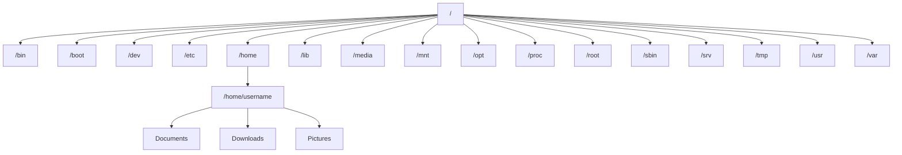

# Debian Directory Commands

## Introduction

When working with Debian Linux, navigating and manipulating directories through the terminal is a fundamental skill. Directory commands help you move around the filesystem, create new folders, delete them, and manage your file organization efficiently. This guide will walk you through the essential directory commands in Debian, their syntax, and practical applications.

## Basic Directory Navigation

### Viewing Your Current Location

The `pwd` (Print Working Directory) command shows your current location in the filesystem:

```bash
pwd
```

**Output:**
```
/home/username
```

This tells you that you're currently in the `/home/username` directory.

### Listing Directory Contents

The `ls` command lists the contents of a directory:

```bash
ls
```

**Output:**
```
Documents  Downloads  Music  Pictures  Videos
```

#### Common `ls` Options

| Option  | Description                                             |
|---------|---------------------------------------------------------|
| `ls -l` | Long format listing (shows permissions, size, date)     |
| `ls -a` | Shows all files including hidden ones (prefixed with .) |
| `ls -h` | Human-readable file sizes (KB, MB, GB)                  |
| `ls -R` | Recursive listing (includes subdirectories)             |

For example, using the long format with human-readable sizes:

```bash
ls -lh
```

**Output:**
```
total 20K
drwxr-xr-x 2 username username 4.0K Jan 10 14:22 Documents
drwxr-xr-x 2 username username 4.0K Jan 10 14:22 Downloads
drwxr-xr-x 2 username username 4.0K Jan 10 14:22 Music
drwxr-xr-x 2 username username 4.0K Jan 10 14:22 Pictures
drwxr-xr-x 2 username username 4.0K Jan 10 14:22 Videos
```

### Changing Directories

The `cd` (Change Directory) command lets you navigate between directories:

```bash
cd Documents
```

There's no output, but now your current directory has changed to `/home/username/Documents`.

#### Special Directory References

| Reference | Meaning                        |
|-----------|--------------------------------|
| `cd ..`   | Move up one directory (parent) |
| `cd ~`    | Go to your home directory      |
| `cd /`    | Go to the root directory       |
| `cd -`    | Go to the previous directory   |

## Creating and Removing Directories

### Creating Directories

The `mkdir` (Make Directory) command creates new directories:

```bash
mkdir Projects
```

Create multiple directories at once:

```bash
mkdir Photos Videos Music
```

#### Creating Nested Directories

To create a directory structure with subdirectories, use the `-p` option:

```bash
mkdir -p Projects/WebDev/HTML
```

This creates the directory `Projects`, then `WebDev` inside it, and finally `HTML` inside `WebDev`.

### Removing Directories

The `rmdir` (Remove Directory) command removes empty directories:

```bash
rmdir Projects
```

To remove non-empty directories, you need the `rm` command with the `-r` (recursive) option:

```bash
rm -r Projects
```

**Warning:** Be careful with the `rm -r` command, especially when combined with `-f` (force). It can delete files and directories without asking for confirmation.

## Advanced Directory Operations

### Copying Directories

To copy a directory and its contents, use the `cp` command with the `-r` option:

```bash
cp -r Documents Documents_Backup
```

This creates a full copy of the `Documents` directory named `Documents_Backup`.

### Moving and Renaming Directories

The `mv` (Move) command moves directories or renames them:

Renaming a directory:

```bash
mv Projects WebProjects
```

This renames the `Projects` directory to `WebProjects`.

Moving a directory:

```bash
mv Downloads/Files Documents/
```

This moves the `Files` directory from `Downloads` to `Documents`.

### Finding Directories

The `find` command helps locate directories in your filesystem:

```bash
find /home -type d -name "Projects"
```

This searches for directories named "Projects" under the `/home` directory.

## Directory Structure Visualization

You can use the `tree` command to visualize directory structures (you might need to install it first with `sudo apt install tree`):

```bash
tree Projects
```

**Output:**
```
Projects/
├── WebDev
│   ├── CSS
│   ├── HTML
│   └── JavaScript
└── MobileDev
    ├── Android
    └── iOS

6 directories, 0 files
```

## Directory Information

### Checking Directory Size

To check the size of a directory and its contents, use the `du` (Disk Usage) command:

```bash
du -sh Documents
```

**Output:**
```
45M Documents
```

The options `-sh` stand for summary and human-readable format.

### Directory Permissions

View directory permissions with `ls -ld`:

```bash
ls -ld Documents
```

**Output:**
```
drwxr-xr-x 5 username username 4096 Jan 15 10:25 Documents
```

Change directory permissions with `chmod`:

```bash
chmod 755 Projects
```

This sets the directory to be readable, writable, and executable by the owner, and only readable and executable by others.

## Practical Examples

### Example 1: Setting Up a Web Project

Let's create a directory structure for a web development project:

```bash
# Create main project directory
mkdir -p MyWebsite

# Navigate into the project
cd MyWebsite

# Create subdirectories for different components
mkdir css js images

# Check the structure
ls -la
```

**Output:**
```
total 20
drwxr-xr-x 5 username username 4096 Jan 15 13:45 .
drwxr-xr-x 3 username username 4096 Jan 15 13:44 ..
drwxr-xr-x 2 username username 4096 Jan 15 13:45 css
drwxr-xr-x 2 username username 4096 Jan 15 13:45 images
drwxr-xr-x 2 username username 4096 Jan 15 13:45 js
```

### Example 2: Backing Up Important Files

Here's how to create a backup of your documents:

```bash
# Create a backup directory
mkdir ~/Backups

# Copy Documents to the backup location with timestamp
cp -r ~/Documents ~/Backups/Documents_$(date +%Y%m%d)

# Check what's in the Backups directory
ls ~/Backups
```

**Output:**
```
Documents_20240115
```

### Example 3: Cleaning Temporary Files

This example shows how to create a temporary work directory and clean it up later:

```bash
# Create and enter a temporary directory
mkdir ~/temp_work
cd ~/temp_work

# Create some files
touch file1.txt file2.txt

# Move back up and remove the directory when done
cd ..
rm -r temp_work
```

## Directory Structure in Debian

Debian follows the Filesystem Hierarchy Standard (FHS). Here's a simplified overview of key directories:



| Directory | Purpose                      |
|-----------|------------------------------|
| `/bin`    | Essential command binaries   |
| `/home`   | User home directories        |
| `/etc`    | System configuration files   |
| `/var`    | Variable data (logs, caches) |
| `/usr`    | User programs and data       |
| `/tmp`    | Temporary files              |

## Summary

Directory commands in Debian Linux provide powerful tools for organizing and navigating your filesystem. In this guide, we've covered:

- Basic navigation with `pwd`, `ls`, and `cd`
- Creating and removing directories with `mkdir` and `rmdir`
- Advanced operations like copying, moving, and finding directories
- Visualizing directory structures with `tree`
- Checking disk usage and permissions
- Practical examples for real-world use cases

Mastering these commands will significantly improve your productivity in the Debian terminal environment, allowing you to manage files and directories efficiently.

## Additional Resources

- Run `man [command]` (e.g., `man ls`) in the terminal to view detailed manual pages for any command
- Practice creating directory structures for different types of projects
- Explore additional commands like `find` with more complex search parameters

## Exercises

1. Create a nested directory structure for organizing photos by year and month.
2. Write a simple bash script that creates a timestamped backup directory and copies your Documents folder into it.
3. Use the `find` command to locate all empty directories in your home folder.
4. Create a directory with specific permissions that allow only the owner to read and write.