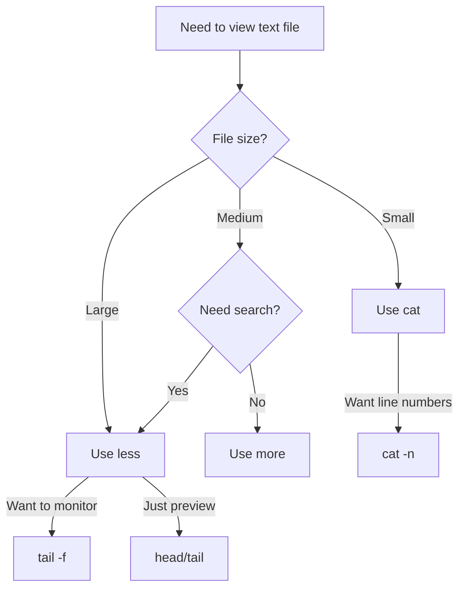

# Debian Text Viewing

## Introduction

When working with Debian or any Linux distribution, viewing text files directly from the terminal is an essential skill. The terminal offers several powerful commands for displaying, scrolling through, and examining text files without the need for graphical editors. Whether you're reading configuration files, checking logs, or reviewing code, these commands will become vital tools in your Linux journey.

In this guide, we'll explore various text viewing commands available in Debian, their options, and practical applications. By the end, you'll be comfortable navigating and examining text files of any size directly from your terminal.

## Basic Text Viewing Commands

### The `cat` Command

The `cat` (concatenate) command is one of the simplest ways to display the content of a file. It outputs the entire file content to the terminal at once.

#### Basic Usage

```bash
cat filename.txt
```

#### Example

Let's create a sample file and view it:

```bash
echo "Hello World" > hello.txt
echo "This is a sample file" >> hello.txt
echo "Created for demonstration purposes" >> hello.txt
cat hello.txt
```

**Output:**
```
Hello World
This is a sample file
Created for demonstration purposes
```

#### Options for `cat`

| Option | Description |
|--------|-------------|
| `-n`   | Numbers all output lines |
| `-b`   | Numbers non-empty output lines |
| `-A`   | Shows all non-printing characters |
| `-T`   | Displays tab characters as `^I` |
| `-E`   | Displays $ at the end of each line |

#### Example with Options

```bash
cat -n hello.txt
```

**Output:**
```
1  Hello World
2  This is a sample file
3  Created for demonstration purposes
```

### The `more` Command

While `cat` is useful for small files, it can be impractical for larger ones as they scroll past your screen. The `more` command displays text one screen at a time.

#### Basic Usage

```bash
more filename.txt
```

#### Navigation in `more`

- Press `Space` to move forward one page
- Press `b` to move backward one page
- Press `q` to quit
- Press `h` for help

#### Example

```bash
more /etc/apt/sources.list
```

This will display the contents of your APT sources list one page at a time.

### The `less` Command

`less` is an improved version of `more` with more features and better navigation.

#### Basic Usage

```bash
less filename.txt
```

#### Navigation in `less`

- Arrow keys: Scroll up and down line by line
- `Space` or `Page Down`: Move forward one page
- `b` or `Page Up`: Move backward one page
- `/pattern`: Search forward for "pattern"
- `?pattern`: Search backward for "pattern"
- `n`: Next search result
- `N`: Previous search result
- `g`: Go to first line
- `G`: Go to last line
- `q`: Quit

#### Example

```bash
less /var/log/syslog
```

This allows you to browse through your system log efficiently.

## Advanced Text Viewing Commands

### The `head` Command

The `head` command displays the beginning of a file (by default, the first 10 lines).

#### Basic Usage

```bash
head filename.txt
```

#### Options

```bash
head -n 5 filename.txt    # Display first 5 lines
head -c 20 filename.txt   # Display first 20 bytes
```

#### Example

Let's create a larger sample file:

```bash
for i in {1..20}; do echo "Line $i" >> lines.txt; done
head lines.txt
```

**Output:**
```
Line 1
Line 2
Line 3
Line 4
Line 5
Line 6
Line 7
Line 8
Line 9
Line 10
```

### The `tail` Command

The `tail` command displays the end of a file (by default, the last 10 lines).

#### Basic Usage

```bash
tail filename.txt
```

#### Options

```bash
tail -n 5 filename.txt    # Display last 5 lines
tail -f filename.txt      # Follow the file (show updates in real-time)
```

#### Example

```bash
tail lines.txt
```

**Output:**
```
Line 11
Line 12
Line 13
Line 14
Line 15
Line 16
Line 17
Line 18
Line 19
Line 20
```

#### Real-time Monitoring with `tail -f`

The `-f` (follow) option is particularly useful for monitoring log files as they update:

```bash
tail -f /var/log/syslog
```

This will continuously display new entries as they're added to the log file. Press `Ctrl+C` to exit.

## Combining Commands

### Using `grep` with Text Viewing Commands

The power of text viewing commands increases when combined with other utilities like `grep` for filtering.

#### Example: Filter Output with `grep`

```bash
cat /etc/passwd | grep "home"
```

This command shows only lines containing "home" from the `/etc/passwd` file.

### Piping to `wc` for Counting

```bash
cat filename.txt | wc -l
```

This counts the number of lines in a file.

## Practical Applications

### Checking System Logs

```bash
tail -n 50 /var/log/syslog | grep ERROR
```

This shows the last 50 lines of the system log and filters for error messages.

### Viewing Configuration Files

```bash
less /etc/ssh/sshd_config
```

This allows comfortable reading of the SSH server configuration.

### Examining Large Data Sets

```bash
head -n 10 dataset.csv
```

This shows a preview of the first 10 lines of a CSV file to understand its structure.

## Text Viewing Workflow Diagram

The following diagram illustrates a typical workflow for deciding which text viewing command to use based on file size and requirements:



## Summary

Debian and other Linux distributions provide a rich set of text viewing tools for terminal use:

- `cat`: Best for small files or quick viewing
- `more`: Basic paging for medium-sized files
- `less`: Full-featured paging with search for larger files
- `head`: View the beginning of files
- `tail`: View the end of files, monitor file changes
- These commands can be combined with pipes and filters for powerful text analysis

Mastering these text viewing commands will significantly improve your efficiency when working with Debian systems, especially for server administration, debugging, and software development tasks.

## Additional Exercises

1. Create a large log file by duplicating an existing log several times. Practice using `less` to navigate through it efficiently.

2. Use `tail -f` on a log file while performing actions that generate log entries to observe real-time logging.

3. Combine `head`, `tail`, and `grep` to extract specific information from the middle of a file.

4. Write a small script that uses `cat` and text viewing commands to display statistics about a log file.

5. Practice using `less` search functionality to find patterns in configuration files.

## Further Reading

- The manual pages (access them using `man cat`, `man less`, etc.)
- The GNU Coreutils documentation
- Linux text processing books and tutorials
- Advanced text manipulation with `sed` and `awk`

Learning these text viewing commands is your first step toward becoming proficient in Debian terminal operations. As you practice these skills, you'll find yourself becoming more comfortable with the command-line interface and more efficient at navigating and working with text files.