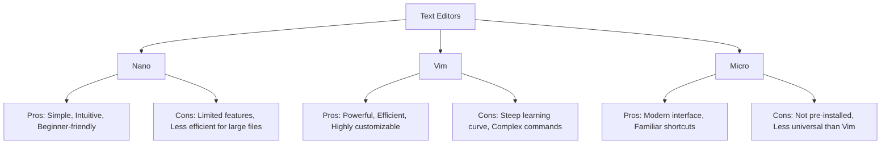

# Debian Text Editing

## Introduction

Text editing is one of the most fundamental skills for anyone working with Debian or any Linux distribution. Unlike graphical operating systems that primarily use rich text editors with mouse-driven interfaces, Debian's terminal environment offers powerful text editing capabilities that are entirely keyboard-driven and often more efficient for programming and system administration tasks.

In this guide, we'll explore various text editors available in the Debian terminal, from simple and beginner-friendly options to more advanced editors with steep learning curves but tremendous capabilities. You'll learn how to create, modify, and manage text files directly from the command line, which is an essential skill for configuration, scripting, and software development on Debian systems.

## Terminal-Based Text Editors in Debian

Debian comes with several text editors pre-installed or easily available. These range from simple editors for quick modifications to sophisticated environments that can rival full-fledged IDEs.

### 1. Nano - The Beginner-Friendly Editor

Nano is often recommended for beginners due to its simplicity and intuitive interface. It's included by default in most Debian installations.

#### Opening/Creating a File with Nano

```bash
nano filename.txt
```

If the file doesn't exist, Nano will create it. If it exists, Nano will open it.


#### Basic Nano Commands

Nano displays its basic commands at the bottom of the screen. The `^` symbol represents the `Ctrl` key.

- `Ctrl+G`: Get help
- `Ctrl+O`: Save file ("Write Out")
- `Ctrl+X`: Exit Nano
- `Ctrl+K`: Cut line
- `Ctrl+U`: Paste text
- `Ctrl+W`: Search for text
- `Ctrl+\`: Search and replace

#### Example: Creating a Simple Script with Nano

Let's create a simple shell script that prints a greeting:

```bash
nano hello.sh
```

In the editor, type:

```bash
#!/bin/bash
echo "Hello from Debian Terminal!"
echo "Today is $(date)"
```

To save: Press `Ctrl+O`, confirm the filename, then press Enter.
To exit: Press `Ctrl+X`.

Make the script executable:

```bash
chmod +x hello.sh
```

Run the script:

```bash
./hello.sh
```

Output:
```
Hello from Debian Terminal!
Today is Thu Mar 13 14:30:25 EDT 2025
```

### 2. Vim - The Powerful and Ubiquitous Editor

Vim (Vi Improved) is a highly configurable, efficient text editor built to enable efficient text editing. It's more complex than Nano but offers significantly more power and efficiency once mastered.

#### Installing Vim (if not already installed)

```bash
sudo apt update
sudo apt install vim
```

#### Opening/Creating a File with Vim

```bash
vim filename.txt
```

#### Vim Modes

Vim operates in different modes:
- **Normal Mode**: Default mode for navigation and commands
- **Insert Mode**: For inserting and editing text
- **Visual Mode**: For selecting blocks of text
- **Command Mode**: For executing commands

#### Basic Vim Commands

- `i`: Enter Insert mode
- `Esc`: Return to Normal mode
- `:w`: Save file
- `:q`: Quit (will fail if unsaved changes)
- `:wq` or `ZZ`: Save and quit
- `:q!`: Quit without saving
- `/text`: Search for "text"
- `n`: Find next occurrence
- `dd`: Delete (cut) current line
- `yy`: Yank (copy) current line
- `p`: Paste after cursor
- `u`: Undo last change

#### Example: Editing a Configuration File with Vim

Let's edit the Bash configuration file:

```bash
vim ~/.bashrc
```

To append a new alias at the end of the file:
1. Press `G` to go to the end of the file
2. Press `o` to open a new line below and enter Insert mode
3. Type: `alias ll='ls -la'`
4. Press `Esc` to return to Normal mode
5. Type `:wq` and press Enter to save and exit

To apply the changes:

```bash
source ~/.bashrc
```

Now test your new alias:

```bash
ll
```

Output will show a detailed directory listing with all files (including hidden ones).

### 3. Micro - A Modern Alternative

Micro is a modern and intuitive terminal-based text editor that combines ease of use with powerful features.

#### Installing Micro

```bash
sudo apt update
sudo apt install micro
```

#### Using Micro

```bash
micro filename.txt
```

Micro uses familiar keyboard shortcuts like:
- `Ctrl+S`: Save
- `Ctrl+Q`: Quit
- `Ctrl+F`: Find
- `Ctrl+Z`: Undo

## Advanced Text Manipulation Commands

Beyond dedicated editors, Debian provides powerful command-line tools for text manipulation:

### 1. sed - Stream Editor

`sed` allows you to perform basic text transformations on an input stream.

#### Example: Replacing Text in a File

```bash
sed -i 's/original/replacement/g' filename.txt
```

This replaces all occurrences of "original" with "replacement" in the file.

#### Example: Deleting Lines

```bash
# Delete lines containing "pattern"
sed -i '/pattern/d' filename.txt

# Delete empty lines
sed -i '/^$/d' filename.txt
```

### 2. awk - Pattern Scanning and Processing

`awk` is powerful for processing and analyzing text data.

#### Example: Print Specific Columns

```bash
awk '{print $1, $3}' filename.txt
```

This prints the first and third columns of each line.

#### Example: Sum Numbers in a Column

```bash
awk '{sum += $1} END {print "Sum:", sum}' numbers.txt
```

### 3. grep - Search Text Patterns

`grep` finds lines matching a pattern.

```bash
# Find lines containing "pattern"
grep "pattern" filename.txt

# Count matching lines
grep -c "pattern" filename.txt

# Find files containing pattern in a directory
grep -r "pattern" /path/to/directory
```

## Practical Example: Creating a System Information Script

Let's create a simple script that displays system information using Nano:

```bash
nano sysinfo.sh
```

Enter this content:

```bash
#!/bin/bash

echo "==== System Information ===="
echo "Hostname: $(hostname)"
echo "Kernel: $(uname -r)"
echo "CPU: $(grep "model name" /proc/cpuinfo | head -n1 | cut -d: -f2 | sed 's/^[ \t]*//')"
echo "Memory: $(free -h | grep Mem | awk '{print $2}')"
echo "Disk Usage: $(df -h --output=pcent / | tail -n1 | tr -d ' ')"
echo "Uptime: $(uptime -p)"
echo "=========================="
```

Save with `Ctrl+O`, exit with `Ctrl+X`, and make executable:

```bash
chmod +x sysinfo.sh
```

Run it:

```bash
./sysinfo.sh
```

Output (example):
```
==== System Information ====
Hostname: debian-server
Kernel: 5.10.0-20-amd64
CPU: Intel(R) Core(TM) i5-8250U CPU @ 1.60GHz
Memory: 7.7Gi
Disk Usage: 42%
Uptime: up 2 days, 5 hours, 17 minutes
==========================
```

## Text Editor Comparison

Here's a comparison of the main text editors discussed:



## When to Use Each Editor

- **Nano**: Quick edits, beginners, simple configuration changes
- **Vim**: Programming, complex edits, when efficiency matters
- **Micro**: Modern alternative with familiar shortcuts
- **Command-line tools** (sed, awk, grep): Batch processing, automated text manipulation

## Summary

Text editing in Debian's terminal environment offers powerful tools for creating and modifying files. We've covered:

1. **Nano**: A beginner-friendly editor for quick edits
2. **Vim**: A powerful editor with a steeper learning curve but greater capabilities
3. **Micro**: A modern alternative with intuitive controls
4. **Command-line tools**: For advanced text manipulation from the terminal

Mastering text editing in the terminal will significantly improve your productivity when working with Debian and other Linux systems, especially for tasks like programming, system administration, and configuration management.

## Exercises

1. Create a new file with Nano containing your favorite programming quote.
2. Use Vim to edit an existing file and perform these operations:
   - Delete a line
   - Copy and paste a paragraph
   - Search and replace a word
3. Use `sed` to replace all occurrences of your name with "YOURNAME" in a text file.
4. Write a one-line command using `grep` to find all files in your home directory containing the word "Debian".
5. Create a shell script that counts the number of words in a file provided as an argument.

## Additional Resources

- [Nano Editor Documentation](https://www.nano-editor.org/docs.php)
- [Vim Documentation](https://www.vim.org/docs.php)
- [Debian Wiki - TextEditing](https://wiki.debian.org/TextEditing)
- `man` pages for various tools: `man nano`, `man vim`, `man sed`, `man awk`, `man grep`
- Interactive Vim tutorial: Run `vimtutor` in the terminal