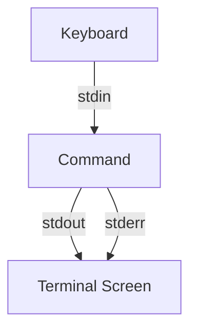

# Debian Redirections

## Introduction

When working with the Debian terminal, one of the most powerful concepts to understand is **redirection**. Redirection allows you to control where the input for a command comes from and where the output goes. Instead of just displaying text on the screen or typing input with your keyboard, you can redirect data to or from files and even between different commands.

In this guide, we'll explore how redirections work in Debian's command-line interface, providing you with the knowledge to make your terminal workflows more efficient and powerful.

## Understanding Standard Streams

Before diving into redirections, it's important to understand the three standard data streams in Linux:

1. **Standard Input (stdin)** - Stream number 0: The default source of input for commands, typically the keyboard.
2. **Standard Output (stdout)** - Stream number 1: The default destination for command output, typically the terminal.
3. **Standard Error (stderr)** - Stream number 2: The destination for error messages, also typically the terminal.



## Basic Output Redirection

### Redirecting to a File (`>`)

The `>` operator redirects standard output to a file instead of the terminal:

```bash
ls -la > file_list.txt
```

This command lists all files in the current directory and saves the output to `file_list.txt` instead of displaying it on screen. **Important**: This will overwrite the file if it already exists.

### Appending to a File (`>>`)

To add output to the end of an existing file without overwriting it, use the `>>` operator:

```bash
echo "New line of text" >> notes.txt
```

This appends the text "New line of text" to the end of `notes.txt` (or creates the file if it doesn't exist).

## Redirecting Standard Error

### Redirecting stderr to a File (`2>`)

Error messages can be redirected separately from standard output:

```bash
find /etc -name "*.conf" 2> errors.log
```

This command searches for configuration files in `/etc` but sends any error messages (like "permission denied") to `errors.log`.

### Redirecting Both stdout and stderr

To redirect both standard output and errors to the same file:

```bash
find /etc -name "*.conf" > results.txt 2>&1
```

The `2>&1` part tells the shell to send stderr to the same place as stdout.

In Bash, there's also a shorthand notation:

```bash
find /etc -name "*.conf" &> results.txt
```

## Input Redirection

### Using a File as Input (`<`)

The `<` operator lets you use a file as input for a command:

```bash
sort < unsorted_list.txt
```

This takes the contents of `unsorted_list.txt` and passes it as input to the `sort` command.

### Here Documents (`<<`)

A "here document" provides a way to input multiple lines of text to a command:

```bash
cat << EOF
This is line 1
This is line 2
This is the final line
EOF
```

This passes all the text between `<< EOF` and the closing `EOF` to the `cat` command.

## Combining Redirections

You can combine input and output redirections in a single command:

```bash
sort < unsorted_list.txt > sorted_list.txt
```

This reads from `unsorted_list.txt`, sorts the contents, and writes the result to `sorted_list.txt`.

## Pipes: Redirecting Between Commands

While not technically the same as redirection, pipes (`|`) are closely related. They allow you to send the output of one command as input to another:

```bash
ls -la | grep ".txt"
```

This lists all files and then filters to show only those containing ".txt".

Pipes can be chained to create powerful command combinations:

```bash
cat log.txt | grep "ERROR" | sort | uniq -c
```

This sequence:
1. Reads the contents of `log.txt`
2. Filters to show only lines containing "ERROR"
3. Sorts these lines
4. Counts unique occurrences

## Practical Examples

### Example 1: Creating a System Information Report

```bash
echo "System Report generated on $(date)" > report.txt
echo "-------------------------------------" >> report.txt
echo "Disk Usage:" >> report.txt
df -h >> report.txt
echo "-------------------------------------" >> report.txt
echo "Memory Usage:" >> report.txt
free -m >> report.txt
echo "-------------------------------------" >> report.txt
echo "Top 5 CPU-intensive processes:" >> report.txt
ps aux --sort=-%cpu | head -n 6 >> report.txt
```

This script creates a report file with system information from multiple commands.

### Example 2: Processing a Log File

```bash
grep "ERROR" application.log > errors_only.log
cat errors_only.log | cut -d' ' -f1,2 | sort | uniq -c > error_summary.txt
```

These commands extract ERROR lines from a log file, then create a summary showing the count of unique date/time combinations when errors occurred.

### Example 3: Silent Installation

```bash
sudo apt-get install -y package_name > /dev/null 2>&1
```

This installs a package but suppresses all output by redirecting stdout to `/dev/null` (a special file that discards all data written to it) and redirecting stderr to the same destination.

## Advanced Redirection Techniques

### Redirecting Specific File Descriptors

You can redirect any file descriptor using its number:

```bash
# Redirect only stderr to a file
command 2> errors.txt

# Redirect stdout to one file and stderr to another
command > output.txt 2> errors.txt
```

### Using /dev/null

To discard output completely, redirect to `/dev/null`:

```bash
# Discard standard output
command > /dev/null

# Discard both stdout and stderr
command > /dev/null 2>&1
```

### Process Substitution

Process substitution (`<()` and `>()`) allows a command's output to be used as a file:

```bash
diff <(ls dir1) <(ls dir2)
```

This compares the output of two `ls` commands without creating temporary files.

## Summary

Redirections are a fundamental part of working effectively in the Debian terminal. They allow you to:

- Save command output to files
- Use files as input for commands  
- Separate and manage error messages
- Chain commands together
- Create more complex and powerful command-line operations

By mastering redirections, you can automate tasks, create logs, process data, and generally make your terminal experience more productive.

## Practice Exercises

1. Create a file containing a list of all `.txt` files in your home directory.
2. Write a command that counts the number of lines in all `.conf` files in `/etc` while redirecting any errors to a separate file.
3. Create a bash script that takes a log file as input and generates a report showing the ten most common error messages.
4. Use process substitution to compare the word count of two different text files.
5. Write a command sequence that finds all files modified in the last day and saves their names and sizes to a report file.

## Additional Resources

- The Bash manual (`man bash`) section on "REDIRECTION"
- The GNU Coreutils manual for detailed information on common commands
- [Bash Guide for Beginners](https://tldp.org/LDP/Bash-Beginners-Guide/html/index.html)
- [Advanced Bash-Scripting Guide](https://tldp.org/LDP/abs/html/index.html)