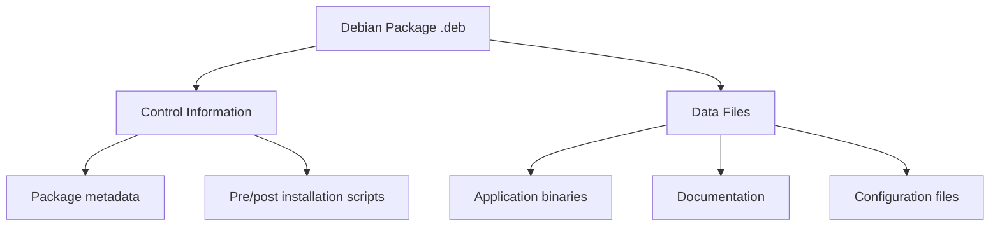

# Debian Package Basics

## Introduction

Debian packages are the foundation of software management in Debian-based Linux distributions like Ubuntu, Linux Mint, and Debian itself. They provide a standardized way to distribute and install software, ensuring dependencies are resolved and system integrity is maintained.

In this guide, we'll explore the basics of Debian packages - what they are, how they work, and how to manage them effectively. By the end, you'll have a solid understanding of the Debian packaging system and be able to confidently install, remove, and manage packages on your system.

## What is a Debian Package?

A Debian package (with the `.deb` extension) is an archive file containing:

1. The application or library files
2. Metadata about the package (dependencies, version, description)
3. Installation scripts
4. Configuration files

Think of a Debian package as a "smart" zip file that not only contains the software but also knows how to properly install itself on your system.



## Package Naming Convention

Debian packages follow a specific naming convention:

```
name_version-revision_architecture.deb
```

For example:
- `firefox_109.0-1_amd64.deb`
  - `firefox` is the package name
  - `109.0` is the version
  - `1` is the Debian revision
  - `amd64` is the architecture (64-bit x86)

## Basic Package Management Tools

### APT (Advanced Package Tool)

APT is a high-level package management tool that handles dependencies automatically. It's the recommended way for beginners to manage packages.

#### Installing Packages with APT

To install a package:

```bash
sudo apt install package-name
```

For example, to install the text editor `nano`:

```bash
sudo apt install nano
```

**Output:**
```
Reading package lists... Done
Building dependency tree... Done
Reading state information... Done
The following additional packages will be installed:
  [list of dependencies]
Suggested packages:
  [suggested related packages]
The following NEW packages will be installed:
  nano [and dependencies]
0 upgraded, 1 newly installed, 0 to remove and 0 not upgraded.
Need to get 269 kB of archives.
After this operation, 851 kB of additional disk space will be used.
Do you want to continue? [Y/n] y
```

#### Removing Packages with APT

To remove a package while keeping configuration files:

```bash
sudo apt remove package-name
```

To completely remove a package including configuration files:

```bash
sudo apt purge package-name
```

#### Updating Package Lists

Before installing new packages, it's good practice to update your package lists:

```bash
sudo apt update
```

#### Upgrading Installed Packages

To upgrade all installed packages to their latest versions:

```bash
sudo apt upgrade
```

### DPKG (Debian Package Manager)

DPKG is the low-level tool that actually installs, removes, and provides information about `.deb` packages. APT uses DPKG behind the scenes.

#### Installing a Local .deb File

```bash
sudo dpkg -i package-file.deb
```

For example:
```bash
sudo dpkg -i google-chrome-stable_current_amd64.deb
```

**Note:** Unlike APT, DPKG doesn't automatically resolve dependencies. If dependencies are missing, you'll see errors and need to manually install them or use `apt install -f` to fix them.

#### Listing Installed Packages

To list all installed packages:

```bash
dpkg -l
```

**Output (excerpt):**
```
| Status | Name | Version | Architecture | Description |
|--------|------|---------|--------------|-------------|
| ii | adduser | 3.118 | all | add and remove users and groups |
| ii | apt | 2.2.4 | amd64 | commandline package manager |
```

#### Checking Package Status

To check if a specific package is installed and see its details:

```bash
dpkg -s package-name
```

For example:
```bash
dpkg -s bash
```

**Output:**
```
Package: bash
Status: install ok installed
Priority: required
Section: shells
Installed-Size: 6470
Maintainer: Matthias Klose <doko@debian.org>
Architecture: amd64
Version: 5.1-2+deb11u1
Replaces: bash-doc (<< 2.05-1)
Depends: base-files (>= 2.1.12), debianutils (>= 2.15)
...
```

#### Finding Which Package Owns a File

To find out which package a specific file belongs to:

```bash
dpkg -S /path/to/file
```

For example:
```bash
dpkg -S /bin/ls
```

**Output:**
```
coreutils: /bin/ls
```

## Package Structure

Let's examine the structure of a Debian package. You can extract a `.deb` file to see its contents:

```bash
mkdir -p extracted/DEBIAN
dpkg-deb --extract package.deb extracted/
dpkg-deb --control package.deb extracted/DEBIAN/
```

### Key Files in a Debian Package

- **DEBIAN/control**: Contains metadata about the package
- **DEBIAN/preinst, postinst, prerm, postrm**: Installation and removal scripts
- Other files: The actual application files, organized in the same directory structure they'll have when installed

For example, a simplified `control` file might look like:

```
Package: hello
Version: 2.10-2
Architecture: amd64
Maintainer: Santiago Vila <sanvila@debian.org>
Installed-Size: 280
Depends: libc6 (>= 2.14)
Section: devel
Priority: optional
Homepage: https://www.gnu.org/software/hello/
Description: example package - GNU hello
 The GNU hello program produces a familiar, friendly greeting.
 It's primarily a demonstration of proper GNU packaging.
```

## Package Repositories

Debian packages are typically obtained from repositories - servers that host collections of packages. The main repository types are:

1. **Main**: Free software supported by the Debian team
2. **Contrib**: Free software that depends on non-free software
3. **Non-free**: Software that isn't free according to Debian's guidelines

Your system's repositories are configured in `/etc/apt/sources.list` and files in `/etc/apt/sources.list.d/`.

A typical sources.list entry looks like:

```
deb http://deb.debian.org/debian bullseye main contrib non-free
```

## Practical Examples

### Example 1: Installing a Web Server

Let's install the Apache web server:

```bash
sudo apt update
sudo apt install apache2
```

After installation, Apache starts automatically. You can verify it's running:

```bash
systemctl status apache2
```

You can now visit `http://localhost` in your browser to see the default Apache page.

### Example 2: Managing Package Configuration

When installing packages that need configuration, Debian's package system will often prompt you with configuration questions.

For example, when installing the MySQL server:

```bash
sudo apt install mysql-server
```

You'll be prompted to set a root password and make other configuration choices through a text-based interface.

### Example 3: Fixing Broken Dependencies

Sometimes package installations can fail due to dependency issues. To fix them:

```bash
sudo apt install -f
```

This command attempts to correct broken dependencies by installing missing packages.

### Example 4: Searching for Packages

To search for packages related to a keyword:

```bash
apt search keyword
```

For example, to find Python packages:

```bash
apt search python
```

**Output (excerpt):**
```
Sorting... Done
Full Text Search... Done
bpython/stable 0.21-1 all
  fancy curses interface to the Python interpreter

bpython3/stable 0.21-1 all
  fancy curses interface to the Python3 interpreter
```

## Common Package Management Operations

Here's a quick reference for common package management operations:

| Operation | APT Command | DPKG Command |
|-----------|-------------|-------------|
| Install package | `sudo apt install pkg-name` | `sudo dpkg -i pkg-file.deb` |
| Remove package | `sudo apt remove pkg-name` | `sudo dpkg -r pkg-name` |
| Purge package | `sudo apt purge pkg-name` | `sudo dpkg -P pkg-name` |
| Update package lists | `sudo apt update` | N/A |
| Upgrade packages | `sudo apt upgrade` | N/A |
| Search for package | `apt search keyword` | N/A |
| List installed packages | `apt list --installed` | `dpkg -l` |
| Show package info | `apt show pkg-name` | `dpkg -s pkg-name` |
| Check which package owns a file | N/A | `dpkg -S /path/to/file` |

## Best Practices for Debian Package Management

1. **Regular updates**: Keep your system updated with `sudo apt update && sudo apt upgrade`
2. **Clean up**: Periodically remove unused packages with `sudo apt autoremove`
3. **Check before installing**: Use `apt show package-name` to review what a package does before installing
4. **Use official repositories**: Stick to official repositories when possible for security
5. **Back up configuration**: Back up important configuration files before upgrading critical packages

## Summary

In this guide, we've covered the basics of Debian packages:

- What Debian packages are and how they're structured
- Using APT for high-level package management
- Using DPKG for low-level package operations
- Understanding package repositories
- Practical examples of package management
- Best practices for maintaining your system

Debian's packaging system is powerful, reliable, and a key reason why Debian-based distributions are popular. Understanding how to effectively manage packages is an essential skill for any Linux user.

## Additional Resources

- [Debian Package Management Handbook](https://www.debian.org/doc/manuals/debian-handbook/apt.en.html)
- [Debian Wiki - APT](https://wiki.debian.org/Apt)
- [Debian New Maintainers' Guide](https://www.debian.org/doc/manuals/maint-guide/)

## Exercises

1. Install a text editor of your choice (like `vim`, `emacs`, or `gedit`) using APT.
2. Search for packages related to "game" and install one that interests you.
3. Examine the dependencies of a large package like `gnome-desktop`.
4. Create a simple bash script to update and upgrade your system, then schedule it to run weekly.
5. Find out which package the `/bin/bash` file belongs to.