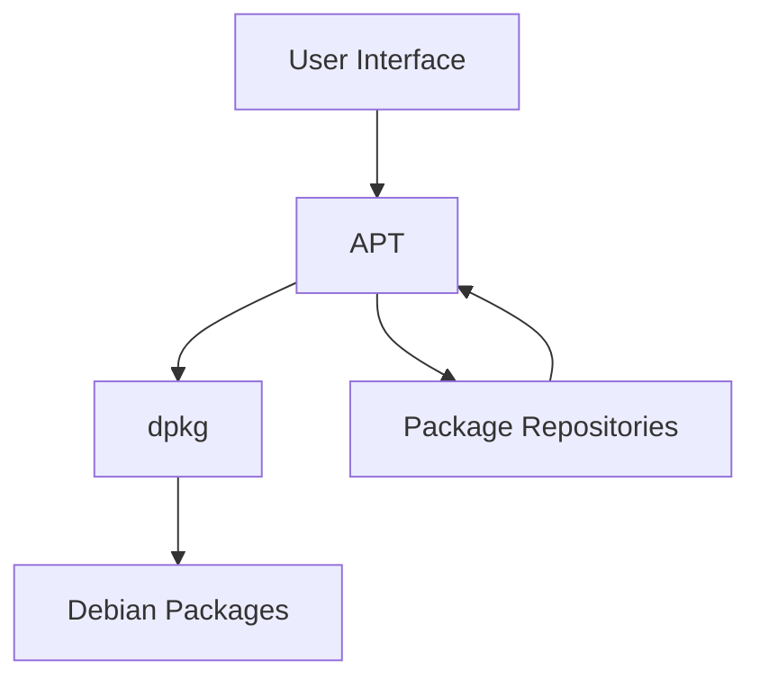

# Debian APT Introduction

## What is APT?

APT (Advanced Package Tool) is a powerful package management system that forms the backbone of software installation, removal, and maintenance on Debian and Debian-based Linux distributions like Ubuntu. APT simplifies the process of managing software by handling dependencies automatically and providing a consistent interface for package operations.

Unlike manual installation methods, APT ensures system stability by tracking all installed packages, their dependencies, and configuration files. This makes software management on Debian systems remarkably straightforward and reliable.

## APT Architecture

APT works as a front-end to the lower-level `dpkg` utility, adding intelligence and automation to package management operations.



The APT system consists of:

1. **Package repositories**: Online sources containing software packages
2. **APT tools**: Command-line utilities like `apt`, `apt-get`, and `apt-cache`
3. **Database files**: Located in `/var/lib/apt/` to track available and installed packages
4. **Configuration files**: Located in `/etc/apt/` to configure repository sources and preferences

## Getting Started with APT

Before you can install or update packages, you need to update your local package index:

```bash
sudo apt update
```

This command connects to the configured repositories and downloads the latest package information without installing anything. You should see output similar to:

```
Hit:1 http://us.archive.ubuntu.com/ubuntu jammy InRelease
Get:2 http://security.ubuntu.com/ubuntu jammy-security InRelease [110 kB]
Get:3 http://us.archive.ubuntu.com/ubuntu jammy-updates InRelease [119 kB]
Fetched 229 kB in 1s (223 kB/s)
Reading package lists... Done
Building dependency tree... Done
Reading state information... Done
All packages are up to date.
```

## Essential APT Commands

### Installing Packages

To install a new package:

```bash
sudo apt install package-name
```

For example, to install the `nginx` web server:

```bash
sudo apt install nginx
```

The system will calculate dependencies and ask for confirmation:

```
Reading package lists... Done
Building dependency tree... Done
Reading state information... Done
The following additional packages will be installed:
  fontconfig-config fonts-dejavu-core libfontconfig1 libgd3 libjbig0
  libjpeg-turbo8 libjpeg8 libnginx-mod-http-geoip2 [...]
Suggested packages:
  fcgiwrap nginx-doc ssl-cert
The following NEW packages will be installed:
  fontconfig-config fonts-dejavu-core libfontconfig1 libgd3 libjbig0
  libjpeg-turbo8 libjpeg8 libnginx-mod-http-geoip2 [...]
0 upgraded, 22 newly installed, 0 to remove and 0 not upgraded.
Need to get 8,413 kB of archives.
After this operation, 28.2 MB of additional disk space will be used.
Do you want to continue? [Y/n]
```

Type `Y` and press Enter to proceed with the installation.

### Removing Packages

To remove an installed package:

```bash
sudo apt remove package-name
```

For example:

```bash
sudo apt remove nginx
```

This will remove the package but keep configuration files. If you want to remove the package and its configuration files:

```bash
sudo apt purge nginx
```

### Updating the System

To update all installed packages to their latest versions:

```bash
sudo apt update
sudo apt upgrade
```

For a more comprehensive upgrade that can handle changing dependencies:

```bash
sudo apt dist-upgrade
```

### Searching for Packages

To search for a package by name or description:

```bash
apt search keyword
```

For example:

```bash
apt search text-editor
```

Sample output:

```
Sorting... Done
Full Text Search... Done
ghostwriter/jammy 2.1.4+ds-1 amd64
  Distraction-free markdown editor

jove/jammy 4.17.4.1 amd64
  Jonathan's Own Version of Emacs - a compact, powerful editor

kwrite/jammy 4:21.12.3-0ubuntu1 amd64
  simple text editor
```

### Viewing Package Information

To view detailed information about a package:

```bash
apt show package-name
```

For example:

```bash
apt show nginx
```

This will display detailed information about the package:

```
Package: nginx
Version: 1.18.0-6ubuntu14.4
Priority: optional
Section: web
Origin: Ubuntu
[...]
Description: small, powerful, scalable web/proxy server
 Nginx ("engine X") is a high-performance web and reverse proxy server
 created by Igor Sysoev. It can be used both as a standalone web server
 and as a proxy to reduce the load on back-end HTTP or mail servers.
[...]
```

## Managing Package Sources

APT uses repository information defined in `/etc/apt/sources.list` and files in the `/etc/apt/sources.list.d/` directory.

To view your current sources:

```bash
cat /etc/apt/sources.list
```

Example output:

```
deb http://us.archive.ubuntu.com/ubuntu/ jammy main restricted
deb http://us.archive.ubuntu.com/ubuntu/ jammy-updates main restricted
deb http://security.ubuntu.com/ubuntu jammy-security main restricted
# Additional repositories...
```

To add a new repository, you can either edit the `sources.list` file directly or add a new file in the `sources.list.d` directory.

For example, to add a repository for a third-party application:

```bash
sudo add-apt-repository ppa:team/application
```

After adding a new repository, always update the package index:

```bash
sudo apt update
```

## Advanced APT Features

### Automatically Remove Unused Dependencies

Over time, your system may accumulate packages that were installed as dependencies but are no longer needed:

```bash
sudo apt autoremove
```

### Clean APT Cache

APT stores downloaded package files in `/var/cache/apt/archives/`. To free up disk space:

```bash
sudo apt clean
```

For a less aggressive option that keeps recently downloaded packages:

```bash
sudo apt autoclean
```

### Simulate Operations

You can see what would happen during an installation without actually making changes:

```bash
sudo apt --simulate install package-name
```

or

```bash
sudo apt -s install package-name
```

### Hold Package Versions

To prevent a package from being automatically upgraded:

```bash
sudo apt-mark hold package-name
```

To allow upgrades again:

```bash
sudo apt-mark unhold package-name
```

## Practical Examples

### Scenario 1: Setting Up a Development Environment

Let's set up a basic web development environment with PHP, MySQL, and Apache:

```bash
# Update package index
sudo apt update

# Install Apache web server
sudo apt install apache2

# Install PHP and common extensions
sudo apt install php php-mysql php-curl php-gd php-mbstring php-xml php-zip

# Install MySQL database server
sudo apt install mysql-server
```

After installation, verify that Apache is running:

```bash
systemctl status apache2
```

You should see output indicating that the service is active (running).

### Scenario 2: Troubleshooting and Fixing Broken Installations

If you encounter package installation issues:

```bash
# Fix broken dependencies
sudo apt --fix-broken install

# Reconfigure packages
sudo dpkg --configure -a

# If still having issues, try:
sudo apt update --fix-missing
sudo apt install -f
```

### Scenario 3: Batch Installation from a File

You can install multiple packages from a list:

```bash
# Create a list of packages
echo -e "htop
vim
tmux
git" > packages.txt

# Install all packages in the list
xargs -a packages.txt sudo apt install -y
```

## Comparing APT Commands

| Task | Modern Command | Traditional Command |
|------|----------------|---------------------|
| Update package index | `sudo apt update` | `sudo apt-get update` |
| Install package | `sudo apt install <pkg>` | `sudo apt-get install <pkg>` |
| Remove package | `sudo apt remove <pkg>` | `sudo apt-get remove <pkg>` |
| Remove with config | `sudo apt purge <pkg>` | `sudo apt-get purge <pkg>` |
| Upgrade packages | `sudo apt upgrade` | `sudo apt-get upgrade` |
| Search packages | `apt search <term>` | `apt-cache search <term>` |
| Show package info | `apt show <pkg>` | `apt-cache show <pkg>` |
| Clean cache | `sudo apt clean` | `sudo apt-get clean` |
| Remove unused deps | `sudo apt autoremove` | `sudo apt-get autoremove` |

Note: The newer `apt` command was designed to be more user-friendly than the older `apt-get` and `apt-cache` commands, consolidating commonly used features.

## Summary

APT is a powerful package management system that makes software installation and maintenance straightforward on Debian-based systems. In this guide, you've learned:

- The core concepts of APT and package management
- Basic commands for installing, removing, and updating software
- How to search for packages and view detailed information
- Managing package sources and repositories
- Advanced features like dependency management and simulation
- Practical examples for common scenarios

By mastering APT, you've gained an essential skill for working with Debian-based Linux distributions, enabling you to easily maintain your system and install the software you need.

## Additional Resources and Exercises

### Further Learning

- Read the official APT documentation with `man apt`
- Explore the Debian Package Management handbook online
- Learn about related tools like `apt-file` for finding which package provides a specific file

### Practice Exercises

1. **Package Explorer**: List all installed packages on your system using `apt list --installed` and identify the five largest packages using `dpkg-query -Wf '${Installed-Size}\t${Package}
' | sort -n | tail -5`

2. **Repository Research**: Identify which repository provides a specific package using `apt policy package-name`

3. **System Maintenance**: Create a simple shell script that updates your system, cleans unused packages, and reports how much disk space was freed

4. **Package Investigation**: Choose an application you use frequently and find out:
   - What dependencies it requires
   - What files it installs on your system
   - What configuration options are available

5. **Dependency Tree**: For a complex package like `firefox` or `libreoffice`, visualize its dependency tree using `apt-cache depends --recursive package-name`