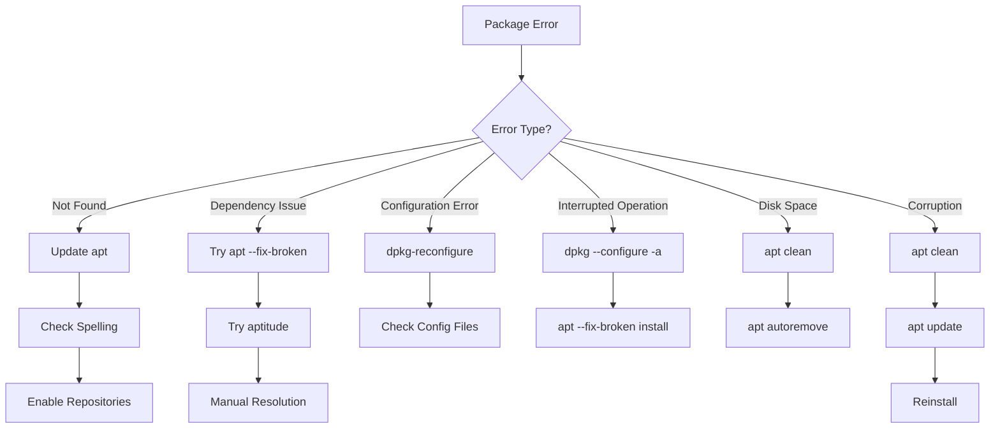

# Debian Package Troubleshooting

While Debian's package management system is robust, you'll occasionally encounter issues when installing, upgrading, or removing packages. This guide will walk you through common problems and their solutions.

## Introduction

Debian's package management system (using tools like `apt`, `dpkg`, and `aptitude`) provides a streamlined way to install, update, and remove software. However, package operations can sometimes fail due to:

- Dependency conflicts
- Interrupted installations
- Repository issues
- Disk space limitations
- Package corruption
- Configuration errors

This guide will help you identify and resolve these issues, making your Debian package management experience smoother.

## Understanding Package Errors

Before diving into specific solutions, let's understand the anatomy of package errors. When troubleshooting, you'll typically see error messages from the package management tool you're using.

### Common Error Message Patterns

```
E: Unable to locate package [package-name]
E: Package [package-name] has no installation candidate
E: Unmet dependencies
E: Broken packages
dpkg: error processing package [package-name] (--configure)
```

These error messages provide important clues about what's going wrong. Let's explore how to resolve them.

## Common Package Issues and Solutions

### 1. Unable to Find Package

#### Problem

You try to install a package but get an error that it can't be found:

```bash
sudo apt install some-package
```

```
E: Unable to locate package some-package
```

#### Solution

1. **Update package lists**:

```bash
sudo apt update
```

2. **Check package name spelling** (package names are case-sensitive)

3. **Enable additional repositories**:

```bash
# Enable universe repository
sudo add-apt-repository universe
sudo apt update
```

4. **Check if the package exists in your Debian version**:

```bash
apt-cache search partial-package-name
```

### 2. Dependency Problems

#### Problem

When dependencies can't be resolved:

```
The following packages have unmet dependencies:
 package-a : Depends: package-b (>= 2.0) but 1.8 is installed
E: Unable to correct problems, you have held broken packages.
```

#### Solution

1. **Try installing with aptitude** (better dependency resolver):

```bash
sudo aptitude install package-a
```

2. **Force apt to fix broken packages**:

```bash
sudo apt --fix-broken install
```

3. **Try different dependency resolution approach**:

```bash
sudo apt install -f
```

### 3. Broken Package Database

#### Problem

Your package system is in an inconsistent state, often due to an interrupted package operation.

#### Solution

1. **Reconfigure partially installed packages**:

```bash
sudo dpkg --configure -a
```

2. **Fix broken dependencies**:

```bash
sudo apt --fix-broken install
```

3. **Clean and update**:

```bash
sudo apt clean
sudo apt update
```

### 4. Package Conflicts

#### Problem

Two packages can't be installed together due to conflicts:

```
The following packages have unmet dependencies:
 package-a : Conflicts: package-b but package-b is installed
```

#### Solution

1. **Remove the conflicting package**:

```bash
sudo apt remove package-b
sudo apt install package-a
```

2. **Look for alternative packages** that provide similar functionality without conflicts

3. **Use aptitude's interactive resolver**:

```bash
sudo aptitude install package-a
```
When prompted with solutions, select the one that best meets your needs.

### 5. Held Packages

#### Problem

Packages marked as "held" won't upgrade:

```
The following packages have been kept back:
  package-a package-b
```

#### Solution

1. **List held packages**:

```bash
apt-mark showhold
```

2. **Release hold on packages**:

```bash
sudo apt-mark unhold package-a
```

3. **Force an upgrade**:

```bash
sudo apt --with-new-pkgs upgrade
```

### 6. Configuration Files Prompt

#### Problem

During upgrades, you might be prompted about modified configuration files:

```
Configuration file '/etc/some-config'
 ==> Modified (by you or by a script) since installation.
 ==> Package distributor has shipped an updated version.
   What would you like to do about it ?
```

#### Solution

Your options in this prompt:
- `Y` or `I`: Install the new version (your changes will be lost)
- `N` or `O`: Keep your currently-installed version
- `D`: Show the differences between versions
- `Z`: Start a shell to examine the situation

Best practice: Choose `D` to see differences first, then decide.

### 7. Failed Package Operation Due to Disk Space

#### Problem

```
Not enough free disk space
```

#### Solution

1. **Clear apt cache**:

```bash
sudo apt clean
```

2. **Remove unnecessary packages**:

```bash
sudo apt autoremove
```

3. **Check disk usage**:

```bash
df -h
```

4. **Find and clean large files**:

```bash
sudo du -sh /var/log
sudo du -sh /var/cache/apt
```

## Diagnostic Tools

Let's explore some useful tools for diagnosing package issues:

### apt-cache

Check package details and dependencies:

```bash
# Search for a package
apt-cache search keyword

# Show package details
apt-cache show package-name

# Show package dependencies
apt-cache depends package-name

# Show what depends on a package
apt-cache rdepends package-name
```

### dpkg

Low-level package management:

```bash
# List all installed packages
dpkg -l

# Check package status
dpkg -s package-name

# List files installed by a package
dpkg -L package-name

# Find which package owns a file
dpkg -S /path/to/file
```

### aptitude

Interactive package manager:

```bash
sudo aptitude
```

This launches an interactive interface where you can browse packages, see conflicts, and resolve dependencies.

## Advanced Troubleshooting

### Downgrading Packages

If a package upgrade causes problems, you can downgrade:

```bash
sudo apt install package-name=version-number
```

Example:
```bash
sudo apt install nginx=1.18.0-6ubuntu14.4
```

### Purging Completely

Sometimes a clean slate is needed:

```bash
sudo apt purge package-name
sudo apt autoremove --purge
```

This removes the package and all configuration files.

### Working with Package Configuration

Reconfigure a package:

```bash
sudo dpkg-reconfigure package-name
```

Example:
```bash
sudo dpkg-reconfigure locales
```

### Manual Package Extraction and Inspection

For deeper issues, extract and examine `.deb` files:

```bash
# Download without installing
apt download package-name

# Extract a deb file
dpkg-deb -x package-name.deb extract-dir/

# View control information
dpkg-deb -I package-name.deb
```

## Flowchart for Package Troubleshooting

Here's a systematic approach to troubleshooting:



## Real-World Examples

### Example 1: Resolving Broken Apache Installation

Scenario: Your Apache installation was interrupted due to a power outage, and now it's in a broken state.

```bash
sudo apt install apache2
```

```
E: Unable to locate package apache2
```

Resolution steps:

```bash
# Update repositories
sudo apt update

# Try installing again
sudo apt install apache2
```

If that fails with dependency issues:

```bash
# Fix broken packages
sudo apt --fix-broken install

# Configure partially installed packages
sudo dpkg --configure -a

# Try installing again
sudo apt install apache2
```

### Example 2: Upgrading with Conflicting Packages

Scenario: System upgrade is blocked by conflicting packages.

```bash
sudo apt upgrade
```

```
The following packages have unmet dependencies:
 python3-minimal : Breaks: python3 (< 3.9.2-3) but 3.8.10-0ubuntu1 is installed
```

Resolution:

```bash
# Use aptitude for interactive conflict resolution
sudo aptitude upgrade

# Select the solution that upgrades both packages together
```

### Example 3: Dealing with Held Packages

Scenario: Some packages are being held back during upgrades.

```bash
sudo apt upgrade
```

```
The following packages have been kept back:
  linux-generic linux-headers-generic linux-image-generic
```

Resolution:

```bash
# Perform full upgrade including package transitions
sudo apt full-upgrade

# If that doesn't work, specifically install the held packages
sudo apt install linux-generic linux-headers-generic linux-image-generic
```

## Preventive Measures

Avoid package issues with these best practices:

1. **Regular updates**:
   ```bash
   sudo apt update && sudo apt upgrade
   ```

2. **Create apt configuration backups**:
   ```bash
   sudo cp -r /etc/apt/sources.list* /path/to/backup/
   ```

3. **Install with simulation first**:
   ```bash
   sudo apt install -s package-name
   ```

4. **Keep your system clean**:
   ```bash
   sudo apt autoremove
   sudo apt clean
   ```

5. **Use apt-mark to manage critical packages**:
   ```bash
   sudo apt-mark hold critical-package
   ```

## Summary

Debian package management is powerful but can occasionally encounter issues. Remember these key points:

- Most package problems stem from dependency conflicts, interrupted operations, or repository issues
- The core tools for fixing problems are `apt`, `dpkg`, and `aptitude`
- Always update your package lists before troubleshooting
- For complex dependency problems, `aptitude` often provides better solutions
- Create backups before making significant system changes
- Regular maintenance helps prevent issues

With these troubleshooting techniques, you'll be able to resolve most Debian package management issues efficiently.

## Additional Resources

- [Debian Package Management Handbook](https://www.debian.org/doc/manuals/debian-handbook/index.en.html)
- [APT Manual](https://manpages.debian.org/stretch/apt/apt.8.en.html)
- [DPKG Manual](https://manpages.debian.org/stretch/dpkg/dpkg.1.en.html)
- [Aptitude User's Manual](https://manpages.debian.org/stretch/aptitude/aptitude.8.en.html)

## Practice Exercises

1. Create a script that checks for and resolves broken packages automatically.
2. Practice fixing a simulated dependency conflict by holding one package and trying to install a dependent one.
3. Set up a test environment where you intentionally interrupt a package installation, then fix it.
4. Create a maintenance checklist for your Debian system's package health.