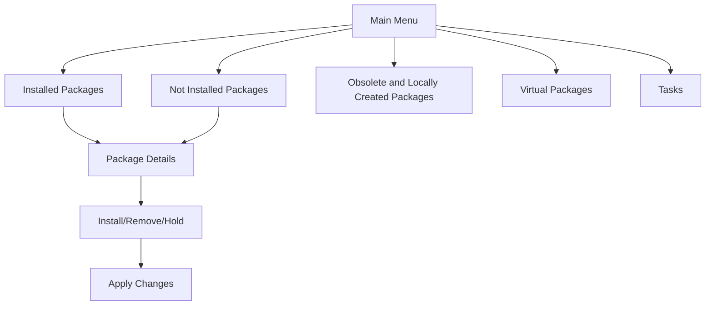

# Debian Aptitude

## Introduction

Aptitude is a powerful text-based interface for package management in Debian-based Linux distributions. It serves as an alternative to the more commonly used `apt` and `apt-get` commands, offering more advanced features and a more sophisticated dependency resolver. Aptitude combines the functionality of `apt-get` and `apt-cache` with additional capabilities, making it a versatile tool for managing software on your Debian system.

In this guide, we'll explore Aptitude's features, how it differs from other package management tools, and how to use it effectively for various package management tasks.

## What is Aptitude?

Aptitude is a package manager with a text-based user interface that offers:

- A full-screen interactive menu system
- Advanced search capabilities
- Dependency resolution that considers suggested and recommended packages
- The ability to automatically remove unused packages
- Better conflict resolution algorithms
- Command-line functionality similar to `apt-get`

Let's dive into how to use Aptitude effectively!

## Installing Aptitude

Before you can use Aptitude, you need to install it. Open a terminal and run:

```bash
sudo apt update
sudo apt install aptitude
```

## Basic Aptitude Commands

### Updating Package Lists

To update your package lists with Aptitude:

```bash
sudo aptitude update
```

**Output example:**
```
Hit http://deb.debian.org/debian bookworm InRelease
Get:1 http://security.debian.org/debian-security bookworm-security InRelease [48.0 kB]
Get:2 http://deb.debian.org/debian bookworm-updates InRelease [52.1 kB]
Fetched 100.1 kB in 2s (50.0 kB/s)
Reading package lists... Done
```

### Upgrading Packages

To upgrade all installed packages:

```bash
sudo aptitude safe-upgrade
```

For a more aggressive upgrade that might remove packages to resolve dependencies:

```bash
sudo aptitude full-upgrade
```

### Installing Packages

To install a package:

```bash
sudo aptitude install package_name
```

For example, to install the `htop` system monitor:

```bash
sudo aptitude install htop
```

**Output example:**
```
The following NEW packages will be installed:
  htop 
0 packages upgraded, 1 newly installed, 0 to remove and 0 not upgraded.
Need to get 180 kB of archives. After unpacking, 291 kB will be used.
Do you want to continue? [Y/n/?] Y
Get:1 http://deb.debian.org/debian bookworm/main amd64 htop amd64 3.2.2-2 [180 kB]
Fetched 180 kB in 0s (1,800 kB/s)
Selecting previously unselected package htop.
(Reading database ... 33851 files and directories currently installed.)
Preparing to unpack .../htop_3.2.2-2_amd64.deb ...
Unpacking htop (3.2.2-2) ...
Setting up htop (3.2.2-2) ...
Processing triggers for man-db (2.11.2-2) ...
```

### Removing Packages

To remove a package:

```bash
sudo aptitude remove package_name
```

To remove a package along with its configuration files:

```bash
sudo aptitude purge package_name
```

### Searching for Packages

To search for packages:

```bash
aptitude search search_term
```

For example, to search for text editors:

```bash
aptitude search editor
```

**Output example:**
```
p   abiword-plugin-grammar           - grammar checking plugin for AbiWord     
p   bluefish                         - advanced Gtk+ text editor for web and so
p   emacs                            - GNU Emacs editor (metapackage)          
p   gedit                            - text editor for the GNOME desktop       
p   gedit-plugins                    - set of plugins for gedit                
p   nano                             - small, friendly text editor inspired by 
i   vim                              - Vi IMproved - enhanced vi editor        
p   vim-gtk3                         - Vi IMproved - enhanced vi editor (with G
```

The letters at the beginning of each line indicate the package status:
- `i`: installed
- `p`: not installed (but available)
- `v`: virtual package
- `c`: package will be removed
- `A`: automatically installed

### Showing Package Details

To get detailed information about a package:

```bash
aptitude show package_name
```

For example:

```bash
aptitude show vim
```

**Output example:**
```
Package: vim                          
Version: 2:9.0.1378-2
State: installed
Automatically installed: no
Priority: optional
Section: editors
Maintainer: Debian Vim Maintainers <team+vim@tracker.debian.org>
Architecture: amd64
Uncompressed Size: 3,191 kB
Depends: vim-common (= 2:9.0.1378-2), vim-runtime (= 2:9.0.1378-2), libacl1 (>= 2.2.23), libc6 (>= 2.34), libgpm2 (>= 1.20.7), libselinux1 (>= 3.1~), libtinfo6 (>= 6)
Suggests: ctags, vim-doc, vim-scripts
Description: Vi IMproved - enhanced vi editor
 Vim is an almost compatible version of the UNIX editor Vi.
 
 Many new features have been added: multi-level undo, syntax highlighting,
 command line history, on-line help, filename completion, block operations,
 folding, Unicode support, etc.
 
 This package contains a version of vim compiled with a rather standard set of
 features.  This package does not provide a GUI version of Vim.  See the other
 vim-* packages if you need more (or less).
Homepage: https://www.vim.org/
```

## Using the Aptitude Text User Interface (TUI)

One of Aptitude's distinctive features is its interactive text user interface. To launch it:

```bash
sudo aptitude
```

This opens an interactive screen where you can:
- Browse available packages
- View package details
- Mark packages for installation, removal, or upgrading
- Resolve dependencies
- Apply changes

### Navigating the Aptitude TUI



Key navigation commands in the Aptitude TUI:
- Use arrow keys to navigate
- Press `Enter` to expand/collapse categories
- Press `+` to mark a package for installation
- Press `-` to mark a package for removal
- Press `=` to place a hold on a package
- Press `g` to preview and apply changes
- Press `q` to quit
- Press `?` for help

## Advanced Aptitude Features

### Dependency Resolution

Aptitude is known for its superior dependency resolution. When there are conflicts, Aptitude offers multiple solutions:

```bash
sudo aptitude install package_with_conflicts
```

**Output example:**
```
The following packages have unmet dependencies:
 package_with_conflicts : Depends: dependency_package (>= 2.0) but 1.8 is installed
The following actions will resolve these dependencies:

     Keep the following packages at their current version:
1)     package_with_conflicts [Not Installed]

Accept this solution? [Y/n/q/?] n

The following actions will resolve these dependencies:

     Downgrade the following packages:
1)     dependency_package [2.0 (testing) -> 1.8 (stable)]

Accept this solution? [Y/n/q/?] n

The following actions will resolve these dependencies:

     Upgrade the following packages:
1)     dependency_package [1.8 (stable) -> 2.0 (testing)]

Accept this solution? [Y/n/q/?] 
```

### Package States and Filters

Aptitude allows filtering packages based on states. For example, to see automatically installed packages:

```bash
aptitude search '~i ~M'
```

To see manually installed packages:

```bash
aptitude search '~i !~M'
```

### Why a Package Was Installed

To see why a package was installed (dependencies):

```bash
aptitude why package_name
```

For example:

```bash
aptitude why libreoffice-core
```

**Output example:**
```
i   libreoffice Depends libreoffice-writer (>= 1:7.0.4)
i A libreoffice-writer Depends libreoffice-core (= 1:7.0.4-3)
```

### Why a Package Would Be Installed

To see why a package would be installed as a dependency:

```bash
aptitude why-not package_name
```

## Aptitude vs. APT: Key Differences

| Feature | Aptitude | APT |
|---------|----------|-----|
| User Interface | Both CLI and TUI | CLI only |
| Dependency Resolution | More sophisticated | Basic |
| Unused Package Removal | Automatic tracking | Requires `autoremove` |
| Conflict Resolution | Interactive solutions | Limited |
| Search Capabilities | Advanced patterns | Basic |
| Recommended Packages | Considers them | Ignores by default |

## Practical Examples

### Example 1: Installing a LAMP Stack

Let's use Aptitude to install a LAMP (Linux, Apache, MySQL, PHP) stack:

```bash
sudo aptitude install apache2 mysql-server php libapache2-mod-php php-mysql
```

Aptitude will resolve all dependencies, suggest additional recommended packages, and present you with options if there are conflicts.

### Example 2: Finding Packages that Depend on a Specific Library

To find all installed packages that depend on a specific library:

```bash
aptitude search '~i ~Ddependency_name'
```

For example, to find all packages that depend on libssl:

```bash
aptitude search '~i ~Dlibssl'
```

### Example 3: Cleaning Up Your System

To remove packages that were automatically installed and are no longer needed:

```bash
sudo aptitude purge ~o
```

To list these packages without removing them:

```bash
aptitude search '~i ~M ~o'
```

## Tips and Best Practices

1. **Regular Maintenance**:
   ```bash
   sudo aptitude update && sudo aptitude safe-upgrade
   ```

2. **Hold Packages** you don't want upgraded:
   ```bash
   sudo aptitude hold package_name
   ```

3. **Search Efficiently** using Aptitude's powerful search patterns:
   ```bash
   aptitude search '~i ~Gtext-editor'  # Installed packages in the text-editor group
   ```

4. **Check Security Updates** specifically:
   ```bash
   aptitude search '~U ~ssecurity'
   ```

5. **Simulate Actions** before performing them:
   ```bash
   sudo aptitude -s install package_name
   ```

## Common Issues and Troubleshooting

### Resolving "Broken Packages" Errors

If you encounter broken package errors:

```bash
sudo aptitude -f install
```

This will attempt to fix broken dependencies.

### Handling Package Conflicts

When faced with package conflicts, Aptitude will present multiple solutions. Consider each carefully before selecting one.

If none of the solutions work, you might need to:

1. Hold problematic packages:
   ```bash
   sudo aptitude hold package_name
   ```

2. Force version selection:
   ```bash
   sudo aptitude install package_name=specific_version
   ```

## Summary

Aptitude is a powerful package management tool for Debian-based systems that offers both a command-line interface and a text-based user interface. Its advanced dependency resolution, interactive conflict solving, and powerful search capabilities make it a preferred choice for many system administrators and advanced users.

Key advantages of Aptitude include:
- Superior dependency resolution
- Interactive conflict resolution
- Automatic tracking and removal of unused packages
- Powerful search patterns
- Consideration of recommended packages

While `apt` and `apt-get` are more commonly used for their simplicity, Aptitude provides more control and flexibility for complex package management scenarios.

## Additional Resources

For further learning and practice, consider these resources:

- The Aptitude manual: `man aptitude`
- The Aptitude user's guide: `aptitude help`
- Practice with searching using different patterns
- Try the following exercises:
  1. Install a package with all recommended dependencies
  2. Find all packages related to a specific programming language
  3. Clean up unused packages on your system
  4. Resolve a package conflict using the interactive interface

You can also explore Aptitude's configuration options in `/etc/apt/apt.conf.d/` to customize its behavior according to your preferences.