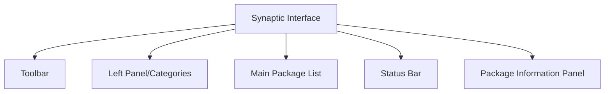

# Debian Synaptic Package Manager

## Introduction

Synaptic is a graphical package management tool for Debian-based Linux distributions. It serves as a front-end for the Advanced Package Tool (APT) system, providing a user-friendly interface to install, remove, upgrade, and manage software packages. For beginners transitioning from other operating systems to Debian or Ubuntu, Synaptic offers an intuitive way to handle software without needing to use command-line tools.

In this guide, we'll explore how to use Synaptic Package Manager effectively, understanding its interface, and performing common package management tasks.

## Installing Synaptic

If Synaptic isn't already installed on your system, you can install it using the command line:

```bash
sudo apt update
sudo apt install synaptic
```

## The Synaptic Interface

When you first open Synaptic, you'll be greeted with an interface divided into several key areas:

1. **Toolbar**: Contains buttons for common operations like Reload, Mark All Upgrades, Apply, etc.
2. **Left Panel**: Filters packages by categories, status, or search results
3. **Main Panel**: Displays the list of packages
4. **Status Bar**: Shows information about package counts and operations



## Basic Operations in Synaptic

### Refreshing Package Information

Before working with packages, it's important to refresh the package database to ensure you have the latest information:

1. Click the **Reload** button in the toolbar or press `Ctrl+R`
2. Synaptic will connect to your configured repositories and update its database

### Searching for Packages

To find a specific package:

1. Click on the **Search** button in the toolbar or press `Ctrl+F`
2. Enter the package name or keywords related to the functionality you're looking for
3. Synaptic will filter the package list to show matching results

For example, searching for "text editor" will show various text editing applications available in the repositories.

### Installing Packages

To install a new package:

1. Find the package you want to install using search or browsing categories
2. Right-click on the package and select **Mark for Installation**
3. If the package has dependencies, Synaptic will prompt you to mark those for installation as well
4. Click **Apply** in the toolbar to execute the installation

```bash
# Equivalent command-line operation:
sudo apt install package-name
```

### Removing Packages

To remove a package:

1. Find the package in your installed packages
2. Right-click and select **Mark for Removal** or **Mark for Complete Removal** (purge)
   - **Mark for Removal**: Removes the package but keeps configuration files
   - **Mark for Complete Removal**: Removes the package and its configuration files
3. Click **Apply** to execute the removal

```bash
# Equivalent command-line operations:
sudo apt remove package-name     # Regular removal
sudo apt purge package-name      # Complete removal with configuration files
```

### Upgrading Packages

To upgrade all installed packages to their latest versions:

1. Click **Mark All Upgrades** in the toolbar
2. Click **Apply** to execute the upgrades

To upgrade a specific package:

1. Find the package in the list
2. If an upgrade is available, right-click and select **Mark for Upgrade**
3. Click **Apply**

```bash
# Equivalent command-line operations:
sudo apt update                  # Update package information
sudo apt upgrade                 # Upgrade all packages
sudo apt install package-name    # Upgrade specific package
```

## Advanced Features

### Package Properties and Details

Synaptic provides detailed information about each package:

1. Select a package in the main panel
2. View the description, dependencies, installed files, and versions in the lower panel
3. Right-click and select **Properties** for even more detailed information

### Package Filters

The left panel offers various ways to filter packages:

- **Status**: Shows packages based on their current state (installed, upgradable, etc.)
- **Sections**: Organizes packages by category (graphics, internet, games, etc.)
- **Search Results**: Shows packages matching your search terms
- **Custom Filters**: Allows you to create custom filters based on specific criteria

### Package Pinning

Pinning allows you to lock packages to specific versions:

1. Select the package you want to pin
2. Go to **Package** menu → **Lock Version**
3. The package will now remain at its current version during upgrades

```bash
# Equivalent command-line operation:
echo "package-name hold" | sudo dpkg --set-selections
```

### Managing Repositories

Synaptic allows you to manage your software sources:

1. Go to **Settings** → **Repositories**
2. Add, remove, or edit repositories as needed
3. Click **Reload** after making changes to update the package information

## Practical Examples

### Example 1: Installing a Web Server

Let's install the Apache web server using Synaptic:

1. Open Synaptic and click **Search**
2. Type "apache2" in the search box
3. Right-click on the "apache2" package and select **Mark for Installation**
4. Click **Apply** to install Apache with all its dependencies
5. After installation, verify it's working by opening a web browser and navigating to `http://localhost`

### Example 2: Finding and Installing Alternative Software

Let's say you need a photo editing application:

1. Open Synaptic and click **Search**
2. Type "photo editor" in the search box
3. Browse through the results to find options like GIMP, Krita, or Shotwell
4. Read the descriptions to find the one that suits your needs
5. Right-click on your chosen package and select **Mark for Installation**
6. Click **Apply** to install it

### Example 3: System Maintenance

Performing regular system maintenance:

1. Open Synaptic and click **Reload** to refresh package information
2. Click **Mark All Upgrades** to select all available updates
3. Click **Apply** to install all updates
4. Use the **Status** filter in the left panel and select "Residual Config" to find packages that were removed but left configuration files
5. Mark these for complete removal if you don't need the configurations
6. Click **Apply** to clean up your system

## Common Issues and Troubleshooting

### Locked Database

If you see an error about the package database being locked:

```bash
E: Could not get lock /var/lib/dpkg/lock
```

This means another package management process is running. Wait for it to complete or check if there's a stuck process:

```bash
ps aux | grep -i apt
```

### Broken Packages

If Synaptic reports broken packages:

1. Go to **Edit** → **Fix Broken Packages**
2. Click **Apply** to resolve dependencies

```bash
# Equivalent command-line operation:
sudo apt --fix-broken install
```

### Failed Downloads

If package downloads fail:

1. Check your internet connection
2. Try a different repository mirror in **Settings** → **Repositories**
3. Click **Reload** and try again

## Summary

Synaptic Package Manager provides a powerful yet user-friendly interface for managing software on Debian-based systems. Key benefits include:

1. **Visual Interface**: Easier for beginners compared to command-line tools
2. **Comprehensive Management**: Install, remove, upgrade, and configure packages in one place
3. **Detailed Information**: Access package descriptions, dependencies, and versions
4. **Search Capabilities**: Find packages by name, function, or category

By mastering Synaptic, you'll be able to maintain your Debian system effectively, keep it up to date, and explore the vast ecosystem of Linux software available in the repositories.

## Additional Resources

For further learning about Debian package management:

- The `apt` command-line tool for more advanced package management
- The `/etc/apt/sources.list` file for manual repository configuration
- The Debian Package Management chapter in the Debian Reference manual
- Exploring alternative package managers like `aptitude`

## Practice Exercises

1. Install three different text editors using Synaptic and compare their features
2. Find and remove unused packages that were automatically installed as dependencies
3. Create a custom filter in Synaptic to show only games installed on your system
4. Use Synaptic to find which package provides a specific command or file on your system
5. Compare the list of upgradable packages in Synaptic with the output of `apt list --upgradable`