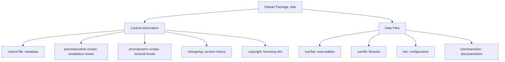

# Debian Package Building

## Introduction

Debian packages (`.deb` files) are the standard software distribution format for Debian and Debian-based Linux distributions like Ubuntu, Linux Mint, and Pop!_OS. Understanding how to build these packages is a valuable skill for developers who want to distribute their applications reliably on these platforms.

In this guide, we'll walk through the process of creating Debian packages from scratch. You'll learn how to organize your source code, define package metadata, handle dependencies, and build a proper `.deb` file that conforms to Debian packaging standards.

## Prerequisites

Before we begin, ensure you have the following installed on your Debian-based system:

```bash
sudo apt update
sudo apt install build-essential devscripts debhelper dh-make fakeroot lintian
```

These tools provide the essential build environment for Debian packaging.

## Understanding Debian Package Structure

A Debian package consists of the following components:



## Building Your First Debian Package

Let's create a simple Debian package for a "Hello World" application. We'll go through each step of the process.

### Step 1: Create a Basic Project

First, let's create a simple C program:

```bash
mkdir -p hello-deb/src
cd hello-deb/src
```

Create `hello.c`:

```c
#include <stdio.h>

int main() {
    printf("Hello, Debian packaging world!
");
    return 0;
}
```

Create a Makefile:

```makefile
all: hello

hello: hello.c
	gcc -o hello hello.c

install:
	mkdir -p $(DESTDIR)/usr/bin
	install -m 755 hello $(DESTDIR)/usr/bin

clean:
	rm -f hello
```

### Step 2: Prepare the Package Source

Return to the main directory and prepare the package:

```bash
cd ..
mkdir -p debian
```

### Step 3: Create Essential Debian Files

Now we'll create the necessary files in the `debian` directory:

**control** file:

```
Source: hello-deb
Section: utils
Priority: optional
Maintainer: Your Name <your.email@example.com>
Build-Depends: debhelper-compat (= 13), gcc
Standards-Version: 4.5.1
Homepage: https://example.com/hello-deb

Package: hello-deb
Architecture: any
Depends: ${shlibs:Depends}, ${misc:Depends}
Description: Simple hello world Debian package example
 This package provides a basic "Hello World" program to
 demonstrate Debian packaging concepts. It's a simple
 C program that prints a greeting message.
```

**changelog** file:

```
hello-deb (1.0-1) unstable; urgency=medium

  * Initial release

 -- Your Name <your.email@example.com>  Thu, 01 Jan 2023 12:00:00 +0000
```

**rules** file:

```makefile
#!/usr/bin/make -f
%:
	dh $@

override_dh_auto_build:
	$(MAKE) -C src

override_dh_auto_install:
	$(MAKE) -C src install DESTDIR=$$(pwd)/debian/hello-deb
```

**copyright** file:

```
Format: https://www.debian.org/doc/packaging-manuals/copyright-format/1.0/
Upstream-Name: hello-deb
Source: https://example.com/hello-deb

Files: *
Copyright: 2023 Your Name <your.email@example.com>
License: MIT
 Permission is hereby granted, free of charge, to any person obtaining a copy
 of this software and associated documentation files (the "Software"), to deal
 in the Software without restriction, including without limitation the rights
 to use, copy, modify, merge, publish, distribute, sublicense, and/or sell
 copies of the Software, and to permit persons to whom the Software is
 furnished to do so, subject to the following conditions:
 .
 The above copyright notice and this permission notice shall be included in all
 copies or substantial portions of the Software.
 .
 THE SOFTWARE IS PROVIDED "AS IS", WITHOUT WARRANTY OF ANY KIND, EXPRESS OR
 IMPLIED, INCLUDING BUT NOT LIMITED TO THE WARRANTIES OF MERCHANTABILITY,
 FITNESS FOR A PARTICULAR PURPOSE AND NONINFRINGEMENT. IN NO EVENT SHALL THE
 AUTHORS OR COPYRIGHT HOLDERS BE LIABLE FOR ANY CLAIM, DAMAGES OR OTHER
 LIABILITY, WHETHER IN AN ACTION OF CONTRACT, TORT OR OTHERWISE, ARISING FROM,
 OUT OF OR IN CONNECTION WITH THE SOFTWARE OR THE USE OR OTHER DEALINGS IN THE
 SOFTWARE.
```

Make the rules file executable:

```bash
chmod +x debian/rules
```

**compat** file (just contains a version number):

```
13
```

**source/format** file:

```bash
mkdir -p debian/source
echo "3.0 (native)" > debian/source/format
```

### Step 4: Build the Package

Now, let's build the package:

```bash
dpkg-buildpackage -us -uc -b
```

This command will:
- `-us`: Skip signing the source package
- `-uc`: Skip signing the .changes file
- `-b`: Build a binary package only

If successful, you'll find the `.deb` file in the parent directory.

### Step 5: Verify the Package

Check your package for conformity with Debian standards:

```bash
lintian ../hello-deb_1.0-1_amd64.deb
```

Install your package:

```bash
sudo dpkg -i ../hello-deb_1.0-1_amd64.deb
```

Test the installed application:

```bash
hello-deb
# Output: Hello, Debian packaging world!
```

## Advanced Packaging Concepts

### Managing Dependencies

Dependencies are defined in the `control` file:

```
Depends: ${shlibs:Depends}, ${misc:Depends}, libsomething (>= 1.2.3)
```

- `${shlibs:Depends}`: Automatically detects library dependencies
- `${misc:Depends}`: Adds dependencies required by debhelper
- You can specify other package dependencies with version constraints

### Configuration Files

To manage configuration files correctly, list them in a file called `debian/conffiles`:

```
/etc/hello-deb/config.conf
```

### Package Versioning

Debian version numbers typically look like: `[epoch:]upstream_version-debian_revision`

- `epoch`: Optional number used to correct ordering mistakes (rarely needed)
- `upstream_version`: The version of the original software
- `debian_revision`: The revision of the Debian package

For example: `2:1.4.5-3ubuntu2`

### Creating Multiple Packages from One Source

You can define multiple packages in the `control` file:

```
Source: my-project
# [...source package details...]

Package: my-app
# [...binary package details...]

Package: my-app-dev
Architecture: all
Depends: my-app (= ${binary:Version}), ${misc:Depends}
Description: Development files for my-app
 This package contains header files and libraries necessary for developing
 applications that use my-app.
```

## Real-World Example: Packaging a Python Application

Let's create a more practical example by packaging a simple Python application:

### Project Structure:

```
mypy-app/
├── mypyapp/
│   ├── __init__.py
│   └── main.py
├── setup.py
└── debian/
    ├── control
    ├── rules
    ├── changelog
    └── ...
```

**mypyapp/main.py**:

```python
#!/usr/bin/env python3

def main():
    print("Hello from my Python Debian package!")

if __name__ == "__main__":
    main()
```

**setup.py**:

```python
from setuptools import setup, find_packages

setup(
    name="mypyapp",
    version="0.1",
    packages=find_packages(),
    entry_points={
        'console_scripts': [
            'mypyapp=mypyapp.main:main',
        ],
    },
)
```

**debian/control**:

```
Source: mypyapp
Section: python
Priority: optional
Maintainer: Your Name <your.email@example.com>
Build-Depends: debhelper-compat (= 13), dh-python, python3-all, python3-setuptools
Standards-Version: 4.5.1
Homepage: https://example.com/mypyapp

Package: python3-mypyapp
Architecture: all
Depends: ${python3:Depends}, ${misc:Depends}
Description: Example Python application in a Debian package
 This package provides a simple Python application that
 demonstrates Debian packaging for Python projects.
```

**debian/rules**:

```makefile
#!/usr/bin/make -f
export PYBUILD_NAME=mypyapp
%:
	dh $@ --with python3 --buildsystem=pybuild
```

Build the package using the same commands as before.

## Automating Package Building with Git-BuildPackage

For more complex projects, consider using git-buildpackage (gbp) to automate the packaging process:

```bash
sudo apt install git-buildpackage
```

Basic workflow:

1. Initialize a git repository for your package:
   ```bash
   gbp import-orig --pristine-tar ../myapp-1.0.tar.gz
   ```

2. Make packaging changes and commit them.

3. Build the package:
   ```bash
   gbp buildpackage
   ```

## Package Repositories

To distribute your packages, you might want to set up a repository:

```bash
# Install tools
sudo apt install reprepro gnupg

# Create a GPG key for signing packages
gpg --full-generate-key

# Set up a basic repository structure
mkdir -p repo/conf
```

Create `repo/conf/distributions`:

```
Origin: Your Repository
Label: Your Repository
Codename: focal
Architectures: i386 amd64 source
Components: main
Description: My Personal Package Repository
SignWith: [your-gpg-key-id]
```

Add your package to the repository:

```bash
reprepro -b repo includedeb focal ../hello-deb_1.0-1_amd64.deb
```

Users can then add your repository to their sources:

```bash
echo "deb [signed-by=/usr/share/keyrings/your-key.gpg] http://your-repo-url focal main" | sudo tee /etc/apt/sources.list.d/your-repo.list
```

## Summary

In this guide, we've covered:

1. The basic structure of Debian packages
2. Essential files needed for packaging
3. Step-by-step instructions for building a simple package
4. Advanced packaging concepts like dependencies and versioning
5. A real-world example with Python
6. Automated tools for package management
7. Setting up a package repository

Building Debian packages requires attention to detail, but it ensures your software can be installed, upgraded, and removed cleanly on Debian-based systems. The skills learned here apply to other packaging systems as well, as the concepts of metadata, dependencies, and build processes are universal in software distribution.

## Exercises

1. Create a Debian package for a simple bash script that displays system information.
2. Modify the Python example to add configuration files in `/etc`.
3. Create a package with documentation installed to `/usr/share/doc`.
4. Build a package that contains multiple binaries from a single source.
5. Set up a local repository and publish your packages to it.

## Additional Resources

- [Debian New Maintainers' Guide](https://www.debian.org/doc/manuals/maint-guide/)
- [Debian Policy Manual](https://www.debian.org/doc/debian-policy/)
- [Debian Developer's Reference](https://www.debian.org/doc/manuals/developers-reference/)
- [Ubuntu Packaging Guide](https://packaging.ubuntu.com/html/)
- `man debhelper`
- `man dh_make`