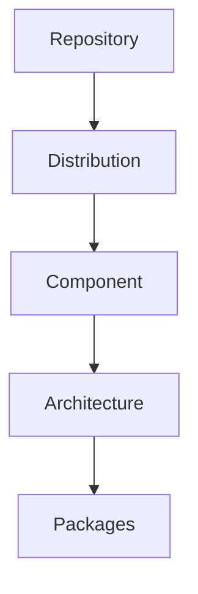

# Debian Repository Structure

## Introduction

Debian repositories are the foundation of Debian's powerful package management system. They are organized collections of software packages that your system can access to install, upgrade, or remove software. Understanding repository structure is essential for effective package management, troubleshooting, and customizing your Debian-based system.

In this guide, we'll explore how Debian repositories are organized, the different types of repositories available, and how to work with them effectively.

## Repository Basics

A Debian repository is essentially a storage location containing packages and special index files that help package managers like APT (Advanced Package Tool) find and retrieve the packages you need.

### Key Components of a Repository

- **Packages**: The actual `.deb` files containing software
- **Distribution pools**: Areas where packages are stored
- **Index files**: Files that catalog available packages and their metadata
- **Release files**: Files containing cryptographic signatures for verification

## Repository Structure Hierarchy

Debian repositories follow a specific hierarchical structure that helps organize packages efficiently:



Let's break down each level:

### 1. Distribution (or Suite)

This represents a specific Debian release version, such as:
- `stable` (currently "bookworm")
- `testing` (currently "trixie")
- `unstable` (always "sid")
- Specific release names like "bookworm", "bullseye", etc.

### 2. Component

Components divide packages based on license compatibility and support level:
- `main`: Fully compliant with Debian Free Software Guidelines and officially supported
- `contrib`: Free software that depends on non-free software
- `non-free`: Software that doesn't comply with Debian Free Software Guidelines
- `non-free-firmware`: Hardware firmware and drivers with non-free licenses

### 3. Architecture

Repositories are organized by hardware architecture:
- `amd64`: 64-bit x86 processors
- `i386`: 32-bit x86 processors
- `arm64`: 64-bit ARM processors
- `armhf`: 32-bit ARM processors with hardware floating point
- `all`: Architecture-independent packages (like documentation)

## Repository URL Structure

The typical structure of a Debian repository URL follows this pattern:

```
http://deb.debian.org/debian/dists/{distribution}/{component}/{architecture}/
```

For example:
```
http://deb.debian.org/debian/dists/bookworm/main/binary-amd64/
```

## Repository Configuration Files

### The sources.list File

The primary repository configuration file in Debian is located at `/etc/apt/sources.list`. This file tells APT where to look for packages.

Each line in this file follows this format:

```
deb [options] repository-url distribution components
```

For example:

```
deb http://deb.debian.org/debian bookworm main contrib non-free
```

Let's examine this line:
- `deb`: Indicates this is a binary package repository (as opposed to `deb-src` for source packages)
- `http://deb.debian.org/debian`: The repository URL
- `bookworm`: The distribution (release)
- `main contrib non-free`: The components to use from this repository

### The sources.list.d Directory

For better organization, Debian also uses the `/etc/apt/sources.list.d/` directory. Any file ending with `.list` in this directory is treated as an additional sources configuration file.

Example of a third-party repository file `/etc/apt/sources.list.d/vscode.list`:

```
deb [arch=amd64 signed-by=/usr/share/keyrings/microsoft.gpg] https://packages.microsoft.com/repos/vscode stable main
```

## Practical Examples

### Example 1: Viewing Your Current Repository Configuration

To see your current repository configuration:

```bash
cat /etc/apt/sources.list
```

Output example:
```
deb http://deb.debian.org/debian bookworm main
deb http://security.debian.org/debian-security bookworm-security main
deb http://deb.debian.org/debian bookworm-updates main
```

### Example 2: Adding a Repository

Let's add the Debian backports repository to get newer versions of certain packages:

1. Edit the sources.list file:

```bash
sudo nano /etc/apt/sources.list
```

2. Add the following line:

```
deb http://deb.debian.org/debian bookworm-backports main contrib non-free
```

3. Update the package lists:

```bash
sudo apt update
```

Output excerpt:
```
Get:1 http://deb.debian.org/debian bookworm-backports InRelease [48.0 kB]
Get:2 http://deb.debian.org/debian bookworm-backports/main amd64 Packages [257 kB]
Get:3 http://deb.debian.org/debian bookworm-backports/contrib amd64 Packages [45.6 kB]
Get:4 http://deb.debian.org/debian bookworm-backports/non-free amd64 Packages [22.4 kB]
...
Reading package lists... Done
Building dependency tree... Done
Reading state information... Done
All packages are up to date.
```

### Example 3: Adding a Third-Party Repository with GPG Key

To add a third-party repository with proper security:

1. Download and add the GPG key:

```bash
wget -qO- https://example.org/key.gpg | sudo gpg --dearmor -o /usr/share/keyrings/example-archive-keyring.gpg
```

2. Create a new source list file:

```bash
echo "deb [signed-by=/usr/share/keyrings/example-archive-keyring.gpg] https://packages.example.org/debian stable main" | sudo tee /etc/apt/sources.list.d/example.list
```

3. Update package lists:

```bash
sudo apt update
```

## Repository Index Files

When you run `apt update`, APT downloads and processes several important index files:

### 1. Release Files

The `InRelease` or `Release` and `Release.gpg` files contain metadata about the repository:
- Supported architectures
- Components
- Cryptographic checksums of other index files
- Signing information

To view a Release file:

```bash
curl -s http://deb.debian.org/debian/dists/bookworm/InRelease | less
```

Example output (partial):
```
Origin: Debian
Label: Debian
Suite: stable
Version: 12.0
Codename: bookworm
Date: Sat, 10 Jun 2023 09:53:50 UTC
Valid-Until: Sat, 17 Jun 2023 09:53:50 UTC
Architectures: amd64 arm64 armel armhf i386 mips64el mipsel ppc64el s390x
Components: main contrib non-free-firmware non-free
...
```

### 2. Packages Files

The `Packages` files (often compressed as `Packages.gz` or `Packages.xz`) contain detailed information about each package in the repository:

```bash
curl -s http://deb.debian.org/debian/dists/bookworm/main/binary-amd64/Packages.gz | gunzip | head -n 20
```

Example output (partial):
```
Package: 0ad
Version: 0.0.26-1
Installed-Size: 24540
Maintainer: Debian Games Team <pkg-games-devel@lists.alioth.debian.org>
Architecture: amd64
Depends: 0ad-data (>= 0.0.26), 0ad-data (<< 0.0.27), libc6 (>= 2.35), ...
Description: Real-time strategy game of ancient warfare
Description-md5: d943033bedada21853d2ae54a2578a7b
...
```

## Pool Directory Structure

While the `dists/` directory contains the repository metadata, the actual packages are stored in the `pool/` directory, which follows a different organization:

```
pool/
├── main/
│   ├── a/
│   │   ├── apache2/
│   │   │   ├── apache2_2.4.57-2_amd64.deb
│   │   │   └── ...
│   ├── b/
│   │   └── ...
├── contrib/
├── non-free/
└── non-free-firmware/
```

The packages are organized:
1. First by component (main, contrib, etc.)
2. Then by first letter or package name prefix
3. Then by package name
4. And finally the actual .deb files and associated files

## Working with Multiple Repositories

### Repository Pinning

You can prioritize packages from specific repositories using pinning in the `/etc/apt/preferences` or `/etc/apt/preferences.d/` files:

Example `/etc/apt/preferences.d/backports.pref`:

```
Package: *
Pin: release a=bookworm-backports
Pin-Priority: 200
```

This sets all packages from bookworm-backports to priority 200 (lower than the default 500), meaning they won't be installed automatically unless specifically requested.

To install a package from a lower-priority repository:

```bash
sudo apt install -t bookworm-backports package-name
```

## Mirror Selection

Debian maintains a worldwide network of mirrors. You can select a geographically closer mirror for faster downloads:

1. Find a nearby mirror at https://www.debian.org/mirror/list
2. Edit your sources.list to use that mirror:

```
deb http://mirror.example.org/debian bookworm main contrib non-free
```

## Summary

Understanding Debian repository structure is crucial for effective package management. We've covered:

- The hierarchical organization of repositories (distribution, component, architecture)
- Repository configuration through sources.list and sources.list.d
- How to add and manage repositories safely
- The internal structure of repositories with dists/ and pool/ directories
- Repository prioritization through pinning

This knowledge allows you to customize your Debian system, troubleshoot package issues, and safely add third-party software repositories.

## Additional Resources

- [Debian Repository HOWTO](https://wiki.debian.org/DebianRepository/Setup)
- [Debian Sources List Generator](https://debgen.simplylinux.ch/)
- [Debian Mirror Network](https://www.debian.org/mirror/list)
- [Secure APT Documentation](https://wiki.debian.org/SecureApt)

## Exercises

1. Examine your current repository configuration with `apt-cache policy` and identify which repositories are being used.
2. Create a custom `preferences` file to pin a specific package to a particular version.
3. Set up a local repository mirror using `apt-mirror` to save bandwidth on multiple Debian systems.
4. Identify three third-party repositories that might be useful for your specific use case, and research their trustworthiness before adding them.