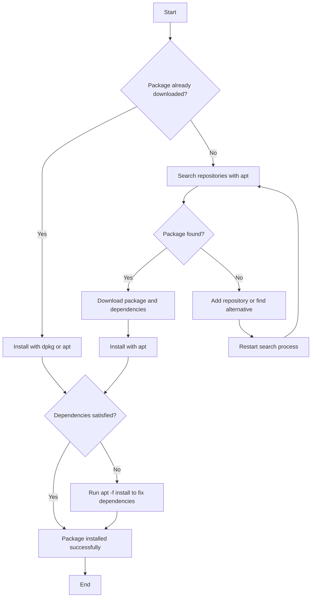

# Debian Package Installation

## Introduction

Debian package installation is a fundamental skill for anyone using Debian-based Linux distributions like Ubuntu, Linux Mint, or Debian itself. The Debian package management system provides a robust way to install, update, and remove software while automatically handling dependencies.

In this guide, you'll learn how to install packages using both low-level tools like `dpkg` and high-level package managers like `apt`. You'll also discover how to find packages, resolve common installation issues, and maintain your system efficiently.

## Understanding Debian Packages

Debian packages (`.deb` files) are archive files containing software, configuration files, and metadata. They include:

- The software itself (binary files or source code)
- Installation instructions
- Dependency information
- Version information
- Description and other metadata

A Debian package is designed to integrate seamlessly with your system, respecting system configurations and dependencies.

## Package Management Tools

Debian-based systems offer several tools for package management:

### Low-level Tools
- `dpkg`: The base package management program that directly handles `.deb` files

### High-level Tools
- `apt` (Advanced Package Tool): Handles dependencies, repositories, and provides a simpler interface
- `apt-get`: Traditional command-line tool for package management
- `aptitude`: Advanced text-based interface with more features
- `synaptic`: Graphical package manager

## Installing Packages with APT

The `apt` command is the recommended way to install packages. It handles dependencies automatically and offers a user-friendly interface.

### Basic Installation

To install a package with `apt`:

```bash
sudo apt update
sudo apt install package-name
```

For example, to install the text editor `nano`:

```bash
sudo apt update
sudo apt install nano
```

**Output:**
```
Reading package lists... Done
Building dependency tree... Done
Reading state information... Done
The following NEW packages will be installed:
  nano
0 upgraded, 1 newly installed, 0 to remove and 0 not upgraded.
Need to get 231 kB of archives.
After this operation, 778 kB of additional disk space will be used.
Get:1 http://archive.ubuntu.com/ubuntu jammy/main amd64 nano amd64 6.2-1 [231 kB]
Fetched 231 kB in 1s (231 kB/s)
Selecting previously unselected package nano.
(Reading database ... 74236 files and directories currently installed.)
Preparing to unpack .../nano_6.2-1_amd64.deb ...
Unpacking nano (6.2-1) ...
Setting up nano (6.2-1) ...
Processing triggers for man-db (2.10.2-1) ...
```

### Installing Multiple Packages

You can install multiple packages at once:

```bash
sudo apt install package1 package2 package3
```

### Installing a Specific Version

If you need a specific version of a package:

```bash
sudo apt install package-name=version-number
```

For example:

```bash
sudo apt install nginx=1.18.0-6ubuntu14
```

## Installing Packages with DPKG

While `apt` is more convenient, sometimes you need to install a `.deb` file directly using `dpkg`.

### Basic Installation with DPKG

```bash
sudo dpkg -i package-file.deb
```

For example, to install a downloaded Chrome package:

```bash
sudo dpkg -i google-chrome-stable_current_amd64.deb
```

**Output:**
```
Selecting previously unselected package google-chrome-stable.
(Reading database ... 74236 files and directories currently installed.)
Preparing to unpack google-chrome-stable_current_amd64.deb ...
Unpacking google-chrome-stable (114.0.5735.133-1) ...
dpkg: dependency problems prevent configuration of google-chrome-stable:
 google-chrome-stable depends on libasound2; however:
  Package libasound2 is not installed.
 google-chrome-stable depends on libatk1.0-0; however:
  Package libatk1.0-0 is not installed.
...

dpkg: error processing package google-chrome-stable (--install):
 dependency problems - leaving unconfigured
Processing triggers for mime-support (3.66) ...
Processing triggers for gnome-menus (3.36.0-1ubuntu3) ...
Errors were encountered while processing:
 google-chrome-stable
```

### Fixing Dependency Issues with DPKG

If you encounter dependency errors (as shown above), run:

```bash
sudo apt -f install
```

This command will install any missing dependencies and complete the installation.

## Finding Available Packages

Before installing a package, you might need to find it first.

### Searching for Packages

To search for a package:

```bash
apt search keyword
```

For example:

```bash
apt search image editor
```

**Output:**
```
Sorting... Done
Full Text Search... Done
gimp/jammy,now 2.10.30-1build1 amd64 [installed]
  GNU Image Manipulation Program

krita/jammy,now 1:5.0.2+dfsg-1 amd64 [installed]
  pixel-based image manipulation program

pinta/jammy 1.7.1-1 all
  Simple drawing/painting program

...
```

### Getting Package Information

To get detailed information about a package:

```bash
apt show package-name
```

Example:

```bash
apt show nginx
```

**Output:**
```
Package: nginx
Version: 1.18.0-6ubuntu14
Priority: optional
Section: web
Origin: Ubuntu
...
Description: small, powerful, scalable web/proxy server
 Nginx ("engine X") is a high-performance web and reverse proxy server
 created by Igor Sysoev. It can be used both as a standalone web server
 and as a proxy to reduce the load on back-end HTTP or mail servers.
...
```

## Advanced Installation Techniques

### Installing from Different Repositories

To install packages from non-default repositories, you first need to add the repository:

```bash
sudo add-apt-repository ppa:repository-name/ppa
sudo apt update
sudo apt install package-name
```

For example, to install the latest version of PHP:

```bash
sudo add-apt-repository ppa:ondrej/php
sudo apt update
sudo apt install php8.2
```

### Installing from a Downloaded DEB File

To install a manually downloaded `.deb` file with `apt` (better than using `dpkg` directly):

```bash
sudo apt install ./package-name.deb
```

For example:

```bash
sudo apt install ./slack-desktop-4.29.149-amd64.deb
```

### Non-Interactive Installation

For scripting or automated installations, you can use the `-y` flag to automatically answer yes to prompts:

```bash
sudo apt install -y package-name
```

## Package Installation Process Flow

Below is a diagram showing the basic package installation flow in Debian:



## Common Installation Options

### Recommended Installation Options

Here are some useful flags for `apt install`:

| Option | Description |
|--------|-------------|
| `-y` | Automatically answer yes to prompts |
| `--no-install-recommends` | Don't install recommended packages |
| `--reinstall` | Reinstall the package even if already installed |
| `-s` or `--simulate` | Simulate the installation without making changes |
| `--download-only` | Download the package but don't install it |

Example using multiple options:

```bash
sudo apt install -y --reinstall nginx
```

## Verifying Package Installation

After installing a package, it's good practice to verify the installation.

### Checking Package Status

To check if a package is installed:

```bash
dpkg -s package-name
```

Or alternatively:

```bash
apt list --installed | grep package-name
```

Example:

```bash
dpkg -s nginx
```

**Output:**
```
Package: nginx
Status: install ok installed
Priority: optional
Section: web
...
```

### Testing Installed Software

For services like web servers, you can verify they're running:

```bash
sudo systemctl status nginx
```

**Output:**
```
● nginx.service - A high performance web server and a reverse proxy server
     Loaded: loaded (/lib/systemd/system/nginx.service; enabled; vendor preset: enabled)
     Active: active (running) since Tue 2023-06-13 14:30:45 UTC; 2min 33s ago
...
```

## Troubleshooting Installation Issues

### Common Installation Problems

1. **Dependency Issues**:
   ```bash
   sudo apt -f install
   ```

2. **Package Conflicts**:
   ```bash
   sudo apt remove conflicting-package
   sudo apt install desired-package
   ```

3. **Repository Issues**:
   ```bash
   sudo apt update --fix-missing
   ```

4. **Broken Packages**:
   ```bash
   sudo apt clean
   sudo apt update
   sudo apt --fix-broken install
   ```

### Resolving "Unable to locate package" Error

If apt can't find a package:

1. Make sure your repository lists are up to date:
   ```bash
   sudo apt update
   ```

2. Check if you need to enable additional repositories:
   ```bash
   sudo add-apt-repository universe
   sudo apt update
   ```

3. Verify the package name is correct (check spelling):
   ```bash
   apt search partial-name
   ```

## Practical Examples

### Example 1: Installing a Web Server

Let's install the Nginx web server and verify it's working:

```bash
# Update package lists
sudo apt update

# Install Nginx
sudo apt install -y nginx

# Start Nginx
sudo systemctl start nginx

# Enable Nginx to start on boot
sudo systemctl enable nginx

# Verify installation
sudo systemctl status nginx
```

Now you can visit http://localhost or your server's IP address in a web browser to see the default Nginx page.

### Example 2: Installing Development Tools

Install a complete development environment with multiple tools:

```bash
# Update package lists
sudo apt update

# Install build essentials, git, and Python
sudo apt install -y build-essential git python3 python3-pip

# Verify the installations
gcc --version
git --version
python3 --version
pip3 --version
```

### Example 3: Installing Software from a Downloaded .deb File

Install Visual Studio Code downloaded from the official website:

```bash
# Download the .deb file
wget https://code.visualstudio.com/sha/download?build=stable&os=linux-deb-x64 -O vscode.deb

# Install using apt
sudo apt install -y ./vscode.deb

# Verify installation
code --version
```

## Summary

You've now learned the essentials of Debian package installation, including:

- Using high-level tools like `apt` for most package management tasks
- Working with low-level tools like `dpkg` for direct package manipulation
- Finding and installing packages from repositories
- Handling downloaded `.deb` files
- Troubleshooting common installation issues
- Verifying successful installations

These skills form the foundation of software management on Debian-based systems, allowing you to efficiently install, update, and manage your software.

## Exercises

1. Install a text editor of your choice (e.g., `vim`, `nano`, or `gedit`).
2. Search for and install a PDF viewer.
3. Find a `.deb` package online for an application not in the default repositories, download it, and install it using both `dpkg` and `apt` methods.
4. Simulate an installation with `apt -s install package-name` and analyze the output.
5. Create a simple shell script that installs multiple packages with a single command.

## Additional Resources

- [Debian Package Management Official Documentation](https://www.debian.org/doc/manuals/debian-reference/ch02.en.html)
- [Ubuntu Package Management Guide](https://help.ubuntu.com/community/SoftwareManagement)
- [APT Command Cheat Sheet](https://itsfoss.com/apt-command-guide/)
- `man apt` - The manual page for apt
- `man dpkg` - The manual page for dpkg