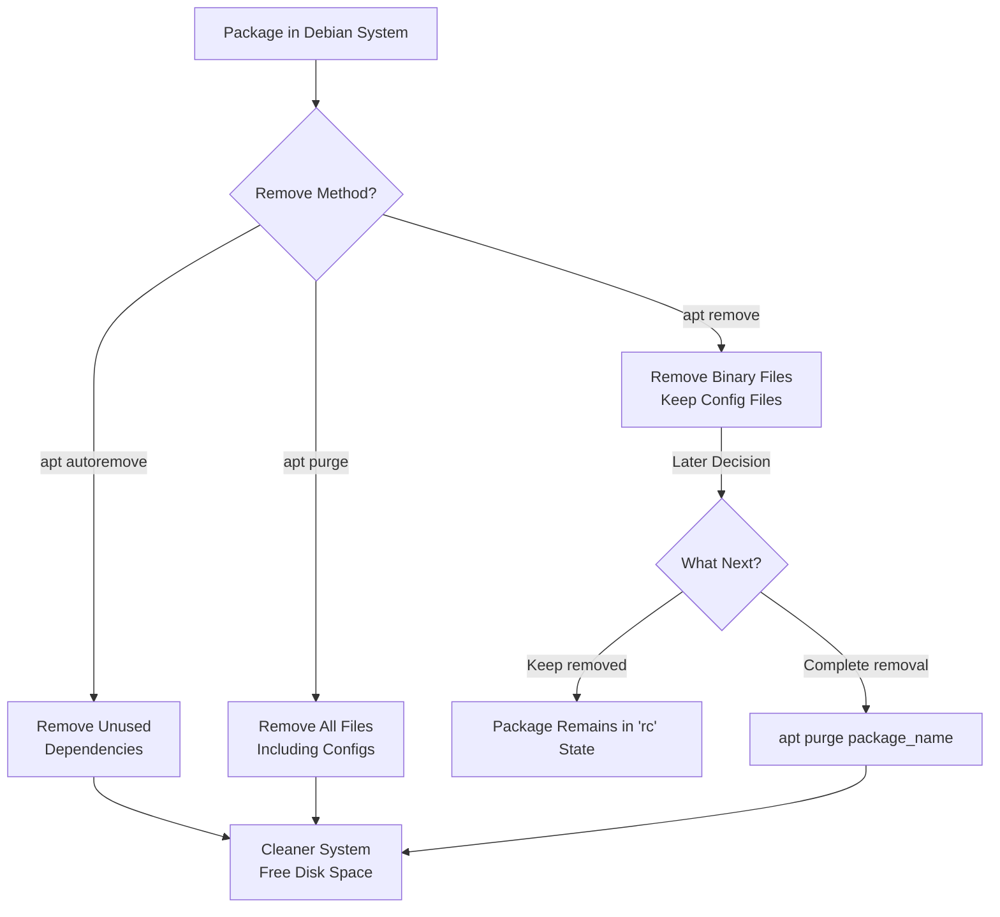

# Debian Package Removal

## Introduction

In Debian-based Linux distributions (such as Debian, Ubuntu, Linux Mint, etc.), managing software is primarily done through the package management system. While installing packages is often straightforward, properly removing packages requires understanding several concepts and commands to avoid system issues. This guide focuses specifically on the various methods to remove packages from your Debian system safely and effectively.

Package removal is an essential skill for maintaining a clean, efficient system and recovering disk space. However, improper package removal can lead to dependency issues or even render your system unusable. Let's explore how to properly manage package removal in Debian systems.

## Understanding Package Removal Options

Debian package management provides several ways to remove packages, each with different implications:

1. **Remove**: Removes the package but keeps configuration files
2. **Purge**: Removes the package including all configuration files
3. **Auto-remove**: Removes packages that were automatically installed and are no longer needed

Let's examine each of these options in detail.

## Basic Package Removal

### Using APT to Remove Packages

The most common command for package removal uses the APT package manager:

```bash
sudo apt remove package_name
```

For example, to remove the `htop` system monitor:

```bash
sudo apt remove htop
```

**Example output:**
```
Reading package lists... Done
Building dependency tree... Done
Reading state information... Done
The following packages will be REMOVED:
  htop
0 upgraded, 0 newly installed, 1 to remove and 0 not upgraded.
After this operation, 304 kB disk space will be freed.
Do you want to continue? [Y/n] y
(Reading database ... 186954 files and directories currently installed.)
Removing htop (3.0.5-7) ...
Processing triggers for man-db (2.9.4-2) ...
```

This command removes the binary files of the package but preserves system-wide configuration files (usually in `/etc`).

### Removing Multiple Packages

You can remove multiple packages in a single command by listing them with spaces:

```bash
sudo apt remove package1 package2 package3
```

## Complete Package Removal (Purging)

### Purging Packages with APT

To completely remove a package including all its configuration files:

```bash
sudo apt purge package_name
```

Or if the package is already removed but you want to purge its configuration files:

```bash
sudo apt purge --auto-remove package_name
```

**Example:**
```bash
sudo apt purge nginx
```

**Example output:**
```
Reading package lists... Done
Building dependency tree... Done
Reading state information... Done
The following packages will be REMOVED:
  nginx*
0 upgraded, 0 newly installed, 1 to remove and 0 not upgraded.
After this operation, 142 kB disk space will be freed.
Do you want to continue? [Y/n] y
(Reading database ... 186920 files and directories currently installed.)
Removing nginx (1.18.0-6) ...
Purging configuration files for nginx (1.18.0-6) ...
```

Note the line "Purging configuration files for nginx" which confirms that configuration files are being removed.

### Using APT with Combined Commands

APT allows combining `remove` and `purge` in one command:

```bash
sudo apt --purge remove package_name
```

This is functionally equivalent to `apt purge package_name`.

## Removing Dependency Packages

### Auto-removing Unused Dependencies

When you install a package, APT often installs additional dependencies. When the main package is removed, these dependencies might remain, taking up disk space.

To remove automatically installed packages that are no longer needed:

```bash
sudo apt autoremove
```

For a more thorough cleanup, combine `autoremove` with `purge`:

```bash
sudo apt --purge autoremove
```

**Example output:**
```
Reading package lists... Done
Building dependency tree... Done
Reading state information... Done
The following packages will be REMOVED:
  libfftw3-single3 libsndfile1
0 upgraded, 0 newly installed, 2 to remove and 0 not upgraded.
After this operation, 1,024 kB disk space will be freed.
Do you want to continue? [Y/n] y
(Reading database ... 186905 files and directories currently installed.)
Removing libfftw3-single3:amd64 (3.3.8-2) ...
Removing libsndfile1:amd64 (1.0.31-2) ...
Processing triggers for libc-bin (2.31-13) ...
```

### Understanding Package States

Packages in Debian can be marked as:
- **Manually installed**: Explicitly requested by the user
- **Automatically installed**: Installed as dependencies

You can check the status of a package with:

```bash
apt-mark showmanual | grep package_name
apt-mark showauto | grep package_name
```

## Using Low-Level DPKG Commands

While APT is the recommended interface, sometimes you need to use the lower-level `dpkg` command:

### Removing with DPKG

```bash
sudo dpkg -r package_name
```

### Purging with DPKG

```bash
sudo dpkg -P package_name
```

**Important note**: Unlike APT, `dpkg` doesn't resolve dependencies automatically, which can lead to broken packages. Use with caution!

## Advanced Package Removal Techniques

### Finding and Removing Packages by Pattern

To find all packages matching a pattern:

```bash
dpkg -l | grep pattern
```

Then remove them:

```bash
sudo apt remove $(dpkg -l | grep pattern | awk '{print $2}')
```

For example, to remove all Python 3.9 packages:

```bash
sudo apt remove $(dpkg -l | grep python3.9 | awk '{print $2}')
```

### Removing Residual Packages

Sometimes packages are removed but leave behind configuration files. To find and remove these:

```bash
dpkg -l | grep '^rc' | awk '{print $2}'
```

This command lists packages in the "rc" state (removed but with config files remaining). To purge all of them:

```bash
sudo apt purge $(dpkg -l | grep '^rc' | awk '{print $2}')
```

**Example output:**
```
Reading package lists... Done
Building dependency tree... Done
Reading state information... Done
The following packages will be REMOVED:
  python3-decorator* python3-magic*
0 upgraded, 0 newly installed, 2 to remove and 0 not upgraded.
After this operation, 0 B disk space will be freed.
Do you want to continue? [Y/n] y
(Reading database ... 186890 files and directories currently installed.)
Purging configuration files for python3-decorator (4.4.2-2) ...
Purging configuration files for python3-magic (0.4.20-3) ...
```

## Package Removal Visualization

The following diagram shows the different package removal options and their effects:



## Common Issues and Troubleshooting

### Handling Dependency Issues

If you encounter errors like "broken packages" during removal:

1. Try to fix broken packages:
   ```bash
   sudo apt --fix-broken install
   ```

2. If that fails, force the removal (use with caution!):
   ```bash
   sudo dpkg --remove --force-remove-reinstreq package_name
   ```

### Dealing with Package Locks

If you get an error about the APT database being locked:

```bash
sudo lsof /var/lib/dpkg/lock
sudo lsof /var/lib/apt/lists/lock
```

If no processes are using it but the lock remains:

```bash
sudo rm /var/lib/apt/lists/lock
sudo rm /var/lib/dpkg/lock
sudo dpkg --configure -a
```

## Practical Examples

### Example 1: Removing a Web Server

Let's say you installed Apache web server for testing but now want to completely remove it:

```bash
# Completely remove Apache and its configurations
sudo apt purge apache2 apache2-utils
# Remove dependencies that are no longer needed
sudo apt autoremove --purge
```

### Example 2: Cleaning Up After a Failed Installation

If a package installation didn't complete successfully:

```bash
# Fix broken dependencies
sudo apt --fix-broken install
# Remove the problematic package
sudo apt purge broken_package
```

### Example 3: Bulk Removal of Development Packages

To remove temporary development packages after completing a project:

```bash
# List all development packages
dpkg -l | grep "\-dev" | awk '{print $2}'
# Remove them
sudo apt remove $(dpkg -l | grep "\-dev" | awk '{print $2}')
```

## Best Practices for Package Removal

1. **Always review what will be removed** before confirming. Pay attention to the "The following packages will be REMOVED:" section.

2. **Use `apt` instead of `apt-get`** for better progress indication and friendlier interface.

3. **Regularly run `sudo apt autoremove`** to keep your system clean of unused dependencies.

4. **Be cautious with removing system packages**, especially those related to your desktop environment or essential services.

5. **Consider using `apt-mark` to protect critical packages**:
   ```bash
   sudo apt-mark hold package_name
   ```

6. **Check package information before removal** with:
   ```bash
   apt show package_name
   ```

## Summary

Proper package removal in Debian-based systems involves understanding the differences between:
- Simple removal (`apt remove`) which preserves configuration
- Complete removal (`apt purge`) which removes everything
- Automatic dependency cleanup (`apt autoremove`)

Mastering these commands helps maintain a clean and efficient system, preserves disk space, and prevents configuration clutter. Remember that careful package removal is just as important as proper installation for system maintenance.

## Exercises for Practice

1. Install a small utility package like `cowsay`, then practice removing it with different commands to observe the differences.

2. Find all packages in the "rc" state on your system and purge them.

3. Identify the packages taking the most space on your system using `dpkg-query -W -f='${Installed-Size} ${Package}
' | sort -n`.

4. Create a script that safely removes all packages matching a specific pattern while asking for confirmation.

## Additional Resources

- The Debian Package Management documentation: [Debian Package Management](https://www.debian.org/doc/manuals/debian-reference/ch02.en.html)
- The APT Howto: [APT Howto](https://www.debian.org/doc/manuals/apt-howto/index.en.html)
- The `man` pages for `apt`, `dpkg`, and `apt-mark`
- The Debian Administrator's Handbook

Remember that package management is a fundamental skill for any Debian system administrator or power user. Taking the time to understand these commands will save you from potential system issues and make your Linux journey much smoother.