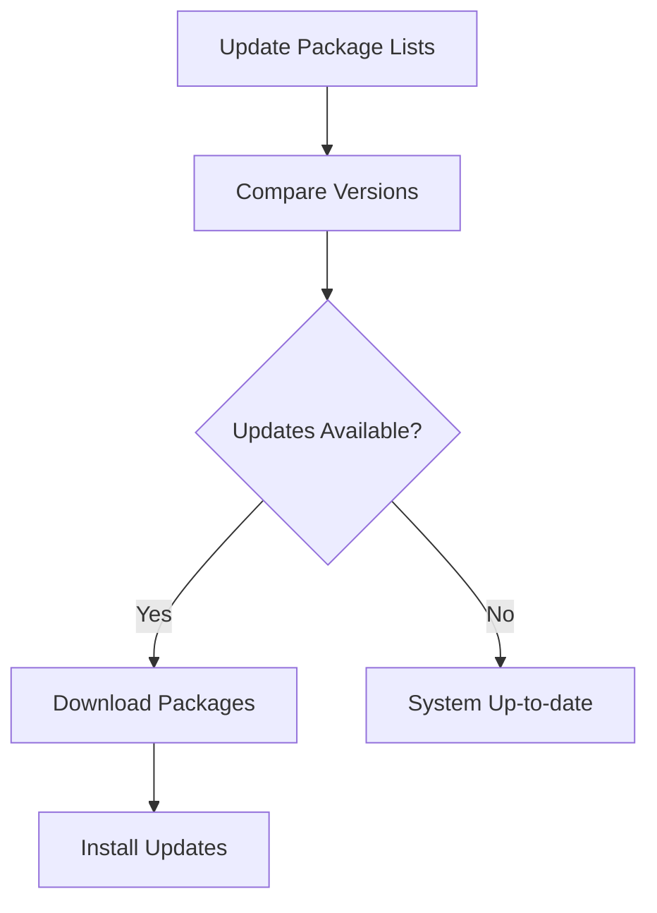

# Debian Package Updating

## Introduction

Updating packages is a fundamental aspect of maintaining a Debian-based Linux system. Regular updates provide security patches, bug fixes, and new features that keep your system secure and running optimally. This guide will walk you through the process of updating packages on Debian-based distributions (like Ubuntu, Linux Mint, and Debian itself), explain the underlying concepts, and provide practical examples for various updating scenarios.

## Understanding the Update Process

Before diving into commands, let's understand what happens when you update packages on a Debian system:

1. **Update Package Lists**: Your system needs to fetch the latest information about available packages from repositories.
2. **Compare Versions**: The package manager compares installed versions with available versions.
3. **Download Packages**: New packages are downloaded if updates are available.
4. **Install Updates**: The package manager installs the new versions, potentially stopping services, updating configuration files, and restarting services.



## Basic Update Commands

### Updating Package Lists

The first step in any update process is refreshing the package lists:

```bash
sudo apt update
```

**Example Output:**
```
Hit:1 http://archive.ubuntu.com/ubuntu jammy InRelease
Get:2 http://security.ubuntu.com/ubuntu jammy-security InRelease [110 kB]
Get:3 http://archive.ubuntu.com/ubuntu jammy-updates InRelease [114 kB]
...
Reading package lists... Done
Building dependency tree... Done
Reading state information... Done
65 packages can be upgraded. Run 'apt list --upgradable' to see them.
```

This command doesn't install anything; it just updates your system's knowledge of what packages are available and their versions.

### Viewing Upgradable Packages

To see which packages can be upgraded:

```bash
apt list --upgradable
```

**Example Output:**
```
Listing... Done
firefox/jammy-security 108.0+build2-0ubuntu0.22.04.1 amd64 [upgradable from: 107.0+build2-0ubuntu0.22.04.1]
libssl3/jammy-updates 3.0.2-0ubuntu1.10 amd64 [upgradable from: 3.0.2-0ubuntu1.9]
...
```

### Upgrading Packages

To install all available updates:

```bash
sudo apt upgrade
```

This command will show you a summary of what will be updated and ask for confirmation:

**Example Output:**
```
Reading package lists... Done
Building dependency tree... Done
Reading state information... Done
Calculating upgrade... Done
The following packages will be upgraded:
  firefox libssl3 ... [more packages]
65 upgraded, 0 newly installed, 0 to remove and 0 not upgraded.
Need to get 112 MB of archives.
After this operation, 2,048 kB of additional disk space will be used.
Do you want to continue? [Y/n]
```

### Upgrading Safely with Options

For a more cautious upgrade that doesn't remove packages:

```bash
sudo apt upgrade --with-new-pkgs
```

## Advanced Update Commands

### Full System Upgrade

To upgrade packages and handle dependencies that require removing old packages:

```bash
sudo apt full-upgrade
```

or the older equivalent:

```bash
sudo apt dist-upgrade
```

**When to use this**: This is important for major version upgrades or when updates require significant system changes.

### Upgrading Specific Packages

To update only a specific package:

```bash
sudo apt install --only-upgrade package_name
```

**Example:**
```bash
sudo apt install --only-upgrade firefox
```

### Automatic Security Updates

For server environments, you might want to automate security updates:

```bash
sudo apt install unattended-upgrades
sudo dpkg-reconfigure unattended-upgrades
```

This will open a configuration wizard to set up automatic security updates.

## Managing Package Sources

### Viewing Current Sources

Your system's package sources are defined in `/etc/apt/sources.list` and files in `/etc/apt/sources.list.d/`:

```bash
cat /etc/apt/sources.list
```

**Example Output:**
```
deb http://archive.ubuntu.com/ubuntu/ jammy main restricted
deb http://archive.ubuntu.com/ubuntu/ jammy-updates main restricted
deb http://security.ubuntu.com/ubuntu jammy-security main restricted
...
```

### Adding New Repository Sources

To add a new repository:

```bash
sudo add-apt-repository ppa:repository-name/ppa
```

**Example:**
```bash
sudo add-apt-repository ppa:deadsnakes/ppa
```

After adding a new repository, always update your package lists:

```bash
sudo apt update
```

## Understanding Update Frequency

Different types of updates have different recommended frequencies:

1. **Security Updates**: Apply as soon as possible
2. **Bug Fix Updates**: Apply regularly (weekly)
3. **Feature Updates**: Apply based on needs
4. **Distribution Upgrades**: Apply according to your stability requirements

## Common Issues and Solutions

### Fixing Broken Packages

If updates are interrupted or packages break:

```bash
sudo apt --fix-broken install
```

### Dealing with Held Packages

Sometimes packages are held back from upgrading:

```bash
sudo apt full-upgrade
```

### Resolving "The following packages have been kept back"

This message often appears when packages need additional dependencies. To resolve:

```bash
sudo apt install package_name
```

Replace `package_name` with the specific package that was kept back.

### Managing Configuration File Changes

During updates, you might see prompts about modified configuration files:

```
Configuration file '/etc/default/grub'
 ==> Modified (by you or by a script) since installation.
 ==> Package distributor has shipped an updated version.
   What would you like to do about it ?  
    Y or I  : install the package maintainer's version
    N or O  : keep your currently-installed version
      D     : show the differences between the versions
      Z     : start a shell to examine the situation
```

Options:
- `Y` or `I`: Replace your configuration with the new version
- `N` or `O`: Keep your modified version
- `D`: Show differences between versions
- `Z`: Open a shell to investigate further

## Best Practices for Debian Updates

1. **Regular Updates**: Schedule regular updates (at least weekly for desktops, monthly for servers)
2. **Backup First**: Always back up important data before major updates
3. **Read Update Notes**: Check what's changing in important updates
4. **Test on Non-Production**: For critical systems, test updates in a staging environment first
5. **Update Incrementally**: Don't skip multiple versions when updating

## Real-World Examples

### Example 1: Regular Desktop Maintenance

Here's a typical update routine for a desktop system:

```bash
# Update package lists
sudo apt update

# See what will be updated
apt list --upgradable

# Apply updates
sudo apt upgrade

# Clean up unused packages
sudo apt autoremove
```

### Example 2: Server Update With Minimal Downtime

For servers where downtime must be minimized:

```bash
# Update package information
sudo apt update

# Check what needs updating that might affect services
apt list --upgradable

# Schedule maintenance window
# Then perform the update
sudo apt upgrade

# If kernel was updated, schedule a reboot
sudo shutdown -r +5 "Rebooting for kernel update in 5 minutes"

# If needed, cancel with:
# sudo shutdown -c
```

### Example 3: Upgrading a Single Application and Its Dependencies

When you need the latest version of a specific application:

```bash
# Update package lists
sudo apt update

# Upgrade only Firefox and its dependencies
sudo apt install --only-upgrade firefox
```

## Summary

Proper package updating is essential for maintaining a secure and functional Debian-based system. By understanding the different update commands and their purposes, you can keep your system current while minimizing the risk of disruptions. Regular updates, especially security patches, are a crucial part of system administration.

Remember these key points:
- `apt update` refreshes package information
- `apt upgrade` installs available updates
- `apt full-upgrade` handles more complex dependency changes
- Always read prompts carefully during updates
- Maintain regular update schedules based on system criticality

## Additional Resources and Exercises

### Practice Exercises

1. Set up a cron job to automatically check for updates daily and notify you by email
2. Create a bash script that updates your system and logs all changes
3. Configure unattended-upgrades for automatic security updates
4. Create a snapshot or backup before updating, then practice restoring from it

### Additional Learning

- Explore the APT configuration files in `/etc/apt/`
- Learn about pinning package versions in `/etc/apt/preferences.d/`
- Study the differences between various Debian-based distributions' update mechanisms