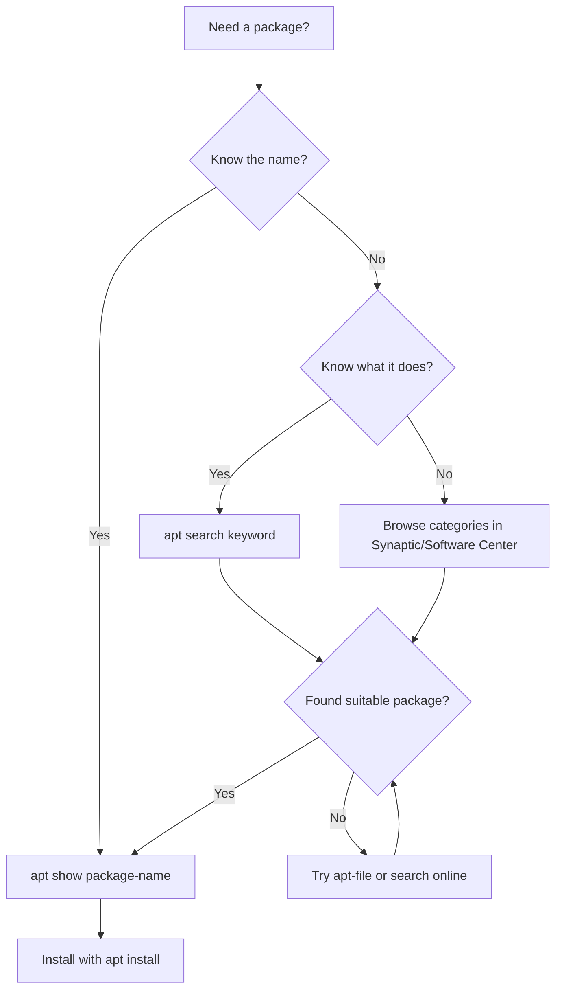

# Debian Package Searching

## Introduction

Finding the right software packages is a fundamental skill when using Debian-based Linux distributions like Ubuntu, Linux Mint, or Debian itself. Package searching allows you to discover software, find dependencies, and locate specific files within packages. This guide will walk you through various methods to search for packages in Debian systems, from basic command-line utilities to graphical tools.

## Why Package Searching Matters

Before diving into the commands, let's understand why efficient package searching is important:

- Find software that meets your needs
- Locate dependencies required by applications
- Discover which package provides a specific file
- Check if packages are installed on your system
- Find alternative packages with similar functionality

## Basic Package Searching with APT

The Advanced Package Tool (APT) is Debian's primary package management interface. Let's explore its searching capabilities.

### Searching Package Names and Descriptions

The `apt search` command searches through package names and descriptions:

```bash
sudo apt update
apt search text-editor
```

Example output:
```
Sorting... Done
Full Text Search... Done
featherpad/stable 0.17.1-1 amd64
  lightweight Qt5 plain text editor

ghostwriter/stable 2.0.2+ds-1 amd64
  Distraction-free Markdown editor

mousepad/stable 0.5.4-1 amd64
  simple Xfce oriented text editor

...
```

### Narrowing Down Search Results

You can use grep to filter results further:

```bash
apt search text-editor | grep -i gtk
```

Example output:
```
gedit/stable 40.1-1 amd64
  GTK text editor for the GNOME desktop environment

pluma/stable 1.24.1-1 amd64
  official text editor of the MATE desktop environment
```

### Showing Detailed Package Information

To get detailed information about a specific package:

```bash
apt show gedit
```

Example output:
```
Package: gedit
Version: 40.1-1
Priority: optional
Section: gnome
Origin: Debian
...
Description: GTK text editor for the GNOME desktop environment
 gedit is a text editor which supports most standard editor features,
 extending this basic functionality with other features not usually
 found in simple text editors.
...
```

## Advanced Package Searching with `apt-cache`

While `apt` provides user-friendly commands, `apt-cache` offers more advanced searching capabilities.

### Searching for Package Names Only

To search only in package names (not descriptions):

```bash
apt-cache search --names-only python-dev
```

Example output:
```
python-dev-is-python3 - transition package for Python development (default to Python 3)
python3-dev - header files and a static library for Python (default)
```

### Finding Which Package Provides a Command

To find which package provides a specific command:

```bash
apt-cache search --names-only '^vim'
```

Example output:
```
vim - Vi IMproved - enhanced vi editor
vim-tiny - Vi IMproved - enhanced vi editor - compact version
vim-gtk3 - Vi IMproved - enhanced vi editor - with GTK3 GUI
vim-nox - Vi IMproved - enhanced vi editor - with scripting languages support
```

## Searching Installed Packages with `dpkg`

The Debian Package Manager (`dpkg`) allows you to search through packages that are already installed on your system.

### Listing All Installed Packages

To see all installed packages:

```bash
dpkg --list
```

Example output (truncated):
```
| Status=Not/Inst/Conf-files/Unpacked/halF-conf/Half-inst/trig-aWait/Trig-pend
|/ Err?=(none)/Reinst-required (Status,Err: uppercase=bad)
||/ Name                Version           Architecture Description
+++-===================-=================-============-============================
ii  accountsservice     0.6.55-3         amd64        query and manipulate user a
ii  acl                 2.3.1-1          amd64        access control list - utili
ii  adduser             3.118            all          add and remove users and gr
```

### Searching Installed Packages by Pattern

To find installed packages that match a pattern:

```bash
dpkg --list | grep ssh
```

Example output:
```
ii  libssh-4:amd64      0.9.6-2          amd64        tiny C SSH library (OpenSSL flavor)
ii  libssh-gcrypt-4:amd64 0.9.6-2        amd64        tiny C SSH library (GCrypt flavor)
ii  openssh-client      1:8.4p1-5        amd64        secure shell (SSH) client, for secure access to remote machines
ii  ssh                 1:8.4p1-5        all          secure shell client and server (metapackage)
```

## Finding Which Package Contains a Specific File

Sometimes you need to discover which package provides a particular file. For this, you'll need additional tools.

### Using `apt-file`

First, install the `apt-file` tool:

```bash
sudo apt update
sudo apt install apt-file
sudo apt-file update
```

Then, search for files:

```bash
apt-file search bin/ls
```

Example output:
```
coreutils: /bin/ls
```

### Searching for a Library:

```bash
apt-file search libssl.so.1.1
```

Example output:
```
libssl1.1: /usr/lib/x86_64-linux-gnu/libssl.so.1.1
libssl1.1: /usr/lib/x86_64-linux-gnu/engines-1.1/libssl.so.1.1
```

## Package Searching with Graphical Tools

If you prefer graphical interfaces, Debian-based systems offer several options.

### Synaptic Package Manager

Synaptic is a powerful graphical package manager.

To install Synaptic:

```bash
sudo apt install synaptic
```

Key features:
- Search by name, description, or other criteria
- Browse packages by category
- Mark packages for installation, removal, or upgrade
- View package dependencies graphically

### GNOME Software or KDE Discover

Modern desktop environments include their own software centers:

- **GNOME Software**: Default on Ubuntu and Debian with GNOME
- **KDE Discover**: Default on KDE-based systems

These provide user-friendly interfaces focused on applications rather than technical packages.

## Search Workflow for Debian Packages

Here's a recommended workflow for finding packages:



## Common Package Search Scenarios

Let's explore some common scenarios you might encounter:

### Scenario 1: Finding a PDF Viewer

```bash
apt search pdf viewer
```

Example output:
```
atril/stable 1.24.0-1 amd64
  MATE document viewer

evince/stable 40.4-1 amd64
  Document (PostScript, PDF) viewer

mupdf/stable 1.18.0+ds1-2 amd64
  lightweight PDF viewer
```

### Scenario 2: Finding Development Files for a Library

```bash
apt search --names-only libpng-dev
```

Example output:
```
libpng-dev - PNG library - development (version 1.6)
libpng-tools - PNG library - tools (version 1.6)
```

### Scenario 3: Finding Which Package Provides a Missing Command

If you get "command not found" for `convert`:

```bash
apt-file search bin/convert
```

Example output:
```
imagemagick-6.q16: /usr/bin/convert
```

Now you know you need to install `imagemagick-6.q16`.

## Online Package Search Resources

In addition to command-line tools, several online resources can help:

- **Debian Package Search**: https://packages.debian.org/
- **Ubuntu Package Search**: https://packages.ubuntu.com/
- **Launchpad**: https://launchpad.net/ubuntu

These sites allow you to search packages across different Debian/Ubuntu versions without needing a local system.

## Summary

Effective package searching is an essential skill for managing Debian-based systems. We've explored various methods:

- Basic searching with `apt search`
- Advanced searching with `apt-cache`
- Finding files within packages using `apt-file`
- Searching installed packages with `dpkg`
- Using graphical tools like Synaptic

By mastering these techniques, you'll be able to efficiently find the software you need, troubleshoot missing dependencies, and better understand your system's package structure.

## Exercises

1. Find all packages related to Python development
2. Determine which package provides the `gcc` command
3. List all installed packages related to networking
4. Find which package contains the file `/usr/bin/python3`
5. Use Synaptic to find alternative web browsers and compare their features

## Next Steps

Now that you understand how to search for packages, you might want to explore:

- Installing and removing packages
- Managing package repositories
- Upgrading your system
- Creating your own Debian packages