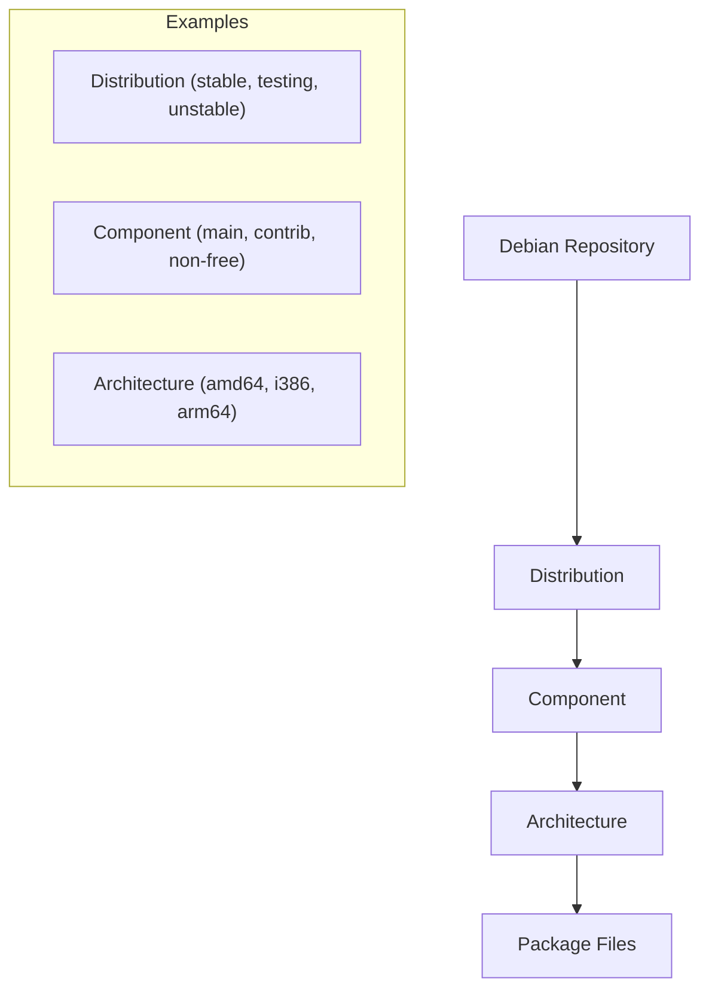

# Debian Repository Management

## Introduction

Debian Repository Management is a crucial skill for anyone working with Debian-based systems (like Ubuntu, Linux Mint, etc.). Repositories are centralized storage locations that contain packages (software) that can be installed on your system. Understanding how to manage these repositories allows you to:

- Control which software sources your system uses
- Create your own repositories for custom software
- Mirror existing repositories for faster local access
- Ensure system security by using trusted package sources

In this guide, we'll explore how Debian's repository system works and how you can effectively manage repositories on your system.

## The Structure of Debian Repositories

Debian repositories follow a specific structure that helps organize packages based on their release status, component category, and architecture.



### Repository Components

A standard Debian repository consists of several components:

- **Main**: Contains free software that complies with the Debian Free Software Guidelines
- **Contrib**: Contains free software that depends on non-free software
- **Non-free**: Contains software that doesn't comply with the Debian Free Software Guidelines

### Repository Format in sources.list

The `/etc/apt/sources.list` file and files in `/etc/apt/sources.list.d/` directory define which repositories your system uses. Each repository entry follows this format:

```
deb [options] repository_url distribution component1 component2 ...
```

For example:

```
deb http://deb.debian.org/debian bullseye main contrib non-free
```

## Viewing and Managing Repositories

### Viewing Current Repositories

To see which repositories are currently configured on your system:

```bash
cat /etc/apt/sources.list
```

And to check additional repository configurations:

```bash
ls -la /etc/apt/sources.list.d/
```

### Adding a Repository

You can add a repository in several ways:

**Method 1: Edit sources.list directly**

```bash
sudo nano /etc/apt/sources.list
```

Add a line like:

```
deb http://example.repository.org/debian stable main
```

**Method 2: Using add-apt-repository**

```bash
sudo add-apt-repository "deb http://example.repository.org/debian stable main"
```

**Method 3: Creating a new file in sources.list.d**

```bash
echo "deb http://example.repository.org/debian stable main" | sudo tee /etc/apt/sources.list.d/example.list
```

After adding a repository, always update the package index:

```bash
sudo apt update
```

### Adding Repository Keys

Many repositories are signed with GPG keys to ensure authenticity. You need to add these keys to your system:

```bash
# Download the key
wget -qO - https://example.repository.org/key.gpg | sudo apt-key add -

# For newer systems, use the keyring method
wget -qO - https://example.repository.org/key.gpg | sudo gpg --dearmor -o /etc/apt/trusted.gpg.d/example.gpg
```

### Removing a Repository

**Method 1: Comment out or remove the entry in sources.list**

```bash
sudo nano /etc/apt/sources.list
```

Add a `#` at the beginning of the line or delete it entirely.

**Method 2: Using add-apt-repository**

```bash
sudo add-apt-repository -r "deb http://example.repository.org/debian stable main"
```

**Method 3: Remove the file from sources.list.d**

```bash
sudo rm /etc/apt/sources.list.d/example.list
```

After removing a repository, update the package index:

```bash
sudo apt update
```

## Creating Your Own Debian Repository

Creating your own repository is useful for distributing custom packages within your organization or for personal use.

### Using reprepro

`reprepro` is a tool that helps manage a Debian repository. Let's set up a basic repository:

1. Install reprepro:

```bash
sudo apt install reprepro gnupg
```

2. Create a directory structure:

```bash
mkdir -p ~/myrepo/{conf,incoming}
```

3. Create a configuration file:

```bash
nano ~/myrepo/conf/distributions
```

Add the following content:

```
Origin: My Repository
Label: My Custom Repo
Suite: stable
Codename: myrepo
Architectures: amd64 i386 source
Components: main
Description: My custom Debian package repository
SignWith: yes
```

4. Generate a GPG key (if you don't already have one):

```bash
gpg --full-generate-key
```

Follow the prompts to create a key. Make note of the key ID.

5. Add packages to your repository:

```bash
cd ~/myrepo
reprepro includedeb myrepo /path/to/your/package.deb
```

6. To use your repository on another machine, export your GPG key:

```bash
gpg --export --armor your-email@example.com > myrepo.key
```

7. On the client machine, add your repository:

```bash
# Add the repository
echo "deb [signed-by=/etc/apt/trusted.gpg.d/myrepo.gpg] http://your-server/myrepo myrepo main" | sudo tee /etc/apt/sources.list.d/myrepo.list

# Add the key
wget -qO - http://your-server/myrepo.key | sudo gpg --dearmor -o /etc/apt/trusted.gpg.d/myrepo.gpg

# Update package lists
sudo apt update
```

### Using aptly

`aptly` is a more powerful alternative to `reprepro`:

1. Install aptly (you may need to add their repository first):

```bash
sudo apt install aptly
```

2. Initialize a repository:

```bash
aptly repo create -distribution=stable -component=main my-repo
```

3. Add packages:

```bash
aptly repo add my-repo /path/to/your/package.deb
```

4. Create a snapshot:

```bash
aptly snapshot create my-snapshot from repo my-repo
```

5. Publish the snapshot:

```bash
aptly publish snapshot my-snapshot
```

## Repository Mirroring

Mirroring a repository allows you to keep a local copy of a remote repository, which can save bandwidth and increase installation speed.

### Using apt-mirror

1. Install apt-mirror:

```bash
sudo apt install apt-mirror
```

2. Configure the mirror:

```bash
sudo nano /etc/apt/mirror.list
```

Add or modify entries:

```
set base_path /var/spool/apt-mirror
set nthreads 20
set _tilde 0

deb http://deb.debian.org/debian bullseye main contrib non-free
deb http://security.debian.org/debian-security bullseye-security main contrib non-free
```

3. Run the mirror process:

```bash
sudo apt-mirror
```

This will start downloading the repository, which can take a long time depending on the size.

4. Create a web server to serve your mirror:

```bash
sudo apt install apache2
sudo ln -s /var/spool/apt-mirror/mirror/deb.debian.org/debian /var/www/html/debian
```

5. Configure systems to use your mirror:

```
deb http://your-server/debian bullseye main contrib non-free
```

## Repository Security Considerations

When managing repositories, always keep these security practices in mind:

1. **Only add trusted repositories**: Third-party repositories can potentially include malicious packages.

2. **Verify repository signatures**: Always add the GPG keys for repositories to verify package authenticity.

3. **Regularly update repository metadata**:

```bash
sudo apt update
```

4. **Pin package priorities** to control which repository takes precedence:

```bash
nano /etc/apt/preferences.d/pinning
```

Example content:

```
Package: *
Pin: origin your-trusted-repo.org
Pin-Priority: 900

Package: *
Pin: origin less-trusted-repo.org
Pin-Priority: 100
```

Higher values indicate higher priority.

## Troubleshooting Repository Issues

### Common Problems and Solutions

1. **GPG errors**:

```
W: GPG error: http://repository.example.org stable Release: The following signatures couldn't be verified because the public key is not available: NO_PUBKEY 1234ABCD
```

Solution:

```bash
sudo apt-key adv --keyserver keyserver.ubuntu.com --recv-keys 1234ABCD
```

2. **404 Not Found errors**:

```
W: Failed to fetch http://repository.example.org/dists/stable/Release  404  Not Found
```

Check if the repository URL is correct and if the distribution name (stable, testing, etc.) is valid.

3. **Hash Sum mismatch**:

```
W: Failed to fetch ... Hash Sum mismatch
```

Solution:

```bash
sudo rm -rf /var/lib/apt/lists/*
sudo apt clean
sudo apt update
```

## Summary

Debian Repository Management is a fundamental skill that allows you to control which software is available on your system. We've covered:

- Understanding the structure of Debian repositories
- Adding and removing repositories
- Creating your own repository using reprepro and aptly
- Mirroring repositories for faster local access
- Important security considerations
- Troubleshooting common repository issues

With these skills, you can effectively manage software sources on your Debian-based system, create custom repositories for your organization, and ensure your systems have secure and reliable access to the software they need.

## Further Resources

- [Debian Repository Format Documentation](https://wiki.debian.org/DebianRepository/Format)
- [Debian Repository Management Wiki](https://wiki.debian.org/DebianRepository/Setup)
- [APT Package Management Tool Guide](https://wiki.debian.org/Apt)
- [Aptly Documentation](https://www.aptly.info/doc/overview/)

## Exercises

1. Add the Debian Backports repository to your system and install a package from it.
2. Create a small personal repository with at least three custom packages.
3. Set up an apt mirror of your distribution's security updates repository.
4. Practice pinning packages from different repositories with different priorities.
5. Create a script that automatically updates your custom repository when new packages are placed in a specific directory.