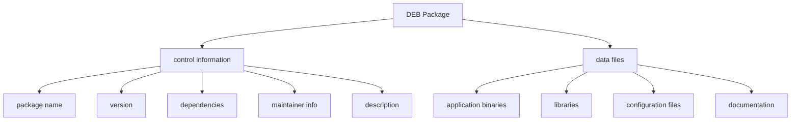
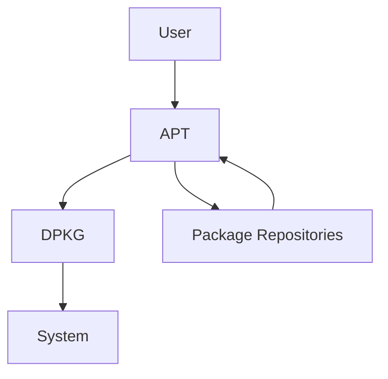

# Debian DEB Packages

## Introduction

Debian packages (commonly known as DEB packages) are the standard software packaging format used by Debian and Debian-based Linux distributions like Ubuntu, Linux Mint, and many others. These packages contain application files, configuration data, and installation instructions bundled together in a single `.deb` file. 

Understanding DEB packages is fundamental for anyone learning Linux system administration or development on Debian-based systems. In this guide, we'll explore what DEB packages are, how they work, and how to manage them effectively.

## What is a DEB Package?

A DEB package is essentially an archive file with the `.deb` extension. It contains software in a structured format that the Debian package management system can understand and process. 

DEB packages are built according to specific standards that ensure consistency and compatibility across different Debian-based systems.



## Anatomy of a DEB Package

A DEB package consists of three main components:

1. **Debian binary package control file** (`debian-binary`) - Contains the version of the package format
2. **Control archive** (`control.tar.gz` or `control.tar.xz`) - Contains metadata about the package
3. **Data archive** (`data.tar.gz`, `data.tar.xz`, etc.) - Contains the actual files to be installed

### Control Information

The control archive contains important metadata about the package, including:

- Package name and version
- Dependencies and conflicts with other packages
- Maintainer information
- Architecture compatibility
- Package description
- Pre and post-installation scripts

Let's look at an example of a control file:

```
Package: hello
Version: 2.10-2
Architecture: amd64
Maintainer: John Doe <john@example.com>
Installed-Size: 120
Depends: libc6 (>= 2.14)
Section: utils
Priority: optional
Description: The classic greeting program
 The GNU hello program produces a familiar, friendly greeting.
 It allows non-programmers to use a classic computer science tool
 which would otherwise be unavailable to them.
```

### Data Files

The data archive contains the actual files that will be installed on the system, organized in the same directory structure where they'll be placed. This includes:

- Executable binaries
- Libraries and shared files
- Configuration files
- Documentation and man pages
- Desktop icons and application entries

## Working with DEB Packages

### Installing DEB Packages

You can install DEB packages using various tools. The most basic tool is `dpkg`, the Debian Package Manager:

```bash
sudo dpkg -i package-name.deb
```

However, `dpkg` doesn't resolve dependencies automatically. For that, you'll want to use higher-level tools like `apt`:

```bash
sudo apt install ./package-name.deb
```

Example of installing the Firefox browser:

```bash
# Using dpkg
sudo dpkg -i firefox_98.0+build2-0ubuntu0.20.04.1_amd64.deb
# If there are dependency problems
sudo apt -f install

# Using apt (automatically handles dependencies)
sudo apt install ./firefox_98.0+build2-0ubuntu0.20.04.1_amd64.deb
```

### Listing Installed Packages

To see what packages are installed on your system:

```bash
# List all installed packages
dpkg -l

# Find specific packages
dpkg -l | grep firefox
```

Example output:

```
ii  firefox                               98.0+build2-0ubuntu0.20.04.1   amd64   Safe and easy web browser from Mozilla
```

The first column shows the package status:
- `ii` means the package is installed correctly
- `rc` means the package was removed but configuration files remain
- `un` means the package is unknown/not installed

### Querying Package Information

To get detailed information about a package:

```bash
# For an installed package
dpkg -s firefox

# For a .deb file
dpkg -I firefox_98.0+build2-0ubuntu0.20.04.1_amd64.deb
```

Example output:

```
Package: firefox
Status: install ok installed
Priority: optional
Section: web
Installed-Size: 221807
Maintainer: Ubuntu Mozilla Team <ubuntu-mozilla@lists.ubuntu.com>
Architecture: amd64
Version: 98.0+build2-0ubuntu0.20.04.1
Depends: lsb-release, libatk1.0-0 (>= 1.12.4), [...]
Description: Safe and easy web browser from Mozilla
 Firefox delivers safe, easy web browsing. A familiar user interface,
 enhanced security features including protection from online identity theft,
 and integrated search let you get the most out of the web.
```

### Listing Package Contents

To see what files a package contains:

```bash
# For an installed package
dpkg -L firefox

# For a .deb file
dpkg -c firefox_98.0+build2-0ubuntu0.20.04.1_amd64.deb
```

Example output:

```
/usr/lib/firefox/
/usr/lib/firefox/firefox
/usr/lib/firefox/firefox-bin
/usr/lib/firefox/browser/chrome.manifest
/usr/lib/firefox/browser/omni.ja
[...]
```

### Removing Packages

To remove an installed package:

```bash
# Remove the package but keep configuration files
sudo dpkg -r firefox
# or
sudo apt remove firefox

# Remove the package and its configuration files
sudo dpkg --purge firefox
# or
sudo apt purge firefox
```

## Creating a Simple DEB Package

Let's walk through creating a simple DEB package for a "hello world" program:

### 1. Create the Program

First, create a simple C program:

```bash
mkdir -p hello-world/src
cd hello-world/src
```

Create a file named `hello.c`:

```c
#include <stdio.h>

int main() {
    printf("Hello, Debian Package World!
");
    return 0;
}
```

Compile it:

```bash
gcc -o hello hello.c
```

### 2. Prepare Package Directory Structure

```bash
mkdir -p ../debian-package/DEBIAN
mkdir -p ../debian-package/usr/local/bin
```

### 3. Create Control File

Create a file named `control` in the `DEBIAN` directory:

```bash
cat > ../debian-package/DEBIAN/control << EOF
Package: hello-world
Version: 1.0-1
Section: utils
Priority: optional
Architecture: amd64
Depends: libc6 (>= 2.14)
Maintainer: Your Name <your.email@example.com>
Description: Hello World Package
 This is a simple hello world package to demonstrate
 how to create Debian packages.
EOF
```

### 4. Copy Files to Package Structure

```bash
cp hello ../debian-package/usr/local/bin/
```

### 5. Build the Package

```bash
cd ..
dpkg-deb --build debian-package
```

This will create `debian-package.deb`, which you can install with:

```bash
sudo dpkg -i debian-package.deb
```

After installation, you can run:

```bash
hello-world
```

Output:
```
Hello, Debian Package World!
```

## Using Higher-Level Tools for Package Creation

For more complex packages, you might want to use higher-level tools like `dh-make` and `debhelper`:

```bash
# Install the necessary tools
sudo apt install dh-make devscripts build-essential

# Set up environment variables
export DEBEMAIL="your.email@example.com"
export DEBFULLNAME="Your Name"

# Create a new package using a template
cd hello-world
dh_make --native --single --yes
```

This creates a `debian/` directory with various template files that you can customize. After editing these files, you can build the package with:

```bash
debuild -us -uc
```

## Package Management Best Practices

1. **Always use package management tools** instead of manual installation when possible
2. **Keep your system updated**:
   ```bash
   sudo apt update
   sudo apt upgrade
   ```
3. **Check package authenticity** before installation
4. **Back up configuration files** before significant changes
5. **Use virtual machines or containers** for testing packages
6. **Review package contents** before installation using `dpkg -c`

## Advanced Package Management

### APT vs DPKG

While `dpkg` is the low-level package manager, APT (Advanced Package Tool) provides a higher-level interface that automatically handles dependencies and package sources:



### Package Repositories

APT uses repositories - collections of packages stored on remote servers. These are configured in the `/etc/apt/sources.list` file and in the `/etc/apt/sources.list.d/` directory.

```bash
# View your current repositories
cat /etc/apt/sources.list
```

Example:
```
deb http://archive.ubuntu.com/ubuntu/ focal main restricted
deb http://archive.ubuntu.com/ubuntu/ focal-updates main restricted
```

### Pinning Packages

Sometimes you might want to control which version of a package is installed. This can be done with "pinning":

Create a file in `/etc/apt/preferences.d/`:

```
Package: firefox
Pin: version 90.*
Pin-Priority: 1001
```

This will prefer Firefox version 90.x over newer versions.

## Summary

Debian DEB packages provide a powerful and consistent way to distribute and manage software on Debian-based systems. In this guide, we've covered:

- What DEB packages are and their internal structure
- How to install, query, and remove packages
- Creating a simple custom DEB package
- Advanced package management concepts

Understanding DEB packages gives you greater control over your Debian-based system and is a foundational skill for Linux system administration.

## Further Learning

### Exercises

1. Find and install a DEB package from the official Debian repositories
2. Examine the control information of five different packages on your system
3. Create a custom DEB package that installs a simple shell script
4. Try building a package from source code using `dh-make`

### Additional Resources

- The Debian Policy Manual: https://www.debian.org/doc/debian-policy/
- Debian New Maintainers' Guide: https://www.debian.org/doc/manuals/maint-guide/
- Debian Developer's Reference: https://www.debian.org/doc/manuals/developers-reference/
- `man` pages: `man dpkg`, `man apt`, `man debhelper`