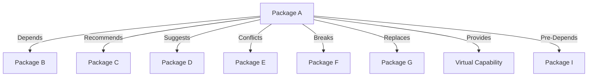

# Debian Dependency Management

## Introduction

In the Debian ecosystem, software is distributed as packages—neatly bundled collections of files that make up an application or service. One of the most powerful aspects of Debian's package management system is how it handles dependencies—the relationships between packages that ensure everything works correctly together.

When you install a program on Debian, the package manager doesn't just install that program alone; it also ensures all the necessary supporting packages (dependencies) are installed. This automatic dependency resolution is what makes Debian package management so user-friendly and robust.

In this guide, we'll explore how Debian's dependency management works, how to view and manage dependencies, troubleshoot common dependency issues, and use advanced dependency management techniques.

## Understanding Package Dependencies

### Types of Dependencies

In Debian, packages can have several types of relationships with other packages:

1. **Depends**: Packages that are absolutely required for the package to function.
2. **Recommends**: Packages that are highly recommended but not strictly necessary.
3. **Suggests**: Optional packages that might enhance functionality.
4. **Conflicts**: Packages that cannot be installed simultaneously.
5. **Breaks**: Packages that would be broken by installing this package.
6. **Replaces**: Packages that this package replaces.
7. **Provides**: Virtual capabilities this package provides.
8. **Pre-Depends**: Packages that must be installed AND configured before this package.

Let's visualize these relationships:



## Viewing Package Dependencies

### Using apt-cache

The `apt-cache` command provides information about packages in the APT cache. To view dependencies of a package:

```bash
apt-cache depends package_name
```

**Example:**

```
$ apt-cache depends firefox
firefox
  Depends: libc6
  Depends: libstdc++6
  Depends: libgtk-3-0
  Depends: fontconfig
  Recommends: fonts-liberation
  Suggests: firefox-locale-en
```

To see what packages depend on a specific package (reverse dependencies):

```bash
apt-cache rdepends package_name
```

**Example:**

```
$ apt-cache rdepends libc6
libc6
Reverse Depends:
  bash
  coreutils
  apt
  ... (many more packages)
```

### Using `dpkg`

The `dpkg` command can also show package relationships:

```bash
dpkg -s package_name
```

**Example:**

```
$ dpkg -s nginx
Package: nginx
Status: install ok installed
Priority: optional
Section: web
...
Depends: libc6 (>= 2.17), nginx-common (= 1.18.0-0ubuntu1), ...
Recommends: ssl-cert
...
```

## Managing Package Dependencies

### Installing Packages with Dependencies

When you install a package using APT, dependencies are automatically handled:

```bash
sudo apt install package_name
```

APT calculates all required dependencies and installs them along with your requested package.

**Example:**

```
$ sudo apt install gimp
Reading package lists... Done
Building dependency tree       
Reading state information... Done
The following additional packages will be installed:
  libbabl-0.1-0 libgegl-0.4-0 libgimp2.0 ...
Suggested packages:
  gimp-help-en gimp-data-extras
The following NEW packages will be installed:
  gimp libbabl-0.1-0 libgegl-0.4-0 libgimp2.0 ...
```

### Installing Without Recommended Packages

By default, APT installs both dependencies and recommended packages. To install only the required dependencies:

```bash
sudo apt install --no-install-recommends package_name
```

**Example:**

```
$ sudo apt install --no-install-recommends firefox
```

This installs Firefox with only the essential dependencies, making for a more minimal installation.

## Troubleshooting Dependency Issues

### Broken Dependencies

Sometimes, package operations can result in broken dependencies. To fix this:

```bash
sudo apt --fix-broken install
```

### Finding Missing Dependencies

If a package complains about missing dependencies:

```bash
sudo apt update
sudo apt install missing_dependency_name
```

### Dependency Conflicts

When two packages conflict, you may need to remove one:

```bash
sudo apt remove conflicting_package
```

**Example Scenario:**

Suppose you're trying to install `package-a` but it conflicts with `package-b` that's already installed:

```
$ sudo apt install package-a
Reading package lists... Done
Building dependency tree       
Reading state information... Done
Some packages could not be installed. This may mean that you have
requested an impossible situation or if you are using the unstable
distribution that some required packages have not yet been created
or been moved out of Incoming.
The following information may help to resolve the situation:

The following packages have unmet dependencies:
 package-a : Conflicts: package-b but 1.2.3-1 is to be installed
E: Unable to correct problems, you have held broken packages.
```

Resolution:

```bash
sudo apt remove package-b
sudo apt install package-a
```

## Advanced Dependency Management

### Using Aptitude

`aptitude` is an alternative to APT with enhanced dependency resolution:

```bash
sudo aptitude install package_name
```

Aptitude often suggests smarter solutions to dependency conflicts.

### Manual Dependency Investigation

To investigate dependency chains:

```bash
apt-cache showpkg package_name
```

This shows detailed dependency information, including versions and reverse dependencies.

### Creating Metapackages

A metapackage is a package that exists only to declare dependencies. You can create your own metapackage to install a predefined set of packages:

1. Install the `equivs` package:

```bash
sudo apt install equivs
```

2. Create a control file template:

```bash
equivs-control mymetapackage.control
```

3. Edit the control file to specify dependencies:

```
Section: misc
Priority: optional
Standards-Version: 3.9.2

Package: mymetapackage
Version: 1.0
Maintainer: Your Name <your.email@example.com>
Depends: package1, package2, package3
Description: My custom collection of packages
 This metapackage installs a predefined set of packages
 that I commonly use together.
```

4. Build the package:

```bash
equivs-build mymetapackage.control
```

5. Install the resulting .deb file:

```bash
sudo dpkg -i mymetapackage_1.0_all.deb
sudo apt --fix-broken install
```

## Practical Examples

### Example 1: Installing a LAMP Stack

Let's install a LAMP (Linux, Apache, MySQL, PHP) stack and examine the dependencies:

```bash
sudo apt install apache2 mysql-server php libapache2-mod-php php-mysql
```

This single command installs all necessary components, with APT resolving all the dependencies automatically.

### Example 2: Minimal Installation of a Desktop Environment

To install a minimal Xfce desktop environment:

```bash
sudo apt install --no-install-recommends xfce4
```

This gives you a basic Xfce environment without the additional recommended packages.

### Example 3: Checking Dependencies Before Installation

Before installing a package, you can check what will be installed:

```bash
apt-cache depends gimp
apt-cache show gimp
apt --simulate install gimp
```

The `--simulate` option shows what would happen without actually making changes.

## Summary

Debian's dependency management system is a sophisticated mechanism that ensures software packages work correctly together. Key points to remember:

- Dependencies specify relationships between packages
- APT automatically resolves and installs required dependencies
- Various commands like `apt-cache` and `dpkg` help inspect dependencies
- Troubleshooting tools exist for fixing dependency issues
- Advanced techniques like creating metapackages allow customized management

By understanding and leveraging Debian's dependency management, you can maintain a stable and well-functioning system while efficiently installing and managing software.

## Additional Resources

- [Debian Package Management Handbook](https://www.debian.org/doc/manuals/debian-handbook/sect.package-meta-information.en.html)
- [APT Documentation](https://manpages.debian.org/stretch/apt/apt.8.en.html)
- [Debian Policy Manual](https://www.debian.org/doc/debian-policy/ch-relationships.html)

## Exercises

1. Find all packages that depend on the `python3` package using the appropriate command.
2. Create a metapackage that installs your favorite development tools.
3. Identify and resolve a dependency conflict between two packages of your choice.
4. Install a package with and without recommended dependencies, and compare the difference in disk space used.
5. Trace the dependency chain for a complex package like `firefox` or `libreoffice`.