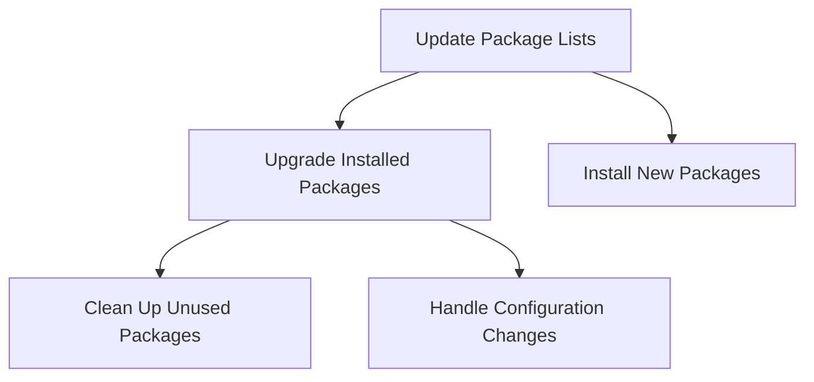

# Debian System Updates

## Introduction

Keeping your Debian system up to date is one of the most important aspects of system administration. Regular updates ensure your system has the latest security patches, bug fixes, and feature enhancements. In this guide, we'll explore the Debian update process, understanding how package management works, and learning the best practices for maintaining a healthy system.

Debian uses the Advanced Package Tool (APT) system, which handles the installation, removal, and updating of software packages. This powerful tool simplifies the management of software on your system by handling dependencies and configuration automatically.

## Understanding the APT System

Before diving into update commands, let's understand some key concepts:

- **Repository**: A collection of packages stored on remote servers
- **Package**: A compressed archive containing software, configuration files, and installation instructions
- **Dependencies**: Other packages required by a specific package to function properly
- **Package Management**: The process of installing, updating, and removing packages

Debian's package management follows this basic workflow:



## Basic Update Commands

### Updating Package Lists

The first step in any update process is refreshing your local package lists to know what updates are available:

```bash
sudo apt update
```

**Example Output:**
```
Hit:1 http://deb.debian.org/debian bullseye InRelease
Get:2 http://security.debian.org/debian-security bullseye-security InRelease [48.4 kB]
Get:3 http://deb.debian.org/debian bullseye-updates InRelease [44.1 kB]
Get:4 http://security.debian.org/debian-security bullseye-security/main amd64 Packages [217 kB]
Fetched 309 kB in 2s (155 kB/s)
Reading package lists... Done
Building dependency tree... Done
Reading state information... Done
65 packages can be upgraded. Run 'apt list --upgradable' to see them.
```

This command connects to your configured repositories, downloads the latest package information, and lets you know if updates are available.

### Viewing Available Updates

To see what packages can be updated:

```bash
apt list --upgradable
```

**Example Output:**
```
Listing... Done
bash/stable 5.1-2+deb11u1 amd64 [upgradable from: 5.1-2]
curl/stable-security 7.74.0-1.3+deb11u3 amd64 [upgradable from: 7.74.0-1.3+deb11u2]
firefox-esr/stable-security 91.11.0esr-1~deb11u1 amd64 [upgradable from: 91.10.0esr-1~deb11u1]
...
```

### Performing System Upgrades

There are several ways to upgrade your system, from basic to more comprehensive approaches:

#### Standard Upgrade

This is the safest option and will never remove existing packages:

```bash
sudo apt upgrade
```

The system will calculate dependencies and ask for your confirmation:

```
Reading package lists... Done
Building dependency tree... Done
Reading state information... Done
Calculating upgrade... Done
The following packages will be upgraded:
  bash curl firefox-esr ...
65 upgraded, 0 newly installed, 0 to remove and 0 not upgraded.
Need to get 112 MB of archives.
After this operation, 2,048 kB of additional disk space will be used.
Do you want to continue? [Y/n]
```

#### Full Upgrade

For a more comprehensive upgrade that can add or remove packages to resolve dependencies:

```bash
sudo apt full-upgrade
```

Or the older equivalent command:

```bash
sudo apt-get dist-upgrade
```

This is particularly useful when upgrading between Debian releases or when dealing with package conflicts.

## Advanced Update Techniques

### Updating a Single Package

You can update a specific package while leaving others untouched:

```bash
sudo apt install --only-upgrade package-name
```

**Example:**
```bash
sudo apt install --only-upgrade firefox-esr
```

### Automatic Security Updates

For servers or critical systems, you might want to automate security updates using the `unattended-upgrades` package:

```bash
sudo apt install unattended-upgrades
sudo dpkg-reconfigure -plow unattended-upgrades
```

This will install and configure automatic updates for security patches.

You can customize the configuration in `/etc/apt/apt.conf.d/50unattended-upgrades`.

### Cleaning Up After Updates

After updates, you can free disk space by removing downloaded package files:

```bash
sudo apt clean
```

Or remove packages that were automatically installed but are no longer needed:

```bash
sudo apt autoremove
```

## Managing Package Sources

Debian's package sources are defined in `/etc/apt/sources.list` and in files under `/etc/apt/sources.list.d/`. Understanding how to configure these is important for proper system updates.

A typical sources.list entry looks like this:

```
deb http://deb.debian.org/debian bullseye main contrib non-free
deb http://security.debian.org/debian-security bullseye-security main contrib non-free
```

Each line specifies:
- The type (`deb` for binary packages)
- The repository URL
- The distribution name (e.g., `bullseye` or `bullseye-security`)
- The components to use (`main`, `contrib`, `non-free`)

### Adding a New Repository

To add a third-party repository:

1. Add the repository's GPG key:
```bash
sudo apt-key adv --keyserver keyserver.ubuntu.com --recv-keys [KEY]
```

2. Add the repository to your sources:
```bash
echo "deb [signed-by=/usr/share/keyrings/example-archive-keyring.gpg] http://example.org/debian stable main" | sudo tee /etc/apt/sources.list.d/example.list
```

3. Update your package lists:
```bash
sudo apt update
```

## Best Practices for System Updates

### 1. Regular Update Schedule

Set a regular schedule for updates, especially security updates. For servers, consider a maintenance window during off-peak hours.

### 2. Read Release Notes

Before performing major updates, read the release notes for any breaking changes or required manual interventions.

### 3. Test Updates on Non-Production Systems

For critical environments, test updates on a staging system before applying to production.

### 4. Create System Backups

Always back up important data before major system updates:

```bash
sudo apt install timeshift
sudo timeshift --create --comments "Before system update"
```

### 5. Verify Package Sources

Only use trusted package sources, especially when adding third-party repositories.

## Troubleshooting Common Update Issues

### Failed Updates

If an update fails, try the following:

```bash
sudo apt update --fix-missing
sudo dpkg --configure -a
sudo apt install -f
```

These commands help fix broken packages and incomplete installations.

### Package Conflicts

When you encounter package conflicts:

1. Check the error message carefully
2. Search the Debian bug tracking system for known issues
3. Consider holding problematic packages temporarily:

```bash
sudo apt-mark hold package-name
```

### Reverting an Update

If a package update causes problems, you can downgrade to a previous version:

```bash
sudo apt install package-name=version-number
```

For example:
```bash
sudo apt install firefox-esr=91.10.0esr-1~deb11u1
```

## Debian Release Upgrades

Upgrading between major Debian releases (e.g., from Debian 10 "Buster" to Debian 11 "Bullseye") requires a different approach:

1. Update your current system fully:
```bash
sudo apt update && sudo apt full-upgrade
```

2. Update your sources.list to the new release:
```bash
sudo sed -i 's/buster/bullseye/g' /etc/apt/sources.list
```

3. Update package lists for the new release:
```bash
sudo apt update
```

4. Perform a minimal upgrade first:
```bash
sudo apt upgrade --without-new-pkgs
```

5. Complete the full upgrade:
```bash
sudo apt full-upgrade
```

6. Reboot the system:
```bash
sudo systemctl reboot
```

## Summary

Maintaining up-to-date Debian systems is critical for security and stability. The APT package management system provides powerful tools for keeping your system current with minimal effort.

Key points to remember:
- `apt update` refreshes package lists
- `apt upgrade` safely upgrades packages
- `apt full-upgrade` upgrades more aggressively when needed
- Regular maintenance saves time and prevents security issues
- Always back up before major updates
- Use trusted package sources

## Practice Exercises

1. Set up a regular update schedule using cron jobs.
2. Configure unattended-upgrades to automatically install security updates.
3. Create a bash script that performs updates and sends a notification with results.
4. Practice adding a third-party repository and installing software from it.
5. Create a snapshot of your system before and after updates to compare changes.

## Additional Resources

- [Debian Package Management Handbook](https://www.debian.org/doc/manuals/debian-reference/ch02.en.html)
- [APT Command Guide](https://wiki.debian.org/Apt)
- [Debian Security Information](https://www.debian.org/security/)
- [Debian Release Information](https://www.debian.org/releases/)

By following these practices and understanding how Debian's package management works, you'll be able to maintain healthy, secure, and up-to-date systems with confidence.