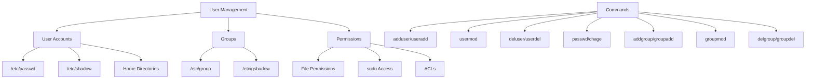

# Debian User Management

## Introduction

User management is a fundamental aspect of Debian system administration. It involves creating, modifying, and deleting user accounts, managing user groups, and setting appropriate permissions. Proper user management ensures system security and provides an organized way for users to interact with the system resources.

In Debian, like other Linux distributions, user management is based on the multi-user design philosophy of Unix systems. This means multiple users can work on the same system simultaneously, each with their own files and permissions.

## Understanding Users and Groups in Debian

### What are Users?

In Debian, a user is an entity that can log in to the system and perform operations based on their assigned permissions. Each user has:

- A unique username
- A unique user ID (UID)
- A home directory (typically `/home/username`)
- A login shell
- Membership in one or more groups

### What are Groups?

Groups are collections of users with similar access requirements. Groups streamline permission management by allowing administrators to grant permissions to multiple users at once. Each group has:

- A unique group name
- A unique group ID (GID)
- A list of members (users)

### System Users vs. Regular Users

Debian distinguishes between two main types of users:

1. **System users**: Created for services and applications (UIDs typically below 1000)
2. **Regular users**: Created for human users (UIDs typically 1000 or higher)

## Key Files for User Management

Before diving into commands, let's understand the key files Debian uses to store user and group information:

| File | Description |
|------|-------------|
| `/etc/passwd` | Contains basic user account information |
| `/etc/shadow` | Contains encrypted passwords and password policy information |
| `/etc/group` | Contains group information |
| `/etc/gshadow` | Contains encrypted group passwords |
| `/etc/login.defs` | Defines user account settings |
| `/etc/skel/` | Contains template files for new user home directories |

## User Management Commands

### Creating Users

To create a new user account, use the `adduser` command:

```bash
sudo adduser username
```

This interactive command will prompt you for:
- Password
- Full name
- Room number
- Work phone
- Home phone
- Other information

Example output:

```
Adding user 'john' ...
Adding new group 'john' (1001) ...
Adding new user 'john' (1001) with group 'john' ...
Creating home directory '/home/john' ...
Copying files from '/etc/skel' ...
New password: 
Retype new password: 
passwd: password updated successfully
Changing the user information for john
Enter the new value, or press ENTER for the default
    Full Name []: John Smith
    Room Number []: 123
    Work Phone []: 555-1234
    Home Phone []: 555-5678
    Other []: 
Is the information correct? [Y/n] Y
```

For non-interactive creation (useful in scripts), use `useradd`:

```bash
sudo useradd -m -s /bin/bash -c "Full Name" username
sudo passwd username
```

The `-m` flag creates the home directory, `-s` sets the login shell, and `-c` adds a comment (typically the user's full name).

### Modifying Users

To modify an existing user's attributes:

```bash
sudo usermod [options] username
```

Common options include:
- `-c`: Change the user's comment field
- `-d`: Change home directory
- `-e`: Set account expiration date
- `-g`: Change primary group
- `-G`: Set supplementary groups
- `-s`: Change login shell
- `-L`: Lock account
- `-U`: Unlock account

Example: Adding a user to the `sudo` group:

```bash
sudo usermod -aG sudo username
```

The `-a` flag is crucial as it appends to existing groups rather than replacing them.

### Deleting Users

To delete a user account:

```bash
sudo deluser username
```

To also remove the user's home directory and mail spool:

```bash
sudo deluser --remove-home username
```

For a more comprehensive removal including all files owned by the user:

```bash
sudo deluser --remove-all-files username
```

### Changing Passwords

Users can change their own passwords:

```bash
passwd
```

Administrators can change any user's password:

```bash
sudo passwd username
```

To set password expiration policies:

```bash
sudo chage [options] username
```

Example: Setting password to expire in 90 days:

```bash
sudo chage -M 90 username
```

To view current password expiration settings:

```bash
sudo chage -l username
```

Output example:

```
Last password change                    : Mar 01, 2023
Password expires                        : May 30, 2023
Password inactive                       : never
Account expires                         : never
Minimum number of days between password changes : 0
Maximum number of days between password changes : 90
Number of days of warning before password expires : 7
```

## Group Management Commands

### Creating Groups

To create a new group:

```bash
sudo addgroup groupname
```

Or using the lower-level command:

```bash
sudo groupadd groupname
```

### Modifying Groups

To add a user to a group:

```bash
sudo adduser username groupname
```

Or:

```bash
sudo usermod -aG groupname username
```

To remove a user from a group:

```bash
sudo deluser username groupname
```

To change a group's name:

```bash
sudo groupmod -n newname oldname
```

### Deleting Groups

To delete a group:

```bash
sudo delgroup groupname
```

Or:

```bash
sudo groupdel groupname
```

## Managing User Privileges

### Understanding the sudo System

The `sudo` command allows regular users to execute commands with administrative privileges. To grant a user sudo access, add them to the sudo group:

```bash
sudo usermod -aG sudo username
```

After this command, the user must log out and log back in for the changes to take effect.

### Configuring sudo Access

For more granular control over sudo permissions, edit the sudoers file:

```bash
sudo visudo
```

Always use `visudo` to edit this file as it checks for syntax errors before saving.

Example sudoers entry to allow a user to run specific commands without a password:

```
username ALL=(ALL) NOPASSWD: /usr/bin/apt update, /usr/bin/apt upgrade
```

## User Information Commands

### Viewing User Information

To see information about the current user:

```bash
id
```

Output example:

```
uid=1000(john) gid=1000(john) groups=1000(john),4(adm),24(cdrom),27(sudo),30(dip),46(plugdev),120(lpadmin)
```

To see information about a specific user:

```bash
id username
```

To check which users are currently logged in:

```bash
who
```

For more detailed information about logged-in users:

```bash
w
```

### Viewing Group Information

To see all groups a user belongs to:

```bash
groups username
```

To list all groups on the system:

```bash
getent group
```

## Practical Examples

### Example 1: Setting Up a New Developer Account

Let's create a complete setup for a new developer joining your team:

```bash
# Create the user
sudo adduser developer

# Add to relevant groups
sudo usermod -aG sudo,adm,docker developer

# Set up SSH access
sudo mkdir -p /home/developer/.ssh
sudo cp authorized_keys /home/developer/.ssh/
sudo chown -R developer:developer /home/developer/.ssh
sudo chmod 700 /home/developer/.ssh
sudo chmod 600 /home/developer/.ssh/authorized_keys

# Set password expiration
sudo chage -M 90 -W 7 developer
```

### Example 2: Creating a Service Account

For running a web application:

```bash
# Create system user without login capabilities
sudo useradd -r -s /usr/sbin/nologin webapp

# Create application directory
sudo mkdir -p /var/www/myapp

# Set ownership
sudo chown -R webapp:webapp /var/www/myapp

# Set appropriate permissions
sudo chmod 750 /var/www/myapp
```

### Example 3: Implementing a Shared Group Workspace

For a team that needs to share files:

```bash
# Create a group
sudo addgroup project

# Add users to the group
sudo usermod -aG project user1
sudo usermod -aG project user2
sudo usermod -aG project user3

# Create a shared directory
sudo mkdir -p /opt/shared/project

# Set group ownership
sudo chown :project /opt/shared/project

# Set permissions (including setgid bit to maintain group ownership)
sudo chmod 2775 /opt/shared/project

# Remind users to log out and back in
echo "Please log out and log back in for group changes to take effect"
```

## Understanding User Management with a Diagram

Here's a diagram showing how user management components relate in Debian:



## Best Practices for User Management

1. **Use strong passwords**: Enforce strong password policies using `pam_pwquality` or similar modules.

2. **Regular audits**: Periodically review user accounts and remove unused ones:
   ```bash
   sudo lastlog | grep "Never"
   ```

3. **Least privilege principle**: Give users only the permissions they need for their role.

4. **Group-based access control**: Organize permissions around groups rather than individual users.

5. **Password aging**: Set appropriate password expiration policies:
   ```bash
   sudo vim /etc/login.defs
   ```

6. **Account lockout**: Configure account lockout after failed attempts using PAM modules.

7. **Secure default settings**: Review and modify `/etc/skel/` for appropriate defaults for new users.

## Troubleshooting Common Issues

### User Can't Log In

1. Check if the account is locked:
   ```bash
   sudo passwd -S username
   ```

2. Verify the user's shell:
   ```bash
   grep username /etc/passwd
   ```

3. Check if the home directory exists and has correct permissions:
   ```bash
   ls -ld /home/username
   ```

### Permission Denied Errors

1. Check file ownership:
   ```bash
   ls -l filename
   ```

2. Verify group membership:
   ```bash
   groups username
   ```

3. Remember that group changes require logging out and back in to take effect.

### Can't Add User to Group

1. Ensure you're using the `-a` flag with `-G` to append groups:
   ```bash
   sudo usermod -aG groupname username
   ```

2. Check if the group exists:
   ```bash
   getent group groupname
   ```

## Summary

User management in Debian is a critical aspect of system administration. It involves creating and maintaining user accounts, managing groups, and setting appropriate permissions. By mastering the commands and concepts we've covered, you'll be able to:

- Create and manage user accounts efficiently
- Organize users into logical groups
- Set appropriate permissions for files and directories
- Implement security best practices
- Troubleshoot common user management issues

These skills form the foundation of effective Debian system administration and will help you maintain a secure and well-organized system.

## Additional Resources

- The Debian Administrator's Handbook (available online)
- `man` pages for each command (e.g., `man useradd`, `man usermod`)
- Debian Wiki: [User Management](https://wiki.debian.org/UserManagement)

## Exercises

1. Create a new user with a home directory, custom shell, and add them to multiple groups.
2. Set up a shared directory for a group where all members can read and write files, but non-members can only read.
3. Implement password expiration policies for a user requiring password changes every 60 days with 7 days of warnings.
4. Create a system user for running a service and set up appropriate directories and permissions.
5. Audit your system for users who haven't logged in for over 90 days and develop a plan to handle these accounts.