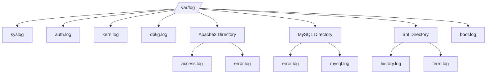

# Debian Log Management

## Introduction

Log management is a critical aspect of Debian system administration. Logs provide a detailed record of system events, application activities, and security-related information. Properly managing these logs enables administrators to troubleshoot issues, monitor system health, and maintain security compliance.

In this tutorial, we'll explore how Debian handles logs, where they're stored, how to view and analyze them, and best practices for log rotation and maintenance. By the end, you'll have a solid understanding of how to effectively manage logs on your Debian system.

## Understanding the Debian Logging System

Debian, like most Linux distributions, uses a centralized logging system that collects and organizes log messages from various sources. The primary logging system in Debian is **syslog**, with **rsyslog** (Rocket-fast System for Log processing) being the default implementation in modern Debian versions.

### Log Locations

The most important logs in Debian are stored in the `/var/log` directory. Here's a breakdown of the key log files and directories:

| Log File/Directory | Description |
|-------------------|-------------|
| `/var/log/syslog` | General system logs and messages |
| `/var/log/auth.log` | Authentication and authorization logs |
| `/var/log/kern.log` | Kernel messages and warnings |
| `/var/log/dpkg.log` | Package management logs (installation/removal) |
| `/var/log/apache2/` | Apache web server logs (if installed) |
| `/var/log/mysql/` | MySQL database logs (if installed) |
| `/var/log/apt/` | APT package manager logs |
| `/var/log/boot.log` | System boot messages |

Let's visualize the log structure:



## Basic Log Viewing Commands

### Using `cat`, `less`, and `tail`

The simplest way to view log files is using standard text viewing commands:

```bash
# View entire log file
cat /var/log/syslog

# View log file with pagination
less /var/log/syslog

# View the last 10 lines of a log file
tail /var/log/syslog

# Follow log updates in real-time
tail -f /var/log/syslog
```

Let's see an example of the output from viewing a syslog file:

```
May 14 15:32:45 debian-server systemd[1]: Started Daily apt upgrade and clean activities.
May 14 15:32:45 debian-server systemd[1]: Reached target Timers.
May 14 15:32:46 debian-server CRON[23452]: (root) CMD (   cd / && run-parts --report /etc/cron.hourly)
May 14 15:40:01 debian-server CRON[23489]: (root) CMD (  [ -x /usr/lib/php/sessionclean ] && if [ ! -d /run/systemd/system ]; then /usr/lib/php/sessionclean; fi)
May 14 16:01:01 debian-server CRON[23521]: (root) CMD (test -e /run/systemd/system || SERVICE_MODE=1 /usr/lib/pm-utils/sleep.d/99anacron suspend)
```

### Filtering Logs with `grep`

To find specific information in log files, you can use `grep`:

```bash
# Search for a specific term
grep "error" /var/log/syslog

# Search case-insensitively
grep -i "failed" /var/log/auth.log

# Show 3 lines before and after the match
grep -A 3 -B 3 "critical" /var/log/syslog

# Search recursively in all logs
grep -r "connection refused" /var/log/
```

Example output when searching for failed login attempts:

```
May 14 09:45:23 debian-server sshd[12345]: Failed password for invalid user admin from 192.168.1.10 port 54321 ssh2
May 14 10:13:45 debian-server sshd[12346]: Failed password for root from 203.0.113.42 port 55123 ssh2
May 14 10:14:12 debian-server sshd[12347]: Failed password for root from 203.0.113.42 port 55124 ssh2
```

## The `journalctl` Utility

Modern Debian systems use **systemd** which includes its own logging system called the **journal**. The `journalctl` command allows you to interact with these logs:

```bash
# View all journal logs
journalctl

# View logs for the current boot
journalctl -b

# View logs for a specific service
journalctl -u ssh

# View logs since a specific time
journalctl --since "2023-05-14 10:00:00"

# View logs in real-time (follow)
journalctl -f
```

Example output from journalctl:

```
May 14 16:15:24 debian-server systemd[1]: Starting Network Manager...
May 14 16:15:25 debian-server NetworkManager[1234]: <info>  [1620999325.4261] NetworkManager (version 1.22.10) is starting...
May 14 16:15:26 debian-server NetworkManager[1234]: <info>  [1620999326.1234] NetworkManager successfully initialized
May 14 16:15:27 debian-server systemd[1]: Started Network Manager.
```

## Log Rotation with `logrotate`

To prevent log files from consuming too much disk space, Debian uses `logrotate` to automatically rotate, compress, and manage log files.

### How Log Rotation Works

The `logrotate` utility is configured through the following files:

- `/etc/logrotate.conf`: Main configuration file
- `/etc/logrotate.d/`: Directory containing configuration files for specific services

Here's a simple example of a logrotate configuration for Apache logs:

```
/var/log/apache2/*.log {
    weekly
    missingok
    rotate 52
    compress
    delaycompress
    notifempty
    create 640 root adm
    sharedscripts
    postrotate
        if /etc/init.d/apache2 status > /dev/null ; then \
            /etc/init.d/apache2 reload > /dev/null; \
        fi;
    endscript
    prerotate
        if [ -d /etc/logrotate.d/httpd-prerotate ]; then \
            run-parts /etc/logrotate.d/httpd-prerotate; \
        fi;
    endscript
}
```

This configuration:
- Rotates Apache logs weekly
- Keeps 52 rotated logs (1 year's worth)
- Compresses old logs
- Creates new log files with specific permissions
- Runs scripts before and after rotation

### Managing Log Rotation

You can manually run logrotate to test your configuration:

```bash
# Test the configuration (dry run)
logrotate -d /etc/logrotate.conf

# Force rotation even if not needed
logrotate -f /etc/logrotate.conf
```

Example output of a logrotate dry run:

```
reading config file /etc/logrotate.conf
including /etc/logrotate.d
reading config file /etc/logrotate.d/apache2
reading config file /etc/logrotate.d/apt
reading config file /etc/logrotate.d/dpkg
...
considering log /var/log/apache2/access.log
  log needs rotating
considering log /var/log/apache2/error.log
  log needs rotating
```

## Setting Up Remote Logging

For centralized log management or to keep logs secure in case of a system compromise, you can set up remote logging.

### Configuring rsyslog for Remote Logging

Edit the rsyslog configuration file:

```bash
sudo nano /etc/rsyslog.conf
```

To forward all logs to a remote server, add:

```
*.* @192.168.1.100:514    # For UDP
*.* @@192.168.1.100:514   # For TCP
```

Remember to restart the service after making changes:

```bash
sudo systemctl restart rsyslog
```

## Log Analysis Tools

Several tools can help analyze Debian logs more effectively:

### Using `logwatch`

Logwatch provides a daily summary of log activities:

```bash
# Install logwatch
sudo apt-get install logwatch

# Run logwatch manually
sudo logwatch --output stdout --format html --range yesterday --detail high
```

Example logwatch output snippet:

```
################### Logwatch 7.5.0 (09/28/19) ####################
       Processing Initiated: Sat May 15 00:00:03 2023
       Date Range Processed: yesterday (2023-May-14)
                         Period is day.
       Detail Level of Output: 5
       Type of Output/Format: stdout / html
       Logfiles for Host: debian-server
##################################################################

 --------------------- pam_unix Begin ------------------------ 

 Authentication Failures:
    root (via sshd):
       192.168.1.105: 12 Time(s)
    admin (via sshd):
       203.0.113.42: 5 Time(s)

 ---------------------- pam_unix End ------------------------- 
```

### Using `lnav`

The Log Navigator (`lnav`) is an enhanced log file viewer:

```bash
# Install lnav
sudo apt-get install lnav

# View multiple log files
lnav /var/log/syslog /var/log/auth.log
```

## Practical Examples

### Example 1: Investigating Failed Login Attempts

Let's investigate suspicious login attempts:

```bash
# Check for failed SSH logins
grep "Failed password" /var/log/auth.log

# Count failed attempts by IP
grep "Failed password" /var/log/auth.log | awk '{print $(NF-3)}' | sort | uniq -c | sort -nr

# Check all authentication failures in the last hour
journalctl -u ssh --since "1 hour ago" | grep "Failed"
```

Expected output:

```
# Count of failed attempts by IP
     15 203.0.113.42
      8 192.168.1.105
      3 198.51.100.17
      1 192.168.1.50
```

### Example 2: Tracking Package Installation History

To review package management activities:

```bash
# Check installation history
grep "install " /var/log/dpkg.log

# View package updates from today
grep "upgrade " /var/log/dpkg.log | grep "$(date +%Y-%m-%d)"

# Check APT history
less /var/log/apt/history.log
```

Example output:

```
2023-05-14 08:45:22 install nginx:amd64 <none> 1.18.0-6.1+deb11u1
2023-05-14 08:45:24 install nginx-common:all <none> 1.18.0-6.1+deb11u1
2023-05-14 08:45:25 install nginx-full:amd64 <none> 1.18.0-6.1+deb11u1
2023-05-14 10:15:30 install fail2ban:all <none> 0.11.2-2
```

### Example 3: Monitoring System Boot Issues

To diagnose boot problems:

```bash
# View boot logs
journalctl -b

# Check for boot errors
journalctl -b -p err

# Compare with previous boot
journalctl -b -1
```

## Creating Custom Logging

You can configure rsyslog to handle custom logs for your applications.

Create a new configuration file:

```bash
sudo nano /etc/rsyslog.d/myapp.conf
```

Add rules for your application:

```
# Log all messages from myapp to its own file
:programname, isequal, "myapp" /var/log/myapp.log

# And stop processing these messages further
& stop
```

Then restart rsyslog:

```bash
sudo systemctl restart rsyslog
```

## Log Security Best Practices

When managing logs, consider these security practices:

1. **Set appropriate permissions**:
   ```bash
   sudo chmod 640 /var/log/auth.log
   sudo chown root:adm /var/log/auth.log
   ```

2. **Configure log rotation** to prevent disk exhaustion attacks

3. **Forward logs to a secure server** to preserve evidence if the system is compromised

4. **Use checksums** to detect log tampering:
   ```bash
   find /var/log -type f -name '*.log' -exec md5sum {} \; > log_checksums.txt
   ```

5. **Monitor for log deletion** or unauthorized changes

## Summary

Debian log management is essential for system administration, troubleshooting, and security. In this tutorial, we've covered:

- The location and purpose of important log files
- Basic and advanced techniques for viewing logs
- Using journalctl for systemd logs
- Configuring log rotation with logrotate
- Setting up remote logging
- Using log analysis tools
- Practical examples for common scenarios
- Security best practices for log management

By effectively managing your Debian logs, you'll be better equipped to maintain system health, troubleshoot issues quickly, and maintain security compliance.

## Additional Resources and Exercises

### Resources

- [Debian Wiki: System Logging](https://wiki.debian.org/SystemLogging)
- [Rsyslog Documentation](https://www.rsyslog.com/doc/master/)
- [Logrotate Manual Page](https://linux.die.net/man/8/logrotate)
- [Journalctl Manual Page](https://www.freedesktop.org/software/systemd/man/journalctl.html)

### Exercises

1. Configure rsyslog to send all authentication logs to a separate file named `/var/log/ssh_auth.log`.

2. Create a custom logrotate configuration that rotates your application logs daily and keeps only the last 7 days.

3. Write a simple Bash script that checks for failed login attempts in the last 24 hours and emails a report to the administrator.

4. Use journalctl to extract all logs related to a specific service and save them to a file for analysis.

5. Set up a log visualization dashboard using Grafana and Loki to monitor your system logs in real-time.