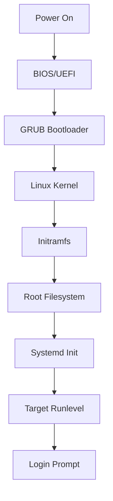

# Debian Boot Management

## Introduction

The boot process is a fundamental aspect of any operating system, including Debian Linux. Understanding how Debian boots is crucial for system administrators, as it enables proper system management, troubleshooting boot issues, and configuring the system to meet specific requirements. This guide will walk you through the Debian boot process, covering everything from the initial power-on to a fully operational system, along with practical management techniques.

## The Debian Boot Sequence

When you power on a Debian system, it goes through several distinct stages before presenting you with a login prompt. Let's explore each stage in detail:

### 1. BIOS/UEFI Stage

The boot process begins when you power on your computer. The hardware initializes, and control is handed to either the BIOS (Basic Input/Output System) or UEFI (Unified Extensible Firmware Interface), depending on your system's firmware.

- **BIOS**: The traditional firmware that initializes hardware and performs the POST (Power-On Self Test).
- **UEFI**: The modern replacement for BIOS, offering more features like Secure Boot and support for larger disks.

### 2. Bootloader Stage (GRUB)

After the BIOS/UEFI initializes the hardware, it looks for a bootloader. In Debian, GRUB (GRand Unified Bootloader) is the default bootloader.

GRUB serves several important functions:
- Presents a boot menu allowing you to select different operating systems or kernel versions
- Loads the selected Linux kernel into memory
- Passes control to the kernel along with required parameters

### 3. Kernel Initialization

Once GRUB loads the kernel, the kernel:
- Initializes hardware devices
- Mounts the root filesystem specified by the `root=` parameter
- Executes the init system (systemd in modern Debian)

### 4. Init System (systemd)

Systemd is the default init system in modern Debian releases. It:
- Starts and manages system services
- Brings the system to the target runlevel
- Presents a login prompt once boot is complete



## Managing the GRUB Bootloader

GRUB is the most critical component for boot management in Debian. Let's look at how to configure and manage it.

### GRUB Configuration Files

The main GRUB configuration files in Debian are:

- `/etc/default/grub`: Contains GRUB settings and parameters
- `/etc/grub.d/`: Directory containing scripts that generate the GRUB configuration
- `/boot/grub/grub.cfg`: The main configuration file (don't edit directly)

### Viewing GRUB Settings

To examine your current GRUB configuration:

```bash
# View the main GRUB settings
cat /etc/default/grub

# View the generated GRUB configuration
cat /boot/grub/grub.cfg
```

Example output of `/etc/default/grub`:

```
GRUB_DEFAULT=0
GRUB_TIMEOUT=5
GRUB_DISTRIBUTOR=`lsb_release -i -s 2> /dev/null || echo Debian`
GRUB_CMDLINE_LINUX_DEFAULT="quiet splash"
GRUB_CMDLINE_LINUX=""
```

### Modifying GRUB Settings

To modify GRUB settings, edit the `/etc/default/grub` file:

```bash
sudo nano /etc/default/grub
```

After making changes, you must update the GRUB configuration:

```bash
sudo update-grub
```

### Common GRUB Settings to Modify

Here are some common GRUB settings you might want to change:

1. **Default Boot Entry**:
   ```
   GRUB_DEFAULT=0
   ```
   - `0` boots the first menu entry
   - Use a number to select a specific entry
   - Use `saved` to boot the last selected entry

2. **Boot Timeout**:
   ```
   GRUB_TIMEOUT=5
   ```
   - Time in seconds GRUB waits before booting the default entry
   - Set to `0` for immediate boot
   - Set to `-1` to wait indefinitely

3. **Kernel Parameters**:
   ```
   GRUB_CMDLINE_LINUX_DEFAULT="quiet splash"
   ```
   - Parameters passed to all Linux kernels at boot
   - `quiet`: Suppresses most boot messages
   - `splash`: Enables the splash screen
   - Other common options: `nomodeset`, `acpi=off`, `single`

### Example: Enabling Boot Logging

To see all boot messages by disabling the quiet boot:

1. Edit the GRUB configuration:
   ```bash
   sudo nano /etc/default/grub
   ```

2. Find and modify the GRUB_CMDLINE_LINUX_DEFAULT line:
   ```
   GRUB_CMDLINE_LINUX_DEFAULT=""
   ```

3. Update GRUB:
   ```bash
   sudo update-grub
   ```

4. Reboot to see the changes:
   ```bash
   sudo reboot
   ```

## Managing Kernel Images

Debian uses the Debian Package Manager (dpkg) to install and manage kernel packages. Here's how to manage kernel images:

### Listing Installed Kernels

To list all installed kernel packages:

```bash
dpkg --list | grep linux-image
```

Example output:

```
ii  linux-image-5.10.0-18-amd64     5.10.140-1      amd64  Linux 5.10 for 64-bit PCs
ii  linux-image-5.10.0-19-amd64     5.10.149-2      amd64  Linux 5.10 for 64-bit PCs
ii  linux-image-amd64               5.10.149-2      amd64  Linux for 64-bit PCs (meta-package)
```

### Installing a New Kernel

To install a new kernel:

```bash
sudo apt update
sudo apt install linux-image-amd64
```

This installs the latest stable kernel available for your architecture.

### Removing an Old Kernel

You might want to remove old kernels to free up disk space:

```bash
sudo apt remove linux-image-5.10.0-18-amd64
```

After removing kernel packages, update GRUB:

```bash
sudo update-grub
```

### Holding Kernel Updates

If you want to prevent a kernel from being upgraded:

```bash
sudo apt-mark hold linux-image-5.10.0-19-amd64
```

To release the hold:

```bash
sudo apt-mark unhold linux-image-5.10.0-19-amd64
```

## Troubleshooting Boot Issues

Boot problems can be challenging. Here are common issues and their solutions:

### 1. GRUB Rescue Mode

If you see a `grub rescue>` prompt, GRUB can't find its configuration. To boot:

```
grub rescue> set prefix=(hd0,1)/boot/grub
grub rescue> set root=(hd0,1)
grub rescue> insmod normal
grub rescue> normal
```

Adjust the disk/partition numbers as needed for your system.

### 2. Reinstalling GRUB

If GRUB is corrupted or missing, you can reinstall it:

1. Boot from a Debian live USB
2. Mount your root partition:
   ```bash
   sudo mount /dev/sda1 /mnt
   ```
3. Mount necessary virtual filesystems:
   ```bash
   sudo mount --bind /dev /mnt/dev
   sudo mount --bind /proc /mnt/proc
   sudo mount --bind /sys /mnt/sys
   ```
4. Chroot into your system:
   ```bash
   sudo chroot /mnt
   ```
5. Reinstall GRUB:
   ```bash
   grub-install /dev/sda
   update-grub
   ```
6. Exit and reboot:
   ```bash
   exit
   sudo reboot
   ```

### 3. Emergency Mode and Recovery

If your system boots to emergency mode, you can try:

1. Restart in recovery mode from the GRUB menu
2. Select "root" to get a root shell
3. Check and repair filesystems:
   ```bash
   fsck -f /dev/sda1
   ```
4. Remount the filesystem in read-write mode:
   ```bash
   mount -o remount,rw /
   ```

## Managing Systemd Boot Targets

Systemd uses "targets" instead of the traditional runlevels. Here's how to manage them:

### Viewing the Current Target

```bash
systemctl get-default
```

Example output:
```
graphical.target
```

### Changing the Default Target

To set the system to always boot to a text console:

```bash
sudo systemctl set-default multi-user.target
```

To set the system to boot to a graphical interface:

```bash
sudo systemctl set-default graphical.target
```

### Booting to a Different Target

To temporarily boot to a different target:

```bash
# Boot to text mode
sudo systemctl isolate multi-user.target

# Boot to graphical mode
sudo systemctl isolate graphical.target
```

### Main Systemd Targets

- `poweroff.target`: Shutdown the system
- `rescue.target`: Single-user mode
- `multi-user.target`: Multi-user text mode
- `graphical.target`: Graphical mode with display manager
- `reboot.target`: Reboot the system

## Practical Examples

### Example 1: Customizing Boot Options for Server Performance

For a Debian server, you might want to optimize boot parameters:

1. Edit GRUB configuration:
   ```bash
   sudo nano /etc/default/grub
   ```

2. Modify parameters for server performance:
   ```
   GRUB_CMDLINE_LINUX_DEFAULT="quiet biosdevname=0 net.ifnames=0 intel_iommu=on"
   ```
   - `biosdevname=0` and `net.ifnames=0` revert to traditional network interface names
   - `intel_iommu=on` enables I/O Memory Management Unit for better device isolation

3. Update GRUB:
   ```bash
   sudo update-grub
   ```

### Example 2: Creating a Dual-Boot Configuration

If you're dual-booting Debian with another OS:

1. Ensure OS-prober is installed:
   ```bash
   sudo apt install os-prober
   ```

2. Edit GRUB configuration:
   ```bash
   sudo nano /etc/default/grub
   ```

3. Enable OS-prober:
   ```
   GRUB_DISABLE_OS_PROBER=false
   ```

4. Update GRUB to detect other operating systems:
   ```bash
   sudo update-grub
   ```

### Example 3: Setting Up a Custom Splash Screen

To customize your boot experience:

1. Place your image in the correct location:
   ```bash
   sudo cp my-splash.png /boot/grub/
   ```

2. Edit GRUB configuration:
   ```bash
   sudo nano /etc/default/grub
   ```

3. Configure the splash image:
   ```
   GRUB_BACKGROUND="/boot/grub/my-splash.png"
   ```

4. Update GRUB:
   ```bash
   sudo update-grub
   ```

## Summary

Boot management in Debian involves understanding and configuring multiple components, primarily GRUB and systemd. By mastering these tools, you can:

- Troubleshoot boot problems effectively
- Customize the boot process for specific needs
- Maintain multiple kernel versions
- Configure system boot behavior
- Optimize boot parameters for performance

The skills covered in this guide are essential for any Debian system administrator, allowing you to ensure your systems start reliably and efficiently.

## Additional Resources

- [Debian Administration Handbook](https://debian-handbook.info/)
- [GRUB Manual](https://www.gnu.org/software/grub/manual/grub/grub.html)
- [Systemd Documentation](https://www.freedesktop.org/wiki/Software/systemd/)

## Exercises

1. Install a new kernel on your Debian system and verify it appears in the GRUB menu.
2. Configure your Debian system to boot directly to a text console instead of the graphical interface.
3. Create a backup of your GRUB configuration and practice restoring it.
4. Create a custom GRUB entry that boots the system with different kernel parameters.
5. Use `systemctl` to investigate which services are started during boot and their dependencies.