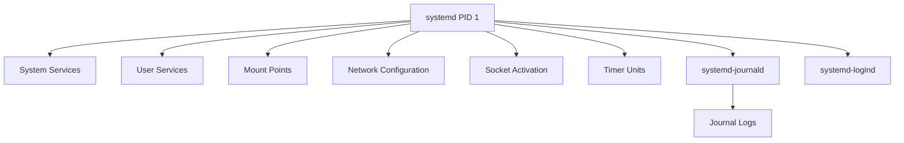

# Understanding SystemD in Debian Linux

## Introduction

SystemD is the modern init system and service manager for many Linux distributions, including Debian (since Debian 8 "Jessie"). It represents a significant shift from the traditional SysVinit system that Linux administrators might be familiar with. SystemD is designed to be a comprehensive system and service manager that not only starts your system during boot but also manages services, mounts, devices, and more throughout the system's uptime.

In this tutorial, we'll dive into SystemD on Debian systems, understanding its core concepts, learning how to manage services, and exploring practical administration tasks that will help you maintain and troubleshoot Debian servers effectively.

## What is SystemD?

SystemD (written as "systemd" in technical contexts) is a suite of system management daemons, utilities, and libraries that serves as a replacement for the System V init daemon. Its name comes from the Unix convention of appending "d" to daemon names.

Key characteristics of SystemD include:

- **Parallel startup**: Services can be started in parallel, leading to faster boot times
- **On-demand service activation**: Services can be started when needed
- **Dependency tracking**: SystemD understands service relationships
- **Consistent interface**: Common command structures for managing different unit types
- **Journal logging**: Built-in logging mechanism
- **Socket activation**: Services can be activated when needed
- **Timer-based activation**: Schedule services similar to cron jobs

Let's examine the architecture of SystemD:



## Core SystemD Concepts

### Units

The fundamental building blocks in SystemD are called "units." Units are resources that SystemD manages, and they are defined by unit files. Different types of units represent different kinds of resources:

| Unit Type | Extension | Purpose |
|-----------|-----------|---------|
| Service | .service | System services |
| Socket | .socket | IPC socket activation |
| Device | .device | Hardware devices |
| Mount | .mount | Filesystem mount points |
| Automount | .automount | Automatic mount points |
| Target | .target | Group of units (replaces runlevels) |
| Timer | .timer | Scheduled tasks (like cron) |
| Slice | .slice | Resource control group hierarchy |
| Scope | .scope | External processes (usually created programmatically) |
| Path | .path | Filesystem path monitoring |

### Unit Files

Unit files are plain text files that define how SystemD treats a specific unit. They can be found in several locations, in order of precedence:

1. `/etc/systemd/system/` - Local system configuration
2. `/run/systemd/system/` - Runtime system configuration
3. `/lib/systemd/system/` - Distribution unit files

Let's look at a simple service unit file:

```ini
[Unit]
Description=My Sample Service
After=network.target

[Service]
Type=simple
ExecStart=/usr/local/bin/my-service
Restart=on-failure
RestartSec=5s

[Install]
WantedBy=multi-user.target
```

This unit file is divided into three sections:

- **[Unit]**: Contains general information and dependencies
- **[Service]**: Service-specific configuration (only for service units)
- **[Install]**: Information used when enabling/disabling the unit

### Targets

Targets in SystemD are similar to runlevels in SysVinit, but more flexible. They group units together and can be used to bring the system to a specific state.

Common targets include:

- **`graphical.target`**: Graphical multi-user system with networking (equivalent to runlevel 5)
- **`multi-user.target`**: Multi-user system with networking (equivalent to runlevel 3)
- **`rescue.target`**: Basic system plus rescue shell (equivalent to runlevel 1)
- **`emergency.target`**: Minimal boot for emergency recovery

## Managing Services with SystemD

### Basic Service Management

The `systemctl` command is your primary tool for interacting with SystemD. Here are some fundamental operations:

#### Starting and Stopping Services

```bash
# Start a service
sudo systemctl start apache2.service

# Stop a service
sudo systemctl stop apache2.service

# Restart a service
sudo systemctl restart apache2.service

# Reload configuration without restarting
sudo systemctl reload apache2.service
```

The output of a successful start command will show no text, indicating success:

```
# No output means success
```

#### Checking Service Status

```bash
sudo systemctl status apache2.service
```

Sample output:

```
● apache2.service - The Apache HTTP Server
     Loaded: loaded (/lib/systemd/system/apache2.service; enabled; vendor preset: enabled)
     Active: active (running) since Mon 2023-05-15 14:30:45 UTC; 2h 15min ago
       Docs: https://httpd.apache.org/docs/2.4/
    Process: 1135 ExecStart=/usr/sbin/apachectl start (code=exited, status=0/SUCCESS)
   Main PID: 1157 (apache2)
      Tasks: 6 (limit: 4680)
     Memory: 11.5M
        CPU: 558ms
     CGroup: /system.slice/apache2.service
             ├─1157 /usr/sbin/apache2 -k start
             ├─1158 /usr/sbin/apache2 -k start
             ├─1159 /usr/sbin/apache2 -k start
             ├─1160 /usr/sbin/apache2 -k start
             ├─1161 /usr/sbin/apache2 -k start
             └─1162 /usr/sbin/apache2 -k start
```

#### Enabling and Disabling Services

To make a service start automatically at boot:

```bash
# Enable a service
sudo systemctl enable apache2.service

# Disable a service
sudo systemctl disable apache2.service
```

Sample output when enabling:

```
Synchronizing state of apache2.service with SysV service script with /lib/systemd/systemd-sysv-install.
Executing: /lib/systemd/systemd-sysv-install enable apache2
Created symlink /etc/systemd/system/multi-user.target.wants/apache2.service → /lib/systemd/system/apache2.service.
```

### Viewing Unit Information

To see detailed information about a unit, including its dependencies:

```bash
sudo systemctl show apache2.service
```

To see a specific property:

```bash
sudo systemctl show -p Requires apache2.service
```

### Managing System State

Change system state using targets:

```bash
# Reboot the system
sudo systemctl reboot

# Shut down the system
sudo systemctl poweroff

# Switch to rescue mode
sudo systemctl isolate rescue.target
```

## Creating Custom SystemD Services

One of the most powerful features of SystemD is the ability to create custom service files for your applications. Let's create a simple service for a hypothetical Node.js application:

1. Create the service file:

```bash
sudo nano /etc/systemd/system/myapp.service
```

2. Add the following content:

```ini
[Unit]
Description=My Node.js Application
After=network.target

[Service]
Type=simple
User=nodejs
WorkingDirectory=/opt/myapp
ExecStart=/usr/bin/node /opt/myapp/server.js
Restart=on-failure
RestartSec=10
StandardOutput=syslog
StandardError=syslog
SyslogIdentifier=myapp
Environment=NODE_ENV=production

[Install]
WantedBy=multi-user.target
```

3. Reload the SystemD configuration to recognize the new service:

```bash
sudo systemctl daemon-reload
```

4. Start and enable the service:

```bash
sudo systemctl start myapp.service
sudo systemctl enable myapp.service
```

This creates a service that will start your Node.js application after the network is up, run it as the `nodejs` user, and automatically restart it if it crashes.

## Practical SystemD Administration Examples

### Example 1: Analyzing Boot Time

SystemD provides tools to analyze how long your system takes to boot:

```bash
systemd-analyze
```

Sample output:

```
Startup finished in 4.036s (kernel) + 15.251s (userspace) = 19.287s 
graphical.target reached after 15.230s in userspace
```

For more detailed information:

```bash
systemd-analyze blame
```

Sample output:

```
8.756s NetworkManager-wait-online.service
4.228s plymouth-quit-wait.service
2.057s dev-sda1.device
1.571s snapd.service
1.235s networkd-dispatcher.service
1.207s accounts-daemon.service
1.187s ModemManager.service
 918ms dev-loop3.device
 906ms dev-loop4.device
 869ms udisks2.service
 866ms dev-loop5.device
 839ms dev-loop2.device
 817ms dev-loop1.device
 799ms dev-loop0.device
 761ms polkit.service
 751ms systemd-logind.service
```

### Example 2: Viewing System Logs with journalctl

SystemD includes its own logging system called the journal. You can access logs with `journalctl`:

```bash
# View all logs
sudo journalctl

# View logs for a specific service
sudo journalctl -u apache2.service

# View logs since the last boot
sudo journalctl -b

# View logs in real-time (like tail -f)
sudo journalctl -f

# View logs from a specific time
sudo journalctl --since "2023-05-15 10:00:00" --until "2023-05-15 11:00:00"
```

Example output for Apache logs:

```
May 15 14:30:45 debian-server systemd[1]: Starting The Apache HTTP Server...
May 15 14:30:45 debian-server apachectl[1135]: AH00558: apache2: Could not reliably determine the server's fully qualified domain name, using 127.0.1.1. Set the 'ServerName' directive globally to suppress this message
May 15 14:30:45 debian-server systemd[1]: Started The Apache HTTP Server.
May 15 16:15:23 debian-server systemd[1]: Restarting The Apache HTTP Server...
May 15 16:15:23 debian-server systemd[1]: apache2.service: Succeeded.
May 15 16:15:23 debian-server apachectl[5678]: AH00558: apache2: Could not reliably determine the server's fully qualified domain name, using 127.0.1.1. Set the 'ServerName' directive globally to suppress this message
May 15 16:15:23 debian-server systemd[1]: Started The Apache HTTP Server.
```

### Example 3: Creating a Timer Unit (SystemD alternative to cron)

SystemD timers can replace traditional cron jobs with more flexibility:

1. Create a service unit that will be executed:

```bash
sudo nano /etc/systemd/system/backup.service
```

```ini
[Unit]
Description=Daily Backup Service
After=network.target

[Service]
Type=oneshot
ExecStart=/usr/local/bin/backup-script.sh
User=backup
```

2. Create a timer unit:

```bash
sudo nano /etc/systemd/system/backup.timer
```

```ini
[Unit]
Description=Run backup daily at 3am

[Timer]
OnCalendar=*-*-* 03:00:00
Persistent=true
Unit=backup.service

[Install]
WantedBy=timers.target
```

3. Enable and start the timer:

```bash
sudo systemctl daemon-reload
sudo systemctl enable backup.timer
sudo systemctl start backup.timer
```

4. Verify the timer is set:

```bash
sudo systemctl list-timers
```

Sample output:

```
NEXT                         LEFT         LAST                         PASSED       UNIT                         ACTIVATES
Thu 2023-05-16 03:00:00 UTC  10h left     Wed 2023-05-15 03:00:00 UTC  13h ago      backup.timer                 backup.service
Thu 2023-05-16 05:38:00 UTC  13h left     Wed 2023-05-15 05:38:19 UTC  11h ago      apt-daily.timer              apt-daily.service
Thu 2023-05-16 06:52:37 UTC  14h left     Wed 2023-05-15 06:45:48 UTC  10h ago      systemd-tmpfiles-clean.timer systemd-tmpfiles-clean.service
```

## Troubleshooting SystemD Issues

### Failed Services

If a service fails to start, check its status for error messages:

```bash
sudo systemctl status failed-service.service
```

You can also examine the journal logs for that service:

```bash
sudo journalctl -u failed-service.service -n 50
```

### Masking Problematic Services

If a service is causing issues and you want to completely prevent it from starting:

```bash
sudo systemctl mask problematic-service.service
```

This creates a symlink to `/dev/null`, ensuring the service cannot be started.

To unmask:

```bash
sudo systemctl unmask problematic-service.service
```

### Dependency Problems

If services have dependency issues, view the dependency tree:

```bash
sudo systemctl list-dependencies service-name.service
```

## SystemD vs SysVinit: Key Differences

For those transitioning from SysVinit to SystemD, here's a comparison:

| Task | SysVinit Command | SystemD Command |
|------|-----------------|-----------------|
| Start a service | `service apache2 start` | `systemctl start apache2.service` |
| Stop a service | `service apache2 stop` | `systemctl stop apache2.service` |
| Restart a service | `service apache2 restart` | `systemctl restart apache2.service` |
| Enable at boot | `update-rc.d apache2 defaults` | `systemctl enable apache2.service` |
| Disable at boot | `update-rc.d -f apache2 remove` | `systemctl disable apache2.service` |
| Check status | `service apache2 status` | `systemctl status apache2.service` |
| View all services | `service --status-all` | `systemctl list-units --type=service` |
| View runlevel | `runlevel` | `systemctl get-default` |
| Change runlevel | `init 3` | `systemctl isolate multi-user.target` |
| System logs | `less /var/log/syslog` | `journalctl` |

## Summary

SystemD represents a significant evolution in how Linux systems are managed. While it introduces new concepts and commands, it offers many advantages:

- Faster, parallel boot process
- Consistent service management
- Integrated logging
- Advanced service dependency handling
- Timer-based activation
- On-demand service activation

With the knowledge you've gained from this tutorial, you should be able to effectively manage services on Debian systems, create custom service units, and troubleshoot issues when they arise.

## Additional Resources and Exercises

### Resources

- [SystemD Official Documentation](https://systemd.io/)
- [Debian Wiki SystemD Page](https://wiki.debian.org/systemd)
- [The systemd for Administrators Blog Series](http://0pointer.de/blog/projects/systemd-for-admins-1.html)

### Exercises

1. **Basic Service Management**:
   - Install the Nginx web server and use SystemD commands to start, stop, and check its status
   - Enable Nginx to start at boot time
   - View the Nginx service logs using journalctl

2. **Create a Custom Service**:
   - Write a simple Bash script that outputs the date to a file
   - Create a SystemD service unit that runs this script
   - Create a timer unit to run this service every 5 minutes
   - Verify the service is running as expected

3. **Service Troubleshooting**:
   - Deliberately modify a service file to introduce an error
   - Use SystemD tools to identify and fix the issue
   - Practice with journalctl to filter logs for specific time periods and services

4. **SystemD Socket Activation**:
   - Research and implement a simple socket-activated service
   - Test that the service starts only when the socket is accessed

By working through these exercises, you'll gain practical experience with SystemD that will help solidify your understanding of Debian system administration.