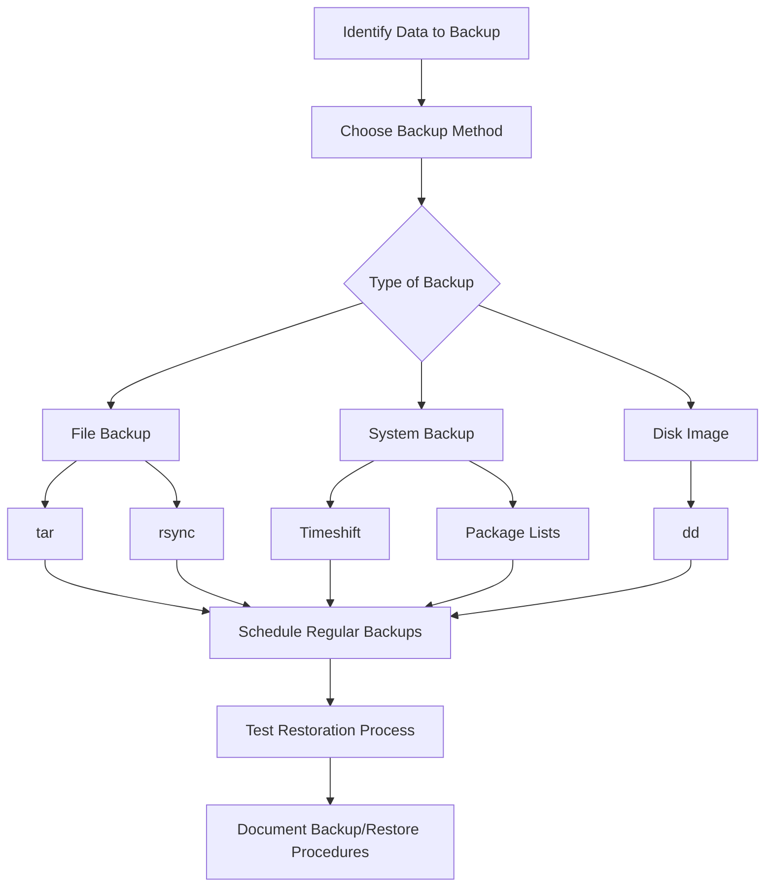

# Debian System Backup

## Introduction

System backups are a critical aspect of Debian system administration. No matter how stable your system is, unexpected events like hardware failures, accidental deletions, or security breaches can occur. Having a reliable backup strategy ensures you can recover your system with minimal downtime and data loss.

This guide covers various backup solutions for Debian systems, from simple file-based backups to complete system images, suitable for both personal and server environments.

## Backup Fundamentals

Before diving into specific tools and commands, let's understand some key backup concepts:

- **Full backup**: A complete copy of all selected data
- **Incremental backup**: Only backs up changes since the last backup (any level)
- **Differential backup**: Only backs up changes since the last full backup
- **Local backup**: Stored on attached media (external drive, second internal drive)
- **Remote backup**: Stored on a separate system over a network
- **System backup**: Focuses on system files, configurations, and installed packages
- **Data backup**: Focuses on user data, databases, and application data

## Backup Planning

A good backup strategy addresses these questions:

1. What data needs backing up?
2. How frequently should backups run?
3. Where will backups be stored?
4. How long should backups be retained?
5. How will you verify backup integrity?
6. How will you restore from backup?

## Basic File Backup with tar

The `tar` command is a simple yet powerful tool for creating backups on Debian systems.

### Creating a Simple Backup Archive

```bash
# Create a backup of your home directory
tar -czvf home_backup_$(date +%Y%m%d).tar.gz /home/username/

# Output example:
# /home/username/Documents/
# /home/username/Documents/notes.txt
# /home/username/Pictures/
# /home/username/Pictures/vacation.jpg
# ...
```

This command creates a compressed archive named with the current date (e.g., `home_backup_20250313.tar.gz`).

### Breaking Down the Command

- `c`: Create a new archive
- `z`: Compress the archive with gzip
- `v`: Verbose mode (show files being processed)
- `f`: Specify the filename for the archive

### Excluding Files from Backup

You can exclude certain files or directories:

```bash
tar -czvf home_backup_$(date +%Y%m%d).tar.gz \
    --exclude="*/Downloads" \
    --exclude="*/Trash" \
    --exclude="*.iso" \
    /home/username/
```

### Restoring from a tar Backup

To restore files from your backup:

```bash
# Restore to original location (be careful!)
sudo tar -xzvf home_backup_20250313.tar.gz -C /

# Or restore to a different location to review first
mkdir ~/restore
tar -xzvf home_backup_20250313.tar.gz -C ~/restore
```

## Incremental Backups with tar

You can also create incremental backups with `tar`:

```bash
# Create a full backup and snapshot file
tar -czvf full_backup_$(date +%Y%m%d).tar.gz \
    --listed-incremental=snapshot.file \
    /home/username/

# Later, create an incremental backup
tar -czvf incremental_backup_$(date +%Y%m%d).tar.gz \
    --listed-incremental=snapshot.file \
    /home/username/
```

The `snapshot.file` tracks file changes between backups.

## Using rsync for Backups

`rsync` is excellent for efficiently backing up files to another location, either locally or remotely.

### Basic Local Backup with rsync

```bash
# Sync home directory to an external drive
rsync -avh --delete /home/username/ /media/external_drive/backups/home/

# Output example:
# sending incremental file list
# ./
# .bashrc
# Documents/
# Documents/new_file.txt
# ...
```

### Breaking Down the Command

- `a`: Archive mode (preserves permissions, ownership, timestamps, etc.)
- `v`: Verbose output
- `h`: Human-readable format
- `--delete`: Removes files in the destination that no longer exist in the source

### Remote Backup with rsync

```bash
# Backup to a remote server
rsync -avz -e ssh /home/username/ remote_user@remote_server:/backup/username/

# Output example:
# sending incremental file list
# ./
# .bashrc
# Documents/
# ...
```

### Setting Up Automated rsync Backups

Create a backup script:

```bash
#!/bin/bash

# Define variables
BACKUP_SOURCE="/home/username/"
BACKUP_DEST="/media/backup_drive/backups"
DATETIME=$(date +%Y%m%d_%H%M%S)
BACKUP_LOG="/var/log/backup_$DATETIME.log"

# Ensure destination exists
mkdir -p "$BACKUP_DEST"

# Run backup
rsync -avh --delete "$BACKUP_SOURCE" "$BACKUP_DEST" > "$BACKUP_LOG" 2>&1

# Report completion
echo "Backup completed at $(date)" >> "$BACKUP_LOG"
```

Make the script executable:

```bash
chmod +x backup_script.sh
```

Schedule it with crontab:

```bash
# Open crontab editor
crontab -e

# Add line to run daily at 2am
0 2 * * * /path/to/backup_script.sh
```

## System Backup with Timeshift

Timeshift is a system restore utility that creates incremental filesystem snapshots of your system.

### Installing Timeshift

```bash
sudo apt update
sudo apt install timeshift
```

### Configuring Timeshift

You can configure Timeshift through its GUI or via command line:

```bash
# Launch Timeshift GUI
sudo timeshift-gtk

# Or configure via command line
sudo timeshift --create --comments "Pre-update backup" --tags D
```

The Timeshift GUI allows you to:
- Select backup location
- Choose snapshot type (RSYNC or BTRFS)
- Schedule automatic snapshots
- Select which files to include/exclude

### Restoring with Timeshift

To restore a system from Timeshift:

```bash
# List available snapshots
sudo timeshift --list

# Restore a specific snapshot
sudo timeshift --restore --snapshot '2025-03-13_00-00-01' --target /
```

## Backing Up Installed Packages

You can backup your installed package list and restore it later:

```bash
# Create a list of manually installed packages
dpkg --get-selections > installed_packages.txt

# On the new system, restore packages
sudo dpkg --clear-selections
sudo dpkg --set-selections < installed_packages.txt
sudo apt-get dselect-upgrade
```

For a more comprehensive approach:

```bash
# Create a backup of package information
sudo apt-clone clone /path/to/backup/apt-clone-state.tar.gz

# On the new system
sudo apt-clone restore /path/to/backup/apt-clone-state.tar.gz
```

## Backing Up System Configuration

Important system configuration files are stored in `/etc`:

```bash
# Backup entire /etc directory
sudo tar -czvf etc_backup_$(date +%Y%m%d).tar.gz /etc/
```

## Disk Imaging with dd

For complete system backups, you can create disk images with `dd`:

```bash
# Create an image of the entire disk
sudo dd if=/dev/sda of=/path/to/backup/disk_image.img bs=4M status=progress

# Create an image of a partition
sudo dd if=/dev/sda1 of=/path/to/backup/partition_image.img bs=4M status=progress
```

:::warning
Be extremely careful with `dd` commands as they can overwrite data if used incorrectly!
:::

## Database Backups

If you're running databases like MySQL/MariaDB:

```bash
# Backup all MySQL databases
mysqldump -u root -p --all-databases > all_databases.sql

# Backup a specific database
mysqldump -u root -p database_name > database_name.sql

# Restore a database
mysql -u root -p database_name < database_name.sql
```

For PostgreSQL:

```bash
# Backup a PostgreSQL database
pg_dump -U username database_name > database_name.sql

# Backup all PostgreSQL databases
pg_dumpall -U username > all_postgres_dbs.sql

# Restore a PostgreSQL database
psql -U username database_name < database_name.sql
```

## Backup Workflow Visualization

Here's a visualization of a typical backup workflow:



## Best Practices for Debian System Backups

1. **Follow the 3-2-1 rule**: 
   - Keep at least 3 copies of your data
   - Store backups on at least 2 different storage types
   - Keep at least 1 backup offsite

2. **Automate backups**: Set up cron jobs or systemd timers to run backups automatically.

3. **Test your backups**: Regularly verify that you can restore from your backups.

4. **Monitor backup jobs**: Set up notifications for backup success/failure.

5. **Encrypt sensitive backups**: Use tools like GPG for encryption:
   ```bash
   # Encrypt a backup file
   gpg -c backup_file.tar.gz
   
   # Decrypt
   gpg backup_file.tar.gz.gpg
   ```

6. **Document your backup strategy**: Keep detailed notes on your backup and restoration procedures.

## Summary

Developing a comprehensive backup strategy is essential for any Debian system administrator. This guide covered:

- Basic file backups with `tar` and `rsync`
- System snapshots with Timeshift
- Package and configuration backups
- Complete disk imaging with `dd`
- Database backups
- Best practices for backup management

Remember that having backups is useless if you can't restore from them, so always test your backup and restoration processes periodically.

## Additional Resources

- [Debian Wiki: Backups](https://wiki.debian.org/BackupAndRecovery)
- [rsync manual](https://download.samba.org/pub/rsync/rsync.html)
- [Timeshift documentation](https://github.com/teejee2008/timeshift)

## Exercises

1. Create a backup script that performs daily incremental backups and weekly full backups of your home directory.
2. Set up an automated remote backup system using rsync and SSH keys.
3. Create a Timeshift snapshot, then intentionally break something in your system (change a configuration file), and practice restoring from the snapshot.
4. Write a comprehensive backup policy for a small organization running Debian servers, considering different retention periods for different types of data.