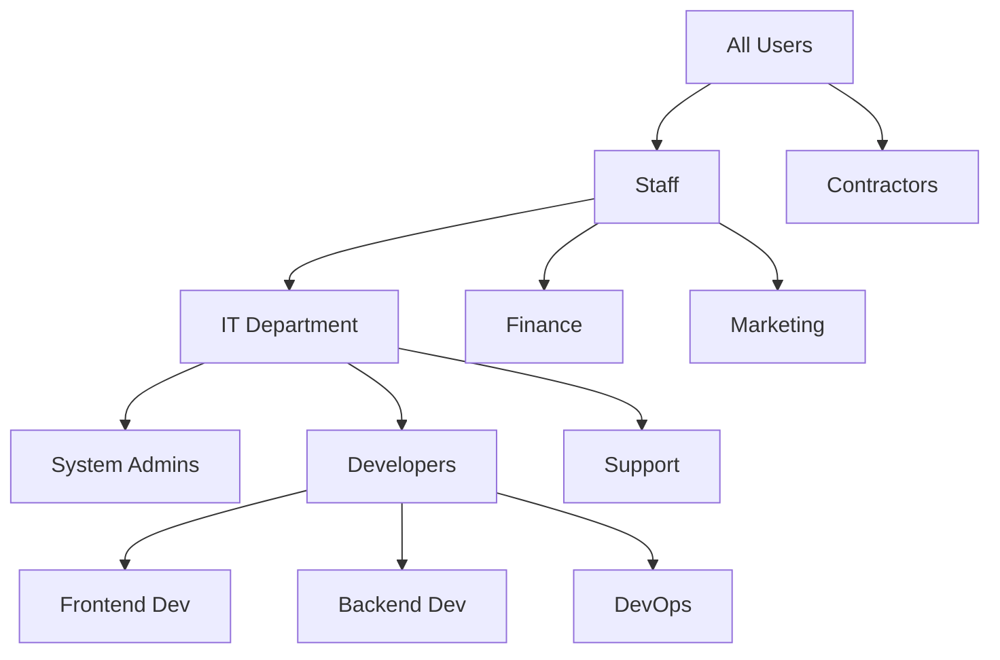

# Debian Group Management

## Introduction

In Debian Linux systems, group management is a fundamental aspect of system administration that plays a critical role in controlling access to resources. Groups allow administrators to organize users and assign permissions collectively rather than individually, making access control more efficient and manageable.

This guide explores the concepts, commands, and best practices for managing groups on Debian systems. Whether you're setting up a new server or maintaining an existing system, understanding group management will help you implement proper security policies and streamline administration tasks.

## What Are Groups in Debian?

In Debian (and other Linux distributions), a group is a collection of users who can share access permissions to files, directories, and other system resources. Groups provide a convenient way to manage permissions for multiple users at once.

Each user in Debian belongs to at least one group (their primary group) and can be a member of additional groups (secondary or supplementary groups). When a user creates a file, that file is automatically assigned to the user's primary group.

### Key Group Concepts

- **Primary Group**: The default group assigned to a user, typically with the same name as the username
- **Secondary Groups**: Additional groups a user belongs to for accessing specific resources
- **Group ID (GID)**: Numeric identifier for a group, similar to a user ID
- **Group Ownership**: Files and directories can be owned by both a user and a group

## Group-Related Files in Debian

Debian stores group information in specific system files:

- `/etc/group`: Contains basic group information
- `/etc/gshadow`: Contains secure group information, including group passwords
- `/etc/passwd`: Contains user information, including primary group IDs
- `/etc/login.defs`: Contains default settings for user and group creation

Let's examine the structure of the `/etc/group` file:

```bash
cat /etc/group
```

Output:
```
root:x:0:
daemon:x:1:
bin:x:2:
sys:x:3:
adm:x:4:syslog,username
sudo:x:27:username
```

Each line represents a group and has four fields separated by colons:
1. Group name
2. Group password (usually 'x', indicating password is stored in `/etc/gshadow`)
3. Group ID (GID)
4. Group members (comma-separated list of users)

## Basic Group Management Commands

### Viewing Group Information

To list all groups on the system:

```bash
getent group
```

To view groups a specific user belongs to:

```bash
groups username
```

Example output:
```
username : username sudo adm cdrom dip plugdev lpadmin sambashare
```

To view detailed information about a specific group:

```bash
getent group sudo
```

Output:
```
sudo:x:27:username
```

### Creating Groups

Create a new group using the `groupadd` command:

```bash
sudo groupadd developers
```

Create a group with a specific GID:

```bash
sudo groupadd -g 1500 developers
```

Create a system group (GID < 1000):

```bash
sudo groupadd -r appusers
```

### Modifying Groups

Change a group's name:

```bash
sudo groupmod -n new_name old_name
```

Change a group's GID:

```bash
sudo groupmod -g 1600 developers
```

### Deleting Groups

Remove a group from the system:

```bash
sudo groupdel developers
```

Note: You cannot delete a group if it is the primary group of any user.

## Managing Group Membership

### Adding Users to Groups

Add a user to an existing group:

```bash
sudo usermod -a -G groupname username
```

For example, to add user "john" to the "developers" group:

```bash
sudo usermod -a -G developers john
```

The `-a` option is important as it appends the group to the user's existing groups. Without it, the user would be removed from all other secondary groups.

### Changing a User's Primary Group

Set a different primary group for a user:

```bash
sudo usermod -g groupname username
```

For example:

```bash
sudo usermod -g developers john
```

### Removing Users from Groups

Remove a user from a group:

```bash
sudo gpasswd -d username groupname
```

Example:

```bash
sudo gpasswd -d john developers
```

### Creating a New User with Specific Groups

When creating a new user, you can specify both primary and secondary groups:

```bash
sudo useradd -g primarygroup -G group1,group2 username
```

Example:

```bash
sudo useradd -g developers -G sudo,docker newuser
```

## Group Permissions and File Access

Group permissions are a key part of Linux's permission system. Every file and directory in Debian has three sets of permissions: for the owner, for the group, and for others.

### Viewing File Permissions

Use the `ls -l` command to view permissions:

```bash
ls -l /path/to/file
```

Example output:
```
-rw-rw-r-- 1 john developers 1234 Jan 1 12:34 project.txt
```

In this example:
- The file is owned by user "john" and group "developers"
- The owner has read and write permissions (rw-)
- The group members have read and write permissions (rw-)
- Others have only read permission (r--)

### Changing Group Ownership

Change the group of a file or directory:

```bash
sudo chgrp groupname filename
```

Example:

```bash
sudo chgrp developers project.txt
```

Change group ownership recursively for a directory:

```bash
sudo chgrp -R groupname directory
```

### Setting Group Permissions

To modify group permissions, use the `chmod` command:

```bash
# Give group read and write permissions
chmod g+rw filename

# Remove group write permission
chmod g-w filename

# Set specific permissions (owner=rwx, group=rx, others=r)
chmod 754 filename
```

### Understanding the SGID Bit

The Set Group ID (SGID) bit is a special permission that affects directories and files:

- For directories: Files created within the directory inherit the directory's group
- For files: When executed, the process runs with the permissions of the file's group

Set the SGID bit on a directory:

```bash
sudo chmod g+s directory
```

Example use case: Create a shared directory for a development team

```bash
# Create a directory for shared projects
sudo mkdir /srv/projects

# Change group ownership
sudo chgrp developers /srv/projects

# Set permissions and SGID bit
sudo chmod 2775 /srv/projects
```

This creates a directory where:
- Owner has full permissions (rwx)
- Group has full permissions (rwx)
- Others can read and execute (r-x)
- SGID bit is set (2), so new files inherit the "developers" group

## Practical Examples

### Example 1: Setting Up a Shared Web Development Environment

Create a group for web developers and configure directory permissions:

```bash
# Create the group
sudo groupadd webdev

# Add users to the group
sudo usermod -a -G webdev user1
sudo usermod -a -G webdev user2

# Create a shared directory
sudo mkdir -p /var/www/projects

# Set ownership and permissions
sudo chown www-data:webdev /var/www/projects
sudo chmod 2775 /var/www/projects
```

Now all members of the "webdev" group can create and modify files in the projects directory, and the web server (running as www-data) can read and serve the files.

### Example 2: Managing Database Access

Create a group for database users:

```bash
# Create the group
sudo groupadd dbusers

# Add users to the group
sudo usermod -a -G dbusers user1
sudo usermod -a -G dbusers user2

# Configure PostgreSQL access
sudo bash -c 'echo "local   mydb    +dbusers     md5" >> /etc/postgresql/13/main/pg_hba.conf'
sudo systemctl restart postgresql
```

This example creates a group for database users and configures PostgreSQL to allow members of that group to access a specific database.

### Example 3: Setting Up a Collaborative Document Directory

Create a shared directory for document collaboration:

```bash
# Create the group
sudo groupadd docwriters

# Add users to the group
sudo usermod -a -G docwriters user1
sudo usermod -a -G docwriters user2

# Create directory
sudo mkdir -p /home/shared/documents

# Set ownership and permissions
sudo chown root:docwriters /home/shared/documents
sudo chmod 2770 /home/shared/documents
```

This setup:
- Allows all members of the "docwriters" group to create, edit, and delete files
- Prevents users outside the group from accessing the directory
- Makes new files automatically belong to the "docwriters" group (due to SGID bit)

## Group Management Best Practices

1. **Use descriptive group names**: Choose names that clearly indicate the group's purpose.
2. **Implement the principle of least privilege**: Only grant the minimum permissions necessary.
3. **Regularly audit group memberships**: Periodically review who belongs to which groups.
4. **Document group purposes**: Maintain documentation about what each group is for.
5. **Use system groups for system processes**: Use GIDs below 1000 for system services.
6. **Standardize group usage**: Develop consistent patterns for group management.

## Common Issues and Troubleshooting

### User Can't Access Files Despite Group Membership

If a user has been added to a group but still can't access files, try:

1. Have the user log out and log back in (group changes only take effect in new sessions)
2. Verify the file permissions with `ls -l`
3. Check group membership with the `groups` command
4. Verify the user is actually in the group in `/etc/group`

```bash
# Temporary solution: update group membership for current session
newgrp groupname
```

### Unable to Delete a Group

If you receive an error when trying to delete a group:

1. Check if any users have the group as their primary group:

```bash
grep -w groupname /etc/passwd
```

2. Check if any files are owned by the group:

```bash
find / -group groupname -ls 2>/dev/null
```

### Permission Denied When Running Commands

If a user gets "Permission denied" when trying to run commands:

1. Verify the user is in the necessary groups (e.g., sudo)
2. Check if the command requires specific group membership
3. Examine file permissions with `ls -l`

## Advanced Group Management Techniques

### Group Password Management

You can set a password for a group, allowing users to temporarily join the group:

```bash
sudo gpasswd groupname
```

Allow a user to join a group using the password:

```bash
newgrp groupname
```

### Group Administrators

You can designate certain users as group administrators who can add or remove members:

```bash
sudo gpasswd -A username groupname
```

Group administrators can then add members:

```bash
gpasswd -a newuser groupname
```

### Using ACLs for More Granular Permissions

For more complex permission scenarios, use Access Control Lists (ACLs):

```bash
# Install ACL support
sudo apt install acl

# Set a group ACL
sudo setfacl -m g:groupname:rwx /path/to/directory

# View ACLs
getfacl /path/to/directory
```

## Group Management on Multi-User Systems

On systems with many users, consider implementing these strategies:

1. **Role-based groups**: Create groups based on roles rather than projects
2. **Hierarchical groups**: Implement a hierarchy of groups for nested permissions
3. **Regular auditing**: Schedule regular reviews of group memberships
4. **Group naming conventions**: Develop standardized naming patterns

The following diagram illustrates a typical group hierarchy in an organization:



## Summary

Effective group management is essential for maintaining security and facilitating collaboration on Debian systems. By organizing users into appropriate groups and setting proper permissions, you can:

- Simplify access control management
- Enhance security through the principle of least privilege
- Enable collaboration among team members
- Streamline system administration tasks

The commands and concepts covered in this guide provide the foundation for implementing a robust group management strategy on your Debian systems.

## Additional Resources

For further learning about Debian group management:

- Debian Administrator's Handbook (section on user and group management)
- `man` pages for commands: `groupadd`, `groupmod`, `groupdel`, `gpasswd`, `usermod`
- Linux documentation project guides on group management

## Exercises

1. Create a new group called "webadmins" and add two users to it.
2. Set up a shared directory where all members of the "webadmins" group can read and write files, but other users can only read files.
3. Configure a directory where files created by any user automatically belong to a specific group.
4. Create a system group for a custom service and set appropriate permissions for its configuration files.
5. Implement a role-based group structure for a small team of 10 users with different responsibilities.