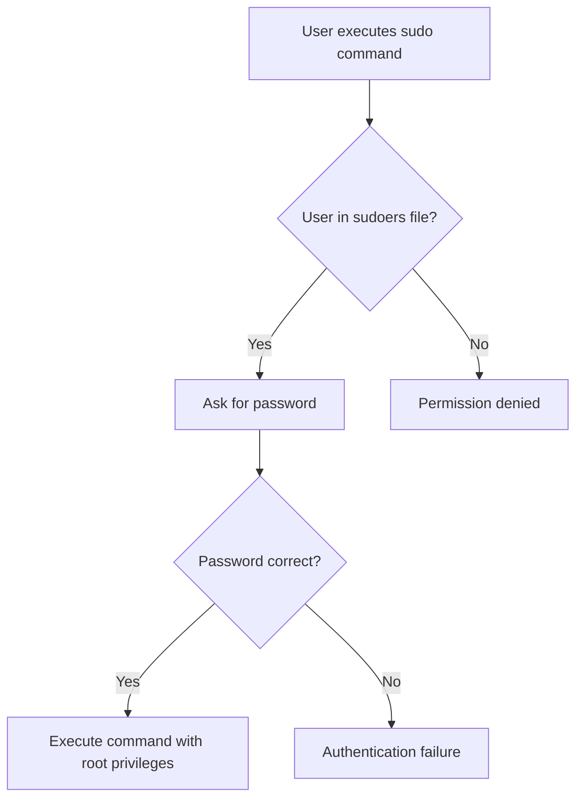

# Debian Sudo Privileges

## Introduction

In Debian Linux systems, managing user permissions effectively is crucial for system security and proper administration. The `sudo` (superuser do) command is a fundamental tool that allows regular users to execute commands with administrative or root privileges in a controlled and secure manner. This approach is preferred over logging in directly as root, as it provides better security, accountability, and flexibility.

In this guide, we'll explore how sudo works in Debian systems, how to configure it properly, and best practices for managing sudo privileges to maintain a secure yet functional system.

## Understanding Sudo in Debian

### What is Sudo?

The `sudo` command temporarily elevates a regular user's privileges to perform tasks that would otherwise require root access. This privilege elevation is granted based on rules defined in the sudo configuration file.



### Why Use Sudo Instead of Root?

Using sudo offers several advantages over direct root login:

1. **Accountability**: Each command executed with sudo is logged with the username
2. **Reduced Risk**: Users only use elevated privileges when necessary
3. **Fine-grained Control**: Administrators can specify which commands users can run
4. **Password Timeout**: By default, sudo caches credentials for 15 minutes
5. **No Shared Root Password**: Each user uses their own password with sudo

## Installing and Setting Up Sudo

### Installing Sudo

Debian doesn't include sudo by default in every installation. To install it:

```bash
apt update
apt install sudo
```

### Adding a User to the Sudo Group

In Debian, members of the `sudo` group automatically receive sudo privileges. To add a user to this group:

```bash
usermod -aG sudo username
```

Example:

```bash
# Add user john to the sudo group
usermod -aG sudo john
```

Output: *(No output indicates success)*

You can verify that a user belongs to the sudo group with:

```bash
groups username
```

Example:

```bash
groups john
```

Output:
```
john : john sudo
```

## Configuring Sudo Access

### The sudoers File

Sudo's behavior is determined by the `/etc/sudoers` file. This file should never be edited directly. Instead, use the `visudo` command, which checks for syntax errors before saving:

```bash
sudo visudo
```

### Basic sudoers Configuration

Here's a simplified look at the default `/etc/sudoers` file in Debian:

```
# User privilege specification
root    ALL=(ALL:ALL) ALL

# Allow members of group sudo to execute any command
%sudo   ALL=(ALL:ALL) ALL
```

Let's break down what this means:

- `root ALL=(ALL:ALL) ALL`: The root user can run any command as any user on any host
- `%sudo ALL=(ALL:ALL) ALL`: Members of the sudo group can run any command as any user on any host

### Custom Sudo Rules

You can create more specific rules to limit what commands users can run with sudo:

```
# Allow user john to only restart the apache2 service
john ALL=/usr/sbin/service apache2 restart

# Allow members of the webadmin group to manage web services without a password
%webadmin ALL=NOPASSWD:/usr/sbin/service apache2 *, /usr/sbin/service nginx *
```

## Using Sudo in Practice

### Basic Sudo Usage

To execute a command with sudo privileges:

```bash
sudo command
```

Example:

```bash
sudo apt update
```

Output:
```
[sudo] password for user: 
Hit:1 http://deb.debian.org/debian bullseye InRelease
Get:2 http://security.debian.org/debian-security bullseye-security InRelease [48.4 kB]
...
```

### Viewing Available Sudo Commands

To see what commands you can run with sudo:

```bash
sudo -l
```

Output:
```
User john may run the following commands on debian:
    (ALL : ALL) ALL
```

### Running a Shell with Sudo

To get a root shell:

```bash
sudo -i
```

This will give you an interactive root shell with the root user's environment.

### Running Commands as Different Users

Sudo allows executing commands as users other than root:

```bash
sudo -u username command
```

Example:

```bash
# Run a script as the www-data user
sudo -u www-data php /var/www/html/script.php
```

## Advanced Sudo Configuration

### Passwordless Sudo

For automated tasks, you might want to configure passwordless sudo for specific commands:

```
# In /etc/sudoers (edit with visudo)
username ALL=NOPASSWD:/path/to/specific/command
```

Example for allowing a user to restart a web server without a password:

```
john ALL=NOPASSWD:/usr/sbin/service apache2 restart
```

### Setting Custom Sudo Timeout

By default, sudo caches your password for 15 minutes. You can change this by adding to the `/etc/sudoers` file:

```
# Set timeout to 5 minutes
Defaults        timestamp_timeout=5

# Disable timeout (always require password)
Defaults        timestamp_timeout=0
```

### Command Aliases

For complex configurations, you can define command aliases:

```
# Define a group of networking commands
Cmnd_Alias NETWORKING = /sbin/route, /sbin/ifconfig, /bin/ping, /sbin/dhclient

# Allow user to run networking commands
john ALL=NETWORKING
```

## Best Practices for Sudo Management

1. **Limit sudo Access**: Only give sudo privileges to users who absolutely need them

2. **Use Command Restrictions**: Limit users to only the commands they need rather than full sudo access

3. **Enable Logging**: Ensure sudo logs are being captured and reviewed

4. **Use visudo**: Always use `visudo` to edit the sudoers file to prevent syntax errors

5. **Regularly Audit**: Check who has sudo privileges regularly:
   ```bash
   getent group sudo
   ```

6. **Use sudo.conf**: For complex environments, consider using `sudo.conf` for additional configuration options

7. **Consider Security Modules**: On sensitive systems, consider using SELinux or AppArmor alongside sudo

## Troubleshooting Sudo Issues

### Common Problems and Solutions

#### User Can't Use Sudo

If a user can't use sudo even after being added to the sudo group:

1. Ensure the user has logged out and back in for group changes to take effect
2. Check the sudo group exists: `getent group sudo`
3. Verify the sudoers file includes the sudo group: `sudo grep sudo /etc/sudoers`

#### "Sorry, user is not allowed to execute" Error

This usually means the user is not in the sudo group or there's a specific restriction in the sudoers file:

```bash
# Add the user to the sudo group
usermod -aG sudo username

# Check the current sudo configuration
sudo visudo
```

#### "sudo: command not found"

If the sudo command itself isn't found:

```bash
apt update && apt install sudo
```

#### "Authentication token manipulation error"

This can occur when there are issues with the password file:

```bash
# Check permissions on password files
ls -la /etc/passwd /etc/shadow

# Repair permissions if needed
chmod 644 /etc/passwd
chmod 640 /etc/shadow
```

## Security Considerations

### Sudo Logging

All sudo commands are logged by default. You can view the sudo logs with:

```bash
journalctl -e | grep sudo
```

Or in older Debian versions:

```bash
cat /var/log/auth.log | grep sudo
```

Example log entry:
```
May 10 15:23:42 debian sudo: john : TTY=pts/0 ; PWD=/home/john ; USER=root ; COMMAND=/usr/bin/apt update
```

### Preventing Sudo Exploits

To minimize security risks:

1. Keep your system updated:
   ```bash
   sudo apt update && sudo apt upgrade
   ```

2. Use specific command permissions rather than blanket sudo access

3. Consider using the `NOEXEC` option to prevent users from executing shells:
   ```
   Defaults:username NOEXEC
   ```

4. Set a secure PATH in sudoers:
   ```
   Defaults secure_path="/usr/local/sbin:/usr/local/bin:/usr/sbin:/usr/bin:/sbin:/bin"
   ```

## Real-World Examples

### Setting Up a Web Administrator

Let's create a practical example of giving a web administrator just enough permissions to manage web servers:

```bash
# Create a new group for web admins
sudo groupadd webadmin

# Add user to the group
sudo usermod -aG webadmin username

# Create a sudoers entry (using visudo)
sudo visudo -f /etc/sudoers.d/webadmin
```

Add the following content to the file:

```
# Web admin permissions
%webadmin ALL= NOPASSWD: /usr/sbin/service apache2 *, /usr/sbin/service nginx *
%webadmin ALL= NOPASSWD: /usr/bin/systemctl status apache2, /usr/bin/systemctl status nginx
%webadmin ALL= NOPASSWD: /usr/bin/tail -f /var/log/apache2/*, /usr/bin/tail -f /var/log/nginx/*
```

Now web administrators can restart web services and view logs without needing full root access:

```bash
# Restart Apache (as a webadmin user)
sudo service apache2 restart

# View Apache logs
sudo tail -f /var/log/apache2/error.log
```

### Automating System Updates

For automated system updates, you might want to create a specific sudo rule:

```
# Create a system updater user
sudo adduser --system updater

# Add a specific sudoers entry
echo "updater ALL= NOPASSWD: /usr/bin/apt update, /usr/bin/apt upgrade -y" | sudo tee /etc/sudoers.d/updater
```

Then create a script that can be scheduled via cron:

```bash
#!/bin/bash
# /home/updater/update-system.sh

sudo apt update
sudo apt upgrade -y
```

Make the script executable and schedule it:

```bash
chmod +x /home/updater/update-system.sh

# Add to updater's crontab to run daily at 2 AM
echo "0 2 * * * /home/updater/update-system.sh" | sudo -u updater crontab -
```

## Summary

Sudo is a powerful tool for managing privileges in Debian systems. When configured properly, it provides the right balance between security and functionality, allowing users to perform administrative tasks without compromising the system.

Key points to remember:
- Add users to the sudo group for basic sudo access
- Use `visudo` to edit the sudoers file safely
- Create specific rules to limit sudo privileges based on actual needs
- Regularly audit sudo access and logs
- Follow best practices to maintain a secure system

By mastering sudo, you'll be able to manage Debian systems more effectively while maintaining strong security practices.

## Additional Resources

- [Debian Wiki - Sudo](https://wiki.debian.org/sudo)
- [Sudo Manual](https://www.sudo.ws/docs/man/1.8.27/sudo.man.html)
- [Linux Command - Sudo](https://linuxcommand.org/lc3_man_pages/sudo8.html)

## Exercises

1. Add a new user to your Debian system and grant them sudo privileges.
2. Create a custom sudoers entry that allows a user to only restart the SSH service.
3. Set up a new sudo group that can run networking commands without a password.
4. Configure sudo to require a password every time (no timeout) for a specific user.
5. Audit your system to identify all users with sudo privileges and document their access levels.