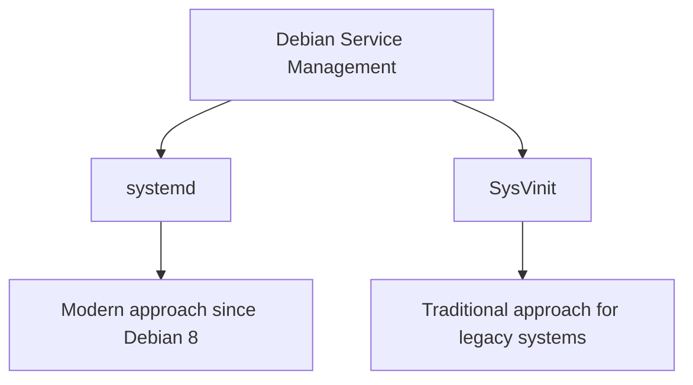

# Debian Service Management

## Introduction

Service management is a fundamental aspect of Debian system administration. Services (also called daemons) are programs that run in the background, providing functionality like web servers, database engines, SSH access, and more. Properly managing these services is crucial for maintaining a stable, secure, and efficient Debian system.

In this guide, we'll explore the tools and techniques for managing services on Debian systems, with a focus on modern systemd methods while also covering traditional SysVinit approaches for legacy compatibility.

## Understanding Services in Debian

A service in Debian is a program that runs continuously in the background, waiting to be used or performing tasks automatically. Examples include:

- Web servers (Apache, Nginx)
- Database servers (MySQL, PostgreSQL)
- SSH server (OpenSSH)
- Printing service (CUPS)
- Network services (DNS, DHCP)

Services typically start automatically when the system boots and continue running until they're stopped or the system shuts down.

## Service Management Systems

Debian has used different service management systems over the years:



### systemd

Since Debian 8 (Jessie), systemd has been the default init system and service manager. It provides powerful features for starting, stopping, and managing services.

### SysVinit

The traditional init system used in older Debian versions. While largely replaced by systemd, understanding SysVinit commands is still valuable for managing legacy systems.

## Managing Services with systemd

systemd is the modern, comprehensive system and service manager for Debian. It provides a standardized way to control services and analyze their status.

### Key systemd Commands

#### Viewing Service Status

To check the status of a service:

```bash
sudo systemctl status apache2
```

Example output:

```
● apache2.service - The Apache HTTP Server
     Loaded: loaded (/lib/systemd/system/apache2.service; enabled; vendor preset: enabled)
     Active: active (running) since Mon 2023-05-15 09:23:14 UTC; 2h 15min ago
       Docs: https://httpd.apache.org/docs/2.4/
   Main PID: 12345 (apache2)
      Tasks: 6 (limit: 4915)
     Memory: 23.3M
        CPU: 1.225s
     CGroup: /system.slice/apache2.service
             ├─12345 /usr/sbin/apache2 -k start
             ├─12346 /usr/sbin/apache2 -k start
             ├─12347 /usr/sbin/apache2 -k start
             ├─12348 /usr/sbin/apache2 -k start
             ├─12349 /usr/sbin/apache2 -k start
             └─12350 /usr/sbin/apache2 -k start
```

This output provides comprehensive information about the service, including:
- Whether it's running (active state)
- When it started
- Memory and CPU usage
- The processes associated with the service

#### Starting a Service

To start a service:

```bash
sudo systemctl start apache2
```

#### Stopping a Service

To stop a running service:

```bash
sudo systemctl stop apache2
```

#### Restarting a Service

To restart a service (stop and then start):

```bash
sudo systemctl restart apache2
```

For services that support it, you can reload the configuration without stopping the service:

```bash
sudo systemctl reload apache2
```

#### Enabling and Disabling Services

To make a service start automatically at boot:

```bash
sudo systemctl enable apache2
```

To prevent a service from starting at boot:

```bash
sudo systemctl disable apache2
```

#### Checking if a Service is Enabled

To see if a service is set to start at boot:

```bash
sudo systemctl is-enabled apache2
```

Output will be either `enabled` or `disabled`.

### Viewing All Services

To list all active services:

```bash
systemctl list-units --type=service
```

To see all services (including inactive):

```bash
systemctl list-units --type=service --all
```

## Managing Services with SysVinit (Legacy Method)

For older Debian systems or for backward compatibility, you might need to use SysVinit commands.

### Key SysVinit Commands

#### Viewing Service Status

```bash
sudo service apache2 status
```

#### Starting a Service

```bash
sudo service apache2 start
```

#### Stopping a Service

```bash
sudo service apache2 stop
```

#### Restarting a Service

```bash
sudo service apache2 restart
```

#### Enabling and Disabling Services

SysVinit uses different tools for enabling/disabling services:

```bash
sudo update-rc.d apache2 defaults
sudo update-rc.d apache2 enable
```

To disable a service:

```bash
sudo update-rc.d apache2 disable
```

## Practical Examples

Let's go through some common scenarios for managing services in Debian.

### Example 1: Setting Up and Managing a Web Server

Let's install and manage the Apache web server:

```bash
# Install Apache
sudo apt update
sudo apt install apache2

# Check if it's running
sudo systemctl status apache2

# If not running, start it
sudo systemctl start apache2

# Configure it to start at boot
sudo systemctl enable apache2

# After making configuration changes
sudo systemctl reload apache2

# To restart completely
sudo systemctl restart apache2
```

### Example 2: Troubleshooting a Failed Service

If a service fails to start, you can use systemd to diagnose the issue:

```bash
# Check detailed status
sudo systemctl status mysql

# View recent logs for the service
sudo journalctl -u mysql --since "1 hour ago"

# Start with verbose output
sudo systemctl start mysql --verbose
```

### Example 3: Creating a Simple Custom Service

You can create your own systemd service for an application. Here's an example for a simple Node.js application:

1. Create a service file:

```bash
sudo nano /etc/systemd/system/myapp.service
```

2. Add the following content:

```
[Unit]
Description=My Node.js Application
After=network.target

[Service]
Type=simple
User=nodeuser
WorkingDirectory=/home/nodeuser/myapp
ExecStart=/usr/bin/node /home/nodeuser/myapp/server.js
Restart=on-failure

[Install]
WantedBy=multi-user.target
```

3. Enable and start the service:

```bash
sudo systemctl daemon-reload
sudo systemctl enable myapp
sudo systemctl start myapp
```

## Monitoring Services

### Using journalctl

systemd provides a powerful logging system via the `journalctl` command:

```bash
# View logs for a specific service
sudo journalctl -u apache2

# View recent logs
sudo journalctl -u apache2 --since "1 hour ago"

# Follow logs in real-time (like tail -f)
sudo journalctl -u apache2 -f
```

### Service Health Checks

For critical services, it's good practice to set up monitoring. A simple approach is to create a cron job that checks service status:

```bash
# Create a monitoring script
sudo nano /usr/local/bin/check-services.sh
```

Add the following content:

```bash
#!/bin/bash

SERVICE_LIST="apache2 mysql ssh"

for service in $SERVICE_LIST; do
    if ! systemctl is-active --quiet $service; then
        echo "WARNING: $service is not running!"
        # Send an email alert
        echo "Service $service stopped on $(hostname) at $(date)" | \
        mail -s "Service Alert: $service down" admin@example.com
        
        # Attempt to restart
        systemctl restart $service
    fi
done
```

Make it executable and add to crontab:

```bash
sudo chmod +x /usr/local/bin/check-services.sh
sudo crontab -e
```

Add this line to run the check every 5 minutes:

```
*/5 * * * * /usr/local/bin/check-services.sh
```

## Best Practices for Service Management

1. **Always check service status after changes**: After making configuration changes or restarting a service, always verify it's running correctly.

2. **Use reload instead of restart when possible**: For services that support it, use `reload` to apply configuration changes without interrupting connections.

3. **Secure services properly**: Configure services to run with minimal privileges using appropriate user accounts.

4. **Configure service dependencies correctly**: When creating custom services, ensure the `After=` and `Requires=` directives are set appropriately.

5. **Keep services updated**: Regularly update packages to ensure services have the latest security patches.

6. **Monitor service logs**: Regularly check service logs for errors or unusual activity.

7. **Implement automatic monitoring**: Set up monitoring tools to alert you when services fail.

## Common Issues and Solutions

### Service Fails to Start

1. Check the status:
   ```bash
   sudo systemctl status service-name
   ```

2. Check logs:
   ```bash
   sudo journalctl -u service-name -n 50
   ```

3. Verify configuration files:
   ```bash
   # For Apache example
   sudo apache2ctl configtest
   ```

### Service Starts But Fails Later

This often indicates resource problems or misconfiguration:

1. Check system resources:
   ```bash
   free -m
   df -h
   ```

2. Look for patterns in the logs:
   ```bash
   sudo journalctl -u service-name --since "2 days ago" | grep -i error
   ```

### Service Cannot Bind to Port

Another service might be using the required port:

```bash
sudo ss -tulpn | grep LISTEN
```

## Summary

Proper service management is essential for maintaining a stable and secure Debian system. With systemd, Debian provides a powerful and flexible framework for managing services, offering features like dependency management, parallel startup, and detailed logging.

Key points to remember:
- Use `systemctl` commands to manage services in modern Debian systems
- Understand the difference between starting/stopping services and enabling/disabling them
- Monitor service health regularly using `journalctl` and other tools
- Follow best practices for security and performance

By mastering service management in Debian, you'll be able to maintain more reliable systems and quickly troubleshoot issues when they arise.

## Additional Resources

- [Debian systemd documentation](https://wiki.debian.org/systemd)
- [systemd man pages](https://manpages.debian.org/buster/systemd/systemd.1.en.html)
- [Debian Administrator's Handbook](https://debian-handbook.info/)

## Exercises

1. Install a service like Nginx or PostgreSQL and practice starting, stopping, and checking its status.

2. Create a simple custom systemd service for a script of your choice.

3. Configure a service to run with non-default options by creating an override file:
   ```bash
   sudo systemctl edit apache2
   ```

4. Practice troubleshooting by deliberately introducing an error in a configuration file and then using systemd tools to diagnose and fix the issue.

5. Set up a basic monitoring system using the script provided in this guide to monitor critical services on your system.