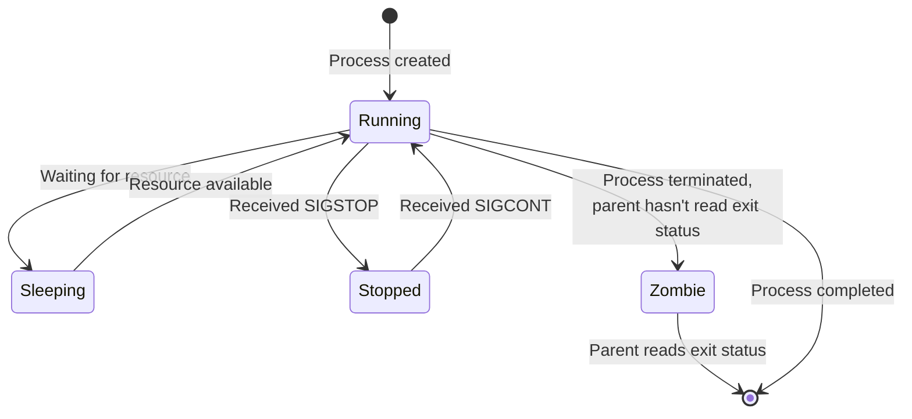

# Debian Process Control

## Introduction

Process control is a fundamental aspect of Debian system administration. A process is simply a running instance of a program. Every command you execute, every application you open, and many system functions run as processes in Linux. As a system administrator, understanding how to monitor, manage, and control these processes is essential for maintaining system performance, troubleshooting issues, and ensuring the overall health of your Debian system.

This guide will walk you through the basics of process control in Debian, from understanding process concepts to practical commands for effective management. We'll explore tools and techniques that help you gain visibility into what's happening on your system and how to take control when needed.

## Understanding Linux Processes

### What is a Process?

In Linux, a process is an instance of a running program. Each process has:

- A unique Process ID (PID)
- A Parent Process ID (PPID)
- User and group ownership
- Resource allocation (memory, CPU time)
- State information (running, sleeping, stopped, etc.)

When Debian boots, it starts with PID 1 (`systemd` or `init` in older versions), which then spawns all other processes.

### Process States

Processes can exist in several states:



- **Running** - The process is either currently executing on the CPU or waiting to be executed.
- **Sleeping** - The process is waiting for a resource (e.g., user input, file access).
- **Stopped** - The process has been paused, usually by receiving a SIGSTOP signal.
- **Zombie** - The process has completed execution but still has an entry in the process table.

## Basic Process Monitoring Commands

### The `ps` Command

The `ps` command is the primary tool for viewing process information. In its simplest form:

```bash
ps
```

Output:
```
  PID TTY          TIME CMD
 1234 pts/0    00:00:00 bash
 5678 pts/0    00:00:00 ps
```

For more detailed information, use `ps` with arguments:

```bash
ps aux
```

Output:
```
USER       PID %CPU %MEM    VSZ   RSS TTY      STAT START   TIME COMMAND
root         1  0.0  0.2 171320  8756 ?        Ss   Mar09   0:10 /sbin/init
root       367  0.0  0.2  94944  9788 ?        Ss   Mar09   0:02 /usr/bin/systemd-journald
debian    5419  0.0  0.2  21888  5304 pts/0    Ss   10:15   0:00 bash
debian    5479  0.0  0.1  39472  3584 pts/0    R+   10:16   0:00 ps aux
```

Common `ps` options:

- `a` - Show processes for all users
- `u` - Display detailed user-oriented format
- `x` - Include processes without controlling terminals
- `f` - Show processes in a tree format

### The `top` Command

While `ps` provides a static snapshot, `top` gives a real-time, dynamic view of processes:

```bash
top
```

Output:
```
top - 10:20:03 up 22:03,  1 user,  load average: 0.00, 0.01, 0.05
Tasks: 104 total,   1 running, 103 sleeping,   0 stopped,   0 zombie
%Cpu(s):  0.0 us,  0.3 sy,  0.0 ni, 99.7 id,  0.0 wa,  0.0 hi,  0.0 si,  0.0 st
MiB Mem :   1978.4 total,    748.5 free,    240.3 used,    989.6 buff/cache
MiB Swap:   2048.0 total,   2048.0 free,      0.0 used.   1559.2 avail Mem 

  PID USER      PR  NI    VIRT    RES    SHR S  %CPU  %MEM     TIME+ COMMAND                       
    1 root      20   0  171320   8756   6700 S   0.0   0.4   0:10.39 systemd                      
  367 root      20   0   94944   9788   8108 S   0.0   0.5   0:02.00 systemd-journal              
  391 root      20   0   23216   5964   5100 S   0.0   0.3   0:00.76 systemd-udevd              
  599 systemd+  20   0   18120   5284   4504 S   0.0   0.3   0:00.45 systemd-network 
```

Key shortcuts while in `top`:

- `q` - Quit the top command
- `k` - Kill a process (prompts for PID)
- `r` - Renice a process (change priority)
- `f` - Configure columns displayed
- `h` - Get help

### The `htop` Command

`htop` is an enhanced version of `top` with a more user-friendly interface:

```bash
sudo apt install htop
htop
```

`htop` provides color-coding, visual process trees, and mouse interaction. It's often preferred by administrators for its clarity and additional features.

## Process Control Commands

### Starting Processes

The simplest way to start a process is by typing the command:

```bash
firefox
```

To run a process in the background, add an ampersand:

```bash
firefox &
```

Output:
```
[1] 5632
```

The number in brackets is the job number, and 5632 is the PID.

### Stopping Processes with `kill`

To terminate a process, use the `kill` command with the PID:

```bash
kill 5632
```

By default, `kill` sends the SIGTERM signal (15), which asks the process to terminate gracefully. If a process is unresponsive, you can force termination:

```bash
kill -9 5632
```

This sends SIGKILL (9), which cannot be ignored by the process.

### Useful `kill` Signals

```bash
kill -l
```

Output:
```
 1) SIGHUP      2) SIGINT      3) SIGQUIT     4) SIGILL      5) SIGTRAP
 6) SIGABRT     7) SIGBUS      8) SIGFPE      9) SIGKILL    10) SIGUSR1
11) SIGSEGV    12) SIGUSR2    13) SIGPIPE    14) SIGALRM    15) SIGTERM
...
```

Common signals include:

- `SIGHUP (1)` - Hang up, often used to reload configurations
- `SIGINT (2)` - Interrupt, same as pressing Ctrl+C
- `SIGTERM (15)` - Terminate gracefully
- `SIGKILL (9)` - Force immediate termination

### Using `killall` and `pkill`

These commands allow you to kill processes by name rather than PID:

```bash
killall firefox
```

Or using pattern matching with `pkill`:

```bash
pkill fire
```

### Process Suspension and Resumption

To pause a process:

```bash
kill -STOP 5632
```

To resume a paused process:

```bash
kill -CONT 5632
```

### Job Control

When working in a terminal, you can use job control commands:

- `Ctrl+Z` - Suspend the current foreground process
- `bg` - Continue a suspended process in the background
- `fg` - Bring a background process to the foreground
- `jobs` - List current jobs

Example:

```bash
sleep 100
# Press Ctrl+Z to suspend
```

Output:
```
[1]+  Stopped                 sleep 100
```

```bash
bg
```

Output:
```
[1]+ sleep 100 &
```

```bash
jobs
```

Output:
```
[1]+  Running                 sleep 100 &
```

```bash
fg
```

Output:
```
sleep 100
```

## Process Priority with `nice` and `renice`

The `nice` value of a process determines its priority. The range is from -20 (highest priority) to 19 (lowest priority). Regular users can only increase nice values (lower priority).

To start a process with a specific priority:

```bash
nice -n 10 firefox
```

To change the priority of a running process:

```bash
renice 10 -p 5632
```

Output:
```
5632 (process ID) old priority 0, new priority 10
```

## Practical Examples of Process Control

### Example 1: Finding Memory-Hungry Processes

To identify processes consuming the most memory:

```bash
ps aux --sort=-%mem | head -n 10
```

Output:
```
USER       PID %CPU %MEM    VSZ   RSS TTY      STAT START   TIME COMMAND
debian    6123  2.0  4.6 2355264 92312 ?       SLl  10:45   0:03 firefox
debian    6235  0.3  2.1 1854868 41680 ?       SLl  10:46   0:00 Web Content
root       367  0.0  0.5   94944  9788 ?       Ss   Mar09   0:02 /usr/bin/systemd-journald
...
```

### Example 2: Managing Runaway Processes

If a process is consuming too much CPU:

```bash
# Find the process
top -n 1 -b | head -n 20

# Reduce its priority
renice 19 -p <PID>

# If necessary, terminate it
kill -15 <PID>
```

### Example 3: Automating Process Control with `cron`

You can use `cron` to schedule regular process checks and management:

Create a script named `check_process.sh`:

```bash
#!/bin/bash

# Check if httpd is running, restart if not
if ! pgrep apache2 > /dev/null; then
    systemctl restart apache2
    echo "Apache restarted at $(date)" >> /var/log/process_control.log
fi

# Terminate any processes using too much memory
for pid in $(ps aux | awk '$4 > 80.0 {print $2}'); do
    echo "Killing high-memory process $pid ($(ps -p $pid -o comm=)) at $(date)" >> /var/log/process_control.log
    kill -15 $pid
done
```

Make it executable:

```bash
chmod +x check_process.sh
```

Add to crontab to run every 5 minutes:

```bash
crontab -e
```

Add the line:
```
*/5 * * * * /path/to/check_process.sh
```

### Example 4: Using `systemd` to Control Services

Modern Debian systems use `systemd` to manage services:

```bash
# Check status of a service
systemctl status apache2

# Start a service
systemctl start apache2

# Stop a service
systemctl stop apache2

# Restart a service
systemctl restart apache2

# Enable auto-start at boot
systemctl enable apache2

# Disable auto-start
systemctl disable apache2
```

## Advanced Process Control

### Process Limits with `ulimit`

The `ulimit` command allows you to control resource limits for processes:

```bash
# View current limits
ulimit -a
```

Output:
```
core file size          (blocks, -c) 0
data seg size           (kbytes, -d) unlimited
scheduling priority             (-e) 0
file size               (blocks, -f) unlimited
pending signals                 (-i) 7697
max locked memory       (kbytes, -l) 65536
max memory size         (kbytes, -m) unlimited
open files                      (-n) 1024
pipe size            (512 bytes, -p) 8
POSIX message queues     (bytes, -q) 819200
real-time priority              (-r) 0
stack size              (kbytes, -s) 8192
cpu time               (seconds, -t) unlimited
max user processes              (-u) 7697
virtual memory          (kbytes, -v) unlimited
file locks                      (-x) unlimited
```

Set a temporary limit:

```bash
# Limit max memory for child processes
ulimit -m 1024000
```

### Process Monitoring with `pstree`

The `pstree` command displays processes in a tree format, showing parent-child relationships:

```bash
pstree
```

Output:
```
systemd─┬─ModemManager───2*[{ModemManager}]
        ├─NetworkManager───2*[{NetworkManager}]
        ├─accounts-daemon───2*[{accounts-daemon}]
        ├─apache2───5*[apache2]
        ├─avahi-daemon───avahi-daemon
        ├─cron
        ├─dbus-daemon
        ├─irqbalance───{irqbalance}
        ├─networkd-dispat
        ├─polkitd───2*[{polkitd}]
        ├─rsyslogd───3*[{rsyslogd}]
        ├─snapd───10*[{snapd}]
        ├─sshd───sshd───sshd───bash───pstree
        ├─systemd-journal
        ├─systemd-logind
        ├─systemd-network
        ├─systemd-resolve
        ├─systemd-udevd
        └─udisksd───4*[{udisksd}]
```

### Using `lsof` to Find Open Files

The `lsof` command lists open files and the processes using them:

```bash
# Find all files opened by a process
lsof -p 5632

# Find which process is using a specific file
lsof /var/log/syslog

# Find all network connections
lsof -i
```

## Troubleshooting Common Process Issues

### Problem: Zombie Processes

Zombie processes don't consume resources but clutter the process table. They occur when a parent process doesn't read the exit status of child processes.

To identify zombies:
```bash
ps aux | grep Z
```

Solution: Usually, you need to restart or fix the parent process. If the parent is defunct, you might need to reboot.

### Problem: High CPU Usage

To identify CPU-intensive processes:
```bash
top -o %CPU
```

Solutions:
- Investigate why the process is consuming high CPU
- Renice to lower priority if appropriate
- Consider optimizing or upgrading hardware
- Terminate if it's a runaway process

### Problem: Memory Leaks

To identify processes consuming excessive memory:
```bash
ps aux --sort=-%mem | head
```

Solutions:
- Restart the leaking application
- Check for available updates that might fix the leak
- Consider setting resource limits

### Problem: Too Many Processes

If a process is spawning too many instances:
```bash
# Find the parent
ps -ef | grep [process_name]
```

Solutions:
- Check application configuration
- Set limits with `ulimit -u`
- Restart the parent application

## Summary

Process control is a critical skill for Debian system administrators. From basic monitoring with `ps` and `top` to advanced management with `systemd` and resource limits, understanding how to effectively manage processes ensures system stability and performance.

Key takeaways:
- Every running program is a process with a unique PID
- Use `ps`, `top`, and `htop` for monitoring processes
- Control processes with commands like `kill`, `nice`, and `systemctl`
- Regular maintenance and monitoring help prevent process-related issues
- Advanced tools like `lsof` and `pstree` provide deeper insights into process behavior

## Additional Resources

- `man` pages for each command mentioned (`man ps`, `man top`, etc.)
- The Debian Administrator's Handbook
- Linux Process Management documentation on the Debian wiki

## Exercises

1. Use `ps` and `grep` to find all processes owned by a specific user.
2. Create a simple shell script that monitors a critical service and restarts it if it stops.
3. Experiment with different `nice` values for a CPU-intensive task and measure the difference in performance.
4. Use `lsof` to identify which processes have open network connections.
5. Practice using job control commands by starting multiple processes, suspending them, and bringing them back to the foreground.