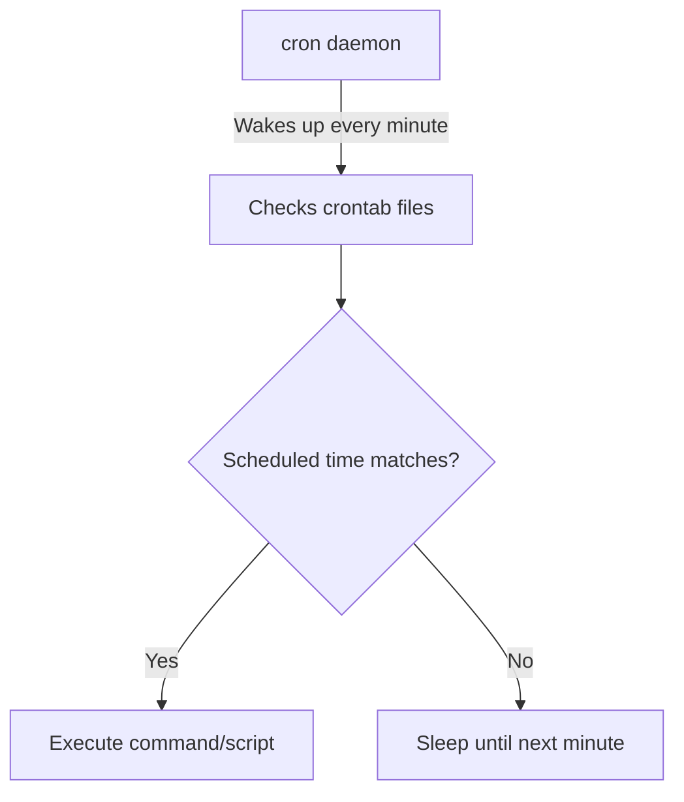

# Debian Job Scheduling

## Introduction

Job scheduling is a crucial aspect of system administration that allows you to automate tasks to run at specific times or intervals without manual intervention. In Debian-based systems, several tools are available for scheduling jobs, each with its own strengths and use cases.

This guide will explore the primary job scheduling mechanisms in Debian:

- The cron system for recurring tasks
- anacron for ensuring jobs run even on systems that aren't always powered on
- The at command for one-time scheduled tasks
- systemd timers as a modern alternative to traditional methods

By mastering these job scheduling tools, you'll be able to automate routine maintenance, backups, system updates, and other administrative tasks efficiently.

## The cron System

### What is cron?

Cron is the traditional and most widely used job scheduling utility in Unix-like operating systems, including Debian. It allows users to schedule commands or scripts to run automatically at specified intervals.

### How cron Works

The cron daemon (`crond`) wakes up every minute, checks for scheduled jobs, and executes them if their scheduled time matches the current time.



### crontab Format

A crontab (cron table) file contains instructions for the cron daemon in a specific format:

```
┌─────────────── minute (0 - 59)
│ ┌───────────── hour (0 - 23)
│ │ ┌─────────── day of month (1 - 31)
│ │ │ ┌───────── month (1 - 12)
│ │ │ │ ┌─────── day of week (0 - 6) (Sunday = 0)
│ │ │ │ │
│ │ │ │ │
* * * * * command to execute
```

### Managing User crontabs

Each user can have their own crontab file:

```bash
# View your current crontab
crontab -l

# Edit your crontab
crontab -e

# Remove your crontab
crontab -r
```

When you first run `crontab -e`, you'll be prompted to choose an editor. The file opens with helpful comments explaining the syntax.

### Examples of cron Jobs

Let's look at some practical examples:

**Example 1: Run a script every day at 3:30 AM**

```
30 3 * * * /path/to/backup-script.sh
```

**Example 2: Run a command every Monday at 9:00 AM**

```
0 9 * * 1 /usr/bin/apt update && /usr/bin/apt -y upgrade
```

**Example 3: Run a script every 15 minutes**

```
*/15 * * * * /path/to/check-service.sh
```

**Example 4: Run a database backup on weekdays at midnight**

```
0 0 * * 1-5 /path/to/db-backup.sh
```

**Example 5: Run different tasks at different frequencies**

```
# Run daily at midnight
0 0 * * * /path/to/daily-script.sh

# Run weekly on Sunday at 2 AM
0 2 * * 0 /path/to/weekly-script.sh

# Run monthly on the 1st at 3 AM
0 3 1 * * /path/to/monthly-script.sh
```

### System-wide cron Jobs

In addition to user crontabs, Debian has several directories for system-wide cron jobs:

- `/etc/crontab`: The system-wide crontab file
- `/etc/cron.d/`: Directory for additional crontab files
- `/etc/cron.hourly/`: Scripts to run hourly
- `/etc/cron.daily/`: Scripts to run daily
- `/etc/cron.weekly/`: Scripts to run weekly
- `/etc/cron.monthly/`: Scripts to run monthly

For the cron.hourly, cron.daily, cron.weekly, and cron.monthly directories, you just need to place executable scripts in these directories, and they'll run at the specified intervals.

**Example: Content of /etc/cron.daily/logrotate**

```bash
#!/bin/sh
/usr/sbin/logrotate /etc/logrotate.conf
```

### Managing cron Output

By default, cron sends the output of jobs via email to the user who owns the crontab. You can redirect the output:

```
# Redirect stdout and stderr to a log file
30 3 * * * /path/to/script.sh >> /var/log/script.log 2>&1

# Discard all output
0 2 * * * /path/to/script.sh > /dev/null 2>&1
```

## Using anacron for Non-continuous Systems

### What is anacron?

While cron is great for servers that run continuously, it has a limitation: if the system is off when a job is scheduled, that job won't run until its next scheduled time. This is where anacron comes in.

Anacron ensures that regular periodic commands run even on systems that aren't running 24/7, like laptops or desktops.

### Installing anacron

If not already installed:

```bash
sudo apt update
sudo apt install anacron
```

### How anacron Works

Unlike cron, anacron doesn't use exact times. Instead, it uses periods: daily, weekly, and monthly. If anacron detects that a job has been missed, it runs it when the system is next turned on.

### Configuring anacron

Anacron's configuration file is located at `/etc/anacrontab`:

```
# /etc/anacrontab: configuration file for anacron

# Period in days   Delay in minutes   Job identifier   Command
1                  5                  cron.daily       run-parts --report /etc/cron.daily
7                  10                 cron.weekly      run-parts --report /etc/cron.weekly
@monthly           15                 cron.monthly     run-parts --report /etc/cron.monthly
```

The format is:
- Period: how often the job should run (in days, or using @monthly)
- Delay: minutes to wait after boot before running
- Job identifier: a unique name for the job
- Command: the command to execute

### Creating Custom anacron Jobs

You can add your own jobs to the anacrontab file:

```
# Custom backup job that runs every 3 days
3    25    backup.home    /path/to/home-backup.sh
```

## One-time Job Scheduling with at

### What is at?

While cron and anacron are designed for recurring tasks, the `at` command is perfect for scheduling one-time jobs to run at a specific future time.

### Installing at

```bash
sudo apt update
sudo apt install at
```

### Basic at Usage

```bash
# Schedule a job to run at 2:30 PM today
at 14:30
warning: commands will be executed using /bin/sh
at> /path/to/script.sh
at> <EOT>
job 1 at Thu Mar 13 14:30 2025

# Schedule using a different date format
at 10:15am Jul 31 2025
at> echo "Reminder: Annual report due today" | mail -s "Reminder" admin@example.com
at> <EOT>
job 2 at Thu Jul 31 10:15 2025
```

To exit the at prompt, press Ctrl+D (which creates the `<EOT>` marker).

### Time Specifications

The `at` command supports various time formats:

```bash
# Specific times
at 10:00
at 10:00am
at 10:00 PM

# Relative times
at now + 30 minutes
at now + 1 hour
at now + 2 days
at now + 1 week

# Named times
at midnight
at noon
at teatime (4 PM)
```

### Managing at Jobs

```bash
# List pending jobs
atq
1    Thu Mar 13 14:30:00 2025 a user
2    Thu Jul 31 10:15:00 2025 a user

# View details of a specific job
at -c 1

# Remove a scheduled job
atrm 1
```

## Modern Job Scheduling with systemd Timers

### Introduction to systemd Timers

In newer Debian versions, systemd provides an alternative to cron and at with systemd timers. These timers offer advantages like:

- Better integration with the rest of the systemd ecosystem
- More precise control over job execution
- Logging through the journal
- Handling of job dependencies

### Basic Components

A systemd timer setup consists of two unit files:

1. A service unit (`.service`) that defines what to execute
2. A timer unit (`.timer`) that defines when to execute the service

### Creating a Simple Timer

Let's create a timer to run a backup script daily at 3 AM:

**1. Create the service unit file: `/etc/systemd/system/daily-backup.service`**

```
[Unit]
Description=Daily backup service

[Service]
Type=oneshot
ExecStart=/path/to/backup-script.sh
User=backup
Group=backup

[Install]
WantedBy=multi-user.target
```

**2. Create the timer unit file: `/etc/systemd/system/daily-backup.timer`**

```
[Unit]
Description=Run daily backup at 3 AM

[Timer]
OnCalendar=*-*-* 03:00:00
Persistent=true

[Install]
WantedBy=timers.target
```

**3. Enable and start the timer**

```bash
sudo systemctl enable daily-backup.timer
sudo systemctl start daily-backup.timer
```

### Timer Specifications

The `OnCalendar` directive uses a calendar event expression:

```
OnCalendar=YYYY-MM-DD HH:MM:SS
```

Some examples:

```
# Run at midnight every day
OnCalendar=*-*-* 00:00:00

# Run at 3:30 AM every Monday
OnCalendar=Mon *-*-* 03:30:00

# Run every hour
OnCalendar=*-*-* *:00:00

# Run every 15 minutes
OnCalendar=*:0/15
```

The `Persistent=true` option ensures that the job runs if it was missed (similar to anacron).

### Managing systemd Timers

```bash
# List all timers
systemctl list-timers

# Check status of a specific timer
systemctl status daily-backup.timer

# Start/stop a timer
systemctl start daily-backup.timer
systemctl stop daily-backup.timer

# Enable/disable a timer at boot
systemctl enable daily-backup.timer
systemctl disable daily-backup.timer
```

### Viewing Timer Logs

```bash
# View logs for a specific service
journalctl -u daily-backup.service

# Follow logs in real-time
journalctl -u daily-backup.service -f
```

## Practical Examples and Use Cases

Let's explore some real-world scenarios for job scheduling in Debian:

### Example 1: Automated System Updates

**Using cron:**

```bash
# Create a script: /usr/local/bin/auto-update.sh
sudo nano /usr/local/bin/auto-update.sh
```

```bash
#!/bin/bash
# Log start time
echo "Starting system update at $(date)" >> /var/log/auto-update.log

# Update package lists and upgrade packages
apt-get update && apt-get -y upgrade >> /var/log/auto-update.log 2>&1

# Log completion
echo "Update completed at $(date)" >> /var/log/auto-update.log
echo "-------------------" >> /var/log/auto-update.log
```

```bash
# Make it executable
sudo chmod +x /usr/local/bin/auto-update.sh

# Add to root's crontab
sudo crontab -e
```

Add the line:
```
0 3 * * 0 /usr/local/bin/auto-update.sh
```

### Example 2: Database Backup

**Using systemd timer:**

Create the service file:
```bash
sudo nano /etc/systemd/system/db-backup.service
```

```
[Unit]
Description=PostgreSQL Database Backup
After=postgresql.service

[Service]
Type=oneshot
User=postgres
ExecStart=/usr/local/bin/pg-backup.sh
KillMode=process

[Install]
WantedBy=multi-user.target
```

Create the backup script:
```bash
sudo nano /usr/local/bin/pg-backup.sh
```

```bash
#!/bin/bash
BACKUP_DIR="/var/backups/postgresql"
TIMESTAMP=$(date +"%Y%m%d_%H%M%S")
mkdir -p $BACKUP_DIR

# Backup all databases
pg_dumpall | gzip > "$BACKUP_DIR/pg_all_$TIMESTAMP.sql.gz"

# Delete backups older than 30 days
find $BACKUP_DIR -type f -name "pg_all_*.sql.gz" -mtime +30 -delete
```

```bash
sudo chmod +x /usr/local/bin/pg-backup.sh
```

Create the timer file:
```bash
sudo nano /etc/systemd/system/db-backup.timer
```

```
[Unit]
Description=Daily PostgreSQL Backup Timer

[Timer]
OnCalendar=*-*-* 02:00:00
Persistent=true
RandomizedDelaySec=10min

[Install]
WantedBy=timers.target
```

Enable and start the timer:
```bash
sudo systemctl enable db-backup.timer
sudo systemctl start db-backup.timer
```

### Example 3: Log Rotation and Cleanup

**Using anacron:**

Edit the anacrontab file:
```bash
sudo nano /etc/anacrontab
```

Add the line:
```
7   25   log-cleanup    /usr/local/bin/cleanup-logs.sh
```

Create the cleanup script:
```bash
sudo nano /usr/local/bin/cleanup-logs.sh
```

```bash
#!/bin/bash
# Compress log files older than 7 days
find /var/log -type f -name "*.log" -mtime +7 -not -name "*.gz" -exec gzip {} \;

# Delete compressed logs older than 90 days
find /var/log -type f -name "*.log.gz" -mtime +90 -delete

# Log the cleanup
echo "Log cleanup completed on $(date)" >> /var/log/cleanup.log
```

```bash
sudo chmod +x /usr/local/bin/cleanup-logs.sh
```

### Example 4: Website Availability Check

**Using cron with a 5-minute interval:**

Create the check script:
```bash
sudo nano /usr/local/bin/check-website.sh
```

```bash
#!/bin/bash
WEBSITE="https://example.com"
LOG_FILE="/var/log/website-checks.log"
ALERT_EMAIL="admin@example.com"

# Check if website is accessible
HTTP_CODE=$(curl -s -o /dev/null -w "%{http_code}" $WEBSITE)

if [ $HTTP_CODE -ne 200 ]; then
    # Log the issue
    echo "$(date): Website $WEBSITE returned HTTP code $HTTP_CODE" >> $LOG_FILE
    
    # Send alert email
    echo "Website $WEBSITE is down with HTTP code $HTTP_CODE" | mail -s "Website DOWN Alert" $ALERT_EMAIL
fi
```

```bash
sudo chmod +x /usr/local/bin/check-website.sh
```

Add to crontab:
```
*/5 * * * * /usr/local/bin/check-website.sh
```

## Troubleshooting Job Scheduling

### Common Issues and Solutions

#### 1. Jobs Not Running

**Check permissions:**
```bash
# Make sure scripts are executable
chmod +x /path/to/script.sh

# Check if script directory is accessible
ls -la /path/to/
```

**Check PATH environment variable:**
Cron jobs run with a limited PATH. Either specify full paths in your scripts or set the PATH in the crontab:
```
PATH=/usr/local/sbin:/usr/local/bin:/usr/sbin:/usr/bin:/sbin:/bin
30 3 * * * backup.sh
```

#### 2. Debugging cron Jobs

Add logging to your scripts:
```bash
#!/bin/bash
exec >> /var/log/myscript.log 2>&1
echo "Script started at $(date)"

# Script commands here

echo "Script completed at $(date)"
```

Check system logs:
```bash
grep CRON /var/log/syslog
```

Run the script manually to test:
```bash
sudo su -c "/path/to/script.sh" username
```

#### 3. systemd Timer Issues

Check timer status:
```bash
systemctl status mytimer.timer
systemctl list-timers
```

Check service status:
```bash
systemctl status myservice.service
```

View logs:
```bash
journalctl -u myservice.service
```

## Best Practices for Job Scheduling

1. **Document your scheduled jobs**
   - Keep a central record of all scheduled jobs and their purposes
   - Include who created them and when they should be reviewed

2. **Use appropriate scheduling methods**
   - Use cron for regular tasks on always-on systems
   - Use anacron for periodic tasks on non-continuous systems
   - Use at for one-time jobs
   - Use systemd timers for more complex requirements

3. **Implement proper error handling**
   - Add error checks and exit codes to your scripts
   - Send notifications for failed jobs
   - Log both success and failure outcomes

4. **Manage resource consumption**
   - Avoid scheduling resource-intensive jobs during peak hours
   - Use the `nice` command to set job priority
   - Stagger job start times to prevent overloading the system

5. **Include timeouts and deadlines**
   - For systemd services:
     ```
     [Service]
     TimeoutStartSec=1h
     TimeoutStopSec=15min
     ```

6. **Control output**
   - Implement proper logging
   - Avoid filling inboxes with unnecessary output
   - Consider log rotation for job outputs

7. **Test thoroughly**
   - Test scripts manually before scheduling
   - Start with more frequent execution during testing, then adjust to final schedule

## Summary

Debian provides several powerful job scheduling mechanisms to automate your system administration tasks:

- **cron** is the traditional solution for recurring tasks on continuously running systems
- **anacron** ensures jobs run on systems that aren't always on
- **at** is perfect for one-time scheduled tasks
- **systemd timers** provide a modern alternative with better integration and logging

By understanding these tools and their specific use cases, you can efficiently automate routine tasks, maintenance, backups, and monitoring in your Debian systems.

## Additional Resources

### Learning Resources

1. The Debian Administrator's Handbook
2. Linux System Administration Handbook
3. `man` pages for each command (`man crontab`, `man anacron`, `man at`, `man systemd.timer`)

### Exercises

1. Set up a cron job to generate a system report daily at 6 AM
2. Create an anacron job to perform weekly disk cleanup that works even if your system is occasionally turned off
3. Use the `at` command to schedule a one-time backup before a system upgrade
4. Convert an existing cron job to use systemd timers
5. Create a monitoring script that runs every 10 minutes and alerts you if disk space gets low

### Advanced Topics

- Job scheduling with job queues like Celery
- Distributed job scheduling across multiple Debian systems
- Integrating job scheduling with configuration management tools like Ansible
- Containerized job scheduling with Docker and Kubernetes CronJobs