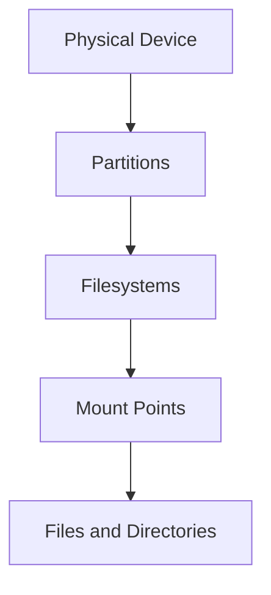
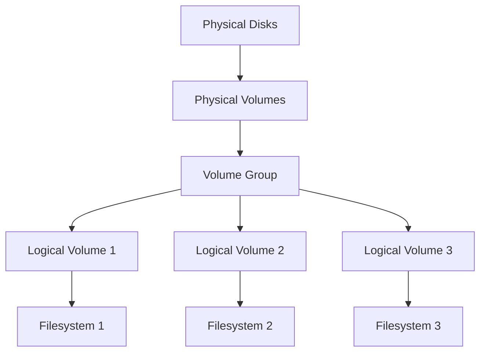

# Debian Storage Management

## Introduction

Storage management is a crucial aspect of Debian system administration. Properly configured storage ensures system stability, optimal performance, and data security. This guide covers the essential concepts and tools for managing storage on Debian systems, from basic disk operations to advanced storage configurations.

Whether you're setting up a new Debian server, managing an existing system, or troubleshooting storage issues, understanding these fundamentals will help you make informed decisions about your storage architecture.

## Basic Storage Concepts

### Understanding Linux Storage Hierarchy

In Debian and other Linux distributions, storage devices follow a hierarchical structure:

1. **Physical Storage Devices** - Actual hardware (HDDs, SSDs, USB drives)
2. **Partitions** - Sections of physical devices
3. **Filesystems** - Organizational structures formatted onto partitions
4. **Mount Points** - Directories where filesystems are accessible in the directory tree



### Storage Device Naming

Debian uses a consistent naming convention for storage devices:

- **SATA/SCSI/USB drives**: `/dev/sdX` (where X is a letter: a, b, c, etc.)
- **NVMe drives**: `/dev/nvmeXnY` (X = controller number, Y = namespace)
- **Virtual disks**: `/dev/vdX` (in virtual machines)
- **Partitions**: `/dev/sdXY` (where Y is a number: 1, 2, 3, etc.)

For example, the first partition on the first SATA drive would be `/dev/sda1`.

## Disk Partitioning

### Viewing Disk Information

Before partitioning, you need to identify your disks:

```bash
# List all block devices
lsblk

# More detailed disk information
sudo fdisk -l
```

Example output:

```
# lsblk output
NAME        MAJ:MIN RM  SIZE RO TYPE MOUNTPOINT
sda           8:0    0   80G  0 disk 
├─sda1        8:1    0    1G  0 part /boot
├─sda2        8:2    0   16G  0 part [SWAP]
└─sda3        8:3    0   63G  0 part /
sdb           8:16   0  500G  0 disk 
└─sdb1        8:17   0  500G  0 part /data
```

### Partitioning Tools

Debian provides several tools for disk partitioning:

#### 1. fdisk (command-line utility)

```bash
# Start fdisk for /dev/sdb
sudo fdisk /dev/sdb

# Common fdisk commands:
# m - display help
# p - print partition table
# n - add new partition
# d - delete partition
# w - write changes and exit
# q - quit without saving
```

#### 2. parted (more advanced command-line tool)

```bash
# Start parted for /dev/sdb
sudo parted /dev/sdb

# Common parted commands:
# print - display partition table
# mklabel gpt - create GPT partition table
# mkpart primary ext4 0% 100% - create partition using entire disk
# quit - exit parted
```

#### 3. gparted (graphical interface)

For systems with a GUI:

```bash
# Install gparted
sudo apt update
sudo apt install gparted

# Run gparted (requires graphical environment)
sudo gparted
```

### Partition Table Types

Debian supports two main partition table types:

1. **MBR (Master Boot Record)**
   - Traditional partition scheme
   - Limited to 4 primary partitions or 3 primary + 1 extended
   - Maximum disk size of 2TB

2. **GPT (GUID Partition Table)**
   - Modern partition scheme
   - Supports up to 128 partitions by default
   - No practical size limitations
   - Required for UEFI systems

```bash
# Create GPT partition table using parted
sudo parted /dev/sdb mklabel gpt
```

## Filesystem Management

### Common Filesystem Types

Debian supports various filesystem types:

1. **ext4** - Default Linux filesystem, good general-purpose choice
2. **XFS** - Good for large files and high-performance systems
3. **Btrfs** - Modern filesystem with advanced features like snapshots
4. **F2FS** - Optimized for flash storage devices
5. **NTFS/FAT32** - For compatibility with Windows (requires additional packages)

### Creating Filesystems

After partitioning, you need to create a filesystem:

```bash
# Format a partition with ext4
sudo mkfs.ext4 /dev/sdb1

# Format with XFS
sudo mkfs.xfs /dev/sdb1

# Format with Btrfs
sudo mkfs.btrfs /dev/sdb1
```

### Mounting Filesystems

To access a filesystem, you need to mount it:

#### Temporary Mounting

```bash
# Create a mount point
sudo mkdir -p /mnt/data

# Mount the filesystem
sudo mount /dev/sdb1 /mnt/data

# Verify the mount
df -h /mnt/data
```

#### Persistent Mounting with /etc/fstab

For persistence across reboots, edit the `/etc/fstab` file:

```bash
# Add a line to /etc/fstab
sudo nano /etc/fstab
```

Add an entry like this:

```
# Device        Mount point     FS type     Options   Dump  Pass
/dev/sdb1       /data           ext4        defaults  0     2
```

You can also use UUID for more reliable mounting:

```bash
# Find UUID of partition
sudo blkid /dev/sdb1
```

Example fstab entry using UUID:

```
UUID=67e4e46a-e126-472d-b054-8a8197c3f6ea  /data  ext4  defaults  0  2
```

After editing fstab:

```bash
# Create the mount point if it doesn't exist
sudo mkdir -p /data

# Test if the entry is valid
sudo mount -a

# Check if mounted
df -h /data
```

### Unmounting Filesystems

```bash
# Unmount by device or mount point
sudo umount /dev/sdb1
# or
sudo umount /data
```

## Logical Volume Management (LVM)

LVM adds a layer of abstraction between physical disks and filesystems, enabling flexible storage management.

### LVM Concepts

1. **Physical Volumes (PVs)** - Physical disks or partitions
2. **Volume Groups (VGs)** - Collections of PVs
3. **Logical Volumes (LVs)** - Virtual partitions created from VGs



### Setting Up LVM

#### 1. Install LVM package

```bash
sudo apt update
sudo apt install lvm2
```

#### 2. Create Physical Volumes

```bash
# Create PV on entire disk
sudo pvcreate /dev/sdb

# Create PV on a partition
sudo pvcreate /dev/sdc1

# Display PVs
sudo pvs
sudo pvdisplay
```

#### 3. Create a Volume Group

```bash
# Create a VG named "data_vg" using two PVs
sudo vgcreate data_vg /dev/sdb /dev/sdc1

# Display VGs
sudo vgs
sudo vgdisplay
```

#### 4. Create Logical Volumes

```bash
# Create 100GB LV for home
sudo lvcreate -n home_lv -L 100G data_vg

# Create LV using percentage of VG
sudo lvcreate -n backup_lv -l 30%VG data_vg

# Display LVs
sudo lvs
sudo lvdisplay
```

#### 5. Create Filesystem and Mount

```bash
# Create filesystem
sudo mkfs.ext4 /dev/data_vg/home_lv

# Mount manually
sudo mkdir -p /home2
sudo mount /dev/data_vg/home_lv /home2

# Add to fstab for persistence
echo "/dev/data_vg/home_lv  /home2  ext4  defaults  0  2" | sudo tee -a /etc/fstab
```

### Managing LVM

#### Extending a Volume Group

```bash
# Add a new disk to an existing VG
sudo pvcreate /dev/sdd
sudo vgextend data_vg /dev/sdd
```

#### Extending a Logical Volume

```bash
# Extend LV by 50GB
sudo lvextend -L +50G /dev/data_vg/home_lv

# Resize filesystem to use new space
sudo resize2fs /dev/data_vg/home_lv
```

#### Creating Snapshots

LVM allows point-in-time snapshots:

```bash
# Create 5GB snapshot of home_lv
sudo lvcreate -s -n home_snap -L 5G /dev/data_vg/home_lv

# Mount snapshot for access
sudo mkdir -p /mnt/snapshot
sudo mount /dev/data_vg/home_snap /mnt/snapshot
```

## Disk Usage Monitoring

### Checking Disk Space

```bash
# Overall disk usage
df -h

# Disk usage of specific directory
du -sh /var/log

# Sorted disk usage by directory
du -h --max-depth=1 /var | sort -hr
```

### Finding Large Files

```bash
# Find files larger than 100MB
sudo find / -type f -size +100M -exec ls -lh {} \; | sort -k5 -hr
```

### Monitoring I/O Performance

```bash
# Install iotop
sudo apt install iotop

# Monitor disk I/O
sudo iotop
```

## RAID Configuration

Debian supports software RAID through the `mdadm` utility.

### Installing mdadm

```bash
sudo apt update
sudo apt install mdadm
```

### Creating a RAID Array

Example of creating a RAID 1 (mirror) array:

```bash
# Create RAID 1 with two disks
sudo mdadm --create /dev/md0 --level=1 --raid-devices=2 /dev/sdb /dev/sdc

# Check RAID status
cat /proc/mdstat
sudo mdadm --detail /dev/md0

# Create filesystem on RAID array
sudo mkfs.ext4 /dev/md0

# Mount the RAID array
sudo mkdir -p /data
sudo mount /dev/md0 /data
```

### RAID Configuration Persistence

Save the RAID configuration:

```bash
# Save RAID configuration
sudo mdadm --detail --scan | sudo tee -a /etc/mdadm/mdadm.conf

# Update initramfs
sudo update-initramfs -u

# Add to fstab for persistent mounting
echo "/dev/md0  /data  ext4  defaults  0  2" | sudo tee -a /etc/fstab
```

## Swap Management

Swap space provides virtual memory when physical RAM is full.

### Creating a Swap Partition

```bash
# Create a swap partition using fdisk or parted
# Then format it as swap
sudo mkswap /dev/sdb2

# Enable the swap
sudo swapon /dev/sdb2

# Add to fstab for persistence
echo "/dev/sdb2  none  swap  sw  0  0" | sudo tee -a /etc/fstab
```

### Creating a Swap File

```bash
# Create 4GB swap file
sudo fallocate -l 4G /swapfile
sudo chmod 600 /swapfile
sudo mkswap /swapfile
sudo swapon /swapfile

# Add to fstab
echo "/swapfile  none  swap  sw  0  0" | sudo tee -a /etc/fstab
```

### Adjusting Swap Settings

```bash
# Check current swappiness (0-100, lower means less swapping)
cat /proc/sys/vm/swappiness

# Change temporarily
sudo sysctl vm.swappiness=10

# Change permanently
echo "vm.swappiness=10" | sudo tee -a /etc/sysctl.conf
```

## Storage Troubleshooting

### Checking Filesystem Errors

```bash
# Check ext4 filesystem (must be unmounted)
sudo umount /dev/sdb1
sudo e2fsck -f /dev/sdb1

# Force check on next boot
sudo touch /forcefsck
```

### Recovering Deleted Files

Install and use `testdisk` for recovery:

```bash
sudo apt install testdisk

# Run testdisk
sudo testdisk
```

### Fixing Bad Blocks

```bash
# Check for bad blocks and mark them
sudo badblocks -v /dev/sdb1 > bad-blocks
sudo e2fsck -l bad-blocks /dev/sdb1
```

### S.M.A.R.T. Monitoring

```bash
# Install smartmontools
sudo apt install smartmontools

# Check drive health
sudo smartctl -a /dev/sda

# Run short self-test
sudo smartctl -t short /dev/sda

# Show test results
sudo smartctl -l selftest /dev/sda
```

## Advanced Storage Topics

### Encrypted Storage with LUKS

```bash
# Install cryptsetup
sudo apt install cryptsetup

# Create encrypted partition
sudo cryptsetup luksFormat /dev/sdb1

# Open encrypted partition
sudo cryptsetup luksOpen /dev/sdb1 encrypted_data

# Create filesystem
sudo mkfs.ext4 /dev/mapper/encrypted_data

# Mount
sudo mkdir -p /secure
sudo mount /dev/mapper/encrypted_data /secure
```

Add to fstab with crypttab for persistence:

```bash
# Create entry in /etc/crypttab
echo "encrypted_data UUID=$(sudo blkid -s UUID -o value /dev/sdb1) none luks" | sudo tee -a /etc/crypttab

# Add to fstab
echo "/dev/mapper/encrypted_data  /secure  ext4  defaults  0  2" | sudo tee -a /etc/fstab
```

### Network Storage

#### NFS Client Setup

```bash
# Install NFS client
sudo apt install nfs-common

# Create mount point
sudo mkdir -p /mnt/nfs

# Mount NFS share
sudo mount -t nfs server:/share /mnt/nfs

# Add to fstab
echo "server:/share  /mnt/nfs  nfs  defaults  0  0" | sudo tee -a /etc/fstab
```

#### Samba Client Setup

```bash
# Install Samba client
sudo apt install cifs-utils

# Create credentials file
echo "username=user" | sudo tee /etc/samba/credentials
echo "password=pass" | sudo tee -a /etc/samba/credentials
sudo chmod 600 /etc/samba/credentials

# Mount SMB share
sudo mkdir -p /mnt/smb
sudo mount -t cifs //server/share /mnt/smb -o credentials=/etc/samba/credentials

# Add to fstab
echo "//server/share  /mnt/smb  cifs  credentials=/etc/samba/credentials,vers=3.0  0  0" | sudo tee -a /etc/fstab
```

## Summary

In this guide, we've covered the essential aspects of Debian storage management:

- Basic storage concepts and disk partitioning
- Filesystem creation, mounting, and management
- Advanced storage with LVM for flexibility
- RAID configuration for redundancy
- Swap space management
- Troubleshooting storage issues
- Encrypted and network storage options

Mastering storage management is crucial for effective Debian system administration. These skills will help you design, implement, and maintain reliable storage infrastructures for various use cases.

## Exercises

1. Create a 1GB swap file, enable it, and configure it to be mounted at boot.
2. Set up LVM with two physical volumes, creating separate logical volumes for `/var` and `/home`.
3. Create a RAID 1 array using two partitions and mount it at `/data`.
4. Configure an encrypted partition and set it to be automatically mounted at boot time.
5. Write a simple bash script that reports disk usage and sends an alert when any filesystem is more than 80% full.

## Additional Resources

- [Debian Wiki - LVM](https://wiki.debian.org/LVM)
- [Debian Wiki - Software RAID](https://wiki.debian.org/SoftwareRAID)
- [Debian Administrator's Handbook](https://debian-handbook.info/)
- [Linux Documentation Project - Storage](https://tldp.org/HOWTO/Software-RAID-HOWTO.html)
- The `man` pages for commands like `fdisk`, `parted`, `lvm`, `mdadm`, etc.