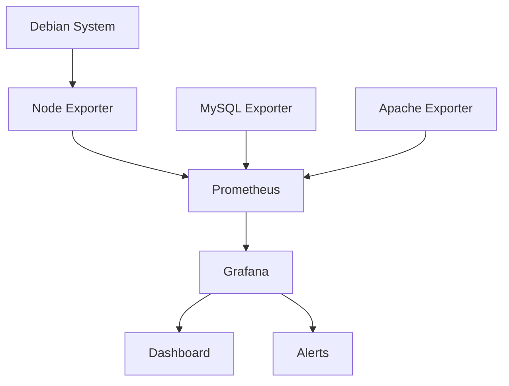

# Debian System Monitoring

## Introduction

System monitoring is a critical aspect of Debian system administration that allows you to track resource usage, identify performance bottlenecks, troubleshoot issues, and ensure your system is operating efficiently. By implementing proper monitoring practices, you can detect problems before they impact users, plan for capacity upgrades, and maintain a stable and reliable environment.

In this guide, we'll explore various tools and techniques for monitoring Debian systems, from basic command-line utilities to more advanced monitoring solutions. We'll focus on practical approaches that you can implement immediately to gain insights into your system's health and performance.

## Basic System Monitoring Tools

### 1. `top` - Process Monitoring in Real-Time

The `top` command provides a dynamic real-time view of running processes and system resource usage:

```bash
top
```

**Sample output:**

```
top - 14:23:42 up 15 days,  5:23,  2 users,  load average: 0.14, 0.05, 0.01
Tasks: 213 total,   1 running, 212 sleeping,   0 stopped,   0 zombie
%Cpu(s):  1.7 us,  0.3 sy,  0.0 ni, 98.0 id,  0.0 wa,  0.0 hi,  0.0 si,  0.0 st
MiB Mem :   7952.8 total,   5437.5 free,   1307.2 used,   1208.1 buff/cache
MiB Swap:   2048.0 total,   2048.0 free,      0.0 used.   6367.4 avail Mem 

  PID USER      PR  NI    VIRT    RES    SHR S  %CPU  %MEM     TIME+ COMMAND                       
 1542 www-data  20   0  723524 119708  76600 S   1.0   1.5   0:02.73 apache2                      
 1234 mysql     20   0 1365492 142336  13200 S   0.7   1.7   5:12.21 mysqld                      
 1003 root      20   0   11828   3880   3236 S   0.3   0.0   0:00.56 sshd                       
```

Key sections in the output:
- **System summary**: Uptime, users, and load averages (1, 5, and 15-minute averages)
- **Task summary**: Total number of processes and their states
- **CPU usage**: Breakdown of CPU utilization
- **Memory usage**: Physical and swap memory statistics
- **Process list**: Information about each process

**Common keyboard shortcuts within top:**
- `q` - Quit the program
- `h` - Display help
- `k` - Kill a process (requires PID)
- `r` - Renice a process (change priority)
- `1` - Toggle display of individual CPU cores
- `M` - Sort processes by memory usage
- `P` - Sort processes by CPU usage (default)

### 2. `htop` - Enhanced Process Viewer

`htop` is an improved version of `top` with a more intuitive interface, color highlighting, and better interactivity:

```bash
# Install htop if not already available
sudo apt install htop

# Run htop
htop
```

`htop` offers several advantages over `top`:
- Color-coded output for better readability
- Visual representation of CPU, memory, and swap usage
- Mouse support for navigation and selection
- Horizontal and vertical scrolling
- Ability to view process trees

### 3. `free` - Memory Usage

The `free` command displays the total amount of free and used physical and swap memory:

```bash
free -h
```

**Sample output:**

```
              total        used        free      shared  buff/cache   available
Mem:          7.8Gi       1.3Gi       5.3Gi        18Mi       1.2Gi       6.2Gi
Swap:         2.0Gi          0B       2.0Gi
```

The `-h` flag presents the output in a human-readable format (with units like MB or GB).

### 4. `df` - Disk Usage

The `df` command reports file system disk space usage:

```bash
df -h
```

**Sample output:**

```
Filesystem      Size  Used Avail Use% Mounted on
/dev/sda1        50G   12G   36G  25% /
/dev/sda2       450G  208G  219G  49% /home
tmpfs           3.9G     0  3.9G   0% /dev/shm
```

The `-h` flag displays sizes in a human-readable format.

### 5. `iostat` - I/O Statistics

`iostat` reports CPU statistics and I/O statistics for devices and partitions:

```bash
# Install sysstat package if not already available
sudo apt install sysstat

# Display I/O statistics
iostat -x 1
```

**Sample output:**

```
Linux 5.10.0-15-amd64 (debian-server)    03/13/2025    _x86_64_    (4 CPU)

avg-cpu:  %user   %nice %system %iowait  %steal   %idle
           2.03    0.00    0.52    0.25    0.00   97.19

Device            r/s     w/s     rkB/s     wkB/s   rrqm/s   wrqm/s  %util
sda              0.28    1.21      9.34     28.44     0.00     0.98   0.42
sdb              0.00    0.00      0.00      0.00     0.00     0.00   0.00
```

The `-x` flag provides extended statistics, and the numeric parameter (1) specifies the interval between reports in seconds.

## Network Monitoring

### 1. `netstat` - Network Statistics

`netstat` displays network connections, routing tables, interface statistics, and more:

```bash
# Display all active connections
netstat -tuln
```

**Sample output:**

```
Active Internet connections (only servers)
Proto Recv-Q Send-Q Local Address           Foreign Address         State      
tcp        0      0 127.0.0.1:3306          0.0.0.0:*               LISTEN     
tcp        0      0 0.0.0.0:22              0.0.0.0:*               LISTEN     
tcp        0      0 0.0.0.0:80              0.0.0.0:*               LISTEN     
tcp6       0      0 :::22                   :::*                    LISTEN     
udp        0      0 0.0.0.0:68              0.0.0.0:*                          
```

Useful flags:
- `-t`: Display TCP connections
- `-u`: Display UDP connections
- `-l`: Show only listening sockets
- `-n`: Show numerical addresses instead of resolving hostnames
- `-p`: Show the PID and name of the program to which each socket belongs

### 2. `ss` - Socket Statistics

`ss` is a modern replacement for `netstat` that provides more information and better performance:

```bash
# Display all TCP sockets
ss -tuln
```

### 3. `iftop` - Network Bandwidth Monitoring

`iftop` monitors bandwidth usage on network interfaces:

```bash
# Install iftop if not already available
sudo apt install iftop

# Monitor the eth0 interface
sudo iftop -i eth0
```

## Advanced Monitoring Tools

### 1. `atop` - System and Process Monitor

`atop` provides comprehensive system and process monitoring with historical data:

```bash
# Install atop if not already available
sudo apt install atop

# Run atop
atop
```

`atop` records system and process activity for later analysis, which is particularly useful for investigating intermittent issues.

### 2. `dstat` - Versatile Resource Statistics

`dstat` combines the functionality of several monitoring tools in one:

```bash
# Install dstat if not already available
sudo apt install dstat

# Show CPU, disk, network, paging, and system statistics
dstat -cdnpm
```

**Sample output:**

```
----total-cpu-usage---- -dsk/total- -net/total- ---paging-- ---system--
usr sys idl wai hiq siq| read  writ| recv  send|  in   out | int   csw 
  2   1  97   0   0   0|  15k   42k|   0     0 |   0     0 | 245   456 
  3   1  96   0   0   0|   0    76k| 166B  178B|   0     0 | 322   544 
  1   0  99   0   0   0|   0     0 | 124B  178B|   0     0 | 290   467 
```

### 3. `glances` - Cross-platform System Monitoring

`glances` provides a comprehensive overview of system resources with a web interface option:

```bash
# Install glances if not already available
sudo apt install glances

# Run glances
glances
```

`glances` can also run in web server mode, allowing you to monitor the system remotely:

```bash
# Run glances as a web server
glances -w
```

Then access `http://your-server-ip:61208` in a web browser.

## System Logs Monitoring

Logs provide valuable information about system events, errors, and activities.

### 1. `journalctl` - Systemd Journal

For systemd-based Debian systems, `journalctl` is the primary tool for accessing and querying the systemd journal:

```bash
# View all logs
journalctl

# View logs for a specific service
journalctl -u apache2

# View logs since a specific time
journalctl --since "2025-03-12 10:00:00"

# Follow new log entries (like tail -f)
journalctl -f
```

### 2. Traditional Log Files

Traditional log files are stored in the `/var/log` directory. Common log files include:

```bash
# View system messages
less /var/log/syslog

# View authentication logs
less /var/log/auth.log

# View kernel messages
less /var/log/kern.log

# Follow new entries in a log file
tail -f /var/log/syslog
```

## Service Monitoring

### 1. `systemctl` - Managing and Monitoring Services

`systemctl` is used to control and monitor systemd services:

```bash
# Check the status of a service
systemctl status apache2

# List all running services
systemctl list-units --type=service --state=running
```

**Sample output of `systemctl status`:**

```
● apache2.service - The Apache HTTP Server
     Loaded: loaded (/lib/systemd/system/apache2.service; enabled; vendor preset: enabled)
     Active: active (running) since Wed 2025-03-12 08:24:32 UTC; 1 day 6h ago
   Main PID: 1234 (apache2)
      Tasks: 55 (limit: 4915)
     Memory: 22.0M
        CPU: 3min 24.211s
     CGroup: /system.slice/apache2.service
             ├─1234 /usr/sbin/apache2 -k start
             ├─1235 /usr/sbin/apache2 -k start
             └─1236 /usr/sbin/apache2 -k start
```

## Visualization with Monitoring Systems

For long-term monitoring and visualization, consider implementing dedicated monitoring systems:

### 1. Prometheus and Grafana

Prometheus collects metrics and Grafana provides visualization:

```bash
# Install Prometheus
sudo apt install prometheus

# Install Grafana
wget -q -O - https://packages.grafana.com/gpg.key | sudo apt-key add -
echo "deb https://packages.grafana.com/oss/deb stable main" | sudo tee /etc/apt/sources.list.d/grafana.list
sudo apt update
sudo apt install grafana

# Start and enable services
sudo systemctl start prometheus
sudo systemctl enable prometheus
sudo systemctl start grafana-server
sudo systemctl enable grafana-server
```

After installation, you can:
- Access Prometheus at `http://your-server-ip:9090`
- Access Grafana at `http://your-server-ip:3000` (default login: admin/admin)

### 2. Setting Up a Simple Dashboard

Here's a basic architecture for a monitoring setup:



## Creating a Custom Monitoring Script

Sometimes you may need custom monitoring for specific needs. Here's a simple bash script that collects basic system metrics and emails alerts:

```bash
#!/bin/bash

# System Monitoring Script

# Get system metrics
LOAD=$(cat /proc/loadavg | awk '{print $1}')
MEMORY=$(free -m | grep Mem | awk '{print $3}')
DISK=$(df -h / | grep / | awk '{print $5}' | sed 's/%//g')

# Set thresholds
LOAD_THRESHOLD=5
MEMORY_THRESHOLD=6000  # In MB
DISK_THRESHOLD=80      # In percentage

# Initialize alert message
ALERT=""

# Check load average
if (( $(echo "$LOAD > $LOAD_THRESHOLD" | bc -l) )); then
    ALERT="$ALERT
High load average: $LOAD"
fi

# Check memory usage
if [ $MEMORY -gt $MEMORY_THRESHOLD ]; then
    ALERT="$ALERT
High memory usage: $MEMORY MB"
fi

# Check disk usage
if [ $DISK -gt $DISK_THRESHOLD ]; then
    ALERT="$ALERT
High disk usage: $DISK%"
fi

# Send alert if necessary
if [ ! -z "$ALERT" ]; then
    echo -e "System Alert on $(hostname) at $(date)
$ALERT" | mail -s "System Alert: $(hostname)" admin@example.com
fi

# Log metrics regardless of alerts
echo "$(date) - Load: $LOAD, Memory: $MEMORY MB, Disk: $DISK%" >> /var/log/system_metrics.log
```

Save this script as `/usr/local/bin/monitor.sh`, make it executable with `chmod +x /usr/local/bin/monitor.sh`, and add it to the crontab to run every 5 minutes:

```bash
*/5 * * * * /usr/local/bin/monitor.sh
```

## Best Practices for System Monitoring

1. **Establish Baselines**: Monitor your system during normal operation to establish baseline metrics for comparison during troubleshooting.

2. **Set Up Alerts**: Configure alerts for critical metrics to be notified when thresholds are exceeded.

3. **Monitor Trends**: Look for trends over time rather than just current values to anticipate issues before they become critical.

4. **Comprehensive Coverage**: Monitor all aspects of your system: CPU, memory, disk, network, services, and application-specific metrics.

5. **Centralized Monitoring**: For multiple systems, implement centralized monitoring to view all systems from one dashboard.

6. **Regular Review**: Regularly review and adjust your monitoring setup as your system changes.

7. **Document Abnormalities**: Keep a record of system abnormalities and their resolutions for future reference.

## Summary

Effective system monitoring is essential for maintaining a healthy and responsive Debian system. In this guide, we've covered:

- Basic command-line monitoring tools like `top`, `htop`, `free`, and `df`
- Network monitoring with `netstat`, `ss`, and `iftop`
- Advanced monitoring tools such as `atop`, `dstat`, and `glances`
- System logs monitoring using `journalctl` and traditional log files
- Service monitoring with `systemctl`
- Implementing dedicated monitoring systems like Prometheus and Grafana
- Creating custom monitoring scripts for specific needs
- Best practices for effective system monitoring

By implementing these monitoring techniques, you'll be better equipped to maintain system health, identify issues early, and ensure optimal performance of your Debian systems.

## Exercises and Additional Resources

### Exercises

1. Install and compare the outputs of `top`, `htop`, and `glances`. Which do you find most useful for your needs?

2. Write a bash script that monitors disk space and sends an alert when any filesystem exceeds 80% usage.

3. Set up Prometheus and Grafana to monitor a web server, creating a dashboard that shows CPU, memory, disk, and HTTP request metrics.

4. Create a cron job that runs `vmstat` every hour and appends the output to a log file for historical analysis.

5. Use `journalctl` to find and analyze error messages from a specific service over the past week.

### Additional Resources

- [Debian System Administrator's Manual](https://www.debian.org/doc/manuals/debian-handbook/)
- [Prometheus Documentation](https://prometheus.io/docs/introduction/overview/)
- [Grafana Documentation](https://grafana.com/docs/)
- [Linux Performance Analysis Tools](https://www.brendangregg.com/linuxperf.html)
- [The Linux Documentation Project](https://tldp.org/)