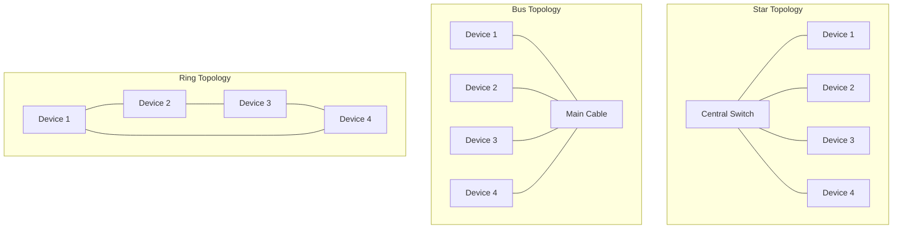
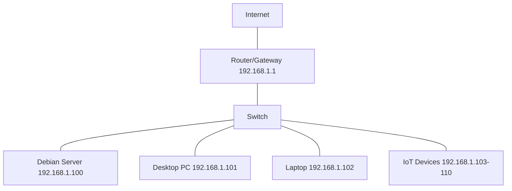

# Debian Network Basics

## Introduction

Networking is a fundamental aspect of modern computing systems. Debian, as a robust and versatile Linux distribution, offers powerful networking capabilities that are essential for system administrators, developers, and even casual users. This guide introduces you to the basics of networking in Debian, providing you with the knowledge to configure, troubleshoot, and optimize network connections on your Debian system.

Whether you're setting up a home server, configuring a development environment, or simply want to understand how your Debian system communicates with the internet, this guide will help you build a solid foundation in Debian networking concepts.

## Network Configuration Files

Debian uses several key files to manage network configurations. Understanding these files is crucial for effective network management.

### /etc/network/interfaces

This is the primary network configuration file in Debian. It defines network interfaces and how they should be initialized.

```bash
# The loopback network interface
auto lo
iface lo inet loopback

# The primary network interface
auto eth0
iface eth0 inet dhcp

# Example of a static IP configuration
#auto eth0
#iface eth0 inet static
#    address 192.168.1.100
#    netmask 255.255.255.0
#    gateway 192.168.1.1
#    dns-nameservers 8.8.8.8 8.8.4.4
```

### /etc/resolv.conf

This file configures DNS resolution, telling your system which DNS servers to use.

```bash
# Generated by NetworkManager
search localdomain
nameserver 192.168.1.1
nameserver 8.8.8.8
```

### /etc/hosts

The hosts file maps hostnames to IP addresses, providing a local DNS-like service.

```bash
127.0.0.1       localhost
127.0.1.1       debian-server

# The following lines are desirable for IPv6 capable hosts
::1             localhost ip6-localhost ip6-loopback
ff02::1         ip6-allnodes
ff02::2         ip6-allrouters

# Custom entries
192.168.1.10    file-server
192.168.1.20    print-server
```

## Network Interface Management

### Checking Network Interfaces

The `ip` command replaces older tools like `ifconfig` and provides comprehensive network interface information:

```bash
ip addr show
```

Example output:

```
1: lo: <LOOPBACK,UP,LOWER_UP> mtu 65536 qdisc noqueue state UNKNOWN group default qlen 1000
    link/loopback 00:00:00:00:00:00 brd 00:00:00:00:00:00
    inet 127.0.0.1/8 scope host lo
       valid_lft forever preferred_lft forever
    inet6 ::1/128 scope host 
       valid_lft forever preferred_lft forever
2: eth0: <BROADCAST,MULTICAST,UP,LOWER_UP> mtu 1500 qdisc pfifo_fast state UP group default qlen 1000
    link/ether 52:54:00:12:34:56 brd ff:ff:ff:ff:ff:ff
    inet 192.168.1.100/24 brd 192.168.1.255 scope global dynamic eth0
       valid_lft 86398sec preferred_lft 86398sec
    inet6 fe80::5054:ff:fe12:3456/64 scope link 
       valid_lft forever preferred_lft forever
```

### Managing Network Interfaces

You can bring interfaces up or down with:

```bash
# Bring up an interface
sudo ip link set eth0 up

# Bring down an interface
sudo ip link set eth0 down
```

### Configuring IP Addresses

Set a temporary IP address (will not persist after reboot):

```bash
sudo ip addr add 192.168.1.100/24 dev eth0
```

To make permanent changes, edit `/etc/network/interfaces` and restart networking:

```bash
sudo systemctl restart networking
```

## Network Services

### Network Manager

For desktop installations, Debian typically uses Network Manager for easier network configuration:

```bash
# Check Network Manager status
systemctl status NetworkManager

# Use nmcli to manage connections
nmcli connection show
nmcli device status
```

### systemd-networkd

Newer Debian installations might use systemd-networkd:

```bash
# Check if systemd-networkd is running
systemctl status systemd-networkd

# Configuration files are in /etc/systemd/network/
```

## Network Diagnostics

### Testing Connectivity

The `ping` command tests basic connectivity:

```bash
ping -c 4 google.com
```

Example output:

```
PING google.com (142.250.185.78) 56(84) bytes of data.
64 bytes from sof02s43-in-f14.1e100.net (142.250.185.78): icmp_seq=1 ttl=116 time=14.5 ms
64 bytes from sof02s43-in-f14.1e100.net (142.250.185.78): icmp_seq=2 ttl=116 time=14.8 ms
64 bytes from sof02s43-in-f14.1e100.net (142.250.185.78): icmp_seq=3 ttl=116 time=15.1 ms
64 bytes from sof02s43-in-f14.1e100.net (142.250.185.78): icmp_seq=4 ttl=116 time=14.4 ms

--- google.com ping statistics ---
4 packets transmitted, 4 received, 0% packet loss, time 3004ms
rtt min/avg/max/mdev = 14.367/14.677/15.088/0.283 ms
```

### Checking Routes

View the routing table with:

```bash
ip route show
```

Example output:

```
default via 192.168.1.1 dev eth0 proto dhcp metric 100
192.168.1.0/24 dev eth0 proto kernel scope link src 192.168.1.100 metric 100
```

### DNS Resolution

Test DNS resolution with:

```bash
# Check if a hostname resolves correctly
host google.com

# More detailed DNS information
dig google.com
```

Example output for `host`:

```
google.com has address 142.250.185.78
google.com has IPv6 address 2a00:1450:4001:830::200e
google.com mail is handled by 10 smtp.google.com.
```

## Network Analysis

### Network Statistics

View network statistics with:

```bash
ss -tuln
```

Example output:

```
Netid  State   Recv-Q  Send-Q    Local Address:Port    Peer Address:Port  Process
udp    UNCONN  0       0         127.0.0.53%lo:53      0.0.0.0:*
udp    UNCONN  0       0         0.0.0.0:67            0.0.0.0:*
tcp    LISTEN  0       128       127.0.0.53%lo:53      0.0.0.0:*
tcp    LISTEN  0       128       0.0.0.0:22            0.0.0.0:*
tcp    LISTEN  0       128       [::]:22               [::]:*
```

### Packet Capturing

For more detailed network analysis, use `tcpdump`:

```bash
# Capture packets on interface eth0
sudo tcpdump -i eth0 -n
```

Example output:

```
tcpdump: verbose output suppressed, use -v or -vv for full protocol decode
listening on eth0, link-type EN10MB (Ethernet), capture size 262144 bytes
15:32:14.628971 IP 192.168.1.100.56789 > 142.250.185.78.443: Flags [P.], seq 1:82, ack 1, win 502, options [nop,nop,TS val 3455919384 ecr 1255804433], length 81
15:32:14.643506 IP 142.250.185.78.443 > 192.168.1.100.56789: Flags [.], ack 82, win 270, options [nop,nop,TS val 1255804448 ecr 3455919384], length 0
```

## Network Topologies

Network topologies define how devices in a network are arranged. Here's a diagram showing common network topologies:



A typical home network with a Debian server might look like this:



## Practical Applications

### Setting Up a DHCP Client

Most Debian installations use DHCP by default. Your configuration in `/etc/network/interfaces` should look like:

```bash
auto eth0
iface eth0 inet dhcp
```

### Configuring Static IP

For servers, a static IP configuration is often preferred:

1. Edit `/etc/network/interfaces`:

```bash
auto eth0
iface eth0 inet static
    address 192.168.1.100
    netmask 255.255.255.0
    gateway 192.168.1.1
    dns-nameservers 8.8.8.8 8.8.4.4
```

2. Apply changes:

```bash
sudo systemctl restart networking
```

### Setting Up a Simple Firewall

Debian uses `iptables` for firewall configuration, with `ufw` providing a simpler interface:

1. Install UFW (Uncomplicated Firewall):

```bash
sudo apt update
sudo apt install ufw
```

2. Configure basic rules:

```bash
# Allow SSH connections
sudo ufw allow ssh

# Allow HTTP and HTTPS
sudo ufw allow http
sudo ufw allow https

# Enable the firewall
sudo ufw enable
```

3. Check status:

```bash
sudo ufw status verbose
```

Example output:

```
Status: active
Logging: on (low)
Default: deny (incoming), allow (outgoing), disabled (routed)
New profiles: skip

To                         Action      From
--                         ------      ----
22/tcp                     ALLOW IN    Anywhere
80/tcp                     ALLOW IN    Anywhere
443/tcp                    ALLOW IN    Anywhere
22/tcp (v6)                ALLOW IN    Anywhere (v6)
80/tcp (v6)                ALLOW IN    Anywhere (v6)
443/tcp (v6)               ALLOW IN    Anywhere (v6)
```

## Troubleshooting Network Issues

### Common Issues and Solutions

1. **No Internet Connection**:
   - Check physical connections
   - Verify IP configuration: `ip addr show`
   - Test gateway connectivity: `ping 192.168.1.1`
   - Check DNS: `ping google.com`

2. **DNS Resolution Problems**:
   - Check `/etc/resolv.conf`
   - Try alternate DNS servers: `echo "nameserver 8.8.8.8" | sudo tee /etc/resolv.conf`
   - Test resolution: `host debian.org`

3. **Cannot Connect to a Specific Service**:
   - Check if the service is running: `systemctl status service-name`
   - Verify firewall rules: `sudo ufw status`
   - Test port connectivity: `telnet host port` or `nc -zv host port`

### Troubleshooting Commands

Here's a systematic approach to network troubleshooting:

```bash
# 1. Check interface status
ip addr show

# 2. Check default gateway
ip route show

# 3. Test gateway connectivity
ping -c 4 $(ip route | grep default | awk '{print $3}')

# 4. Test DNS resolution
host debian.org

# 5. Check open ports
ss -tuln

# 6. Trace the route to a destination
traceroute debian.org
```

## Summary

In this guide, we covered the fundamental aspects of networking in Debian:

- Network configuration files and their purposes
- Managing network interfaces
- Basic diagnostic tools
- Network topologies
- Practical configuration examples
- Troubleshooting common issues

Mastering these basics provides a solid foundation for more advanced networking tasks in Debian. As you become more comfortable with these concepts, you can explore more complex configurations like VPNs, network bridges, and advanced routing.

## Additional Resources and Exercises

### Resources

- [Debian Network Configuration Documentation](https://wiki.debian.org/NetworkConfiguration)
- [The Linux Documentation Project: Networking](https://tldp.org/HOWTO/NET-3-HOWTO.html)
- [Man pages for networking tools](https://manpages.debian.org/buster/net-tools/index.html)

### Exercises

1. **Basic Configuration**:
   - Configure your Debian system with a static IP address
   - Set up custom DNS servers
   - Test connectivity with various tools

2. **Network Analysis**:
   - Use `tcpdump` to capture HTTP traffic to a website
   - Analyze the output to understand the TCP handshake process

3. **Firewall Configuration**:
   - Create a simple firewall policy with UFW
   - Allow specific services and block others
   - Test the configuration

4. **Routing Exercise**:
   - Set up a custom route to a specific network
   - Test the route with ping and traceroute

By working through these exercises, you'll gain practical experience with Debian networking concepts and be better prepared for real-world networking tasks.