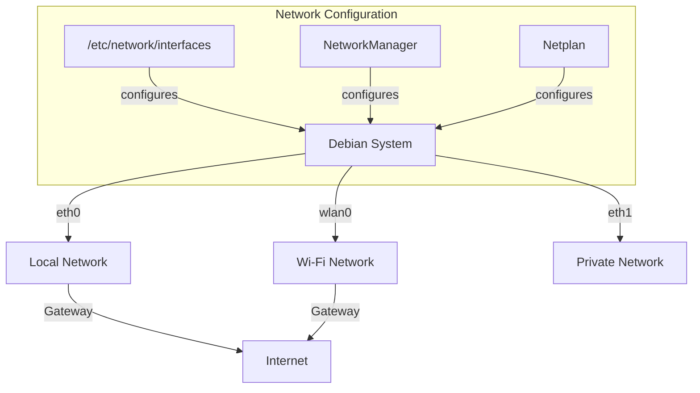

# Debian Network Configuration

## Introduction

Networking is an essential aspect of any modern operating system. Debian, being one of the most popular Linux distributions, provides several tools and methods to configure your network connections. Whether you're setting up a home server, configuring a workstation, or preparing a system for deployment, understanding how to properly configure networking in Debian is a fundamental skill.

In this guide, we'll explore different methods of network configuration in Debian, from traditional approaches to modern tools. By the end of this tutorial, you'll be able to confidently set up and manage network connections on your Debian system.

## Network Configuration Files

### The Traditional Approach: /etc/network/interfaces

Debian has traditionally used the `/etc/network/interfaces` file to define network interfaces. This configuration file contains information about how network interfaces should be initialized and configured.

Let's examine a basic configuration:

```bash
# The loopback network interface
auto lo
iface lo inet loopback

# The primary network interface
auto eth0
iface eth0 inet static
    address 192.168.1.100
    netmask 255.255.255.0
    gateway 192.168.1.1
    dns-nameservers 8.8.8.8 8.8.4.4
```

In this example:
- `auto lo` and `auto eth0` tell the system to bring up these interfaces automatically at boot time
- `iface eth0 inet static` indicates that eth0 will use a static IP configuration
- We then define the IP address, netmask, gateway, and DNS servers

For a dynamic IP using DHCP, the configuration is simpler:

```bash
auto eth0
iface eth0 inet dhcp
```

### Multiple Network Interfaces

If your system has multiple network interfaces, you can configure them all in the same file:

```bash
# First Ethernet interface
auto eth0
iface eth0 inet static
    address 192.168.1.100
    netmask 255.255.255.0
    gateway 192.168.1.1

# Second Ethernet interface
auto eth1
iface eth1 inet static
    address 10.0.0.100
    netmask 255.255.255.0
```

### Working with Wireless Networks

For wireless networks, you'll need to include additional parameters:

```bash
auto wlan0
iface wlan0 inet dhcp
    wpa-ssid "YourNetworkName"
    wpa-psk "YourNetworkPassword"
```

## Modern Networking with Netplan

Starting with newer versions of Debian (especially Debian 10 Buster and later), Netplan is available as an alternative configuration method. Netplan uses YAML files to define network configuration.

A typical Netplan configuration file is located at `/etc/netplan/01-netcfg.yaml`:

```yaml
network:
  version: 2
  renderer: networkd
  ethernets:
    enp3s0:
      dhcp4: no
      addresses: [192.168.1.100/24]
      gateway4: 192.168.1.1
      nameservers:
        addresses: [8.8.8.8, 8.8.4.4]
```

After making changes to your Netplan configuration, apply them with:

```bash
sudo netplan apply
```

## Network Command Line Tools

### Using ip Command Suite

Modern Debian systems use the `ip` command suite for network configuration, which is part of the `iproute2` package. Here are some common tasks:

#### Viewing Network Interfaces

```bash
ip addr show
```

Example output:
```
1: lo: <LOOPBACK,UP,LOWER_UP> mtu 65536 qdisc noqueue state UNKNOWN group default qlen 1000
    link/loopback 00:00:00:00:00:00 brd 00:00:00:00:00:00
    inet 127.0.0.1/8 scope host lo
       valid_lft forever preferred_lft forever
2: eth0: <BROADCAST,MULTICAST,UP,LOWER_UP> mtu 1500 qdisc pfifo_fast state UP group default qlen 1000
    link/ether 08:00:27:c8:e4:0c brd ff:ff:ff:ff:ff:ff
    inet 192.168.1.100/24 brd 192.168.1.255 scope global eth0
       valid_lft forever preferred_lft forever
```

#### Adding/Removing IP Addresses

```bash
# Add an IP address
sudo ip addr add 192.168.1.200/24 dev eth0

# Remove an IP address
sudo ip addr del 192.168.1.200/24 dev eth0
```

#### Managing Network Links

```bash
# Bring an interface up
sudo ip link set eth0 up

# Bring an interface down
sudo ip link set eth0 down
```

#### Viewing Routing Table

```bash
ip route show
```

Example output:
```
default via 192.168.1.1 dev eth0 
192.168.1.0/24 dev eth0 proto kernel scope link src 192.168.1.100 
```

#### Adding a Static Route

```bash
sudo ip route add 10.0.0.0/24 via 192.168.1.254
```

### Using ifupdown Commands

Debian also provides the traditional `ifup` and `ifdown` commands which read the `/etc/network/interfaces` file:

```bash
# Bring up an interface
sudo ifup eth0

# Bring down an interface
sudo ifdown eth0

# Restart an interface
sudo ifdown eth0 && sudo ifup eth0
```

## Network Manager for Desktop Environments

If you're using Debian with a desktop environment like GNOME or KDE, NetworkManager provides a user-friendly GUI for network configuration.

You can also use the `nmcli` command to manage NetworkManager from the terminal:

```bash
# Show all connections
nmcli connection show

# Connect to a Wi-Fi network
nmcli device wifi connect "YourNetworkName" password "YourNetworkPassword"

# Create a new connection
nmcli connection add type ethernet con-name "my-ethernet" ifname eth0
```

## DNS Configuration

### Configuring Resolv.conf

DNS servers are typically defined in `/etc/resolv.conf`:

```bash
nameserver 8.8.8.8
nameserver 8.8.4.4
search mydomain.local
```

However, this file is often managed automatically by DHCP or other services. For permanent DNS configuration, consider using one of these approaches:

1. Set DNS in `/etc/network/interfaces` as shown earlier
2. Use `/etc/systemd/resolved.conf` if you're using systemd-resolved
3. Configure NetworkManager's DNS settings

## Network Testing and Troubleshooting

### Basic Connectivity Tests

```bash
# Test basic connectivity
ping 8.8.8.8

# Test DNS resolution
ping google.com

# Trace route to a destination
traceroute google.com
```

### Network Interface Information

The `ip` command provides detailed information:

```bash
# Show link status and statistics
ip -s link show eth0

# Show IP addresses
ip addr show eth0
```

### Network Diagnostics

```bash
# Display all active connections
ss -tuln

# Show network statistics
netstat -i

# Check if ports are open
sudo nmap -sT -O localhost
```

## Network Service Management

Many network services on Debian are managed through systemd:

```bash
# Check status of networking service
sudo systemctl status networking

# Restart networking
sudo systemctl restart networking

# Enable networking to start at boot
sudo systemctl enable networking
```

## Network Visualization

Understanding the network topology can be helpful. Here's a simple diagram of common Debian network configurations:



## Advanced Topics

### Bridging Interfaces

To create a network bridge, modify your `/etc/network/interfaces`:

```bash
auto br0
iface br0 inet static
    address 192.168.1.100
    netmask 255.255.255.0
    gateway 192.168.1.1
    bridge_ports eth0 eth1
    bridge_stp on
    bridge_fd 0
```

### VLAN Configuration

To configure VLANs:

```bash
# Load VLAN module
sudo modprobe 8021q

# Create VLAN interface
sudo ip link add link eth0 name eth0.10 type vlan id 10

# Configure the new interface
sudo ip addr add 192.168.10.1/24 dev eth0.10
sudo ip link set eth0.10 up
```

For persistent configuration, add to `/etc/network/interfaces`:

```bash
auto eth0.10
iface eth0.10 inet static
    address 192.168.10.1
    netmask 255.255.255.0
    vlan-raw-device eth0
```

## Summary

In this guide, we've explored various methods of configuring networking on Debian systems:

1. Traditional configuration using `/etc/network/interfaces`
2. Modern configuration using Netplan
3. Command-line management with the `ip` command suite
4. Desktop configuration with NetworkManager
5. Advanced topics like bridging and VLANs

Networking in Debian provides flexibility and power for both server and desktop environments. By understanding these configuration methods, you can effectively set up your Debian system for any networking scenario.

## Exercises

1. Configure a static IP address using the `/etc/network/interfaces` file
2. Set up a DHCP configuration using Netplan
3. Create a bridge between two network interfaces
4. Configure a wireless connection using the command line
5. Set up a VLAN for network segmentation

## Additional Resources

- [Debian Wiki: NetworkConfiguration](https://wiki.debian.org/NetworkConfiguration)
- [Debian Handbook: Networking](https://debian-handbook.info/browse/stable/sect.network-config.html)
- [Man pages: interfaces(5)](https://manpages.debian.org/buster/ifupdown/interfaces.5.en.html)
- [Man pages: ip(8)](https://manpages.debian.org/buster/iproute2/ip.8.en.html)
- [Netplan Documentation](https://netplan.io/reference)