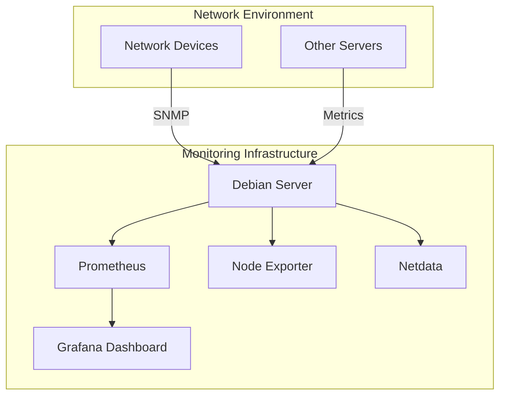

## Debian Network Monitoring

Network monitoring is an essential practice for system administrators and network engineers to ensure network reliability, security, and optimal performance. On Debian systems, a rich ecosystem of monitoring tools allows you to track connections, analyze traffic patterns, identify bottlenecks, and detect potential security issues. This guide will walk you through the most useful network monitoring tools and techniques for Debian systems, from simple command-line utilities to comprehensive monitoring solutions.

## Basic Network Monitoring Tools

Before diving into complex monitoring setups, let's explore some basic command-line tools that come pre-installed or are readily available in Debian repositories.

### 1. `ping` - Basic Connectivity Testing

The `ping` command is one of the most fundamental network diagnostic tools that sends ICMP echo requests to a target host.

```bash
# Basic usage
ping google.com

# Limit the number of packets
ping -c 4 google.com

# Specify interval between packets (in seconds)
ping -i 2 google.com
```

Example output:
```
PING google.com (142.250.185.78) 56(84) bytes of data.
64 bytes from waw02s22-in-f14.1e100.net (142.250.185.78): icmp_seq=1 ttl=116 time=9.27 ms
64 bytes from waw02s22-in-f14.1e100.net (142.250.185.78): icmp_seq=2 ttl=116 time=9.48 ms
64 bytes from waw02s22-in-f14.1e100.net (142.250.185.78): icmp_seq=3 ttl=116 time=9.63 ms
64 bytes from waw02s22-in-f14.1e100.net (142.250.185.78): icmp_seq=4 ttl=116 time=9.55 ms

--- google.com ping statistics ---
4 packets transmitted, 4 received, 0% packet loss, time 3005ms
rtt min/avg/max/mdev = 9.268/9.483/9.634/0.138 ms
```

### 2. `traceroute` - Tracing Network Paths

`traceroute` shows the path packets take to reach a destination, helping you identify routing issues.

```bash
# Install traceroute if not already available
sudo apt update
sudo apt install traceroute

# Basic usage
traceroute google.com
```

Example output:
```
traceroute to google.com (142.250.185.78), 30 hops max, 60 byte packets
 1  _gateway (192.168.1.1)  0.366 ms  0.328 ms  0.307 ms
 2  10.0.0.1 (10.0.0.1)  9.391 ms  9.366 ms  9.351 ms
 3  172.16.35.1 (172.16.35.1)  10.123 ms  10.109 ms  10.093 ms
 4  * * *
 5  142.250.185.78 (142.250.185.78)  9.429 ms  9.456 ms  9.439 ms
```

### 3. `netstat` - Network Statistics

The `netstat` command displays network connections, routing tables, interface statistics, and more.

```bash
# Install net-tools package if not already available
sudo apt update
sudo apt install net-tools

# Show all active connections
netstat -a

# Show only TCP connections
netstat -at

# Show listening ports
netstat -l

# Display with numeric addresses and ports
netstat -an

# Show process name/PID using the connection
netstat -p
```

Example output (partial):
```
Active Internet connections (servers and established)
Proto Recv-Q Send-Q Local Address           Foreign Address         State       PID/Program name
tcp        0      0 0.0.0.0:22              0.0.0.0:*               LISTEN      848/sshd
tcp        0      0 127.0.0.1:631           0.0.0.0:*               LISTEN      847/cupsd
tcp        0      0 192.168.1.5:22          192.168.1.10:49123      ESTABLISHED 1843/sshd
```

### 4. `ss` - Socket Statistics

`ss` is a more modern replacement for `netstat` with similar functionality but better performance.

```bash
# Show all connections
ss

# Show listening TCP sockets
ss -lt

# Show established TCP connections
ss -t state established

# Show detailed socket information
ss -i

# Show process using the socket
ss -p
```

Example output:
```
Netid  State   Recv-Q  Send-Q   Local Address:Port     Peer Address:Port   Process
tcp    ESTAB   0       0        192.168.1.5:ssh        192.168.1.10:49123  users:(("sshd",pid=1843,fd=4))
tcp    LISTEN  0       128      0.0.0.0:ssh            0.0.0.0:*           users:(("sshd",pid=848,fd=3))
tcp    LISTEN  0       5        127.0.0.1:ipp          0.0.0.0:*           users:(("cupsd",pid=847,fd=7))
```

## Advanced Network Monitoring Tools

Let's explore more sophisticated tools that provide deeper insights into your network.

### 1. `iftop` - Bandwidth Monitoring

`iftop` displays bandwidth usage on an interface by host, allowing you to see which connections are consuming your bandwidth.

```bash
# Install iftop
sudo apt update
sudo apt install iftop

# Monitor default interface
sudo iftop

# Monitor specific interface
sudo iftop -i eth0

# Don't resolve hostnames
sudo iftop -n
```

`iftop` provides a real-time display that looks like this:

```
                    12.5Kb           25.0Kb           37.5Kb           50.0Kb     
└───────────────────┴───────────────────┴───────────────────┴───────────────────┘
192.168.1.5                       => 192.168.1.10                   2.46Kb  1.23Kb
                                  <=                                1.84Kb  921b 
192.168.1.5                       => dns.google                     382b    191b 
                                  <=                                574b    287b 
```

### 2. `tcpdump` - Packet Analyzer

`tcpdump` is a powerful command-line packet analyzer that can capture and display packet contents.

```bash
# Install tcpdump
sudo apt update
sudo apt install tcpdump

# Capture packets on all interfaces
sudo tcpdump

# Capture packets on specific interface
sudo tcpdump -i eth0

# Capture packets from/to a specific host
sudo tcpdump host 192.168.1.10

# Capture specific protocol
sudo tcpdump tcp

# Capture specific port
sudo tcpdump port 80

# Save capture to a file
sudo tcpdump -w capture.pcap
```

Example output:
```
13:45:17.798321 IP 192.168.1.5.22 > 192.168.1.10.49123: Flags [P.], seq 1546841:1547037, ack 3077, win 501, length 196
13:45:17.798552 IP 192.168.1.10.49123 > 192.168.1.5.22: Flags [.], ack 1547037, win 8192, length 0
13:45:18.090498 IP 192.168.1.5.40326 > dns.google.53: 22510+ [1au] A? debian.org. (39)
13:45:18.105461 IP dns.google.53 > 192.168.1.5.40326: 22510 1/0/1 A 149.20.4.15 (55)
```

### 3. `nmap` - Network Scanner

`nmap` is a versatile network scanner that can discover hosts and services on a network.

```bash
# Install nmap
sudo apt update
sudo apt install nmap

# Scan a single host
nmap 192.168.1.10

# Scan an entire network
nmap 192.168.1.0/24

# Quick scan
nmap -F 192.168.1.0/24

# Detect operating system
sudo nmap -O 192.168.1.10

# Scan for specific ports
nmap -p 22,80,443 192.168.1.10
```

Example output:
```
Nmap scan report for 192.168.1.10
Host is up (0.0020s latency).
Not shown: 996 closed ports
PORT     STATE SERVICE
22/tcp   open  ssh
80/tcp   open  http
443/tcp  open  https
8080/tcp open  http-proxy
```

### 4. `iptraf-ng` - Interactive Network Monitor

`iptraf-ng` is an interactive, colorful IP traffic monitor that shows detailed network statistics.

```bash
# Install iptraf-ng
sudo apt update
sudo apt install iptraf-ng

# Start iptraf-ng
sudo iptraf-ng
```

`iptraf-ng` provides an interactive menu-driven interface that displays various network statistics, including packet counts, byte counts, TCP flag information, and more.

## Comprehensive Network Monitoring Solutions

For ongoing, systematic network monitoring, consider these more comprehensive solutions.

### 1. Prometheus + Node Exporter

Prometheus is a powerful monitoring system with an integrated time-series database. When combined with Node Exporter, it can collect and store detailed network metrics.

#### Installation and Basic Setup

```bash
# Install Node Exporter
sudo apt update
sudo apt install prometheus-node-exporter

# Install Prometheus
sudo apt install prometheus
```

After installation, Node Exporter will expose network metrics that Prometheus can scrape and store. You can configure Prometheus by editing `/etc/prometheus/prometheus.yml`:

```yaml
global:
  scrape_interval: 15s

scrape_configs:
  - job_name: 'node'
    static_configs:
      - targets: ['localhost:9100']
```

Restart Prometheus to apply changes:

```bash
sudo systemctl restart prometheus
```

Access the Prometheus web interface at http://your-server-ip:9090 to query and visualize your network metrics.

### 2. Netdata - Real-time Monitoring

Netdata is a lightweight, real-time performance and health monitoring system that provides detailed insights into network activity.

```bash
# Install dependencies
sudo apt update
sudo apt install wget build-essential libmnl-dev autoconf automake pkg-config curl zlib1g-dev

# Install Netdata
bash <(curl -Ss https://my-netdata.io/kickstart.sh)
```

Once installed, access the Netdata dashboard at http://your-server-ip:19999 to view comprehensive network metrics in real-time.

### 3. Zabbix - Enterprise-grade Monitoring

Zabbix is an enterprise-class open-source monitoring solution designed for real-time monitoring of networks.

```bash
# Add Zabbix repository
wget https://repo.zabbix.com/zabbix/6.0/debian/pool/main/z/zabbix-release/zabbix-release_6.0-1+debian11_all.deb
sudo dpkg -i zabbix-release_6.0-1+debian11_all.deb
sudo apt update

# Install Zabbix server, frontend, and agent
sudo apt install zabbix-server-mysql zabbix-frontend-php zabbix-apache-conf zabbix-sql-scripts zabbix-agent
```

Further configuration involves setting up a MySQL database and configuring the Zabbix server. After setup, access the Zabbix web interface to set up network monitoring.

## Network Visualization with Diagrams

Understanding network topology is essential for effective monitoring. Here's a simple network monitoring setup diagram:



## Practical Monitoring Scenarios

Let's explore some real-world monitoring scenarios and how to address them using the tools we've discussed.

### Scenario 1: Identifying Network Bottlenecks

If users report slow network performance, you can use several tools to identify potential bottlenecks:

1. Check current bandwidth usage with `iftop`:
   ```bash
   sudo iftop -n
   ```

2. Monitor interface statistics with `netstat`:
   ```bash
   netstat -i
   ```

3. Set up ongoing bandwidth monitoring with Netdata to track patterns over time.

### Scenario 2: Troubleshooting Connectivity Issues

When facing connectivity problems between servers:

1. Verify basic connectivity with `ping`:
   ```bash
   ping problematic-server-ip
   ```

2. Trace the network path with `traceroute`:
   ```bash
   traceroute problematic-server-ip
   ```

3. Check for packet loss or routing issues along the path.

4. Examine firewall rules that might be blocking traffic:
   ```bash
   sudo iptables -L
   ```

### Scenario 3: Detecting Unusual Network Activity

For security monitoring:

1. Use `tcpdump` to capture and analyze suspicious traffic:
   ```bash
   sudo tcpdump -i eth0 -n "port not 22"
   ```

2. Monitor established connections with `ss`:
   ```bash
   ss -tupn
   ```

3. Set up Prometheus alerts for unusual traffic patterns or connection spikes.

## Best Practices for Network Monitoring on Debian

1. **Establish Baselines**: Monitor your network during normal operation to establish baseline metrics for comparison during troubleshooting.

2. **Automate Monitoring**: Use tools like Prometheus and Grafana to automate the collection and visualization of network metrics.

3. **Set Up Alerts**: Configure alert thresholds based on your baselines to receive notifications when metrics deviate significantly.

4. **Regular Security Scans**: Schedule regular network scans with tools like `nmap` to identify potential security vulnerabilities.

5. **Document Network Topology**: Maintain up-to-date documentation of your network topology to help with troubleshooting.

6. **Monitor Multiple Metrics**: Don't rely on a single metric. Monitor bandwidth, latency, packet loss, error rates, and connection counts.

7. **Retain Historical Data**: Keep historical monitoring data for trend analysis and capacity planning.

## Summary

Network monitoring on Debian systems can range from simple command-line tools like `ping` and `netstat` to comprehensive solutions like Prometheus and Zabbix. By combining these tools effectively, you can gain valuable insights into your network's performance, security, and reliability.

Starting with basic tools helps you understand the fundamentals of network monitoring, while more advanced solutions provide automation and deeper analytics. Regardless of your network's size or complexity, Debian offers a rich ecosystem of monitoring tools to meet your needs.

## Exercises

1. Set up `iftop` and monitor your network for 30 minutes. Identify the top bandwidth consumers and analyze the traffic patterns.

2. Install Netdata and explore the real-time network monitoring dashboard. Compare the insights provided by Netdata with those from command-line tools.

3. Use `tcpdump` to capture HTTP traffic to a specific website and analyze the packet contents.

4. Configure Prometheus to scrape network metrics from Node Exporter and create a simple Grafana dashboard to visualize the data.

5. Perform a network scan of your local network using `nmap` and document all discovered devices and open ports.

## Additional Resources

- [Debian Network Administration Guide](https://www.debian.org/doc/manuals/debian-reference/ch05.en.html)
- [Prometheus Documentation](https://prometheus.io/docs/introduction/overview/)
- [Netdata Documentation](https://learn.netdata.cloud/docs/overview/)
- [The Linux Documentation Project: Network Monitoring](https://tldp.org/HOWTO/Traffic-Control-HOWTO/monitoring.html)

Remember that effective network monitoring is an ongoing practice that evolves with your network's growth and changing requirements. Regular review and refinement of your monitoring strategy are essential for maintaining optimal network performance and security.
