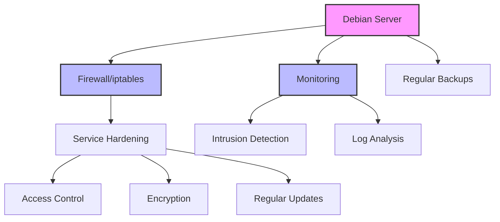

# Debian Network Security

## Introduction

Network security is a critical aspect of maintaining a robust and reliable Debian system. As your Debian server connects to networks and the internet, it becomes exposed to various security threats that could compromise your data and system integrity. This guide will walk you through the essential concepts and practical implementations of network security on Debian systems.

Whether you're running a personal server or managing an enterprise infrastructure, understanding how to properly secure your Debian network will help protect against unauthorized access, data breaches, and service disruptions.

## Understanding Network Security Basics

Before diving into specific tools and configurations, let's understand what network security entails on a Debian system:

1. **Access Control**: Limiting who can connect to your system and what they can access
2. **Traffic Filtering**: Monitoring and controlling incoming and outgoing network traffic
3. **Encryption**: Protecting data during transmission
4. **Monitoring**: Detecting and responding to suspicious activities
5. **Updates and Patches**: Keeping your system protected against known vulnerabilities

## Setting Up a Firewall with iptables

One of the first lines of defense for your Debian network is a properly configured firewall. Debian comes with `iptables`, a powerful packet filtering framework.

### Basic iptables Configuration

Let's create a simple firewall configuration:

```bash
# View current rules
sudo iptables -L

# Set default policies
sudo iptables -P INPUT DROP
sudo iptables -P FORWARD DROP
sudo iptables -P OUTPUT ACCEPT

# Allow established connections
sudo iptables -A INPUT -m conntrack --ctstate ESTABLISHED,RELATED -j ACCEPT

# Allow local loopback traffic
sudo iptables -A INPUT -i lo -j ACCEPT

# Allow SSH (adjust as needed)
sudo iptables -A INPUT -p tcp --dport 22 -j ACCEPT

# Save rules
sudo apt-get install iptables-persistent
sudo netfilter-persistent save
```

The output should look similar to:

```
Chain INPUT (policy DROP)
target     prot opt source               destination         
ACCEPT     all  --  anywhere             anywhere             ctstate RELATED,ESTABLISHED
ACCEPT     all  --  anywhere             anywhere            
ACCEPT     tcp  --  anywhere             anywhere             tcp dpt:ssh

Chain FORWARD (policy DROP)
target     prot opt source               destination         

Chain OUTPUT (policy ACCEPT)
target     prot opt source               destination
```

This basic configuration:
- Drops all incoming traffic by default
- Allows established connections
- Permits SSH connections
- Allows all outgoing traffic

### Using ufw - The Uncomplicated Firewall

For beginners, Debian also offers a more user-friendly firewall interface called `ufw` (Uncomplicated Firewall):

```bash
# Install ufw
sudo apt-get update
sudo apt-get install ufw

# Set default policies
sudo ufw default deny incoming
sudo ufw default allow outgoing

# Allow SSH
sudo ufw allow ssh

# Enable the firewall
sudo ufw enable

# Check status
sudo ufw status verbose
```

Output:

```
Status: active
Logging: on (low)
Default: deny (incoming), allow (outgoing)
New profiles: skip

To                         Action      From
--                         ------      ----
22/tcp                     ALLOW IN    Anywhere
22/tcp (v6)                ALLOW IN    Anywhere (v6)
```

## Securing SSH Access

SSH (Secure Shell) is likely how you'll remotely access your Debian system. Securing it is essential:

### Basic SSH Hardening

Edit the SSH configuration file:

```bash
sudo nano /etc/ssh/sshd_config
```

Make these changes:

```
# Disable root login
PermitRootLogin no

# Use SSH Protocol 2
Protocol 2

# Limit user access (replace 'username' with actual username)
AllowUsers username

# Disable password authentication (after setting up key-based auth)
PasswordAuthentication no

# Set idle timeout (in seconds)
ClientAliveInterval 300
ClientAliveCountMax 2
```

After making changes:

```bash
# Restart SSH service
sudo systemctl restart ssh
```

### Setting Up SSH Key Authentication

Key-based authentication is more secure than passwords:

On your local machine:

```bash
# Generate SSH key pair
ssh-keygen -t ed25519 -C "your_email@example.com"

# Copy public key to server
ssh-copy-id username@your_server_ip
```

## Network Intrusion Detection with Snort

Snort is an open-source intrusion detection system that can monitor network traffic for suspicious activity:

```bash
# Install Snort
sudo apt-get update
sudo apt-get install snort

# Basic configuration will be prompted during installation
# You'll need to specify your network settings
```

After installation, check its status:

```bash
sudo systemctl status snort
```

A basic command to test Snort:

```bash
# Test Snort configuration
sudo snort -T -c /etc/snort/snort.conf
```

## Securing Network Services

### Identifying Running Services

First, identify what network services are running:

```bash
# Check listening ports
sudo ss -tulpn
```

Output might look like:

```
Netid  State   Recv-Q  Send-Q  Local Address:Port  Peer Address:Port  Process
udp    UNCONN  0       0       127.0.0.1:53        0.0.0.0:*          users:(("systemd-resolve",pid=849,fd=12))
tcp    LISTEN  0       128     0.0.0.0:22          0.0.0.0:*          users:(("sshd",pid=1325,fd=3))
tcp    LISTEN  0       128     127.0.0.1:631       0.0.0.0:*          users:(("cupsd",pid=1259,fd=7))
```

### Disabling Unnecessary Services

Remove or disable services you don't need:

```bash
# Disable a service
sudo systemctl disable service_name
sudo systemctl stop service_name

# Remove a package
sudo apt-get remove package_name
```

## Network Encryption with OpenVPN

For secure remote access to your network, consider setting up a VPN:

```bash
# Install OpenVPN
sudo apt-get update
sudo apt-get install openvpn easy-rsa

# Create a directory for OpenVPN keys
mkdir -p ~/openvpn-ca
cp -r /usr/share/easy-rsa/* ~/openvpn-ca/
```

Setting up a full VPN is beyond the scope of this guide, but these are the initial steps.

## Monitoring Network Activity

### Using Tcpdump

Tcpdump allows you to capture and analyze network packets:

```bash
# Install tcpdump
sudo apt-get install tcpdump

# Capture packets on interface eth0
sudo tcpdump -i eth0

# Capture with more details
sudo tcpdump -i eth0 -nnvvS
```

Example output:

```
13:58:47.789795 IP (tos 0x0, ttl 64, id 58288, offset 0, flags [DF], proto TCP (6), length 60)
    192.168.1.102.59274 > 192.168.1.1.22: Flags [S], cksum 0xe5d5 (correct), seq 3677147268, win 64240, options [mss 1460,sackOK,TS val 3136007292 ecr 0,nop,wscale 7], length 0
```

### Using Fail2ban

Fail2ban helps protect against brute force attacks:

```bash
# Install Fail2ban
sudo apt-get install fail2ban

# Create a local configuration file
sudo cp /etc/fail2ban/jail.conf /etc/fail2ban/jail.local
sudo nano /etc/fail2ban/jail.local
```

Add this configuration to protect SSH:

```
[sshd]
enabled = true
port = ssh
filter = sshd
logpath = /var/log/auth.log
maxretry = 3
bantime = 3600
```

Start Fail2ban:

```bash
sudo systemctl restart fail2ban
```

Check the status:

```bash
sudo fail2ban-client status sshd
```

Example output:

```
Status for the jail: sshd
|- Filter
|  |- Currently failed: 0
|  |- Total failed:     0
|  `- Journal matches:  _SYSTEMD_UNIT=sshd.service + _COMM=sshd
`- Actions
   |- Currently banned: 0
   |- Total banned:     0
   `- Banned IP list:
```

## Network Security Best Practices

Let's visualize a comprehensive network security approach:



Here are some additional best practices:

1. **Keep your system updated**:
   ```bash
   sudo apt-get update
   sudo apt-get upgrade
   ```

2. **Regular security audits**:
   ```bash
   # Install Lynis security auditing tool
   sudo apt-get install lynis
   
   # Run audit
   sudo lynis audit system
   ```

3. **Check for rootkits**:
   ```bash
   sudo apt-get install rkhunter
   sudo rkhunter --check
   ```

4. **Monitor auth logs**:
   ```bash
   sudo tail -f /var/log/auth.log
   ```

5. **Network benchmarking and testing**:
   ```bash
   sudo apt-get install nmap
   sudo nmap -sV -p 1-1000 your_server_ip
   ```

## Practical Example: Securing a Web Server

Let's put everything together in a practical example of securing a Debian web server:

1. **Install and configure firewall**:
   ```bash
   sudo apt-get install ufw
   sudo ufw default deny incoming
   sudo ufw default allow outgoing
   sudo ufw allow ssh
   sudo ufw allow http
   sudo ufw allow https
   sudo ufw enable
   ```

2. **Secure SSH access**:
   ```bash
   # Edit SSH config
   sudo nano /etc/ssh/sshd_config
   
   # Changes to make:
   # PermitRootLogin no
   # PasswordAuthentication no
   # Port 2222  # Change from default 22
   
   # Restart SSH
   sudo systemctl restart ssh
   
   # Update firewall for new SSH port
   sudo ufw delete allow ssh
   sudo ufw allow 2222/tcp
   ```

3. **Install and secure web server**:
   ```bash
   sudo apt-get install apache2
   
   # Secure Apache
   sudo nano /etc/apache2/conf-available/security.conf
   
   # Changes to make:
   # ServerTokens Prod
   # ServerSignature Off
   # TraceEnable Off
   
   # Enable and reload
   sudo a2enconf security
   sudo systemctl reload apache2
   ```

4. **Set up monitoring**:
   ```bash
   # Install Fail2ban
   sudo apt-get install fail2ban
   
   # Create local config
   sudo cp /etc/fail2ban/jail.conf /etc/fail2ban/jail.local
   
   # Add Apache jail
   sudo nano /etc/fail2ban/jail.local
   
   # Add:
   # [apache]
   # enabled = true
   # port = http,https
   # filter = apache-auth
   # logpath = /var/log/apache2/error.log
   # maxretry = 3
   
   # Restart Fail2ban
   sudo systemctl restart fail2ban
   ```

5. **Enable HTTPS with Let's Encrypt**:
   ```bash
   sudo apt-get install certbot python3-certbot-apache
   sudo certbot --apache -d yourdomain.com
   ```

## Summary

Securing your Debian network involves multiple layers of protection:

1. **Perimeter security** with firewalls and access controls
2. **Service hardening** for all network-facing services
3. **Encryption** for data in transit
4. **Monitoring** for detecting suspicious activity
5. **Regular updates** to patch security vulnerabilities
6. **Backup and recovery** plans for when things go wrong

By implementing these measures, you'll significantly reduce the attack surface of your Debian system and protect it from most common network threats.

## Additional Resources and Exercises

### Resources

1. [Debian Security Information](https://www.debian.org/security/)
2. [Debian Wiki - Securing Debian Manual](https://wiki.debian.org/SecurityManual)
3. [The Debian Administrator's Handbook](https://debian-handbook.info/)

### Exercises

1. **Basic Firewall Setup**:
   - Install and configure iptables or ufw
   - Create rules to protect SSH and one other service
   - Verify the rules are working correctly

2. **SSH Hardening**:
   - Create SSH keys and set up key-based authentication
   - Disable password authentication
   - Change the default SSH port

3. **Service Audit**:
   - Identify all running network services on your system
   - Determine which ones are necessary
   - Secure or disable unnecessary services

4. **Intrusion Detection**:
   - Install and configure Snort or another IDS
   - Create custom rules for detecting specific attacks
   - Test the system with simulated traffic

5. **Complete Server Hardening**:
   - Apply all the techniques in this guide to a test server
   - Run a security audit with Lynis
   - Address any vulnerabilities found in the audit