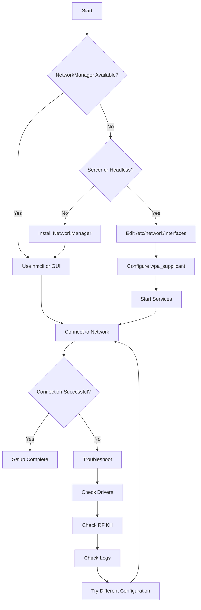

# Debian Wireless Settings

## Introduction

Wireless networking is essential for most modern computing environments. While Debian Linux provides robust wireless networking capabilities, configuring and managing these settings requires understanding several key components and tools. This guide will walk you through everything you need to know about wireless networking on Debian systems, from basic configuration to advanced troubleshooting techniques.

## Prerequisites

Before diving into wireless configuration, ensure you have:

- A Debian-based system (Debian 11 "Bullseye" or newer recommended)
- A compatible wireless network interface card (NIC)
- Administrative (sudo/root) access to your system

## Understanding Wireless Hardware

### Identifying Your Wireless Hardware

The first step is to identify your wireless hardware. You can use the following commands:

```bash
# List all network interfaces
ip link

# OR use
iwconfig

# Detailed hardware information
lspci | grep -i wireless
lsusb | grep -i wireless
```

Example output for `ip link`:

```
1: lo: <LOOPBACK,UP,LOWER_UP> mtu 65536 qdisc noqueue state UNKNOWN mode DEFAULT group default qlen 1000
    link/loopback 00:00:00:00:00:00 brd 00:00:00:00:00:00
2: eth0: <BROADCAST,MULTICAST,UP,LOWER_UP> mtu 1500 qdisc pfifo_fast state UP mode DEFAULT group default qlen 1000
    link/ether 00:11:22:33:44:55 brd ff:ff:ff:ff:ff:ff
3: wlan0: <BROADCAST,MULTICAST> mtu 1500 qdisc noop state DOWN mode DEFAULT group default qlen 1000
    link/ether aa:bb:cc:dd:ee:ff brd ff:ff:ff:ff:ff:ff
```

In this example, `wlan0` is your wireless interface.

### Driver Status

Check if your wireless card has the proper drivers loaded:

```bash
# Check loaded modules
lsmod | grep -i wifi
lsmod | grep -i wireless
lsmod | grep -i 80211    # For 802.11 Wi-Fi standards
```

## Basic Wireless Configuration

Debian offers several methods to configure wireless networks:

1. Network Manager (GUI and CLI)
2. System configuration files
3. Command-line tools

Let's explore each approach.

## Method 1: Using Network Manager

Network Manager is the most user-friendly approach and is ideal for desktop environments.

### Command-Line Interface (nmcli)

Network Manager's command-line tool is powerful and scriptable:

```bash
# List available Wi-Fi networks
nmcli device wifi list

# Connect to a network
nmcli device wifi connect "SSID_NAME" password "WIFI_PASSWORD"

# Show current connections
nmcli connection show

# Turn Wi-Fi on or off
nmcli radio wifi on
nmcli radio wifi off
```

Example of scanning for networks:

```
$ nmcli device wifi list
IN-USE  SSID               MODE    CHAN  RATE        SIGNAL  BARS  SECURITY
        HomeNetwork        Infra   6     130 Mbit/s  90      ▂▄▆█  WPA2
*       WorkWiFi           Infra   11    65 Mbit/s   75      ▂▄▆_  WPA2
        GuestNetwork       Infra   1     54 Mbit/s   30      ▂___  WPA2
```

### Creating a Persistent Connection

To create a connection that persists across reboots:

```bash
# Create a new connection profile
nmcli connection add type wifi con-name "My Home WiFi" ifname wlan0 ssid "HomeNetwork"

# Set the WiFi password (WPA/WPA2)
nmcli connection modify "My Home WiFi" wifi-sec.key-mgmt wpa-psk wifi-sec.psk "WIFI_PASSWORD"

# Enable autoconnect
nmcli connection modify "My Home WiFi" connection.autoconnect yes
```

## Method 2: Using Configuration Files

For server environments or systems without Network Manager, you can configure wireless settings directly in configuration files.

### The /etc/network/interfaces File

Edit the interfaces file:

```bash
sudo nano /etc/network/interfaces
```

For a WPA/WPA2 network, add:

```
# Wireless interface
auto wlan0
iface wlan0 inet dhcp
    wpa-ssid "YOUR_SSID"
    wpa-psk "YOUR_PASSWORD"
```

For more complex configurations, you can use wpa_supplicant directly.

### Using wpa_supplicant

Create a wpa_supplicant configuration file:

```bash
sudo nano /etc/wpa_supplicant/wpa_supplicant.conf
```

Add your network configuration:

```
ctrl_interface=DIR=/var/run/wpa_supplicant GROUP=netdev
update_config=1

network={
    ssid="YOUR_SSID"
    psk="YOUR_PASSWORD"
    key_mgmt=WPA-PSK
}
```

For multiple networks, you can add more network blocks.

## Method 3: Command-Line Tools

For manual configuration or troubleshooting, use these direct commands:

```bash
# Bring interface up
sudo ip link set wlan0 up

# Scan for networks
sudo iwlist wlan0 scan | grep ESSID

# Connect using wpa_supplicant
sudo wpa_supplicant -B -i wlan0 -c /etc/wpa_supplicant/wpa_supplicant.conf

# Get IP address via DHCP
sudo dhclient wlan0
```

## Advanced Wireless Settings

### Setting a Static IP

In `/etc/network/interfaces`:

```
auto wlan0
iface wlan0 inet static
    address 192.168.1.100
    netmask 255.255.255.0
    gateway 192.168.1.1
    dns-nameservers 8.8.8.8 8.8.4.4
    wpa-ssid "YOUR_SSID"
    wpa-psk "YOUR_PASSWORD"
```

Or with Network Manager:

```bash
nmcli connection modify "My Home WiFi" \
    ipv4.method manual \
    ipv4.addresses 192.168.1.100/24 \
    ipv4.gateway 192.168.1.1 \
    ipv4.dns "8.8.8.8 8.8.4.4"
```

### Connecting to Hidden Networks

Using nmcli:

```bash
nmcli device wifi connect "HIDDEN_SSID" password "WIFI_PASSWORD" hidden yes
```

In wpa_supplicant.conf:

```
network={
    ssid="HIDDEN_SSID"
    scan_ssid=1
    psk="YOUR_PASSWORD"
    key_mgmt=WPA-PSK
}
```

### Configuring MAC Address Settings

To change your MAC address:

```bash
# Temporary change
sudo ip link set wlan0 down
sudo ip link set wlan0 address XX:XX:XX:XX:XX:XX
sudo ip link set wlan0 up

# Permanent change via Network Manager
nmcli connection modify "My Home WiFi" wifi.cloned-mac-address XX:XX:XX:XX:XX:XX
```

## Troubleshooting Wireless Issues

### Common Problems and Solutions

#### 1. No Wireless Extension

If `iwconfig` shows "no wireless extensions," your wireless driver might not be loaded or compatible.

Solution:
```bash
# Install firmware packages
sudo apt update
sudo apt install firmware-iwlwifi   # For Intel
sudo apt install firmware-realtek   # For Realtek
sudo apt install firmware-atheros   # For Atheros

# Reload the module
sudo modprobe -r iwlwifi   # Replace with your module
sudo modprobe iwlwifi
```

#### 2. Connection Drops Frequently

Check for interference or power management issues:

```bash
# Disable power management
sudo iwconfig wlan0 power off

# In Network Manager
nmcli connection modify "My Home WiFi" wifi.powersave 2
```

#### 3. Weak Signal

Position issue or need for stronger antenna. You can also check signal strength:

```bash
watch -n1 "iwconfig wlan0 | grep -i quality"
```

### Debugging Commands

Here's a systematic approach to debug wireless issues:

```bash
# Check if interface is detected
ip link

# Check if drivers are loaded
lsmod | grep -i wifi

# Check RF kill status (hardware/software blocks)
rfkill list all

# Check detailed wireless info
iwconfig wlan0

# View wireless logs
journalctl -u NetworkManager
dmesg | grep -i wifi
```

## Security Considerations

### Securing Your Wireless Connection

1. **Use WPA2/WPA3**: Avoid WEP and WPA1 as they're insecure

2. **Strong Passwords**: Use complex passwords with mixed characters

3. **Disable Unnecessary Services**: If you don't need your system to broadcast, disable:
   ```bash
   # Disable wireless access point mode
   nmcli radio wifi-hw off
   ```

4. **Enable Firewall**: Configure iptables or ufw:
   ```bash
   sudo apt install ufw
   sudo ufw enable
   sudo ufw allow ssh
   ```

## Working with Different Network Types

### Enterprise Networks (802.1X)

For WPA2-Enterprise networks (common in universities and corporations):

```bash
nmcli connection add type wifi con-name "Work Enterprise" ifname wlan0 ssid "WorkNet" \
    wifi-sec.key-mgmt wpa-eap 802-1x.eap ttls \
    802-1x.phase2-auth mschapv2 \
    802-1x.identity "your_username" \
    802-1x.password "your_password"
```

In wpa_supplicant.conf:

```
network={
    ssid="WorkNet"
    key_mgmt=WPA-EAP
    eap=TTLS
    identity="your_username"
    password="your_password"
    phase2="auth=MSCHAPV2"
}
```

### Hotspot / Access Point

Turn your Debian system into a Wi-Fi hotspot:

```bash
# Create a hotspot using Network Manager
nmcli device wifi hotspot ssid "MyHotspot" password "hotspot-password"

# For more persistent configuration
nmcli connection add type wifi ifname wlan0 con-name Hotspot autoconnect no ssid MyHotspot
nmcli connection modify Hotspot 802-11-wireless.mode ap 802-11-wireless.band bg ipv4.method shared
nmcli connection modify Hotspot wifi-sec.key-mgmt wpa-psk wifi-sec.psk "hotspot-password"
nmcli connection up Hotspot
```

## Wireless Management Tools

Here are some useful GUI and CLI tools for managing wireless networks:

### Command-Line Tools
- `iwconfig` - Configure wireless interfaces
- `iw` - More modern wireless configuration tool
- `wavemon` - Wireless network monitor
- `nmtui` - Text-based UI for NetworkManager

Install additional tools:
```bash
sudo apt install wavemon wireless-tools
```

## Network Configuration Flow

Here's a diagram showing the typical workflow for wireless configuration on Debian:



## Practical Examples

### Example 1: Connecting to a Home Network

Let's say you want to connect to your home network "HomeWiFi" with password "SecurePassword123":

```bash
# Using NetworkManager
sudo apt install network-manager
sudo systemctl start NetworkManager
sudo systemctl enable NetworkManager
nmcli device wifi scan
nmcli device wifi connect "HomeWiFi" password "SecurePassword123"

# Verify connection
ip addr show wlan0
ping -c 4 google.com
```

### Example 2: Setting Up a Server with Static IP

For a Debian server with a static wireless connection:

```bash
# Install required packages
sudo apt install wireless-tools wpasupplicant

# Create wpa_supplicant configuration
cat << EOF | sudo tee /etc/wpa_supplicant/wpa_supplicant-wlan0.conf
ctrl_interface=DIR=/var/run/wpa_supplicant GROUP=netdev
update_config=1

network={
    ssid="ServerNetwork"
    psk="ServerPassword"
    key_mgmt=WPA-PSK
}
EOF

# Configure network interfaces
cat << EOF | sudo tee /etc/network/interfaces.d/wlan0
auto wlan0
iface wlan0 inet static
    address 192.168.1.50
    netmask 255.255.255.0
    gateway 192.168.1.1
    dns-nameservers 8.8.8.8 8.8.4.4
    wpa-conf /etc/wpa_supplicant/wpa_supplicant-wlan0.conf
EOF

# Apply changes
sudo systemctl restart networking
```

### Example 3: Creating a Wireless Bridge

To create a bridge between wireless and wired interfaces:

```bash
# Install bridge utilities
sudo apt install bridge-utils

# Configure interfaces
cat << EOF | sudo tee /etc/network/interfaces.d/bridge
auto br0
iface br0 inet static
    address 192.168.1.50
    netmask 255.255.255.0
    gateway 192.168.1.1
    bridge_ports eth0 wlan0
    bridge_stp on
    bridge_fd 0
    bridge_maxwait 0
    wpa-conf /etc/wpa_supplicant/wpa_supplicant-wlan0.conf
EOF

# Apply changes
sudo systemctl restart networking
```

## Summary

Debian Linux provides multiple options for configuring wireless networks, from user-friendly Network Manager to advanced configuration files and command-line tools. By understanding these different methods, you can effectively set up and manage wireless connections in any environment, whether it's a desktop, laptop, or server.

The key components to remember are:
1. Hardware identification and driver installation
2. Network configuration tools (NetworkManager or manual configuration)
3. Security best practices
4. Troubleshooting techniques

## Additional Resources

To further expand your knowledge of Debian wireless networking:

1. **Official Documentation**:
   - Debian Wiki: https://wiki.debian.org/WiFi
   - NetworkManager Documentation: https://networkmanager.dev/

2. **Recommended Books**:
   - "Linux Networking Cookbook" by Carla Schroder
   - "The Debian Administrator's Handbook"

## Exercises

1. Identify all wireless interfaces on your system and their current status.
2. Connect to a wireless network using three different methods: NetworkManager CLI, GUI, and configuration files.
3. Set up a wireless connection with a static IP address.
4. Create a script that automatically reconnects to your preferred network if the connection drops.
5. Configure your system to automatically switch between home and work networks based on availability.