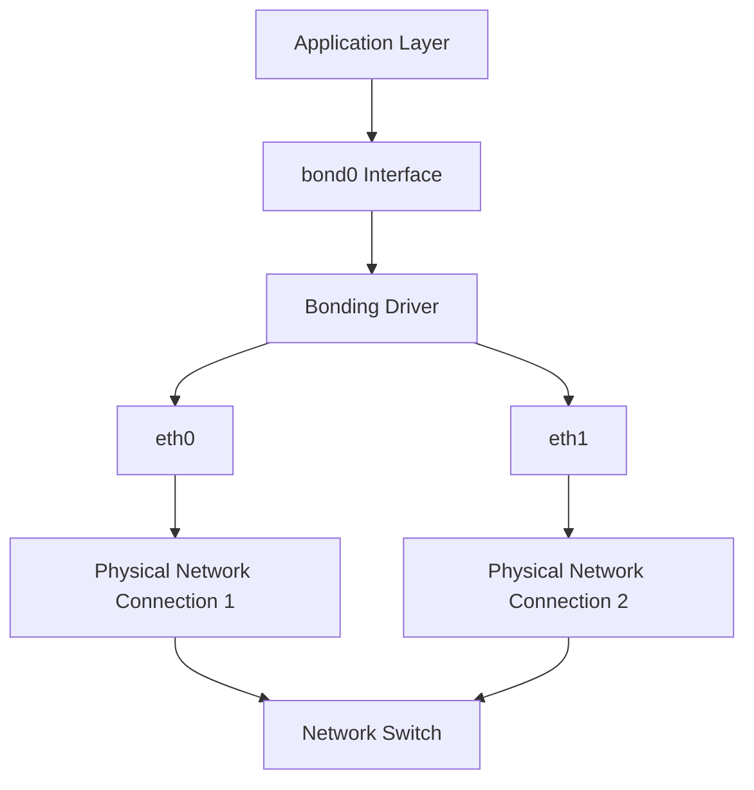

# Debian Network Bonding

## Introduction

Network bonding (also known as link aggregation) is a technique that allows you to combine multiple network interfaces into a single logical interface. This provides several benefits:

- **Increased bandwidth**: Multiple connections can operate in parallel to increase throughput
- **High availability**: If one interface fails, the others continue to function
- **Load balancing**: Traffic can be distributed across multiple physical connections

In this tutorial, we'll explore how to set up and configure network bonding in Debian systems. We'll cover different bonding modes, configuration methods, and practical examples.

## Prerequisites

- A Debian system (this tutorial is tested on Debian 11 Bullseye)
- Root or sudo privileges
- Multiple network interfaces (at least two)

## Understanding Bonding Modes

Before we start configuring, it's important to understand the different bonding modes available:

| Mode | Name | Description |
|------|------|-------------|
| 0 | balance-rr | Round-robin load balancing. Packets are transmitted in sequential order from the first available interface to the last. Provides both load balancing and fault tolerance. |
| 1 | active-backup | Only one interface is active. The other interfaces become active only if the active interface fails. Provides fault tolerance only. |
| 2 | balance-xor | Transmits based on a XOR formula. Provides load balancing and fault tolerance. |
| 3 | broadcast | Transmits everything on all interfaces. Provides fault tolerance. |
| 4 | 802.3ad | IEEE 802.3ad dynamic link aggregation. Requires a switch that supports IEEE 802.3ad. |
| 5 | balance-tlb | Adaptive transmit load balancing. Does not require special switch support. |
| 6 | balance-alb | Adaptive load balancing. Includes balance-tlb plus receive load balancing. Does not require special switch support. |

## Installing Required Packages

First, let's install the required packages:

```bash
sudo apt update
sudo apt install ifenslave
```

## Loading the Bonding Module

To use network bonding, you need to load the bonding kernel module:

```bash
sudo modprobe bonding
```

To make this persistent across reboots, add the module to `/etc/modules`:

```bash
echo "bonding" | sudo tee -a /etc/modules
```

To check if the module is loaded:

```bash
lsmod | grep bonding
```

Expected output:
```
bonding               167936  0
```

## Configuring Network Bonding

Debian offers two main ways to configure network bonding:

1. Using `/etc/network/interfaces` (traditional method)
2. Using Netplan (newer method, mainly in Ubuntu and newer Debian versions)

We'll focus on the traditional method using `/etc/network/interfaces` as it's still the most common in Debian.

### Method 1: Using /etc/network/interfaces

First, let's back up the existing network configuration:

```bash
sudo cp /etc/network/interfaces /etc/network/interfaces.bak
```

Now, edit the interfaces file:

```bash
sudo nano /etc/network/interfaces
```

Here's an example configuration for creating a bond with two interfaces (eth0 and eth1) using mode 1 (active-backup):

```
# The loopback network interface
auto lo
iface lo inet loopback

# The bonding interfaces
auto bond0
iface bond0 inet static
    address 192.168.1.100
    netmask 255.255.255.0
    gateway 192.168.1.1
    dns-nameservers 8.8.8.8 8.8.4.4
    bond-slaves eth0 eth1
    bond-mode 1
    bond-miimon 100
    bond-primary eth0

# The physical interfaces
auto eth0
iface eth0 inet manual
    bond-master bond0

auto eth1
iface eth1 inet manual
    bond-master bond0
```

### Configuration Parameters Explained

- `bond-slaves`: Specifies the interfaces that will be part of the bond
- `bond-mode`: Specifies the bonding mode (1 = active-backup in this example)
- `bond-miimon`: Specifies how often (in milliseconds) to check the link status
- `bond-primary`: Specifies the primary interface when using active-backup mode

### Applying the Configuration

After making changes to the configuration file, restart the networking service:

```bash
sudo systemctl restart networking
```

Or, if you're using a Debian version with ifupdown:

```bash
sudo ifdown bond0
sudo ifup bond0
```

## Checking Bond Status

You can check the status of your bond using various commands:

### Using ip command:

```bash
ip addr show bond0
```

Expected output:
```
3: bond0: <BROADCAST,MULTICAST,MASTER,UP,LOWER_UP> mtu 1500 qdisc noqueue state UP group default qlen 1000
    link/ether 00:11:22:33:44:55 brd ff:ff:ff:ff:ff:ff
    inet 192.168.1.100/24 brd 192.168.1.255 scope global bond0
       valid_lft forever preferred_lft forever
```

### Using the /proc filesystem:

```bash
cat /proc/net/bonding/bond0
```

Expected output:
```
Ethernet Channel Bonding Driver: v3.7.1 (April 27, 2011)

Bonding Mode: fault-tolerance (active-backup)
Primary Slave: eth0 (primary_reselect always)
Currently Active Slave: eth0
MII Status: up
MII Polling Interval (ms): 100
Up Delay (ms): 0
Down Delay (ms): 0

Slave Interface: eth0
MII Status: up
Speed: 1000 Mbps
Duplex: full
Link Failure Count: 0
Permanent HW addr: 00:11:22:33:44:55
Slave queue ID: 0

Slave Interface: eth1
MII Status: up
Speed: 1000 Mbps
Duplex: full
Link Failure Count: 0
Permanent HW addr: 00:11:22:33:44:66
Slave queue ID: 0
```

## Advanced Configurations

### LACP (802.3ad) Bonding

If your network switch supports LACP (Link Aggregation Control Protocol), you can use mode 4 for higher performance. Here's an example configuration:

```
auto bond0
iface bond0 inet static
    address 192.168.1.100
    netmask 255.255.255.0
    gateway 192.168.1.1
    bond-slaves eth0 eth1
    bond-mode 4
    bond-miimon 100
    bond-lacp-rate 1  # Fast rate
    bond-xmit-hash-policy layer2+3
```

The `bond-lacp-rate` parameter determines how often LACP PDUs are sent:
- 0 = slow (30 seconds)
- 1 = fast (1 second)

The `bond-xmit-hash-policy` parameter determines how traffic is distributed:
- `layer2`: Uses MAC addresses
- `layer3+4`: Uses IP addresses and TCP/UDP ports
- `layer2+3`: Uses MAC and IP addresses

### Bonding with VLAN Support

If you need to use VLANs with bonding, you can add VLAN interfaces on top of your bond:

```
# Bond configuration
auto bond0
iface bond0 inet manual
    bond-slaves eth0 eth1
    bond-mode 1
    bond-miimon 100

# VLAN 10 on bond0
auto bond0.10
iface bond0.10 inet static
    address 192.168.10.100
    netmask 255.255.255.0
    vlan-raw-device bond0
```

## Visual Representation

Here's a diagram illustrating network bonding:



## Common Issues and Troubleshooting

### Bond Interface Doesn't Come Up

Check if the slave interfaces are available and not configured elsewhere:

```bash
sudo ip link show
```

Make sure the bonding module is loaded:

```bash
lsmod | grep bonding
```

### Performance Issues

If you're experiencing performance issues, check if the bonding mode matches your network environment:

1. For a single switch without LACP support, use mode 0, 2, 5, or 6
2. For LACP-capable switches, use mode 4
3. For pure redundancy, use mode 1

### Link Status Monitoring Issues

If bond status detection is slow, adjust the miimon parameter:

```
bond-miimon 100  # Check every 100ms
```

For faster failure detection, you can lower this value, but don't set it too low to avoid false positives.

## Real-World Applications

### High-Availability Server Setup

This example shows a configuration for a high-availability web server:

```
auto bond0
iface bond0 inet static
    address 192.168.1.100
    netmask 255.255.255.0
    gateway 192.168.1.1
    dns-nameservers 8.8.8.8 8.8.4.4
    bond-slaves eth0 eth1
    bond-mode 1
    bond-miimon 100
    bond-primary eth0
```

This configuration ensures that if one network connection fails, the server will continue to be accessible through the other connection.

### Load-Balanced Database Server

This example shows a configuration for a database server requiring maximum throughput:

```
auto bond0
iface bond0 inet static
    address 192.168.1.100
    netmask 255.255.255.0
    gateway 192.168.1.1
    dns-nameservers 8.8.8.8 8.8.4.4
    bond-slaves eth0 eth1
    bond-mode 0  # Round-robin for maximum throughput
    bond-miimon 100
```

This configuration distributes the traffic across both interfaces, maximizing the available bandwidth for database transactions.

## Summary

In this tutorial, we've covered:

- The concept of network bonding and its benefits
- Different bonding modes and their use cases
- How to install and configure network bonding in Debian
- Advanced configurations for specific scenarios
- Troubleshooting common issues

Network bonding is a powerful technique for improving network reliability and performance in Debian systems. By combining multiple physical interfaces into a single logical interface, you can achieve higher bandwidth, better redundancy, and more efficient load balancing.

## Additional Resources

- [Debian Wiki: Bonding](https://wiki.debian.org/Bonding)
- [Linux Kernel Documentation on Bonding](https://www.kernel.org/doc/Documentation/networking/bonding.txt)
- [Netplan Documentation](https://netplan.io/examples) (for newer Debian-based systems)

## Exercises

1. Configure a bond in mode 0 (round-robin) and test the throughput using `iperf`.
2. Set up a bond in mode 1 (active-backup) and simulate a network failure by unplugging one of the cables. Observe how the system responds.
3. Experiment with different bonding modes and measure the performance differences with various network loads.
4. Set up VLAN interfaces on top of a bonded interface and configure routing between them.