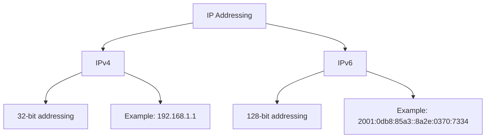

# Debian IP Addressing

## Introduction

IP (Internet Protocol) addressing is a fundamental concept in networking that allows devices to communicate with each other. In Debian Linux, understanding how to configure and manage IP addresses is essential for setting up network connectivity. This guide will walk you through the basics of IP addressing in Debian systems, from understanding IP concepts to practical configuration techniques.

## Understanding IP Addresses

An IP address is a unique identifier assigned to each device on a network. It serves two primary functions:

1. **Host identification**: Identifies a specific device on a network
2. **Location addressing**: Provides the network location of the device

### IPv4 vs IPv6

There are two versions of IP addresses currently in use:

- **IPv4**: Uses a 32-bit addressing scheme allowing for approximately 4.3 billion addresses (e.g., `192.168.1.1`)
- **IPv6**: Uses a 128-bit addressing scheme providing a vastly larger address space (e.g., `2001:0db8:85a3:0000:0000:8a2e:0370:7334`)



## Checking Current IP Configuration

Before making any changes, it's important to understand your current IP configuration. Debian provides several commands for this purpose.

### Using `ip` Command

The modern way to check and configure network interfaces in Debian is using the `ip` command:

```bash
ip addr show
```

Example output:

```
1: lo: <LOOPBACK,UP,LOWER_UP> mtu 65536 qdisc noqueue state UNKNOWN group default qlen 1000
    link/loopback 00:00:00:00:00:00 brd 00:00:00:00:00:00
    inet 127.0.0.1/8 scope host lo
       valid_lft forever preferred_lft forever
    inet6 ::1/128 scope host 
       valid_lft forever preferred_lft forever
2: eth0: <BROADCAST,MULTICAST,UP,LOWER_UP> mtu 1500 qdisc pfifo_fast state UP group default qlen 1000
    link/ether 08:00:27:a6:c1:7f brd ff:ff:ff:ff:ff:ff
    inet 192.168.1.105/24 brd 192.168.1.255 scope global dynamic eth0
       valid_lft 86390sec preferred_lft 86390sec
    inet6 fe80::a00:27ff:fea6:c17f/64 scope link 
       valid_lft forever preferred_lft forever
```

### Using `ifconfig` Command

While considered legacy, the `ifconfig` command is still widely used:

```bash
ifconfig
```

If `ifconfig` is not installed, you can install it with:

```bash
sudo apt update
sudo apt install net-tools
```

## Temporary IP Configuration

### Setting a Temporary IP Address

To set a temporary IP address (which will be lost after reboot), use the `ip` command:

```bash
sudo ip addr add 192.168.1.100/24 dev eth0
```

This assigns the IP address `192.168.1.100` with a subnet mask of `255.255.255.0` to the `eth0` interface.

### Removing a Temporary IP Address

```bash
sudo ip addr del 192.168.1.100/24 dev eth0
```

## Persistent IP Configuration

For permanent IP configuration in Debian, you'll need to edit the network interfaces configuration file.

### Using `/etc/network/interfaces`

The traditional way to configure network interfaces in Debian is through the `/etc/network/interfaces` file:

```bash
sudo nano /etc/network/interfaces
```

#### Static IP Configuration

```
# The loopback network interface
auto lo
iface lo inet loopback

# The primary network interface
auto eth0
iface eth0 inet static
    address 192.168.1.100
    netmask 255.255.255.0
    gateway 192.168.1.1
    dns-nameservers 8.8.8.8 8.8.4.4
```

#### DHCP Configuration

If you want to obtain an IP address automatically from a DHCP server:

```
auto eth0
iface eth0 inet dhcp
```

After making changes, restart networking services:

```bash
sudo systemctl restart networking
```

### Using NetworkManager

Modern Debian installations often use NetworkManager, especially for desktop environments:

```bash
sudo apt install network-manager
```

You can configure NetworkManager through:

1. **Command line** with `nmcli`:

```bash
# Create a new connection
sudo nmcli con add type ethernet con-name "My Connection" ifname eth0

# Set static IP
sudo nmcli con mod "My Connection" ipv4.addresses 192.168.1.100/24
sudo nmcli con mod "My Connection" ipv4.gateway 192.168.1.1
sudo nmcli con mod "My Connection" ipv4.dns "8.8.8.8 8.8.4.4"
sudo nmcli con mod "My Connection" ipv4.method manual

# Enable the connection
sudo nmcli con up "My Connection"
```

2. **GUI tools** like `nm-connection-editor` or the network settings in desktop environments.

## Understanding Subnet Masks

A subnet mask determines which portion of an IP address identifies the network and which portion identifies the host.

Common subnet masks:

| CIDR Notation | Subnet Mask     | Available Hosts |
|---------------|-----------------|-----------------|
| /24           | 255.255.255.0   | 254             |
| /16           | 255.255.0.0     | 65,534          |
| /8            | 255.0.0.0       | 16,777,214      |

Example: With the IP address `192.168.1.100` and subnet mask `255.255.255.0` (/24):
- Network address: `192.168.1.0`
- Broadcast address: `192.168.1.255`
- Available host addresses: `192.168.1.1` to `192.168.1.254`

## Configuring Multiple IP Addresses

### Multiple IPs with `/etc/network/interfaces`

You can assign multiple IP addresses to a single interface using the `up` command:

```
auto eth0
iface eth0 inet static
    address 192.168.1.100
    netmask 255.255.255.0
    gateway 192.168.1.1
    up ip addr add 192.168.1.101/24 dev eth0
    down ip addr del 192.168.1.101/24 dev eth0
```

### Multiple IPs with `ip` Command

```bash
sudo ip addr add 192.168.1.101/24 dev eth0
```

## Network Testing and Troubleshooting

After configuring your IP address, it's important to test your network connectivity.

### Basic Network Testing Commands

1. **Test local connectivity**:
```bash
ping 127.0.0.1
```

2. **Test connectivity to gateway**:
```bash
ping 192.168.1.1
```

3. **Test internet connectivity**:
```bash
ping 8.8.8.8
ping google.com
```

### Troubleshooting Network Issues

If you encounter networking problems, check:

1. **Interface status**:
```bash
ip link show
```

2. **Routing table**:
```bash
ip route show
```

3. **DNS resolution**:
```bash
cat /etc/resolv.conf
```

4. **Network services**:
```bash
sudo systemctl status networking
```

## IPv6 Configuration

### Basic IPv6 Setup

To configure IPv6 on Debian, add the following to `/etc/network/interfaces`:

```
iface eth0 inet6 static
    address 2001:db8::1
    netmask 64
    gateway 2001:db8::1:1
```

### Testing IPv6 Connectivity

```bash
ping6 ::1
ping6 2001:4860:4860::8888  # Google's IPv6 DNS
```

## Practical Examples

### Example 1: Setting Up a Web Server with a Static IP

Imagine you're setting up a web server that needs a static IP address:

1. Configure a static IP in `/etc/network/interfaces`:
```
auto eth0
iface eth0 inet static
    address 192.168.1.200
    netmask 255.255.255.0
    gateway 192.168.1.1
    dns-nameservers 8.8.8.8 8.8.4.4
```

2. Restart networking:
```bash
sudo systemctl restart networking
```

3. Install and configure your web server:
```bash
sudo apt update
sudo apt install apache2
```

4. Test access to your web server using the static IP:
```bash
curl 192.168.1.200
```

### Example 2: Network Interface Bonding for Redundancy

For critical servers, you might want to set up network bonding for redundancy:

1. Install required packages:
```bash
sudo apt install ifenslave
```

2. Configure bonding in `/etc/network/interfaces`:
```
auto bond0
iface bond0 inet static
    address 192.168.1.150
    netmask 255.255.255.0
    gateway 192.168.1.1
    bond-slaves eth0 eth1
    bond-mode active-backup
    bond-miimon 100
    bond-primary eth0
```

3. Restart networking:
```bash
sudo systemctl restart networking
```

## Summary

In this guide, we've covered:

- Basic IP addressing concepts in Debian
- Temporary and persistent IP configuration methods
- Working with static and dynamic (DHCP) addressing
- Managing multiple IP addresses
- Testing and troubleshooting network connectivity
- IPv6 configuration
- Practical real-world examples

Understanding IP addressing in Debian is crucial for setting up stable network connections and is the foundation for more advanced networking topics.

## Additional Resources and Exercises

### Further Learning

- Official Debian Network Configuration documentation
- The Linux Documentation Project's networking guides
- Man pages for network commands: `man ip`, `man interfaces`

### Practice Exercises

1. Configure a Debian system with both IPv4 and IPv6 static addresses
2. Set up a Debian system with multiple IP addresses on a single interface
3. Create a network bonding configuration with two interfaces
4. Experiment with different subnet masks and understand their effects on network size
5. Practice network troubleshooting on a deliberately misconfigured network interface

By practicing these exercises, you'll develop a solid understanding of Debian IP addressing that will serve as a foundation for more advanced networking topics.