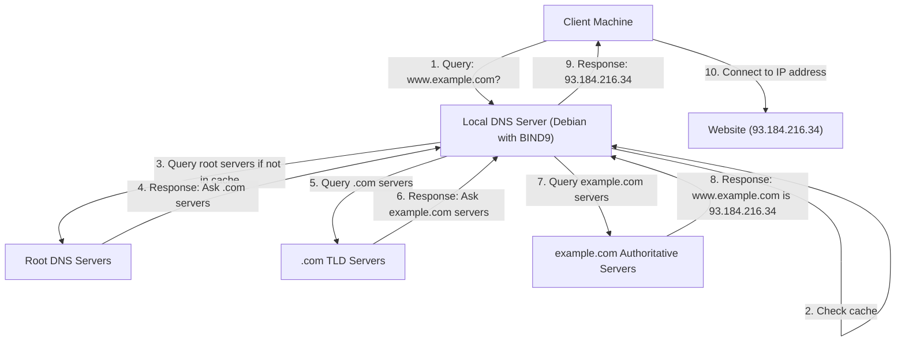

# Debian DNS Configuration

## Introduction

Domain Name System (DNS) is a fundamental networking service that translates human-readable domain names (like `example.com`) into IP addresses (like `192.168.1.1`) that computers use to identify each other on networks. Proper DNS configuration is essential for any Debian system to communicate effectively on local networks and the internet.

In this guide, we'll explore both DNS client configuration (how your Debian system resolves domain names) and basic DNS server setup (how to create your own DNS server using Debian). By the end of this tutorial, you'll understand how to configure DNS on Debian systems for various networking scenarios.

## DNS Client Configuration

Every Debian system needs to know which DNS servers to query when resolving domain names. Let's look at different ways to configure DNS resolution on Debian.

### Traditional Method: Using `/etc/resolv.conf`

The traditional way to configure DNS on Debian is by editing the `/etc/resolv.conf` file. This file contains nameserver entries that your system consults when resolving domain names.

Here's a basic example of a `resolv.conf` file:

```bash
# /etc/resolv.conf
nameserver 8.8.8.8
nameserver 8.8.4.4
search example.com
domain example.com
```

Let's break down what each line does:

- `nameserver`: Specifies the IP address of a DNS server to query
- `search`: Adds a domain suffix to unqualified hostnames
- `domain`: Sets the local domain name

However, be aware that on modern Debian systems, this file is often managed automatically by other services like NetworkManager, DHCP clients, or systemd-resolved. Manual changes might be overwritten.

### Using NetworkManager

If you're running Debian with a desktop environment, NetworkManager likely manages your network connections. You can configure DNS settings through NetworkManager's GUI or using the `nmcli` command-line tool:

```bash
# Set DNS servers for a connection
nmcli connection modify "My Connection" ipv4.dns "8.8.8.8 8.8.4.4"

# Apply changes
nmcli connection up "My Connection"
```

### Using systemd-resolved

Modern Debian systems often use systemd-resolved for DNS resolution. To configure it:

1. Edit `/etc/systemd/resolved.conf`:

```bash
# /etc/systemd/resolved.conf
[Resolve]
DNS=8.8.8.8 8.8.4.4
Domains=example.com
```

2. Restart the service:

```bash
sudo systemctl restart systemd-resolved
```

3. Check the configuration:

```bash
systemd-resolve --status
```

Example output:

```
Link 2 (eth0)
      Current Scopes: DNS
       LLMNR setting: yes
MulticastDNS setting: no
      DNSSEC setting: no
    DNSSEC supported: no
         DNS Servers: 8.8.8.8
                      8.8.4.4
         DNS Domain: example.com
```

### Using DHCP Client Configuration

If your Debian system gets its IP address via DHCP, you can configure it to use specific DNS servers by editing `/etc/dhcp/dhclient.conf`:

```bash
# /etc/dhcp/dhclient.conf
supersede domain-name-servers 8.8.8.8, 8.8.4.4;
```

This will override the DNS servers provided by the DHCP server.

## Testing DNS Resolution

To test if your DNS client configuration is working properly, you can use the following commands:

### Using `dig`

```bash
dig debian.org
```

Example output:

```
; <<>> DiG 9.16.27-Debian <<>> debian.org
;; global options: +cmd
;; Got answer:
;; ->>HEADER<<- opcode: QUERY, status: NOERROR, id: 12345
;; flags: qr rd ra; QUERY: 1, ANSWER: 1, AUTHORITY: 0, ADDITIONAL: 1

;; QUESTION SECTION:
;debian.org.			IN	A

;; ANSWER SECTION:
debian.org.		3599	IN	A	149.20.4.15

;; Query time: 28 msec
;; SERVER: 8.8.8.8#53(8.8.8.8)
;; WHEN: Thu Mar 13 14:22:37 CET 2025
;; MSG SIZE  rcvd: 56
```

### Using `nslookup`

```bash
nslookup debian.org
```

Example output:

```
Server:		8.8.8.8
Address:	8.8.8.8#53

Non-authoritative answer:
Name:	debian.org
Address: 149.20.4.15
```

### Using `host`

```bash
host debian.org
```

Example output:

```
debian.org has address 149.20.4.15
debian.org mail is handled by 10 mailly.debian.org.
```

## Setting Up a DNS Server with BIND9

For more complex networks or to host your own domains, you might want to set up a DNS server on Debian. The most common DNS server software on Debian is BIND9 (Berkeley Internet Name Domain).

### Installing BIND9

```bash
sudo apt update
sudo apt install bind9 bind9utils bind9-doc
```

### Basic BIND9 Configuration

BIND9's main configuration file is `/etc/bind/named.conf`. This file typically includes other configuration files:

```bash
# /etc/bind/named.conf
include "/etc/bind/named.conf.options";
include "/etc/bind/named.conf.local";
include "/etc/bind/named.conf.default-zones";
```

Let's configure a simple caching DNS server:

1. Edit `/etc/bind/named.conf.options`:

```bash
options {
    directory "/var/cache/bind";
    
    // If you want to allow queries only from your local network:
    allow-query { localhost; 192.168.1.0/24; };
    
    // Forwarders - upstream DNS servers to use
    forwarders {
        8.8.8.8;
        8.8.4.4;
    };
    
    // Basic security settings
    version "not disclosed";
    recursion yes;
    dnssec-validation auto;
    
    listen-on-v6 { any; };
};
```

2. Restart BIND9:

```bash
sudo systemctl restart bind9
```

3. Check if BIND9 is running:

```bash
sudo systemctl status bind9
```

Example output:

```
● named.service - BIND Domain Name Server
     Loaded: loaded (/lib/systemd/system/named.service; enabled; vendor preset: enabled)
     Active: active (running) since Thu 2025-03-13 15:30:22 CET; 5s ago
       Docs: man:named(8)
    Process: 12345 ExecStart=/usr/sbin/named -f -u bind (code=exited, status=0/SUCCESS)
   Main PID: 12346 (named)
      Tasks: 12 (limit: 4915)
     Memory: 13.8M
        CPU: 134ms
     CGroup: /system.slice/named.service
             └─12346 /usr/sbin/named -f -u bind
```

### Creating a Forward Zone

To host your own domain, you need to create a zone file. Let's set up a zone for `example.local`:

1. Add the zone to `/etc/bind/named.conf.local`:

```bash
zone "example.local" {
    type master;
    file "/etc/bind/db.example.local";
};
```

2. Create the zone file by copying the example file:

```bash
sudo cp /etc/bind/db.local /etc/bind/db.example.local
```

3. Edit the zone file:

```bash
; /etc/bind/db.example.local
$TTL    604800
@       IN      SOA     ns1.example.local. admin.example.local. (
                            2         ; Serial
                       604800         ; Refresh
                        86400         ; Retry
                      2419200         ; Expire
                       604800 )       ; Negative Cache TTL
;
@       IN      NS      ns1.example.local.
@       IN      A       192.168.1.10
@       IN      AAAA    ::1
ns1     IN      A       192.168.1.10
www     IN      A       192.168.1.20
mail    IN      A       192.168.1.30
```

4. Check the configuration for errors:

```bash
sudo named-checkconf
sudo named-checkzone example.local /etc/bind/db.example.local
```

5. Restart BIND9:

```bash
sudo systemctl restart bind9
```

### Creating a Reverse Zone

Reverse zones are used for reverse DNS lookups (converting IP addresses to hostnames):

1. Add the reverse zone to `/etc/bind/named.conf.local`:

```bash
zone "1.168.192.in-addr.arpa" {
    type master;
    file "/etc/bind/db.192.168.1";
};
```

2. Create the reverse zone file:

```bash
sudo cp /etc/bind/db.127 /etc/bind/db.192.168.1
```

3. Edit the reverse zone file:

```bash
; /etc/bind/db.192.168.1
$TTL    604800
@       IN      SOA     ns1.example.local. admin.example.local. (
                            1         ; Serial
                       604800         ; Refresh
                        86400         ; Retry
                      2419200         ; Expire
                       604800 )       ; Negative Cache TTL
;
@       IN      NS      ns1.example.local.
10      IN      PTR     ns1.example.local.
20      IN      PTR     www.example.local.
30      IN      PTR     mail.example.local.
```

4. Check and restart BIND9:

```bash
sudo named-checkzone 1.168.192.in-addr.arpa /etc/bind/db.192.168.1
sudo systemctl restart bind9
```

## DNS Architecture in Debian Networks

Understanding the DNS architecture helps you design better networking solutions. Here's a diagram showing how DNS typically works in a Debian network:



## Common DNS Issues and Troubleshooting

Here are some common DNS-related issues and how to troubleshoot them:

### 1. DNS Resolution Not Working

If you can't resolve domain names, check:

```bash
# Check if DNS servers are configured
cat /etc/resolv.conf

# Test DNS resolution
dig debian.org

# Check if you can reach the DNS server
ping 8.8.8.8
```

### 2. BIND9 Server Not Starting

If your BIND9 server won't start:

```bash
# Check status
sudo systemctl status bind9

# Check the logs
sudo journalctl -u bind9

# Check configuration
sudo named-checkconf
```

### 3. Zone Transfer Issues

If you're having problems with zone transfers:

```bash
# Test a zone transfer
dig @192.168.1.10 example.local AXFR

# Check transfer configuration
grep "allow-transfer" /etc/bind/named.conf*
```

## Best Practices for DNS Configuration

1. **Use Multiple DNS Servers**: Always configure at least two DNS servers for redundancy.

2. **Implement DNSSEC**: Consider enabling DNSSEC to protect against DNS spoofing:

```bash
# In /etc/bind/named.conf.options
dnssec-validation auto;
dnssec-enable yes;
```

3. **Restrict Zone Transfers**: Only allow zone transfers to authorized secondary servers:

```bash
# In zone configuration
zone "example.local" {
    type master;
    file "/etc/bind/db.example.local";
    allow-transfer { 192.168.1.11; };
};
```

4. **Use Split DNS/Views**: For networks that need different DNS responses internally and externally:

```bash
view "internal" {
    match-clients { 192.168.1.0/24; };
    zone "example.com" {
        type master;
        file "/etc/bind/internal/db.example.com";
    };
};

view "external" {
    match-clients { any; };
    zone "example.com" {
        type master;
        file "/etc/bind/external/db.example.com";
    };
};
```

## Summary

In this guide, we've covered:
- DNS client configuration on Debian systems using various methods
- Setting up a basic DNS server using BIND9
- Creating forward and reverse zones
- DNS architecture and how resolution works
- Troubleshooting common DNS issues
- Best practices for Debian DNS configuration

DNS is a critical service for any network. With the knowledge from this guide, you should be able to configure both basic and advanced DNS setups on your Debian systems. Remember that proper DNS configuration not only ensures connectivity but also impacts network security and performance.

## Additional Resources

- [Debian Wiki: DNS Configuration](https://wiki.debian.org/NetworkConfiguration#DNS_Configuration)
- [BIND9 Documentation](https://bind9.readthedocs.io/)
- [DNS and BIND, 5th Edition](https://www.oreilly.com/library/view/dns-and-bind/0596100574/) - A comprehensive reference for BIND

## Exercises

1. Configure your Debian system to use Cloudflare's DNS servers (1.1.1.1 and 1.0.0.1).
2. Set up a caching-only DNS server with BIND9 that forwards requests to Google's DNS servers.
3. Create a local DNS zone for "home.local" with entries for your local devices.
4. Configure a secondary DNS server that receives zone transfers from your primary server.
5. Implement DNSSEC on your BIND9 server and validate that it's working correctly.