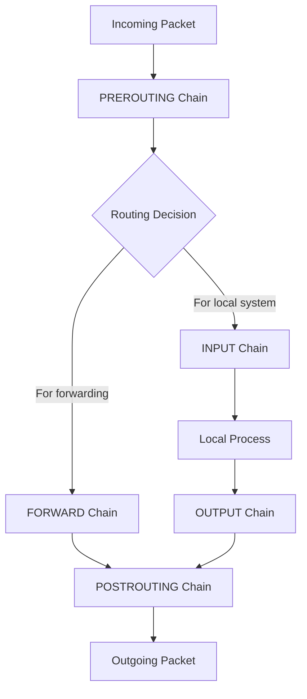

# Debian Firewall Management

## Introduction

A firewall is an essential security component for any networked system, acting as a barrier between your trusted internal network and untrusted external networks like the internet. On Debian systems, you have several options for firewall management, each with different levels of complexity and flexibility.

In this guide, we'll explore how to effectively manage firewall rules on Debian systems. We'll cover the three main firewall solutions available in Debian:

1. **iptables** - The traditional, powerful but complex Linux firewall infrastructure
2. **ufw** (Uncomplicated Firewall) - A user-friendly interface to iptables
3. **firewalld** - A dynamic firewall manager with support for network zones

By the end of this guide, you'll be able to set up, configure, and manage firewalls to protect your Debian system effectively.

## Understanding Linux Firewalls

Before diving into specific tools, it's important to understand that most Linux firewall tools are frontends to [netfilter](https://www.netfilter.org/), the packet filtering framework built into the Linux kernel. Netfilter operates at several points in the network stack, allowing packets to be examined and modified as they travel through the system.

Here's a simplified view of how packets flow through the netfilter framework:



With this understanding, let's explore the available tools to manage these rules.

## Using iptables

### What is iptables?

`iptables` is the classic command-line firewall utility for Linux. It provides direct control over the netfilter packet filtering system in the Linux kernel. While powerful, it can be complex for beginners.

### Installing iptables

On Debian, iptables is usually pre-installed. If not, you can install it with:

```bash
sudo apt update
sudo apt install iptables
```

### Basic iptables Concepts

iptables organizes rules into:

- **Tables**: filter, nat, mangle, raw
- **Chains**: INPUT, OUTPUT, FORWARD, PREROUTING, POSTROUTING
- **Rules**: Actions to take on packets that match certain criteria

### Basic iptables Commands

Here are some essential iptables commands:

#### Viewing Current Rules

```bash
sudo iptables -L
```

Output:
```
Chain INPUT (policy ACCEPT)
target     prot opt source               destination         

Chain FORWARD (policy ACCEPT)
target     prot opt source               destination         

Chain OUTPUT (policy ACCEPT)
target     prot opt source               destination
```

#### Adding Rules

To allow SSH connections (port 22):

```bash
sudo iptables -A INPUT -p tcp --dport 22 -j ACCEPT
```

To allow HTTP traffic (port 80):

```bash
sudo iptables -A INPUT -p tcp --dport 80 -j ACCEPT
```

#### Setting Default Policies

Block all incoming traffic by default:

```bash
sudo iptables -P INPUT DROP
```

Allow all outgoing traffic:

```bash
sudo iptables -P OUTPUT ACCEPT
```

#### Saving Rules

iptables rules are not persistent by default. To save them:

```bash
sudo apt install iptables-persistent
sudo netfilter-persistent save
```

### Real-world iptables Example: Basic Server Firewall

Here's a practical example of setting up basic firewall rules for a web server:

```bash
# Flush existing rules
sudo iptables -F

# Set default policies
sudo iptables -P INPUT DROP
sudo iptables -P FORWARD DROP
sudo iptables -P OUTPUT ACCEPT

# Allow loopback traffic
sudo iptables -A INPUT -i lo -j ACCEPT

# Allow established and related connections
sudo iptables -A INPUT -m conntrack --ctstate ESTABLISHED,RELATED -j ACCEPT

# Allow SSH, HTTP, and HTTPS
sudo iptables -A INPUT -p tcp --dport 22 -j ACCEPT
sudo iptables -A INPUT -p tcp --dport 80 -j ACCEPT
sudo iptables -A INPUT -p tcp --dport 443 -j ACCEPT

# Save the rules
sudo netfilter-persistent save
```

## Using UFW (Uncomplicated Firewall)

### What is UFW?

UFW (Uncomplicated Firewall) is a user-friendly interface to iptables that simplifies firewall management. It's designed to be easy to use while still providing the security benefits of iptables.

### Installing UFW

```bash
sudo apt update
sudo apt install ufw
```

### Basic UFW Commands

#### Check Status

```bash
sudo ufw status
```

Output:
```
Status: inactive
```

#### Enable UFW

```bash
sudo ufw enable
```

#### Allow Services

Allow SSH:

```bash
sudo ufw allow ssh
```

Allow HTTP:

```bash
sudo ufw allow http
```

Allow HTTPS:

```bash
sudo ufw allow https
```

#### Allow Specific Ports

```bash
sudo ufw allow 8080/tcp
```

#### Deny Traffic

```bash
sudo ufw deny 3306/tcp
```

#### Delete Rules

First, list rules by number:

```bash
sudo ufw status numbered
```

Then delete by number:

```bash
sudo ufw delete 2
```

### Real-world UFW Example: Web Server Configuration

Here's how to set up a UFW firewall for a typical web server:

```bash
# Reset UFW to default settings
sudo ufw reset

# Set default policies
sudo ufw default deny incoming
sudo ufw default allow outgoing

# Allow SSH (port 22)
sudo ufw allow ssh

# Allow HTTP and HTTPS
sudo ufw allow http
sudo ufw allow https

# Enable the firewall
sudo ufw enable
```

Checking the status should show:

```
Status: active

To                         Action      From
--                         ------      ----
22/tcp                     ALLOW       Anywhere
80/tcp                     ALLOW       Anywhere
443/tcp                    ALLOW       Anywhere
22/tcp (v6)                ALLOW       Anywhere (v6)
80/tcp (v6)                ALLOW       Anywhere (v6)
443/tcp (v6)               ALLOW       Anywhere (v6)
```

## Using firewalld

### What is firewalld?

firewalld is a dynamic firewall manager that uses network zones to assign different levels of trust to different network interfaces and connections. It's more modern than iptables and easier to configure for complex scenarios.

### Installing firewalld

```bash
sudo apt update
sudo apt install firewalld
```

### Basic firewalld Concepts

firewalld organizes rules into:

- **Zones**: public, home, work, internal, external, etc.
- **Services**: Predefined sets of rules for common services
- **Rich Rules**: Advanced rules with extensive options

### Basic firewalld Commands

#### Check Status

```bash
sudo firewall-cmd --state
```

Output:
```
running
```

#### List All Zones

```bash
sudo firewall-cmd --list-all-zones
```

#### Check Default Zone

```bash
sudo firewall-cmd --get-default-zone
```

Output:
```
public
```

#### Add Services to a Zone

```bash
sudo firewall-cmd --zone=public --add-service=http --permanent
sudo firewall-cmd --zone=public --add-service=https --permanent
sudo firewall-cmd --reload
```

#### Add Port to a Zone

```bash
sudo firewall-cmd --zone=public --add-port=8080/tcp --permanent
sudo firewall-cmd --reload
```

### Real-world firewalld Example: Multiple Network Zones

Suppose you have a server with two network interfaces:
- eth0 connected to the internet
- eth1 connected to your internal network

Here's how to configure different security levels for each:

```bash
# Assign eth0 to the public zone
sudo firewall-cmd --zone=public --change-interface=eth0 --permanent

# Assign eth1 to the internal zone
sudo firewall-cmd --zone=internal --change-interface=eth1 --permanent

# Allow SSH, HTTP, and HTTPS on public zone
sudo firewall-cmd --zone=public --add-service=ssh --permanent
sudo firewall-cmd --zone=public --add-service=http --permanent
sudo firewall-cmd --zone=public --add-service=https --permanent

# Allow additional services on internal zone
sudo firewall-cmd --zone=internal --add-service=ssh --permanent
sudo firewall-cmd --zone=internal --add-service=http --permanent
sudo firewall-cmd --zone=internal --add-service=https --permanent
sudo firewall-cmd --zone=internal --add-service=mysql --permanent

# Apply changes
sudo firewall-cmd --reload
```

## Choosing the Right Firewall Tool

Here's a comparison to help you choose the right tool for your needs:

| Feature | iptables | UFW | firewalld |
|---------|----------|-----|-----------|
| Complexity | High | Low | Medium |
| Flexibility | High | Medium | High |
| Zone support | No | No | Yes |
| Dynamic updates | No | No | Yes |
| Good for beginners | No | Yes | Yes |
| Suitable for servers | Yes | Yes | Yes |
| Suitable for complex networks | Yes | No | Yes |

- Choose **iptables** if you need low-level control and are comfortable with its complexity
- Choose **UFW** if you want a simple solution for basic needs
- Choose **firewalld** if you need to manage multiple networks with different trust levels

## Common Debugging and Troubleshooting Techniques

### Checking Current Firewall Rules

#### For iptables:
```bash
sudo iptables -L -v -n
```

#### For UFW:
```bash
sudo ufw status verbose
```

#### For firewalld:
```bash
sudo firewall-cmd --list-all
```

### Checking for Blocked Connections

Use the following command to check if connections are being blocked:

```bash
sudo grep DROP /var/log/kern.log
```

### Testing Firewall Rules

You can use `netcat` to test if ports are accessible:

```bash
# On the server side
nc -l -p 8080

# On the client side
nc [server_ip] 8080
```

### Temporarily Disabling the Firewall

Sometimes for troubleshooting, you may need to temporarily disable the firewall:

#### For iptables:
```bash
sudo iptables -F
sudo iptables -P INPUT ACCEPT
sudo iptables -P FORWARD ACCEPT
sudo iptables -P OUTPUT ACCEPT
```

#### For UFW:
```bash
sudo ufw disable
```

#### For firewalld:
```bash
sudo systemctl stop firewalld
```

Remember to re-enable your firewall after troubleshooting!

## Best Practices for Debian Firewall Management

1. **Default Deny**: Start with a "default deny" policy and only allow necessary traffic
2. **Allow Established Connections**: Always allow established and related connections
3. **Limit SSH Access**: Restrict SSH access to specific IPs if possible
4. **Log Dropped Packets**: Enable logging to identify potential attacks
5. **Regular Backups**: Back up your firewall rules regularly
6. **Use Rate Limiting**: Implement rate limiting to prevent brute force attacks
7. **Regular Audits**: Periodically review and audit your firewall rules
8. **Least Privilege**: Only open ports that are absolutely necessary

## Summary

In this guide, we've covered the three main firewall management tools available on Debian systems:

1. **iptables** - A powerful but complex tool that provides low-level access to netfilter
2. **ufw** - A simplified interface to iptables for basic firewall needs
3. **firewalld** - A dynamic firewall manager with support for network zones

Each tool has its strengths and ideal use cases. For beginners, UFW provides a good balance of simplicity and functionality. For more complex networks, firewalld offers better organization through its zone concept. And for those who need maximum control, iptables remains the most powerful option.

Remember that a properly configured firewall is just one component of a comprehensive security strategy. It should be complemented with regular updates, secure configurations, and other security measures.

## Additional Resources

- [Debian Wiki: Firewalls](https://wiki.debian.org/Firewalls)
- [netfilter/iptables project homepage](https://www.netfilter.org/)
- [UFW Documentation](https://help.ubuntu.com/community/UFW)
- [firewalld Documentation](https://firewalld.org/documentation/)

## Exercises

1. Set up a basic UFW firewall that allows SSH, HTTP, and blocks all other incoming traffic.
2. Configure iptables to allow traffic only from a specific IP address range to your SSH port.
3. Create a firewalld configuration with two zones: one for your local network and one for the internet.
4. Write a script that backs up your current firewall rules and can restore them if needed.
5. Configure a firewall rule that limits the number of SSH connection attempts to prevent brute force attacks.