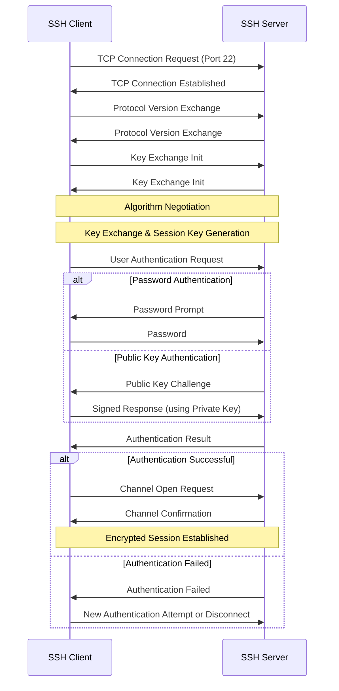

# Debian SSH Configuration

## Introduction

Secure Shell (SSH) is a cryptographic network protocol that enables secure communication over an unsecured network. On Debian systems, SSH provides a secure way to access remote servers, execute commands, manage files, and tunnel network connections. This guide will walk you through the complete process of configuring SSH on Debian systems, from installation to advanced security hardening techniques.

SSH operates on a client-server model, allowing you to connect from your local machine (client) to remote servers. All data transmitted between the client and server is encrypted, protecting your information from eavesdropping and man-in-the-middle attacks.

## Installing SSH on Debian

The SSH server component is called OpenSSH Server (package name: `openssh-server`), while the client component is OpenSSH Client (package name: `openssh-client`). On most Debian installations, the client is pre-installed, but you'll need to install the server to accept incoming connections.

### Installing the SSH Server

```bash
sudo apt update
sudo apt install openssh-server
```

After installation, the SSH service should start automatically. You can verify its status with:

```bash
sudo systemctl status ssh
```

Output:
```
● ssh.service - OpenBSD Secure Shell server
     Loaded: loaded (/lib/systemd/system/ssh.service; enabled; vendor preset: enabled)
     Active: active (running) since Mon 2023-10-09 14:30:45 UTC; 5s ago
       Docs: man:sshd(8)
             man:sshd_config(5)
    Process: 1234 ExecStartPre=/usr/sbin/sshd -t (code=exited, status=0/SUCCESS)
   Main PID: 1235 (sshd)
      Tasks: 1 (limit: 4915)
     Memory: 1.1M
        CPU: 25ms
     CGroup: /system.slice/ssh.service
             └─1235 sshd: /usr/sbin/sshd -D [listener] 0 of 10-100 startups
```

If you need to manually start, stop, or restart the SSH service:

```bash
sudo systemctl start ssh   # Start the service
sudo systemctl stop ssh    # Stop the service
sudo systemctl restart ssh # Restart the service
```

To enable SSH to start at boot:

```bash
sudo systemctl enable ssh
```

## SSH Configuration Files

The main SSH configuration files on Debian are:

1. Server configuration: `/etc/ssh/sshd_config`
2. Client configuration: `/etc/ssh/ssh_config`
3. User-specific client configuration: `~/.ssh/config`

### SSH Server Configuration

The `/etc/ssh/sshd_config` file controls the behavior of the SSH server. Let's explore some important settings:

```bash
sudo nano /etc/ssh/sshd_config
```

Here are key directives you might want to modify:

#### Port Setting

```
# Change the default SSH port (default is 22)
Port 22
```

Changing the default port can reduce automated attacks, but remember that you'll need to specify this port when connecting.

#### Protocol Version

Modern SSH servers use Protocol 2 exclusively, which is more secure than Protocol 1:

```
# Only use SSH protocol version 2
Protocol 2
```

#### Connection Settings

```
# Number of authentication attempts permitted
MaxAuthTries 6

# Maximum number of concurrent unauthenticated connections
MaxStartups 10:30:100

# Client alive interval in seconds (server checks if client is alive)
ClientAliveInterval 300

# Maximum client alive count (number of checks before disconnecting)
ClientAliveCountMax 3

# Timeout in seconds for login
LoginGraceTime 120
```

#### Authentication Settings

```
# Disable root login
PermitRootLogin no

# Disable password authentication (require key-based authentication)
PasswordAuthentication no

# Disable empty passwords
PermitEmptyPasswords no

# Enable public key authentication
PubkeyAuthentication yes

# Configure authorized keys file location
AuthorizedKeysFile .ssh/authorized_keys
```

After making changes to the configuration file, you need to restart the SSH service:

```bash
sudo systemctl restart ssh
```

## Setting Up Key-Based Authentication

Key-based authentication is more secure than passwords. It uses a pair of cryptographic keys: a private key on your client and a public key on the server.

### Step 1: Generate SSH Key Pair on Your Client

On your local machine (not the server), generate an SSH key pair:

```bash
ssh-keygen -t ed25519 -C "your_email@example.com"
```

Ed25519 is a modern, secure and efficient algorithm. If you need compatibility with older systems, you can use:

```bash
ssh-keygen -t rsa -b 4096 -C "your_email@example.com"
```

You'll be prompted to provide a file path and passphrase:

```
Generating public/private ed25519 key pair.
Enter file in which to save the key (/home/username/.ssh/id_ed25519):
Enter passphrase (empty for no passphrase):
Enter same passphrase again:
```

This creates:
- Private key: `~/.ssh/id_ed25519`
- Public key: `~/.ssh/id_ed25519.pub`

### Step 2: Copy the Public Key to Your Server

There are two ways to do this:

#### Option 1: Using ssh-copy-id (Easiest)

```bash
ssh-copy-id username@server_ip
```

If you're using a non-standard port:

```bash
ssh-copy-id -p port_number username@server_ip
```

#### Option 2: Manual Copy

First, display your public key:

```bash
cat ~/.ssh/id_ed25519.pub
```

Then, on your server, create the `.ssh` directory and the `authorized_keys` file if they don't exist:

```bash
mkdir -p ~/.ssh
touch ~/.ssh/authorized_keys
chmod 700 ~/.ssh
chmod 600 ~/.ssh/authorized_keys
```

Add your public key to the `authorized_keys` file:

```bash
echo "ssh-ed25519 AAAAC3NzaC1lZDI1NTE5AAAAIC8dkVOJ0ij1etgar9RgQ1xEwooF3SJYYKfS3U1CxvCn your_email@example.com" >> ~/.ssh/authorized_keys
```

### Step 3: Test the Connection

Try connecting to your server:

```bash
ssh username@server_ip
```

If you're using a custom port:

```bash
ssh -p port_number username@server_ip
```

## Configuring SSH Client

The system-wide client configuration is in `/etc/ssh/ssh_config`, but you can also create a user-specific configuration in `~/.ssh/config`.

### Creating a User Configuration File

```bash
touch ~/.ssh/config
chmod 600 ~/.ssh/config
nano ~/.ssh/config
```

### Example Configuration

Here's an example configuration with various options:

```
# Default for all hosts
Host *
    ForwardAgent no
    ForwardX11 no
    PasswordAuthentication no
    IdentityFile ~/.ssh/id_ed25519
    ServerAliveInterval 60
    ServerAliveCountMax 30

# Specific server configuration
Host myserver
    HostName 192.168.1.100
    Port 2222
    User myusername
    IdentityFile ~/.ssh/specific_key
    
# GitHub configuration
Host github.com
    HostName github.com
    User git
    IdentityFile ~/.ssh/github_key
```

With this configuration, you can simply use `ssh myserver` instead of `ssh -p 2222 myusername@192.168.1.100`.

## Securing Your SSH Server

Here are additional security measures for your SSH server:

### 1. Use SSH Keys Exclusively

Edit `/etc/ssh/sshd_config`:

```
PasswordAuthentication no
ChallengeResponseAuthentication no
UsePAM no
```

### 2. Implement Fail2Ban

Fail2Ban helps protect against brute force attacks by temporarily banning IP addresses with too many failed login attempts.

```bash
sudo apt install fail2ban
sudo systemctl enable fail2ban
sudo systemctl start fail2ban
```

Create a custom jail configuration:

```bash
sudo nano /etc/fail2ban/jail.d/ssh.conf
```

Add the following content:

```
[sshd]
enabled = true
port = ssh
filter = sshd
logpath = /var/log/auth.log
maxretry = 3
bantime = 3600
```

Restart Fail2Ban:

```bash
sudo systemctl restart fail2ban
```

### 3. Restrict SSH Access to Specific Users

In `/etc/ssh/sshd_config`:

```
# Allow only specific users
AllowUsers user1 user2

# Alternatively, allow only specific groups
AllowGroups sshusers admins
```

### 4. Configure Firewall Rules

Using UFW (Uncomplicated Firewall):

```bash
sudo apt install ufw
sudo ufw allow 22/tcp  # Or your custom SSH port
sudo ufw enable
```

### 5. Use TCP Wrappers

Edit `/etc/hosts.allow`:

```
sshd: 192.168.1.0/24, 10.0.0.0/8
```

Edit `/etc/hosts.deny`:

```
sshd: ALL
```

This allows connections only from specific IP ranges.

## SSH Tunneling

SSH tunneling allows you to securely forward traffic through an encrypted SSH connection.

### Local Port Forwarding

This forwards a port from your local machine to a remote server.

```bash
ssh -L local_port:destination_host:destination_port username@ssh_server
```

Example: Access a remote web server through SSH tunnel:

```bash
ssh -L 8080:internal-web-server:80 username@ssh_server
```

Now you can access the remote web server by browsing to `http://localhost:8080`.

### Remote Port Forwarding

This forwards a port from the server to your local machine.

```bash
ssh -R remote_port:local_host:local_port username@ssh_server
```

Example: Make your local web server accessible through a remote server:

```bash
ssh -R 8080:localhost:80 username@ssh_server
```

### Dynamic Port Forwarding (SOCKS Proxy)

This creates a SOCKS proxy on your local machine.

```bash
ssh -D local_port username@ssh_server
```

Example:

```bash
ssh -D 1080 username@ssh_server
```

Then configure your browser to use SOCKS proxy at localhost:1080.

## SSH Connection Flow

Here's a diagram of how SSH connections work:



## SCP and SFTP

SSH also enables secure file transfers using SCP (Secure Copy) and SFTP (SSH File Transfer Protocol).

### Using SCP

Copy a local file to a remote server:

```bash
scp /path/to/local/file username@server_ip:/path/to/remote/directory
```

Copy a remote file to your local machine:

```bash
scp username@server_ip:/path/to/remote/file /path/to/local/directory
```

For recursive copying of directories:

```bash
scp -r /path/to/local/directory username@server_ip:/path/to/remote/directory
```

### Using SFTP

Start an interactive SFTP session:

```bash
sftp username@server_ip
```

Common SFTP commands:
```
pwd         # Print working directory on remote
lpwd        # Print working directory on local
ls          # List files on remote
lls         # List files on local
cd          # Change directory on remote
lcd         # Change directory on local
get file    # Download file
put file    # Upload file
exit        # Exit SFTP
```

## Troubleshooting SSH

Here are some common issues and their solutions:

### Connection Refused

If you see `Connection refused`:

1. Check if the SSH service is running:
   ```bash
   sudo systemctl status ssh
   ```

2. Verify firewall settings:
   ```bash
   sudo ufw status
   ```

3. Check if SSH is listening on the expected port:
   ```bash
   sudo ss -tuln | grep ssh
   ```

### Permission Denied

If you see `Permission denied`:

1. Verify you're using the correct username and password/key.

2. Check the permissions on your key files:
   ```bash
   chmod 700 ~/.ssh
   chmod 600 ~/.ssh/id_ed25519
   chmod 600 ~/.ssh/config
   ```

3. Check the server logs:
   ```bash
   sudo tail -f /var/log/auth.log
   ```

### Slow SSH Connection

If SSH connections are slow to establish:

1. Add the following to your client's `~/.ssh/config`:
   ```
   Host *
       GSSAPIAuthentication no
       AddressFamily inet
   ```

2. Avoid DNS lookups in the server by adding this to `/etc/ssh/sshd_config`:
   ```
   UseDNS no
   ```

### Debugging Connection Issues

Use verbose mode for troubleshooting:

```bash
ssh -vvv username@server_ip
```

This provides detailed information about the connection process.

## Summary

SSH is a powerful tool for secure remote access and management of Debian systems. In this guide, we've covered:

- Installing and configuring the SSH server
- Setting up key-based authentication
- Securing your SSH server with best practices
- Using SSH tunneling for secure network access
- Transferring files with SCP and SFTP
- Troubleshooting common SSH issues

By implementing these practices, you can ensure that your remote connections are secure, efficient, and well-managed.

## Additional Resources

- [OpenSSH Documentation](https://www.openssh.com/manual.html)
- [Debian Wiki: SSH](https://wiki.debian.org/SSH)
- [SSH Academy](https://www.ssh.com/academy/)

## Exercises

1. Install the SSH server on your Debian system and connect to it from another machine.
2. Generate SSH keys and set up key-based authentication.
3. Modify the SSH server configuration to use a non-standard port and disable root login.
4. Create a custom SSH client configuration for connecting to multiple servers.
5. Set up a local port forwarding to access a web server running on a remote machine.
6. Configure Fail2Ban to protect your SSH server from brute force attacks.
7. Use SFTP to transfer files between your local machine and the server.
8. Set up SSH access for a specific group of users only.