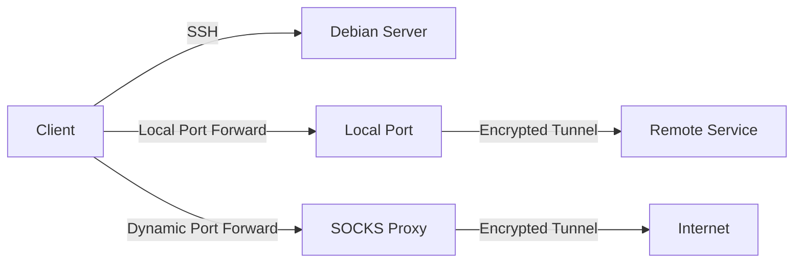
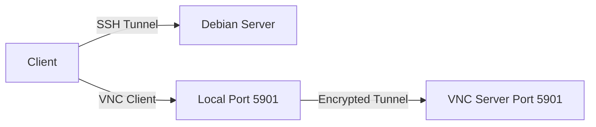
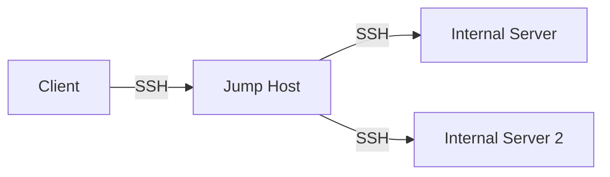

# Debian Remote Access

## Introduction

Remote access is a fundamental aspect of modern system administration and development, allowing users to connect to and manage Debian systems from distant locations. This capability is essential for server management, remote work, and collaborative development environments. In this tutorial, we'll explore various methods to establish secure and efficient remote connections to Debian systems.

Remote access technologies enable you to:
- Manage servers without physical access
- Work on your systems from anywhere
- Provide technical support to users
- Automate tasks across multiple machines
- Create distributed computing environments

## SSH: The Foundation of Remote Access

### What is SSH?

SSH (Secure Shell) is the cornerstone of remote access in Linux environments. It provides encrypted communication between computers, allowing secure remote login, command execution, and file transfers.

### Setting Up SSH Server on Debian

To enable SSH access to your Debian system, you need to install and configure the SSH server:

```bash
# Update package lists
sudo apt update

# Install OpenSSH server
sudo apt install openssh-server -y

# Check service status
systemctl status ssh
```

Expected output:
```
● ssh.service - OpenBSD Secure Shell server
     Loaded: loaded (/lib/systemd/system/ssh.service; enabled; vendor preset: enabled)
     Active: active (running) since Tue 2023-05-02 14:32:45 UTC; 5s ago
...
```

### Basic SSH Configuration

The main SSH configuration file is located at `/etc/ssh/sshd_config`. Let's modify some basic settings:

```bash
# Make a backup of the original configuration
sudo cp /etc/ssh/sshd_config /etc/ssh/sshd_config.bak

# Edit the configuration file
sudo nano /etc/ssh/sshd_config
```

Key settings to consider:

```
# Change default port (optional but recommended)
Port 2222

# Disable root login
PermitRootLogin no

# Use SSH key authentication only
PasswordAuthentication no
ChallengeResponseAuthentication no

# Limit user access (specify allowed users)
AllowUsers username1 username2
```

Remember to restart the SSH service after making changes:

```bash
sudo systemctl restart ssh
```

### Setting Up SSH Key Authentication

SSH keys provide a more secure authentication method than passwords:

1. Generate a key pair on your client machine:

```bash
ssh-keygen -t ed25519 -C "your_email@example.com"
```

2. Copy the public key to your Debian server:

```bash
ssh-copy-id -i ~/.ssh/id_ed25519.pub username@server_ip
```

3. Test the connection:

```bash
ssh username@server_ip
```

### SSH Port Forwarding

SSH can create secure tunnels for forwarding network traffic:

#### Local Port Forwarding
Forward a port from your local machine to a remote server:

```bash
ssh -L 8080:localhost:80 username@server_ip
```

This forwards your local port 8080 to port 80 on the server.

#### Remote Port Forwarding
Forward a port from the remote server to your local machine:

```bash
ssh -R 8080:localhost:80 username@server_ip
```

#### Dynamic Port Forwarding (SOCKS proxy)
Create a SOCKS proxy for browsing through your SSH connection:

```bash
ssh -D 1080 username@server_ip
```



## SCP and SFTP: File Transfers Over SSH

### Secure Copy (SCP)

SCP allows secure file transfers using the SSH protocol:

```bash
# Copy a local file to remote server
scp /path/to/local/file username@server_ip:/path/to/remote/directory

# Copy a remote file to local machine
scp username@server_ip:/path/to/remote/file /path/to/local/directory

# Recursive copy of directory
scp -r /path/to/local/directory username@server_ip:/path/to/remote/directory
```

### SFTP (SSH File Transfer Protocol)

SFTP provides an interactive file transfer session:

```bash
# Connect to remote server
sftp username@server_ip
```

Common SFTP commands:
```
pwd         # Print working directory on remote server
lpwd        # Print working directory on local machine
ls          # List files on remote server
lls         # List files on local machine
cd          # Change directory on remote server
lcd         # Change directory on local machine
get file    # Download a file
put file    # Upload a file
mget *.txt  # Download multiple files
mput *.txt  # Upload multiple files
exit        # Close the connection
```

## VNC: Remote Desktop Access

While SSH provides command-line access, VNC (Virtual Network Computing) allows graphical desktop access.

### Setting Up VNC Server on Debian

1. Install TigerVNC server:

```bash
sudo apt update
sudo apt install tigervnc-standalone-server tigervnc-common -y
```

2. Set VNC password:

```bash
vncpasswd
```

3. Create a VNC startup script (`~/.vnc/xstartup`):

```bash
mkdir -p ~/.vnc
nano ~/.vnc/xstartup
```

Add the following content:

```bash
#!/bin/bash
xrdb $HOME/.Xresources
startxfce4 &
```

Make it executable:

```bash
chmod +x ~/.vnc/xstartup
```

4. Start the VNC server:

```bash
vncserver :1 -geometry 1280x720 -depth 24
```

This starts a VNC server on display 1 (port 5901).

5. To stop the server:

```bash
vncserver -kill :1
```

### Accessing VNC Over SSH Tunnel

For security, we'll tunnel VNC through SSH:

1. On the client machine, create an SSH tunnel:

```bash
ssh -L 5901:localhost:5901 username@server_ip
```

2. Connect with a VNC client to `localhost:5901`



## X11 Forwarding: Remote GUI Applications

X11 forwarding allows running individual GUI applications remotely while displaying them locally.

### Server Setup

Ensure X11 forwarding is enabled in the SSH configuration:

```bash
sudo nano /etc/ssh/sshd_config
```

Add or uncomment:
```
X11Forwarding yes
```

Restart SSH:
```bash
sudo systemctl restart ssh
```

### Client Connection

Connect with X11 forwarding enabled:

```bash
ssh -X username@server_ip
```

For trusted X11 forwarding (better performance):

```bash
ssh -Y username@server_ip
```

Now you can run GUI applications on the remote server:

```bash
firefox &
```

The application will display on your local screen while running on the remote server.

## RDP: Remote Desktop Protocol

For Windows-like remote desktop experience, you can use RDP with xrdp.

### Setting Up xrdp on Debian

1. Install xrdp:

```bash
sudo apt update
sudo apt install xrdp -y
```

2. Start and enable the service:

```bash
sudo systemctl enable xrdp
sudo systemctl start xrdp
```

3. Check status:

```bash
sudo systemctl status xrdp
```

4. Configure the firewall to allow RDP traffic (port 3389):

```bash
sudo ufw allow 3389/tcp
```

### Connecting via RDP

Use an RDP client (like Windows Remote Desktop, Remmina, or FreeRDP) to connect to your Debian server's IP address.

## Security Considerations

When implementing remote access, security should be a top priority:

1. **Use Strong Authentication**
   - Prefer key-based authentication over passwords
   - Use passphrase-protected keys
   - Consider implementing 2FA for SSH

2. **Limit Access**
   - Change default ports
   - Use `AllowUsers` or `AllowGroups` in SSH config
   - Implement IP-based restrictions when possible

3. **Keep Software Updated**
   - Regularly update your system and remote access software
   - `sudo apt update && sudo apt upgrade`

4. **Use Firewalls**
   - Configure UFW (Uncomplicated Firewall):
   ```bash
   sudo apt install ufw
   sudo ufw default deny incoming
   sudo ufw default allow outgoing
   sudo ufw allow 2222/tcp  # SSH on custom port
   sudo ufw enable
   ```

5. **Implement Fail2ban**
   - Install and configure Fail2ban to block brute force attempts:
   ```bash
   sudo apt install fail2ban
   sudo cp /etc/fail2ban/jail.conf /etc/fail2ban/jail.local
   sudo nano /etc/fail2ban/jail.local
   ```

   Basic configuration:
   ```
   [sshd]
   enabled = true
   port = 2222
   filter = sshd
   logpath = /var/log/auth.log
   maxretry = 3
   bantime = 3600
   ```

   Start the service:
   ```bash
   sudo systemctl enable fail2ban
   sudo systemctl start fail2ban
   ```

## Automation with SSH

SSH can be leveraged for automation tasks:

### Running Commands Without Interactive Login

```bash
ssh username@server_ip "df -h; free -m; uptime"
```

### Using SSH Config File

Create `~/.ssh/config` for easier connections:

```
Host debian-server
    HostName 192.168.1.100
    Port 2222
    User username
    IdentityFile ~/.ssh/id_ed25519
    ForwardX11 yes
```

Now you can simply use:
```bash
ssh debian-server
```

### SSH Agent for Key Management

Use SSH agent to avoid entering your passphrase repeatedly:

```bash
# Start the SSH agent
eval $(ssh-agent)

# Add your key
ssh-add ~/.ssh/id_ed25519
```

## Advanced Topic: Jumphost Configuration

When you need to access servers in private networks, use a jumphost:

```bash
ssh -J username@jumphost.example.com username@internal-server
```

Configure in SSH config:

```
Host internal-server
    HostName 10.0.0.5
    User username
    ProxyJump username@jumphost.example.com
```



## Summary

Remote access is a critical skill for any Debian administrator or user. We've covered:

- SSH setup and configuration for secure command-line access
- File transfers using SCP and SFTP
- Graphical access using VNC, X11 forwarding, and RDP
- Security best practices for remote connections
- Automation and advanced SSH configurations

By implementing these tools and techniques, you can efficiently manage your Debian systems from anywhere while maintaining security and control.

## Additional Resources and Exercises

### Exercises

1. Set up SSH server with key-based authentication and disable password login.
2. Configure port forwarding to access a web server running on your Debian system.
3. Create an SSH config file with at least three different host configurations.
4. Set up a VNC server and connect to it through an SSH tunnel.
5. Configure Fail2ban to protect your SSH server from brute force attacks.

### Further Learning

- **OpenSSH Documentation**: The official documentation for OpenSSH
- **Linux Foundation Networking Basics**: Courses on networking fundamentals
- **Debian Administrator's Handbook**: Comprehensive guide to Debian system administration
- **The Secure Shell: The Definitive Guide**: In-depth book on SSH

Remember that remote access opens your system to the internet, so always prioritize security and keep your systems updated.