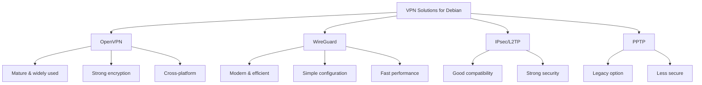
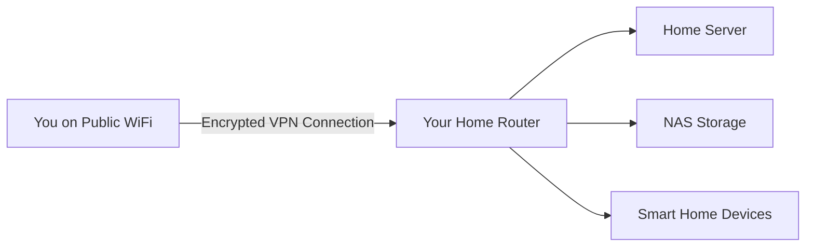

# Debian VPN Setup

## Introduction

Virtual Private Networks (VPNs) are essential tools in modern networking that create secure, encrypted connections over potentially insecure networks like the internet. For Debian users, setting up a VPN provides enhanced privacy, security, and access to resources that might otherwise be restricted.

In this guide, we'll explore how to set up different types of VPNs on Debian systems. We'll cover both client and server configurations, focusing on OpenVPN and WireGuard, two of the most popular and robust VPN solutions available for Linux systems.

## Prerequisites

Before beginning the VPN setup process, ensure you have:

- A Debian system (this guide is tested on Debian 11 Bullseye and 12 Bookworm)
- Root access or sudo privileges
- Basic understanding of networking concepts
- Terminal familiarity
- An internet connection

## Understanding VPN Types

There are several VPN implementations available for Debian. Let's look at the most common options:



For this guide, we'll focus on OpenVPN and WireGuard as they represent the best balance of security, performance, and ease of use.

## Setting Up OpenVPN Client

Let's start with configuring a Debian system as an OpenVPN client to connect to an existing VPN server.

### 1. Install OpenVPN Package

```bash
sudo apt update
sudo apt install openvpn
```

### 2. Obtain Configuration Files

You'll need configuration files from your VPN provider or administrator. These typically include:
- A `.ovpn` configuration file
- Certificate and key files (sometimes embedded in the .ovpn file)

Save these files in a secure location, such as `/etc/openvpn/client/`.

### 3. Connect to the VPN

For a quick test connection:

```bash
sudo openvpn --config /path/to/your/config.ovpn
```

If the connection is successful, you'll see output similar to:

```
Initialization Sequence Completed
```

To disconnect, press `Ctrl+C`.

### 4. Configure Automatic Connection at Boot

To have the VPN start automatically at boot time:

1. Copy your `.ovpn` file to the OpenVPN directory:

```bash
sudo cp your-config.ovpn /etc/openvpn/client/your-config.conf
```

Note: The file must have a `.conf` extension in this location.

2. Enable and start the OpenVPN client service:

```bash
sudo systemctl enable --now openvpn-client@your-config
```

3. Verify the connection status:

```bash
sudo systemctl status openvpn-client@your-config
```

## Setting Up WireGuard Client

WireGuard is a modern VPN protocol that offers simplicity and performance advantages over OpenVPN.

### 1. Install WireGuard

```bash
sudo apt update
sudo apt install wireguard
```

### 2. Create a Configuration File

Create a new configuration file at `/etc/wireguard/wg0.conf`:

```bash
sudo nano /etc/wireguard/wg0.conf
```

Add the following content, replacing the placeholders with your actual WireGuard configuration:

```
[Interface]
PrivateKey = your_private_key
Address = 10.0.0.2/24
DNS = 1.1.1.1, 8.8.8.8

[Peer]
PublicKey = server_public_key
AllowedIPs = 0.0.0.0/0, ::/0
Endpoint = server_ip:51820
PersistentKeepalive = 25
```

### 3. Secure the Configuration File

```bash
sudo chmod 600 /etc/wireguard/wg0.conf
```

### 4. Start the WireGuard Connection

```bash
sudo wg-quick up wg0
```

### 5. Enable Automatic Connection at Boot

```bash
sudo systemctl enable --now wg-quick@wg0
```

### 6. Verify Connection Status

```bash
sudo wg show
```

The output should display your active connection:

```
interface: wg0
  public key: your_public_key
  private key: (hidden)
  listening port: 51820

peer: server_public_key
  endpoint: server_ip:51820
  allowed ips: 0.0.0.0/0, ::/0
  latest handshake: 1 minute ago
  transfer: 4.32 KiB received, 3.60 KiB sent
  persistent keepalive: every 25 seconds
```

## Setting Up an OpenVPN Server

For those who want to create their own VPN server on Debian, here's a step-by-step process.

### 1. Install Required Packages

```bash
sudo apt update
sudo apt install openvpn easy-rsa
```

### 2. Set Up Certificate Authority and Server Certificates

```bash
mkdir -p ~/openvpn-ca
cd ~/openvpn-ca
cp -r /usr/share/easy-rsa/* .
```

Initialize the PKI (Public Key Infrastructure):

```bash
cd ~/openvpn-ca
./easyrsa init-pki
./easyrsa build-ca
```

When prompted, enter a suitable CA name (or press Enter for the default).

Generate the server certificate and key:

```bash
./easyrsa build-server-full server nopass
./easyrsa gen-dh
```

Generate an HMAC signature to strengthen the server's TLS integrity verification:

```bash
openvpn --genkey secret ~/openvpn-ca/pki/ta.key
```

### 3. Create Server Configuration

First, create a directory for the server configuration:

```bash
sudo mkdir -p /etc/openvpn/server
```

Copy the necessary files to the OpenVPN directory:

```bash
cd ~/openvpn-ca/pki
sudo cp ca.crt issued/server.crt private/server.key dh.pem ta.key /etc/openvpn/server/
```

Create a server configuration file:

```bash
sudo nano /etc/openvpn/server/server.conf
```

Add the following content:

```
port 1194
proto udp
dev tun
ca /etc/openvpn/server/ca.crt
cert /etc/openvpn/server/server.crt
key /etc/openvpn/server/server.key
dh /etc/openvpn/server/dh.pem
tls-auth /etc/openvpn/server/ta.key 0
server 10.8.0.0 255.255.255.0
ifconfig-pool-persist ipp.txt
push "redirect-gateway def1 bypass-dhcp"
push "dhcp-option DNS 8.8.8.8"
push "dhcp-option DNS 8.8.4.4"
keepalive 10 120
cipher AES-256-GCM
auth SHA256
user nobody
group nogroup
persist-key
persist-tun
status openvpn-status.log
verb 3
```

### 4. Configure IP Forwarding

Enable IP forwarding:

```bash
sudo nano /etc/sysctl.conf
```

Uncomment or add the following line:

```
net.ipv4.ip_forward=1
```

Apply the change:

```bash
sudo sysctl -p
```

### 5. Configure Firewall Rules

If you're using UFW (Uncomplicated Firewall):

```bash
sudo nano /etc/default/ufw
```

Change the default forward policy:

```
DEFAULT_FORWARD_POLICY="ACCEPT"
```

Then configure the firewall rules:

```bash
sudo nano /etc/ufw/before.rules
```

Add the following lines at the beginning of the file, before the `*filter` line:

```
# NAT table rules
*nat
:POSTROUTING ACCEPT [0:0]
-A POSTROUTING -s 10.8.0.0/24 -o eth0 -j MASQUERADE
COMMIT
```

Replace `eth0` with your actual network interface name.

Allow OpenVPN traffic:

```bash
sudo ufw allow 1194/udp
sudo ufw reload
```

### 6. Start and Enable the OpenVPN Server

```bash
sudo systemctl enable --now openvpn-server@server
```

### 7. Create Client Configuration

Generate a client certificate:

```bash
cd ~/openvpn-ca
./easyrsa build-client-full client1 nopass
```

Create a client configuration file:

```bash
mkdir -p ~/client-configs/files
nano ~/client-configs/client-template.txt
```

Add the following content:

```
client
dev tun
proto udp
remote your_server_ip 1194
resolv-retry infinite
nobind
persist-key
persist-tun
remote-cert-tls server
cipher AES-256-GCM
auth SHA256
key-direction 1
verb 3
```

Create a script to generate the final client configuration:

```bash
nano ~/client-configs/make_config.sh
```

Add the following content:

```bash
#!/bin/bash

KEY_DIR=~/openvpn-ca/pki
OUTPUT_DIR=~/client-configs/files
BASE_CONFIG=~/client-configs/client-template.txt

cat ${BASE_CONFIG} \
    <(echo -e '<ca>') \
    ${KEY_DIR}/ca.crt \
    <(echo -e '</ca>
<cert>') \
    ${KEY_DIR}/issued/${1}.crt \
    <(echo -e '</cert>
<key>') \
    ${KEY_DIR}/private/${1}.key \
    <(echo -e '</key>
<tls-auth>') \
    ${KEY_DIR}/ta.key \
    <(echo -e '</tls-auth>') \
    > ${OUTPUT_DIR}/${1}.ovpn
```

Make the script executable:

```bash
chmod 700 ~/client-configs/make_config.sh
```

Generate the client configuration:

```bash
cd ~/client-configs
./make_config.sh client1
```

The client configuration will be available at `~/client-configs/files/client1.ovpn`.

## Setting Up a WireGuard Server

WireGuard is simpler to set up as a server compared to OpenVPN.

### 1. Install WireGuard

```bash
sudo apt update
sudo apt install wireguard
```

### 2. Generate Server Keys

```bash
cd /etc/wireguard
sudo umask 077
sudo wg genkey | sudo tee server_private.key | sudo wg pubkey | sudo tee server_public.key
```

### 3. Create Server Configuration

Create a configuration file:

```bash
sudo nano /etc/wireguard/wg0.conf
```

Add the following content:

```
[Interface]
PrivateKey = $(cat /etc/wireguard/server_private.key)
Address = 10.0.0.1/24
ListenPort = 51820
SaveConfig = true

# Enable IP forwarding
PostUp = iptables -A FORWARD -i wg0 -j ACCEPT; iptables -t nat -A POSTROUTING -o eth0 -j MASQUERADE
PostDown = iptables -D FORWARD -i wg0 -j ACCEPT; iptables -t nat -D POSTROUTING -o eth0 -j MASQUERADE
```

Replace `eth0` with your actual network interface name.

### 4. Enable IP Forwarding

```bash
sudo nano /etc/sysctl.conf
```

Uncomment or add the following line:

```
net.ipv4.ip_forward=1
```

Apply the change:

```bash
sudo sysctl -p
```

### 5. Configure a Client

Generate client keys:

```bash
cd /etc/wireguard
sudo wg genkey | sudo tee client1_private.key | sudo wg pubkey | sudo tee client1_public.key
```

Add the client to the server configuration:

```bash
sudo nano /etc/wireguard/wg0.conf
```

Append the following at the end of the file:

```
[Peer]
PublicKey = $(cat /etc/wireguard/client1_public.key)
AllowedIPs = 10.0.0.2/32
```

### 6. Start and Enable WireGuard

```bash
sudo systemctl enable --now wg-quick@wg0
```

### 7. Create Client Configuration

Create a configuration file for the client:

```
[Interface]
PrivateKey = $(cat /etc/wireguard/client1_private.key)
Address = 10.0.0.2/24
DNS = 1.1.1.1, 8.8.8.8

[Peer]
PublicKey = $(cat /etc/wireguard/server_public.key)
AllowedIPs = 0.0.0.0/0, ::/0
Endpoint = your_server_ip:51820
PersistentKeepalive = 25
```

## Testing Your VPN Connection

After setting up your VPN, it's important to test that it's working properly.

### 1. Check Connection Status

For OpenVPN:
```bash
sudo systemctl status openvpn-client@your-config
```

For WireGuard:
```bash
sudo wg show
```

### 2. Verify IP Address

Before connecting:
```bash
curl ifconfig.me
```

After connecting:
```bash
curl ifconfig.me
```

Your IP address should change after connecting to the VPN.

### 3. Test for DNS Leaks

Visit a website like [dnsleaktest.com](https://dnsleaktest.com) (from your browser) to check for DNS leaks.

### 4. Check for IPv6 Leaks

If you're concerned about IPv6 leaks, disable IPv6 if not needed:

```bash
sudo nano /etc/sysctl.conf
```

Add these lines:

```
net.ipv6.conf.all.disable_ipv6 = 1
net.ipv6.conf.default.disable_ipv6 = 1
```

Apply the changes:

```bash
sudo sysctl -p
```

## Common VPN Issues and Troubleshooting

### 1. Connection Failures

If you can't connect to your VPN:

- Check your internet connection
- Verify server addresses and ports
- Ensure firewall rules allow VPN traffic
- Check logs for specific errors:
  ```bash
  sudo journalctl -u openvpn-client@your-config
  ```
  or
  ```bash
  sudo journalctl -u wg-quick@wg0
  ```

### 2. Slow Performance

If your VPN connection is slow:

- Try a different VPN protocol (WireGuard is often faster than OpenVPN)
- Connect to a server geographically closer to your location
- Adjust MTU settings (advanced):
  ```bash
  sudo ip link set dev tun0 mtu 1400  # For OpenVPN
  ```
  or
  ```bash
  sudo wg-quick down wg0
  sudo nano /etc/wireguard/wg0.conf  # Add: MTU = 1420
  sudo wg-quick up wg0
  ```

### 3. DNS Issues

If websites don't resolve properly:

- Check your DNS settings
- Try using different DNS servers in your configuration
- Install and use `resolvconf`:
  ```bash
  sudo apt install resolvconf
  ```

## Best Practices for VPN Security

1. **Keep software updated**:
   ```bash
   sudo apt update && sudo apt upgrade
   ```

2. **Use strong encryption**:
   - For OpenVPN, use AES-256-GCM with SHA256 authentication
   - WireGuard uses modern cryptography by default

3. **Implement perfect forward secrecy**:
   - OpenVPN provides this via TLS
   - WireGuard implements this by default

4. **Regular certificate rotation**:
   - For OpenVPN, regenerate certificates every 1-2 years

5. **Limit access**:
   - Use firewall rules to restrict access to VPN services
   - Implement 2FA where possible

## Practical Applications

### 1. Accessing Home Network Remotely

Set up a VPN server at home to securely access your devices when away:



### 2. Securing Public WiFi Usage

Use a VPN client to encrypt your traffic when on public WiFi:


### 3. Connecting Multiple Office Locations

Use site-to-site VPN to connect different office networks:


## Summary

In this guide, we've covered:

- Setting up OpenVPN and WireGuard clients on Debian
- Configuring OpenVPN and WireGuard servers
- Testing and troubleshooting VPN connections
- Best practices for VPN security
- Practical applications of VPNs

VPNs are powerful tools for enhancing your network security and privacy. By following this guide, you should be able to set up a secure VPN solution that meets your needs using Debian's robust networking capabilities.

## Additional Resources

For further learning:

- **OpenVPN Documentation**: [https://openvpn.net/community-resources/](https://openvpn.net/community-resources/)
- **WireGuard Documentation**: [https://www.wireguard.com/quickstart/](https://www.wireguard.com/quickstart/)
- **Debian Wiki - VPN**: [https://wiki.debian.org/CategoryVPN](https://wiki.debian.org/CategoryVPN)

## Exercises

1. Set up a WireGuard client and connect to a free or commercial VPN service.
2. Configure an OpenVPN server on your home network and connect to it from outside your network.
3. Create a script that automatically switches between different VPN configurations based on your network location.
4. Implement a kill switch that disconnects your internet if the VPN connection drops.
5. Set up split tunneling to route only specific traffic through your VPN.