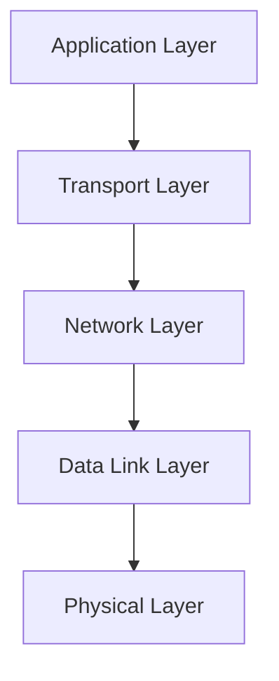

# Debian Network Troubleshooting

## Introduction

Network troubleshooting is an essential skill for any Debian system administrator or enthusiast. When network connectivity issues arise, having a systematic approach to identify and resolve problems can save hours of frustration. This guide will walk you through the common network issues on Debian systems and provide practical tools and techniques to diagnose and fix them.

Whether you're dealing with a simple connection problem or a complex networking issue, this guide will equip you with the knowledge to efficiently troubleshoot and resolve network problems on your Debian system.

## Basic Network Concepts

Before diving into troubleshooting, let's review some fundamental networking concepts that will help you understand the troubleshooting process better.

### Network Layers

Networks operate on different layers, and problems can occur at any layer:



When troubleshooting, it's often best to start at the physical layer and work your way up, verifying each layer functions correctly.

### Common Network Components in Debian

- **Network Interface**: Physical or virtual device that connects your computer to a network (e.g., `eth0`, `wlan0`)
- **IP Address**: Unique identifier for your device on a network
- **Gateway**: Router that connects your local network to other networks
- **DNS Servers**: Servers that translate domain names to IP addresses
- **Netmask**: Defines the range of IP addresses in your subnet

## Essential Network Troubleshooting Tools

Debian comes with powerful tools for diagnosing and fixing network issues. Let's explore the most important ones:

### 1. Network Status Tools

#### `ip` Command

The `ip` command is the modern replacement for `ifconfig` and provides comprehensive information about your network interfaces.

```bash
# Show all network interfaces
ip link

# Show IP addresses assigned to interfaces
ip addr

# Show routing table
ip route
```

Example output of `ip addr`:

```
1: lo: <LOOPBACK,UP,LOWER_UP> mtu 65536 qdisc noqueue state UNKNOWN group default qlen 1000
    link/loopback 00:00:00:00:00:00 brd 00:00:00:00:00:00
    inet 127.0.0.1/8 scope host lo
       valid_lft forever preferred_lft forever
    inet6 ::1/128 scope host 
       valid_lft forever preferred_lft forever
2: eth0: <BROADCAST,MULTICAST,UP,LOWER_UP> mtu 1500 qdisc pfifo_fast state UP group default qlen 1000
    link/ether 00:1a:2b:3c:4d:5e brd ff:ff:ff:ff:ff:ff
    inet 192.168.1.100/24 brd 192.168.1.255 scope global eth0
       valid_lft forever preferred_lft forever
    inet6 fe80::21a:2bff:fe3c:4d5e/64 scope link 
       valid_lft forever preferred_lft forever
```

#### `netstat` or `ss`

These tools show network connections, routing tables, and interface statistics.

```bash
# Show all listening ports and established connections
ss -tuln

# Show network statistics
netstat -i
```

Example output of `ss -tuln`:

```
Netid  State   Recv-Q  Send-Q  Local Address:Port  Peer Address:Port
udp    UNCONN  0       0       127.0.0.53%lo:53    0.0.0.0:*
udp    UNCONN  0       0       0.0.0.0:68          0.0.0.0:*
tcp    LISTEN  0       128     0.0.0.0:22          0.0.0.0:*
tcp    LISTEN  0       128     127.0.0.1:631       0.0.0.0:*
tcp    LISTEN  0       128     [::]:22             [::]:*
```

### 2. Connectivity Testing Tools

#### `ping`

The simplest tool to check if a host is reachable:

```bash
# Test connectivity to Google's DNS server
ping 8.8.8.8

# Test connectivity to a domain
ping debian.org
```

Example output:

```
PING 8.8.8.8 (8.8.8.8) 56(84) bytes of data.
64 bytes from 8.8.8.8: icmp_seq=1 ttl=118 time=12.3 ms
64 bytes from 8.8.8.8: icmp_seq=2 ttl=118 time=11.9 ms
64 bytes from 8.8.8.8: icmp_seq=3 ttl=118 time=12.1 ms
--- 8.8.8.8 ping statistics ---
3 packets transmitted, 3 received, 0% packet loss, time 2003ms
rtt min/avg/max/mdev = 11.902/12.106/12.316/0.169 ms
```

#### `traceroute`

Shows the path packets take to reach a destination:

```bash
# Trace route to Debian's website
traceroute debian.org
```

Example output:

```
traceroute to debian.org (149.20.4.15), 30 hops max, 60 byte packets
 1  _gateway (192.168.1.1)  1.234 ms  1.456 ms  1.789 ms
 2  isp-router.example.net (203.0.113.1)  15.643 ms  16.012 ms  16.345 ms
 3  backbone-1.example.net (198.51.100.1)  20.123 ms  20.456 ms  20.789 ms
 ...
15  debian.org (149.20.4.15)  78.123 ms  78.456 ms  78.789 ms
```

#### `mtr`

Combines ping and traceroute in a continuously updating display:

```bash
# Run MTR to Debian's website
mtr debian.org
```

Example output:

```
                                       My traceroute  [v0.92]
host (192.168.1.100)                                         Thu Mar 13 14:22:38 2025
Keys:  Help   Display mode   Restart statistics   Order of fields   quit
                                        Packets               Pings
 Host                                Loss%   Snt   Last   Avg  Best  Wrst StDev
 1. _gateway                          0.0%    10    1.2   1.3   1.1   1.5   0.1
 2. isp-router.example.net            0.0%    10   15.6  15.8  15.3  16.4   0.3
 ...
15. debian.org                        0.0%    10   78.1  78.5  77.9  79.3   0.4
```

### 3. DNS Troubleshooting Tools

#### `dig` or `nslookup`

These tools query DNS servers for information:

```bash
# Look up the IP address for debian.org
dig debian.org

# Query a specific DNS server
dig @8.8.8.8 debian.org
```

Example output of `dig debian.org`:

```
; <<>> DiG 9.16.33-Debian <<>> debian.org
;; global options: +cmd
;; Got answer:
;; ->>HEADER<<- opcode: QUERY, status: NOERROR, id: 12345
;; flags: qr rd ra; QUERY: 1, ANSWER: 1, AUTHORITY: 0, ADDITIONAL: 1

;; QUESTION SECTION:
;debian.org.			IN	A

;; ANSWER SECTION:
debian.org.		3599	IN	A	149.20.4.15

;; Query time: 28 msec
;; SERVER: 127.0.0.53#53(127.0.0.53)
;; WHEN: Thu Mar 13 14:25:30 UTC 2025
;; MSG SIZE  rcvd: 56
```

#### `host`

A simpler DNS lookup tool:

```bash
# Look up hostname for an IP
host 8.8.8.8

# Look up IP for a hostname
host debian.org
```

Example output:

```
debian.org has address 149.20.4.15
debian.org has IPv6 address 2001:4f8:1:c::15
debian.org mail is handled by 10 mailly.debian.org.
```

### 4. Network Configuration Files

Understanding these files is crucial for effective troubleshooting:

- **/etc/network/interfaces**: Traditional network interface configuration
- **/etc/netplan/**: Configuration for newer versions of Debian using Netplan
- **/etc/resolv.conf**: DNS resolver configuration
- **/etc/hosts**: Static hostname to IP mappings

## Common Network Issues and Solutions

Let's explore typical network problems and how to solve them systematically:

### Issue 1: No Network Connectivity

#### Step-by-Step Troubleshooting:

1. **Check physical connection**
   
   Verify cables are properly connected and network interface LEDs are active.

2. **Verify interface status**

   ```bash
   ip link show
   ```
   
   Look for `UP` or `DOWN` status. If it's down, bring it up:
   
   ```bash
   sudo ip link set eth0 up
   ```

3. **Check IP address assignment**

   ```bash
   ip addr show
   ```
   
   If no IP address is assigned, try:
   
   ```bash
   # For static IP
   sudo ip addr add 192.168.1.100/24 dev eth0
   
   # For DHCP
   sudo dhclient eth0
   ```

4. **Verify default gateway**

   ```bash
   ip route show
   ```
   
   If no default route exists, add one:
   
   ```bash
   sudo ip route add default via 192.168.1.1 dev eth0
   ```

### Issue 2: DNS Problems

If you can ping an IP address but not a domain name, you have a DNS issue:

1. **Check DNS configuration**

   ```bash
   cat /etc/resolv.conf
   ```
   
   It should contain valid nameservers, e.g.:
   
   ```
   nameserver 8.8.8.8
   nameserver 8.8.4.4
   ```

2. **Test DNS resolution**

   ```bash
   dig debian.org
   ```
   
   If that fails, try with a specific DNS server:
   
   ```bash
   dig @8.8.8.8 debian.org
   ```

3. **Fix DNS configuration**

   ```bash
   sudo nano /etc/resolv.conf
   ```
   
   Add reliable DNS servers:
   
   ```
   nameserver 8.8.8.8
   nameserver 1.1.1.1
   ```
   
   Make changes permanent by editing the appropriate configuration file, which might be:
   - `/etc/network/interfaces`
   - `/etc/netplan/*.yaml`
   - `/etc/dhcp/dhclient.conf`

### Issue 3: Intermittent Connectivity

1. **Check for packet loss**

   ```bash
   ping -c 100 8.8.8.8
   ```
   
   Look for packet loss percentage in the summary.

2. **Monitor connection quality**

   ```bash
   mtr google.com
   ```
   
   Watch for high packet loss or latency at specific hops.

3. **Check interface errors**

   ```bash
   ip -s link show eth0
   ```
   
   Look for increasing error counts which might indicate hardware issues.

### Issue 4: Firewall Blocks

1. **Check if iptables is blocking traffic**

   ```bash
   sudo iptables -L -v
   ```

2. **Temporarily disable the firewall for testing**

   ```bash
   sudo iptables -F
   ```
   
   If connectivity returns, you need to adjust your firewall rules.

3. **Add appropriate rules**

   ```bash
   sudo iptables -A INPUT -p tcp --dport 80 -j ACCEPT
   sudo iptables -A INPUT -p tcp --dport 443 -j ACCEPT
   ```

## Practical Troubleshooting Scenarios

### Scenario 1: Web Server Access Problem

Imagine you have a web server running on your Debian system, but users can't access it:

1. **Verify the web server is running**

   ```bash
   sudo systemctl status apache2
   ```

2. **Check if the web server is listening on the expected port**

   ```bash
   ss -tuln | grep 80
   ```

3. **Test local access**

   ```bash
   curl http://localhost
   ```

4. **Check firewall rules**

   ```bash
   sudo iptables -L | grep 80
   ```

5. **Verify network interface configuration**

   ```bash
   ip addr show
   ```

### Scenario 2: Diagnosing Slow Network Performance

1. **Check current network usage**

   ```bash
   iftop -i eth0
   ```
   
   Or if not installed:
   
   ```bash
   sudo apt update && sudo apt install iftop
   ```

2. **Identify processes using network bandwidth**

   ```bash
   nethogs eth0
   ```

3. **Test network throughput**

   ```bash
   # Install iperf3 if needed
   sudo apt install iperf3
   
   # Run as server on one machine
   iperf3 -s
   
   # Run as client on another machine
   iperf3 -c server_ip_address
   ```

4. **Check for duplex mismatches**

   ```bash
   ethtool eth0 | grep -E 'Speed|Duplex'
   ```

## Advanced Troubleshooting Techniques

### Network Packet Capture with tcpdump

`tcpdump` is a powerful tool for analyzing network traffic:

```bash
# Capture packets on interface eth0
sudo tcpdump -i eth0

# Capture packets for a specific host
sudo tcpdump -i eth0 host 192.168.1.10

# Capture specific port traffic
sudo tcpdump -i eth0 port 80

# Save capture to a file for later analysis
sudo tcpdump -i eth0 -w capture.pcap
```

Example output:

```
14:35:24.123456 IP 192.168.1.100.58642 > 93.184.216.34.80: Flags [S], seq 123456789, win 64240, options [mss 1460,sackOK,TS val 1234567 ecr 0,nop,wscale 7], length 0
14:35:24.234567 IP 93.184.216.34.80 > 192.168.1.100.58642: Flags [S.], seq 987654321, ack 123456790, win 65535, options [mss 1460,sackOK,TS val 9876543 ecr 1234567,nop,wscale 7], length 0
14:35:24.234678 IP 192.168.1.100.58642 > 93.184.216.34.80: Flags [.], ack 1, win 502, options [nop,nop,TS val 1234568 ecr 9876543], length 0
```

### Network Boot Process Understanding

Understanding the boot process can help troubleshoot persistent issues:

1. **Interface initialization**: Kernel loads network drivers
2. **Configuration application**: System reads configs from `/etc/network/interfaces` or `/etc/netplan/`
3. **DHCP negotiation** (if using DHCP)
4. **Interface activation**: Network interfaces come online
5. **Routing table setup**: Default routes and static routes established
6. **DNS configuration**: `/etc/resolv.conf` populated

## Making Network Changes Persistent

### For Traditional Debian Systems

Edit the `/etc/network/interfaces` file:

```bash
sudo nano /etc/network/interfaces
```

Example configuration:

```
# The loopback network interface
auto lo
iface lo inet loopback

# The primary network interface
auto eth0
iface eth0 inet static
    address 192.168.1.100
    netmask 255.255.255.0
    gateway 192.168.1.1
    dns-nameservers 8.8.8.8 8.8.4.4
```

For DHCP:

```
auto eth0
iface eth0 inet dhcp
```

### For Newer Debian Systems (using Netplan)

Edit or create a file in `/etc/netplan/`:

```bash
sudo nano /etc/netplan/01-netcfg.yaml
```

Example configuration:

```yaml
network:
  version: 2
  renderer: networkd
  ethernets:
    eth0:
      dhcp4: no
      addresses:
        - 192.168.1.100/24
      gateway4: 192.168.1.1
      nameservers:
        addresses: [8.8.8.8, 8.8.4.4]
```

Apply the configuration:

```bash
sudo netplan apply
```

## Troubleshooting Wireless Networks

Wireless networks add another layer of complexity:

1. **Check wireless interface status**

   ```bash
   ip link show wlan0
   ```

2. **Scan for available networks**

   ```bash
   sudo iwlist wlan0 scan | grep ESSID
   ```

3. **Check connection quality**

   ```bash
   iwconfig wlan0
   ```
   
   Look for "Link Quality" and "Signal level" in the output.

4. **Restart wireless interface**

   ```bash
   sudo ip link set wlan0 down
   sudo ip link set wlan0 up
   ```

5. **Connect to a network manually**

   ```bash
   sudo iwconfig wlan0 essid "NetworkName" key s:password
   sudo dhclient wlan0
   ```

## Summary

Network troubleshooting in Debian is a methodical process that involves:

1. **Identifying the problem**: Determine which layer of the network stack is affected
2. **Gathering information**: Use tools like `ip`, `ping`, `dig`, and `traceroute`
3. **Testing hypotheses**: Make controlled changes to isolate the issue
4. **Implementing solutions**: Apply fixes systematically
5. **Verifying the fix**: Ensure the problem is resolved and doesn't recur

By following a structured approach and understanding the tools at your disposal, you can efficiently diagnose and resolve most network issues on your Debian system.

## Additional Resources

To deepen your understanding of Debian networking, consider exploring:

- The [Debian Network Configuration](https://wiki.debian.org/NetworkConfiguration) wiki page
- The `man` pages for networking tools: `man ip`, `man netstat`, `man tcpdump`
- The book "TCP/IP Network Administration" by Craig Hunt
- The [Linux Network Administrators Guide](https://tldp.org/LDP/nag2/index.html)

## Exercises

1. Deliberately disconnect your network cable and practice bringing the interface back up
2. Set up a static IP address, then change it back to DHCP
3. Configure your system to use alternate DNS servers
4. Use `tcpdump` to capture HTTP traffic while accessing a website
5. Create a script that performs basic network diagnostics and reports any issues found