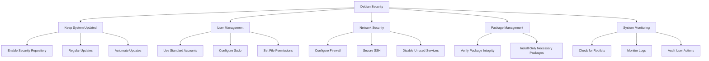

# Debian Security Basics

## Introduction

Security is a critical aspect of any operating system, and Debian Linux is no exception. As one of the most stable and widely-used Linux distributions, Debian provides robust security features that, when properly configured, can protect your system from various threats. This guide introduces the fundamental security concepts and practices for Debian systems, aimed at beginners who want to ensure their systems remain secure.

Security in Debian involves multiple layers of protection, from package management to user permissions, network configuration, and regular system maintenance. By understanding these basics, you'll build a solid foundation for maintaining secure Debian systems in any environment.

## Understanding Debian's Security Model

Debian's security philosophy is built on several key principles:

1. **Stable, tested software**: Debian prioritizes stability and security over having the latest features
2. **Timely security updates**: The Debian Security Team actively monitors and addresses vulnerabilities
3. **Principle of least privilege**: Users and processes should have only the permissions they need
4. **Transparency**: Security issues are openly discussed and addressed

Let's explore how these principles translate into practical security measures.

## Keeping Your System Updated

### The Debian Security Repository

Debian maintains a dedicated security repository that provides security updates for all supported Debian releases. This repository should be included in your `/etc/apt/sources.list` file.

For Debian 12 (Bookworm), your sources.list should include:

```bash
deb http://security.debian.org/debian-security bookworm-security main contrib non-free
```

### Updating Your System

To keep your system secure, regularly update your package lists and install security updates:

```bash
# Update package lists
sudo apt update

# Install security updates only
sudo apt upgrade -t bookworm-security

# Or upgrade all packages
sudo apt full-upgrade
```

### Automating Security Updates

For servers or systems requiring minimal maintenance, you can automate security updates using the `unattended-upgrades` package:

```bash
# Install unattended-upgrades
sudo apt install unattended-upgrades apt-listchanges

# Configure automatic updates
sudo dpkg-reconfigure -plow unattended-upgrades
```

The configuration file at `/etc/apt/apt.conf.d/50unattended-upgrades` can be customized to determine which updates are automatically installed.

## User and Permission Management

### Creating and Managing Users

Proper user management is crucial for system security. Create standard (non-administrator) accounts for daily use:

```bash
# Create a new user
sudo adduser username

# Add user to a group
sudo adduser username groupname
```

### Understanding the Sudo System

Instead of using the root account directly, Debian recommends using `sudo` to perform administrative tasks:

```bash
# Install sudo if not already installed
sudo apt install sudo

# Add a user to the sudo group
sudo adduser username sudo
```

Users in the sudo group can run commands with root privileges by prefixing commands with `sudo`.

### Setting Proper File Permissions

Ensure files have appropriate permissions:

```bash
# View file permissions
ls -l filename

# Change file ownership
sudo chown user:group filename

# Set restrictive permissions for sensitive files
sudo chmod 600 /path/to/sensitive/file

# Make a script executable for the owner only
chmod 700 script.sh
```

## Network Security

### Configuring the Firewall

Debian uses `nftables` (or the older `iptables`) as its firewall system. For easier management, install `ufw` (Uncomplicated Firewall):

```bash
# Install UFW
sudo apt install ufw

# Allow SSH connections (important if connecting remotely!)
sudo ufw allow ssh

# Enable the firewall
sudo ufw enable

# Check status
sudo ufw status verbose
```

### Basic Firewall Rules

Here are some common UFW commands:

```bash
# Allow specific service
sudo ufw allow http

# Allow specific port
sudo ufw allow 8080/tcp

# Deny specific traffic
sudo ufw deny from 192.168.1.100

# Delete a rule (by number)
sudo ufw status numbered
sudo ufw delete 2
```

### Securing SSH

If your system is accessible remotely, securing SSH is crucial:

1. Edit `/etc/ssh/sshd_config`:

```bash
sudo nano /etc/ssh/sshd_config
```

2. Recommended settings:

```
Port 2222                      # Change default port
PermitRootLogin no             # Disable root login
PasswordAuthentication no      # Use key authentication only
X11Forwarding no               # Disable X11 forwarding
```

3. Restart SSH service:

```bash
sudo systemctl restart ssh
```

4. Set up SSH key authentication:

```bash
# Generate key on client
ssh-keygen -t ed25519 -C "your_email@example.com"

# Copy public key to server
ssh-copy-id -i ~/.ssh/id_ed25519.pub username@server_ip
```

## Package Management Security

### Verifying Package Integrity

Debian packages are signed with GPG keys to ensure their authenticity:

```bash
# Update the list of trusted keys
sudo apt update

# If you need to add a key manually
sudo apt-key adv --keyserver keyserver.ubuntu.com --recv-keys KEY_ID
```

### Installing Only Necessary Packages

Minimize attack surface by installing only what you need:

```bash
# List installed packages
dpkg -l

# Remove unnecessary packages
sudo apt remove package_name

# Remove package and its configuration files
sudo apt purge package_name

# Remove unused dependencies
sudo apt autoremove
```

## System Monitoring and Auditing

### Checking for Rootkits

Install and run rkhunter to check for rootkits:

```bash
# Install rkhunter
sudo apt install rkhunter

# Update rkhunter database
sudo rkhunter --update

# Run a check
sudo rkhunter --check
```

### Monitoring Log Files

Regularly check system logs for suspicious activity:

```bash
# View authentication attempts
sudo journalctl -u ssh

# View system boot log
sudo journalctl -b

# Real-time log monitoring
sudo tail -f /var/log/auth.log
```

### Audit User Actions

For more detailed tracking of user actions, install and configure the audit system:

```bash
# Install auditd
sudo apt install auditd

# Start the service
sudo systemctl enable auditd
sudo systemctl start auditd

# Create a basic rule
sudo auditctl -w /etc/passwd -p wa -k passwd_changes
```

## Security Best Practices

Let's visualize some key Debian security best practices:



### Additional Security Hardening Steps

1. **Disable unused services**:

```bash
# List running services
systemctl list-units --type=service

# Disable unused service
sudo systemctl disable service_name
sudo systemctl stop service_name
```

2. **Set up automated backups**:

```bash
# Install backup tool
sudo apt install duplicity

# Create encrypted backup
duplicity /path/to/backup sftp://user@backup-server/path
```

3. **Configure system security limits** in `/etc/security/limits.conf`:

```
* hard core 0
* soft nproc 1000
```

4. **Set login restrictions** in `/etc/login.defs`:

```
PASS_MAX_DAYS 90
PASS_MIN_DAYS 7
PASS_WARN_AGE 14
```

## Real-World Example: Securing a Debian Web Server

Let's walk through securing a basic Debian web server:

1. **Initial server setup**:

```bash
# Update system
sudo apt update && sudo apt full-upgrade

# Install necessary packages
sudo apt install ufw fail2ban

# Configure firewall
sudo ufw default deny incoming
sudo ufw default allow outgoing
sudo ufw allow ssh
sudo ufw allow http
sudo ufw allow https
sudo ufw enable
```

2. **Secure SSH access**:

```bash
# Edit SSH config
sudo nano /etc/ssh/sshd_config

# Set these options
Port 2222
PermitRootLogin no
PasswordAuthentication no
AllowUsers username

# Restart SSH
sudo systemctl restart ssh
```

3. **Set up fail2ban** to protect against brute force attacks:

```bash
# Install fail2ban
sudo apt install fail2ban

# Create jail.local file
sudo nano /etc/fail2ban/jail.local
```

Add the following configuration:

```
[DEFAULT]
bantime = 3600
findtime = 600
maxretry = 5

[sshd]
enabled = true
port = 2222
```

Restart fail2ban:

```bash
sudo systemctl restart fail2ban
```

4. **Secure web server** (if using Apache):

```bash
# Install Apache with minimal modules
sudo apt install apache2

# Disable server signature
sudo nano /etc/apache2/conf-enabled/security.conf
```

Change these settings:

```
ServerTokens Prod
ServerSignature Off
```

Restart Apache:

```bash
sudo systemctl restart apache2
```

## Summary

In this guide, we've covered the essential aspects of Debian security:

- Keeping your system updated through the Debian security repository
- Managing users and permissions following the principle of least privilege
- Securing network services, especially SSH
- Safe package management practices
- System monitoring and auditing
- Implementing real-world security measures for a web server

These fundamentals provide a solid foundation for maintaining secure Debian systems. Remember that security is an ongoing process that requires regular attention and updates as new threats emerge and systems evolve.

## Additional Resources

- [Debian Security Information](https://www.debian.org/security/)
- [Debian Wiki - Securing Debian Manual](https://wiki.debian.org/SecureApt)
- [Linux Hardening Guide](https://madaidans-insecurities.github.io/guides/linux-hardening.html)

## Exercises

1. Set up a test Debian system (can be a virtual machine) and implement all the security measures discussed in this guide.
2. Configure automated security updates and test that they're working correctly.
3. Set up SSH key-based authentication and disable password authentication.
4. Install and configure fail2ban with custom jail settings.
5. Perform a basic security audit of your system using tools like `rkhunter` and `lynis`.