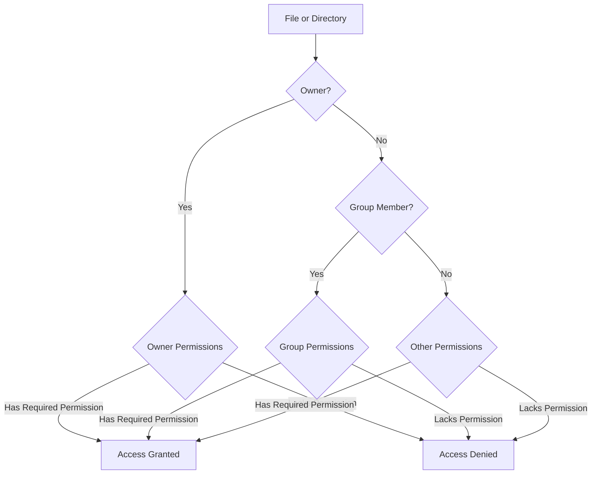

# Debian User Permissions

## Introduction

User permissions are a cornerstone of Linux security, including Debian-based systems. They determine who can access files, run programs, and make system changes. Understanding permissions is essential for maintaining a secure Debian system and preventing unauthorized access or modifications.

In this guide, we'll explore how user permissions work in Debian, how to manage them effectively, and how to implement secure permission practices for your system.

## Understanding the User Permission Model

Debian, like other Linux distributions, follows a permission model based on users, groups, and the concept of ownership.

### Users and Groups

Every file and process in Debian belongs to:
- A specific user (owner)
- A specific group

Every user account belongs to at least one group. The system uses these relationships to determine access rights.

### Three Permission Types

For each file or directory, Debian defines three permission types:

1. **Read (r)**: View file contents or list directory contents
2. **Write (w)**: Modify a file or create/delete files within a directory
3. **Execute (x)**: Run a file as a program or access a directory

### Three Permission Classes

Each permission type applies to three different classes:

1. **User/Owner (u)**: The user who owns the file
2. **Group (g)**: Users who are members of the file's assigned group
3. **Others (o)**: All other users on the system

## Basic Permission Representation

Permissions are represented in two formats:

### Symbolic Notation

This uses letters to represent permissions:
- `r`: read
- `w`: write
- `x`: execute
- `-`: no permission

When you run `ls -l`, you'll see something like:

```bash
-rwxr-xr-- 1 user group 4096 Mar 13 14:22 example.sh
```

Breaking down the first part `-rwxr-xr--`:
- First character: File type (`-` for regular file, `d` for directory)
- Characters 2-4: Owner permissions (`rwx` = read, write, execute)
- Characters 5-7: Group permissions (`r-x` = read, execute, no write)
- Characters 8-10: Others permissions (`r--` = read only)

### Numeric Notation

This uses numbers to represent permission combinations:
- 4: read
- 2: write
- 1: execute
- 0: no permission

Permission values are added together for each class:
- `7` (4+2+1) = read, write, execute
- `5` (4+0+1) = read, execute
- `4` (4+0+0) = read only
- `0` (0+0+0) = no permissions

A permission of `750` means:
- Owner: 7 (read, write, execute)
- Group: 5 (read, execute)
- Others: 0 (no access)

## Viewing Permissions

To view permissions of files and directories:

```bash
$ ls -l
-rw-r--r-- 1 user group  2048 Mar 13 14:30 document.txt
drwxr-xr-x 2 user group  4096 Mar 13 14:35 project_folder
-rwxr-xr-- 1 user group  1024 Mar 13 14:40 script.sh
```

Output explanation:
- `document.txt`: Owner can read/write, group and others can only read
- `project_folder`: Directory where owner has full access, group and others can list contents and access it
- `script.sh`: Executable script where owner has full access, group can read/execute, others can only read

## Changing Permissions

### Using chmod with Symbolic Notation

The `chmod` command changes permissions. With symbolic notation:

```bash
$ chmod u+x file.sh    # Add execute permission for user/owner
$ chmod g-w file.txt   # Remove write permission for group
$ chmod o=r file.txt   # Set others permissions to read only
$ chmod a+r file.txt   # Give read permission to all (user, group, others)
```

Example with output:

```bash
$ ls -l script.sh
-rw-r--r-- 1 user group 1024 Mar 13 14:40 script.sh

$ chmod u+x script.sh
$ ls -l script.sh
-rwxr--r-- 1 user group 1024 Mar 13 14:40 script.sh
```

### Using chmod with Numeric Notation

```bash
$ chmod 755 script.sh  # rwx for owner, rx for group and others
$ chmod 640 data.txt   # rw for owner, r for group, none for others
$ chmod 600 key.pem    # rw for owner, no access for group and others
```

Example with output:

```bash
$ ls -l data.txt
-rw-r--r-- 1 user group 2048 Mar 13 14:50 data.txt

$ chmod 640 data.txt
$ ls -l data.txt
-rw-r----- 1 user group 2048 Mar 13 14:50 data.txt
```

## Changing Ownership

The `chown` command changes file ownership:

```bash
$ chown newuser file.txt             # Change owner
$ chown newuser:newgroup file.txt    # Change owner and group
$ chown :newgroup file.txt           # Change only group
```

The `chgrp` command can also change a file's group:

```bash
$ chgrp developers project_files/
```

Example with output:

```bash
$ ls -l report.pdf
-rw-r--r-- 1 alice staff 309250 Mar 13 15:05 report.pdf

$ chown bob:marketing report.pdf
$ ls -l report.pdf
-rw-r--r-- 1 bob marketing 309250 Mar 13 15:05 report.pdf
```

## Special Permissions

### SUID (Set User ID)

When set on an executable file, it runs with the permissions of the file owner rather than the user executing it.

```bash
$ chmod u+s executable
$ chmod 4755 executable  # The '4' prefix adds SUID
```

Example with output:

```bash
$ ls -l /usr/bin/passwd
-rwsr-xr-x 1 root root 68208 Apr 16  2020 /usr/bin/passwd
```

The `s` in the owner permissions indicates SUID is set. This allows regular users to run `passwd` with temporary root privileges to update their passwords.

### SGID (Set Group ID)

When set on a directory, new files created inside inherit the directory's group rather than the user's primary group.

```bash
$ chmod g+s directory
$ chmod 2775 directory  # The '2' prefix adds SGID
```

Example with output:

```bash
$ ls -ld /shared_project
drwxrwsr-x 2 admin developers 4096 Mar 13 15:20 /shared_project

# When users create files in this directory:
$ touch /shared_project/new_file.txt
$ ls -l /shared_project/new_file.txt
-rw-r--r-- 1 bob developers 0 Mar 13 15:21 /shared_project/new_file.txt
```

The `s` in the group permissions indicates SGID is set. Note how the new file's group is `developers` even though the user is `bob`.

### Sticky Bit

When set on a directory, only the file owner, directory owner, or root can delete or rename files within it.

```bash
$ chmod +t directory
$ chmod 1775 directory  # The '1' prefix adds sticky bit
```

Example with output:

```bash
$ ls -ld /tmp
drwxrwxrwt 18 root root 4096 Mar 13 15:25 /tmp
```

The `t` at the end indicates the sticky bit is set. This prevents users from deleting other users' files in shared directories like `/tmp`.

## Recursive Permission Changes

To change permissions for directories and all their contents:

```bash
$ chmod -R 755 project_directory/
$ chown -R user:group project_directory/
```

## Understanding Default Permissions

The `umask` command controls default permissions for newly created files and directories:

```bash
$ umask
0022
```

The value is subtracted from the maximum default:
- Files: 666 (rw-rw-rw-)
- Directories: 777 (rwxrwxrwx)

With a umask of 022:
- New files: 644 (rw-r--r--)
- New directories: 755 (rwxr-xr-x)

To change umask temporarily:

```bash
$ umask 027  # More restrictive: new files will be 640, directories 750
```

## Access Control Lists (ACLs)

For more fine-grained permissions beyond the standard user/group/others model, Debian supports ACLs:

### Installing ACL Support

```bash
$ sudo apt update
$ sudo apt install acl
```

### Setting ACLs

```bash
# Give user 'jane' read and write access to a file
$ setfacl -m u:jane:rw- file.txt

# Give group 'developers' read access
$ setfacl -m g:developers:r-- file.txt
```

### Viewing ACLs

```bash
$ getfacl file.txt
# file: file.txt
# owner: bob
# group: staff
user::rw-
user:jane:rw-
group::r--
group:developers:r--
mask::rw-
other::r--
```

## Practical Use Cases

### Securing Configuration Files

Sensitive configuration files should typically be readable only by the owner:

```bash
$ sudo chmod 600 /etc/mysql/mysql.conf.d/mysqld.cnf
$ ls -l /etc/mysql/mysql.conf.d/mysqld.cnf
-rw------- 1 root root 3202 Mar 13 15:40 /etc/mysql/mysql.conf.d/mysqld.cnf
```

### Creating a Shared Project Directory

For a team collaborating on files:

```bash
# Create directory
$ sudo mkdir /projects/team_alpha

# Assign ownership
$ sudo chown root:team_alpha /projects/team_alpha

# Set permissions (rwxrwx---)
$ sudo chmod 770 /projects/team_alpha

# Set SGID to ensure new files keep the team_alpha group
$ sudo chmod g+s /projects/team_alpha

$ ls -ld /projects/team_alpha
drwxrws--- 2 root team_alpha 4096 Mar 13 15:45 /projects/team_alpha
```

### Securing SSH Keys

Private SSH keys should be protected:

```bash
$ chmod 600 ~/.ssh/id_rsa
$ ls -l ~/.ssh/id_rsa
-rw------- 1 user user 1876 Mar 13 15:50 ~/.ssh/id_rsa
```

### Web Server Permissions

Proper permissions for a web application:

```bash
# Web content files - readable by web server
$ sudo chmod -R 644 /var/www/html/*

# Web content directories - readable and executable by web server
$ sudo find /var/www/html -type d -exec chmod 755 {} \;

# Configuration files with sensitive data
$ sudo chmod 640 /var/www/config.php

# Ensure web server group can read configurations
$ sudo chown root:www-data /var/www/config.php
```

## User and Group Management

### Creating and Managing Users

```bash
# Create a new user
$ sudo adduser newuser

# Add user to existing group
$ sudo usermod -aG sudo newuser

# View user groups
$ groups newuser
newuser : newuser sudo

# Lock a user account
$ sudo passwd -l username
```

### Creating and Managing Groups

```bash
# Create a new group
$ sudo addgroup developers

# Add existing users to group
$ sudo usermod -aG developers username
```

## Understanding Permission Flow Diagram



## Permission Problems and Troubleshooting

### Common Issues and Solutions

1. **Permission Denied Errors**

   ```bash
   $ ./script.sh
   bash: ./script.sh: Permission denied
   
   # Solution: Add execute permission
   $ chmod u+x script.sh
   ```

2. **Cannot Access File Despite Permissions**

   Check parent directory permissions:
   
   ```bash
   $ ls -ld /path/to/
   drwx------ 2 otheruser othergroup 4096 Mar 13 16:10 /path/to/
   
   # Solution: Ensure directory is accessible
   $ sudo chmod 755 /path/to/
   ```

3. **SSH Key Not Working**

   ```bash
   $ ssh user@server
   Permission denied (publickey)
   
   # Check and fix permissions
   $ chmod 700 ~/.ssh
   $ chmod 600 ~/.ssh/id_rsa
   ```

### Finding Permission Issues

Use the `namei` command to check the permissions along a path:

```bash
$ namei -l /var/www/html/private/data.txt
f: /var/www/html/private/data.txt
drwxr-xr-x root  root  /
drwxr-xr-x root  root  var
drwxr-xr-x root  root  www
drwxr-xr-x root  www-data html
drwx------ root  root  private    # Blocked here
-rw-r--r-- www-data www-data data.txt
```

## Best Practices for Debian Permissions

1. **Principle of Least Privilege**
   - Grant only the permissions necessary for tasks
   - Regularly audit permissions to remove unnecessary access

2. **Protect Important Directories**
   - `/etc`: Configuration files (typically 644 for files, 755 for directories)
   - `/home/user`: User home directories (typically 750)
   - `/var/log`: Log files (typically 640 for sensitive logs)

3. **Use Groups Effectively**
   - Create functional groups based on roles
   - Use ACLs for complex permission needs

4. **Special Files**
   - Configuration files: 640 or 644
   - Executables: 755
   - Scripts: 700 or 755
   - SSH private keys: 600

5. **Regular Audits**
   ```bash
   # Find world-writable files (potentially dangerous)
   $ find /path/to/check -type f -perm -002 -print
   
   # Find SUID/SGID files
   $ find /path/to/check -type f \( -perm -4000 -o -perm -2000 \) -print
   ```

## Summary

Understanding and properly managing user permissions is vital for maintaining a secure Debian system. The permission model, based on users, groups, and ownership, provides a flexible framework for controlling access to files and directories.

Key concepts covered:
- Basic permission structure (read, write, execute)
- Permission classes (user, group, others)
- Symbolic and numeric permission notation
- Changing permissions and ownership
- Special permissions (SUID, SGID, sticky bit)
- Access Control Lists (ACLs)
- Practical permission strategies

By applying these concepts and following best practices, you can create a secure environment that protects sensitive data while allowing necessary access for users and applications.

## Additional Resources and Exercises

### Exercises

1. Set up a shared directory for a team where all members can edit files, but non-team users cannot access them.
2. Audit your system for world-writable files and correct any unsafe permissions.
3. Create a proper permission structure for a web application with different components (public content, configuration files, executable scripts).

### Further Learning

- `man chmod`, `man chown`, `man getfacl` - Manual pages for permission commands
- The Debian Administrator's Handbook - Chapter on Unix users and permissions
- Linux Security Cookbook - For advanced security configurations

### Practice Commands

Try these commands in a safe environment to practice permission management:

```bash
# Create test files
$ mkdir -p ~/permissions-test/{public,private,shared}
$ touch ~/permissions-test/{public,private,shared}/file.txt

# Practice setting different permissions
$ chmod 644 ~/permissions-test/public/file.txt
$ chmod 600 ~/permissions-test/private/file.txt
$ chmod 664 ~/permissions-test/shared/file.txt

# Create a group and practice group permissions
$ sudo addgroup practice
$ sudo usermod -aG practice $USER
$ chgrp practice ~/permissions-test/shared/file.txt
$ chmod g+w ~/permissions-test/shared/file.txt
```