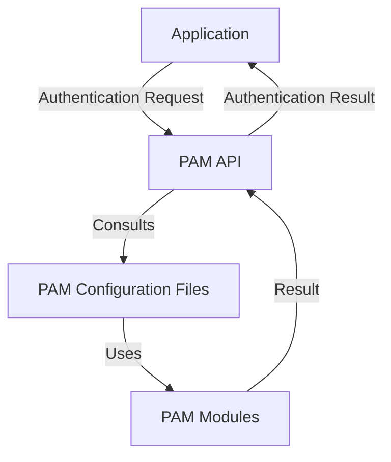

# Debian Authentication Methods

Authentication is a fundamental aspect of security in any operating system. In Debian Linux, several authentication methods are available to verify users' identities and control system access. This guide explores the most common authentication mechanisms in Debian, their configuration, and best practices for implementation.

## Introduction

Authentication is the process of verifying that a user or system is who they claim to be. Debian, like other Linux distributions, employs various authentication methods to secure the system against unauthorized access. Understanding these methods is crucial for system administrators and security-conscious users.

In Debian, authentication is primarily managed through:

1. PAM (Pluggable Authentication Modules)
2. Password-based authentication
3. SSH (Secure Shell) authentication
4. Two-factor authentication (2FA)
5. Kerberos authentication
6. LDAP authentication

Let's explore each of these methods in detail.

## PAM (Pluggable Authentication Modules)

PAM provides a flexible framework for authentication in Debian. It allows system administrators to customize authentication policies without modifying individual applications.

### How PAM Works

PAM works by providing a layer of abstraction between applications and authentication mechanisms. When an application needs to authenticate a user, it calls the PAM API, which then consults configuration files to determine how to perform the authentication.



### PAM Configuration

PAM configuration files are stored in the `/etc/pam.d/` directory. Each service that uses PAM has its own configuration file.

Let's look at a sample PAM configuration file for the SSH service:

```bash
# /etc/pam.d/sshd

# Authentication modules
auth       required     pam_unix.so nullok_secure
auth       optional     pam_google_authenticator.so

# Account management modules
account    required     pam_unix.so
account    required     pam_access.so

# Password modules
password   required     pam_unix.so obscure sha512

# Session modules
session    required     pam_unix.so
session    optional     pam_loginuid.so
session    optional     pam_motd.so
```

### Creating a Custom PAM Rule

Here's how to create a custom PAM rule to enforce stronger password policies:

1. Edit the common-password file:

```bash
sudo nano /etc/pam.d/common-password
```

2. Add a line to enforce password complexity:

```
password required pam_pwquality.so retry=3 minlen=12 ucredit=-1 lcredit=-1 dcredit=-1 ocredit=-1 difok=4
```

This rule enforces:
- Minimum password length of 12 characters
- At least 1 uppercase letter
- At least 1 lowercase letter
- At least 1 digit
- At least 1 special character
- At least 4 characters different from the previous password
- Up to 3 password change attempts

## Password-Based Authentication

Password authentication is the most common method in Debian. It's simple yet effective when configured properly.

### Password Policy Configuration

Debian uses the PAM module `pam_pwquality` (or the older `pam_cracklib`) to enforce password policies.

First, install the necessary package:

```bash
sudo apt update
sudo apt install libpam-pwquality
```

Then edit the configuration file:

```bash
sudo nano /etc/security/pwquality.conf
```

A sample configuration:

```
# Password must be at least 12 characters long
minlen = 12

# Require at least 1 uppercase letter
ucredit = -1

# Require at least 1 lowercase letter
lcredit = -1

# Require at least 1 digit
dcredit = -1

# Require at least 1 special character
ocredit = -1

# Check password against a dictionary
dictcheck = 1

# Check for simple patterns
enforcing = 1
```

### Password Aging

You can enforce password aging policies using the `chage` command:

```bash
# Set maximum password age to 90 days
sudo chage -M 90 username

# Set minimum password age to 7 days
sudo chage -m 7 username

# Set password expiration warning to 14 days
sudo chage -W 14 username

# View current settings
sudo chage -l username
```

Output:
```
Last password change                                : Jan 15, 2023
Password expires                                    : Apr 15, 2023
Password inactive                                   : never
Account expires                                     : never
Minimum number of days between password change      : 7
Maximum number of days between password change      : 90
Number of days of warning before password expires   : 14
```

## SSH Authentication

SSH (Secure Shell) is used for remote system access in Debian. It offers several authentication methods, including password-based and key-based authentication.

### Key-Based Authentication

Key-based authentication is more secure than password authentication for SSH. Here's how to set it up:

1. Generate an SSH key pair on the client machine:

```bash
ssh-keygen -t ed25519 -C "your_email@example.com"
```

This generates two files in the `~/.ssh/` directory:
- `id_ed25519` (private key)
- `id_ed25519.pub` (public key)

2. Copy the public key to the server:

```bash
ssh-copy-id username@server_ip
```

Alternatively, you can manually add the public key to the `~/.ssh/authorized_keys` file on the server.

3. Configure SSH to prefer key-based authentication by editing `/etc/ssh/sshd_config`:

```bash
# Disable password authentication
PasswordAuthentication no

# Enable public key authentication
PubkeyAuthentication yes

# Specify the location of authorized keys
AuthorizedKeysFile .ssh/authorized_keys
```

4. Restart the SSH service:

```bash
sudo systemctl restart ssh
```

### Hardening SSH

Additional SSH hardening measures:

```bash
# Edit SSH config
sudo nano /etc/ssh/sshd_config
```

Add or modify these lines:

```
# Disable root login
PermitRootLogin no

# Use protocol version 2 only
Protocol 2

# Limit authentication attempts
MaxAuthTries 3

# Set login grace time
LoginGraceTime 60

# Restrict SSH to specific users
AllowUsers user1 user2

# Set idle timeout (300 seconds)
ClientAliveInterval 300
ClientAliveCountMax 0
```

## Two-Factor Authentication (2FA)

Two-factor authentication adds an extra layer of security by requiring something you know (password) and something you have (typically a mobile device).

### Setting Up Google Authenticator

1. Install the required package:

```bash
sudo apt update
sudo apt install libpam-google-authenticator
```

2. Run the setup command as the user who needs 2FA:

```bash
google-authenticator
```

3. Answer the setup questions (typically "y" for all):
   - Do you want authentication tokens to be time-based? y
   - Do you want to update your ~/.google_authenticator file? y
   - Do you want to disallow multiple uses? y
   - By default, a new token is generated every 30 seconds. Do you want to do so? y
   - Do you want to enable rate-limiting? y

4. Configure PAM to use Google Authenticator for SSH:

```bash
sudo nano /etc/pam.d/sshd
```

Add this line:
```
auth required pam_google_authenticator.so
```

5. Edit SSH configuration:

```bash
sudo nano /etc/ssh/sshd_config
```

Set:
```
ChallengeResponseAuthentication yes
```

6. Restart SSH:

```bash
sudo systemctl restart ssh
```

Now when you SSH into the system, you'll need both your password and a verification code from your authenticator app.

## Kerberos Authentication

Kerberos provides a strong authentication mechanism for network services. It's particularly useful in enterprise environments.

### Installing Kerberos

```bash
sudo apt update
sudo apt install krb5-user libpam-krb5 krb5-config
```

During installation, you'll be prompted to enter:
- Default Kerberos realm (e.g., EXAMPLE.COM)
- Kerberos server hostname (e.g., kerberos.example.com)
- Administrative server hostname (usually the same as the Kerberos server)

### Basic Kerberos Commands

1. Obtain a ticket:

```bash
kinit username@REALM
```

2. List current tickets:

```bash
klist
```

Sample output:
```
Ticket cache: FILE:/tmp/krb5cc_1000
Default principal: user@EXAMPLE.COM

Valid starting     Expires            Service principal
03/10/23 09:15:23  03/10/23 19:15:23  krbtgt/EXAMPLE.COM@EXAMPLE.COM
```

3. Destroy tickets:

```bash
kdestroy
```

### Configuring PAM to Use Kerberos

Edit the common-auth file:

```bash
sudo nano /etc/pam.d/common-auth
```

Add:
```
auth sufficient pam_krb5.so minimum_uid=1000
```

## LDAP Authentication

LDAP (Lightweight Directory Access Protocol) is used for centralized authentication in organizations.

### Installing LDAP Authentication

```bash
sudo apt update
sudo apt install libpam-ldap libnss-ldap
```

During installation, you'll be prompted to configure:
- LDAP server URI (e.g., ldap://ldap.example.com)
- Distinguished name of the search base (e.g., dc=example,dc=com)
- LDAP version to use (usually 3)
- Make local root Database admin (usually yes)
- Does the LDAP database require login? (depends on your setup)
- LDAP account for root (e.g., cn=admin,dc=example,dc=com)
- LDAP root account password

### Configuring NSS to Use LDAP

Edit the NSS configuration:

```bash
sudo nano /etc/nsswitch.conf
```

Modify the passwd, group, and shadow lines:

```
passwd: files ldap
group:  files ldap
shadow: files ldap
```

### Testing LDAP Authentication

Test if LDAP users are visible:

```bash
getent passwd
```

This should show both local and LDAP users.

## Practical Example: Setting Up a Secure Authentication System

Let's create a comprehensive example that combines multiple authentication methods for a secure Debian server:

1. Set up strong password policies:

```bash
sudo apt install libpam-pwquality
sudo nano /etc/security/pwquality.conf
```

Add these settings:
```
minlen = 14
ucredit = -1
lcredit = -1
dcredit = -1
ocredit = -1
dictcheck = 1
enforcing = 1
```

2. Configure SSH key-based authentication:

```bash
# On client
ssh-keygen -t ed25519 -C "admin@example.com"
ssh-copy-id admin@server_ip

# On server
sudo nano /etc/ssh/sshd_config
```

Add:
```
PasswordAuthentication no
PubkeyAuthentication yes
PermitRootLogin no
Protocol 2
MaxAuthTries 3
LoginGraceTime 60
```

3. Set up 2FA with Google Authenticator:

```bash
sudo apt install libpam-google-authenticator
google-authenticator  # Run as the user
sudo nano /etc/pam.d/sshd
```

Add:
```
auth required pam_google_authenticator.so
```

Edit SSH config:
```bash
sudo nano /etc/ssh/sshd_config
```

Set:
```
ChallengeResponseAuthentication yes
AuthenticationMethods publickey,keyboard-interactive
```

4. Restart SSH:

```bash
sudo systemctl restart ssh
```

This configuration:
- Enforces strong passwords
- Requires SSH key for initial authentication
- Requires 2FA code as a second factor
- Disables root SSH login
- Limits login attempts

## Summary

Debian offers a robust set of authentication methods that can be combined to create a secure authentication system. The key components are:

1. **PAM** provides the framework for all authentication methods
2. **Password policies** ensure strong user passwords
3. **SSH key authentication** offers secure remote access
4. **Two-factor authentication** adds an extra security layer
5. **Kerberos** provides enterprise-level network authentication
6. **LDAP** enables centralized user management

By understanding and properly implementing these authentication methods, you can significantly enhance the security of your Debian system.

## Additional Resources

- [Debian Wiki: Authentication](https://wiki.debian.org/Authentication)
- [Debian Handbook: Security](https://debian-handbook.info/browse/stable/security.html)
- [PAM Documentation](http://www.linux-pam.org/Linux-PAM-html/)
- [SSH Documentation](https://www.openssh.com/manual.html)

## Exercises

1. Set up password policies on your Debian system using pam_pwquality.
2. Configure SSH to use key-based authentication only.
3. Implement Google Authenticator for two-factor authentication.
4. Create a PAM configuration that combines multiple authentication methods.
5. Research and document the advantages and disadvantages of Kerberos compared to LDAP authentication.