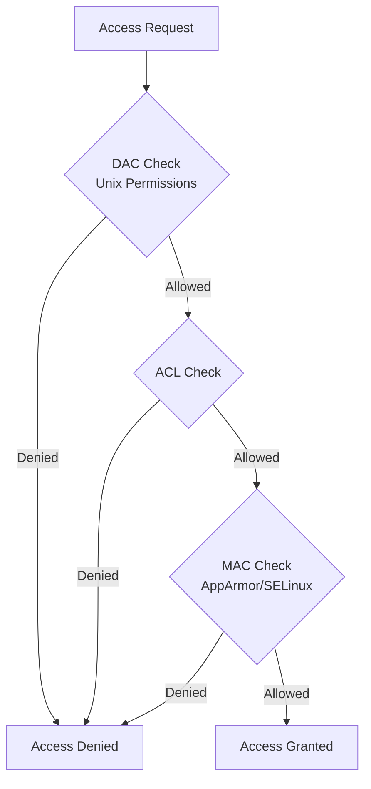

# Debian Access Controls

## Introduction

Access controls are fundamental security mechanisms in any operating system, and Debian Linux is no exception. They determine who can access what resources and what actions they can perform. In this guide, we'll explore the various access control systems available in Debian, how they work, and how to implement them effectively to secure your system.

Whether you're setting up a personal computer or a server, understanding access controls is crucial for maintaining security while ensuring functionality. This guide is designed to help beginners grasp these concepts through practical examples and step-by-step explanations.

## Traditional Unix Permissions

### Basic File Permissions

The foundation of Debian's access control is the traditional Unix permission model. Every file and directory in a Debian system has three permission sets:

- Owner permissions
- Group permissions
- Others (world) permissions

Each set can have any combination of read (`r`), write (`w`), and execute (`x`) permissions.

Let's look at how to view these permissions:

```bash
ls -l /etc/passwd
```

Output:
```
-rw-r--r-- 1 root root 2890 Mar 10 15:30 /etc/passwd
```

Breaking down this output:

```
-rw-r--r--    File type and permissions
1             Number of hard links
root          Owner
root          Group
2890          Size in bytes
Mar 10 15:30  Last modification date
/etc/passwd   Filename
```

The permission string `-rw-r--r--` can be interpreted as:

- First character `-`: File type (regular file)
- Next three characters `rw-`: Owner has read and write permissions
- Next three characters `r--`: Group has read-only permission
- Last three characters `r--`: Others have read-only permission

### Changing Permissions with chmod

You can modify permissions using the `chmod` command:

```bash
# Give owner execute permission
sudo chmod u+x myfile.sh

# Remove write permission from group
sudo chmod g-w myfile.sh

# Set specific permissions using octal notation
sudo chmod 755 myfile.sh  # rwxr-xr-x
```

### Changing Ownership with chown and chgrp

To change the owner or group of a file:

```bash
# Change owner
sudo chown newowner myfile

# Change group
sudo chgrp newgroup myfile

# Change both owner and group
sudo chown newowner:newgroup myfile
```

## Special Permission Bits

Beyond the basic permissions, Debian provides special permission bits:

### The SUID Bit (Set User ID)

When set on an executable file, the SUID bit allows the file to be executed with the permissions of its owner.

```bash
# Setting SUID bit
sudo chmod u+s myprogram

# Viewing a file with SUID bit
ls -l /usr/bin/passwd
```

Output:
```
-rwsr-xr-x 1 root root 68208 Apr 16 15:36 /usr/bin/passwd
```

The `s` in place of `x` in the owner permission set indicates the SUID bit is set.

### The SGID Bit (Set Group ID)

Similar to SUID, but for group permissions. When set on a directory, new files created within it inherit the directory's group ownership.

```bash
# Setting SGID bit on a directory
sudo chmod g+s /shared/projects

# Viewing a directory with SGID bit
ls -ld /shared/projects
```

Output:
```
drwxrwsr-x 2 admin developers 4096 Mar 10 16:45 /shared/projects
```

### The Sticky Bit

When set on a directory, the sticky bit restricts file deletion. Only the file owner, directory owner, or root can delete files.

```bash
# Setting sticky bit
sudo chmod +t /shared/uploads

# Viewing a directory with sticky bit
ls -ld /tmp
```

Output:
```
drwxrwxrwt 18 root root 4096 Mar 13 09:22 /tmp
```

The `t` at the end indicates the sticky bit is set.

## Access Control Lists (ACLs)

Standard Unix permissions are sometimes insufficient for complex access requirements. Debian supports Access Control Lists (ACLs) to provide more fine-grained control.

### Installing ACL Support

```bash
sudo apt update
sudo apt install acl
```

### Setting and Viewing ACLs

```bash
# Grant user 'alice' read and write permissions to a file
sudo setfacl -m u:alice:rw- myfile.txt

# View ACLs for a file
getfacl myfile.txt
```

Output:
```
# file: myfile.txt
# owner: admin
# group: admin
user::rw-
user:alice:rw-
group::r--
mask::rw-
other::r--
```

### Default ACLs for Directories

You can set default ACLs on directories that will be inherited by new files:

```bash
# Set default ACL for new files
sudo setfacl -d -m u:alice:rx /projects/webapp
```

## AppArmor

Debian includes AppArmor, a Mandatory Access Control (MAC) system that restricts programs' capabilities beyond standard permissions.

### AppArmor Status and Profiles

Check AppArmor status:

```bash
sudo aa-status
```

Output:
```
apparmor module is loaded.
40 profiles are loaded.
38 profiles are in enforce mode.
2 profiles are in complain mode.
0 processes have profiles defined.
0 processes are in enforce mode.
0 processes are in complain mode.
0 processes are unconfined but have a profile defined.
```

List available profiles:

```bash
ls /etc/apparmor.d/
```

### Managing AppArmor Profiles

```bash
# Set profile to enforce mode
sudo aa-enforce /etc/apparmor.d/usr.bin.firefox

# Set profile to complain mode (logging but not blocking)
sudo aa-complain /etc/apparmor.d/usr.bin.firefox

# Disable a profile
sudo ln -s /etc/apparmor.d/usr.bin.firefox /etc/apparmor.d/disable/
sudo apparmor_parser -R /etc/apparmor.d/usr.bin.firefox
```

### Creating a Simple AppArmor Profile

Here's how to create a basic AppArmor profile for a custom application:

```bash
# Install apparmor-utils if not already installed
sudo apt install apparmor-utils

# Generate a profile in complain mode
sudo aa-genprof /usr/local/bin/myapp

# After running the application to generate logs
sudo aa-logprof

# Enable the profile in enforce mode
sudo aa-enforce /etc/apparmor.d/usr.local.bin.myapp
```

## SELinux in Debian

While Debian primarily uses AppArmor, SELinux (Security-Enhanced Linux) is also available.

### Installing SELinux

```bash
sudo apt update
sudo apt install selinux-basics selinux-policy-default auditd
```

After installation and reboot, check SELinux status:

```bash
sestatus
```

Output:
```
SELinux status:                 enabled
SELinuxfs mount:                /sys/fs/selinux
SELinux root directory:         /etc/selinux
Loaded policy name:             default
Current mode:                   enforcing
Mode from config file:          enforcing
Policy MLS status:              enabled
Policy deny_unknown status:     allowed
Memory protection checking:     actual (secure)
Max kernel policy version:      31
```

### Basic SELinux Commands

```bash
# List security contexts
ls -Z /home

# Change file context
sudo chcon -t user_home_t /path/to/file

# Restore default contexts
sudo restorecon -R /home/user
```

## Practical Examples and Use Cases

### Scenario 1: Setting Up a Shared Directory

Let's create a shared directory for a development team where everyone can read files, but only specific users can modify them:

```bash
# Create the directory
sudo mkdir -p /shared/development

# Set ownership
sudo chown root:developers /shared/development

# Set base permissions
sudo chmod 775 /shared/development

# Set the SGID bit so new files belong to the developers group
sudo chmod g+s /shared/development

# Add specific permissions for users
sudo setfacl -m u:alice:rwx /shared/development
sudo setfacl -m u:bob:r-x /shared/development

# Set default ACLs for new files
sudo setfacl -d -m g::rwx /shared/development
sudo setfacl -d -m o::r-x /shared/development
```

### Scenario 2: Securing a Web Server

Applying proper access controls to a web server:

```bash
# Set correct ownership for web files
sudo chown -R www-data:www-data /var/www/html

# Set appropriate permissions
sudo find /var/www/html -type d -exec chmod 755 {} \;
sudo find /var/www/html -type f -exec chmod 644 {} \;

# Protect configuration files
sudo chmod 750 /etc/apache2/
sudo chmod 640 /etc/apache2/apache2.conf

# Use AppArmor to restrict Apache
sudo aa-enforce /etc/apparmor.d/usr.sbin.apache2
```

### Scenario 3: Creating a User with Limited Permissions

Create a user who can only access specific directories and run specific commands:

```bash
# Create the user
sudo adduser --shell /bin/rbash restricted_user

# Create a limited PATH directory
sudo mkdir -p /home/restricted_user/allowed_commands

# Copy only necessary commands
sudo cp /bin/ls /home/restricted_user/allowed_commands/
sudo cp /usr/bin/less /home/restricted_user/allowed_commands/

# Set ownership
sudo chown root:root /home/restricted_user/allowed_commands/
sudo chmod 755 /home/restricted_user/allowed_commands/

# Configure .bashrc to set a limited PATH
echo 'export PATH=/home/restricted_user/allowed_commands' | sudo tee -a /home/restricted_user/.bashrc

# Make .bashrc unmodifiable by the user
sudo chown root:root /home/restricted_user/.bashrc
sudo chmod 644 /home/restricted_user/.bashrc
```

## Understanding Access Control Flowchart

Here's a flowchart showing how the different access control systems interact:



## Common Mistakes and Troubleshooting

### Too Permissive Permissions

A common mistake is setting overly permissive permissions:

```bash
# Avoid this for sensitive files
chmod 777 myfile  # rwxrwxrwx
```

This gives everyone full access, which is rarely necessary and creates security risks.

### Permission Denied Errors

When facing "Permission Denied" errors:

1. Check file ownership:
   ```bash
   ls -l filename
   ```

2. Check if AppArmor is blocking access:
   ```bash
   sudo grep DENIED /var/log/audit/audit.log
   ```

3. Check effective permissions with ACLs:
   ```bash
   getfacl filename
   ```

### Finding Files with Insecure Permissions

Scan your system for potentially insecure files:

```bash
# Find world-writable files
sudo find / -xdev -type f -perm -0002

# Find SUID files
sudo find / -xdev -type f -perm -4000
```

## Summary

Access controls in Debian provide multiple layers of protection for your system:

1. **Traditional Unix permissions** form the foundation, controlling read, write, and execute access for owners, groups, and others.
2. **Special permission bits** (SUID, SGID, sticky bit) provide additional control for specific use cases.
3. **Access Control Lists (ACLs)** offer fine-grained permissions beyond the traditional Unix model.
4. **Mandatory Access Control systems** like AppArmor and SELinux add another security layer by restricting what programs can do regardless of user permissions.

By effectively combining these tools, you can create a secure yet usable Debian system that follows the principle of least privilege—giving users and programs only the access they need to function.

## Additional Resources and Exercises

### Resources for Further Learning

- The [Debian Security Manual](https://www.debian.org/doc/manuals/securing-debian-manual/)
- AppArmor documentation in the Debian Wiki
- `man` pages for commands mentioned in this guide (`chmod`, `chown`, `setfacl`, etc.)

### Exercises to Practice

1. **Basic Permission Exercise**: Create a directory structure for a simulated project with appropriate permissions for different user roles.
2. **ACL Implementation**: Set up a shared directory where different users have custom permission sets using ACLs.
3. **AppArmor Profile Creation**: Create and test a custom AppArmor profile for a simple application.
4. **Security Audit**: Scan your system for files with potentially insecure permissions and document your findings and remediation steps.
5. **Combined Scenario**: Set up a web server directory with the appropriate combination of Unix permissions, ACLs, and AppArmor restrictions.

By completing these exercises, you'll gain practical experience with Debian's access control systems and develop the skills to implement secure configurations in your own environment.