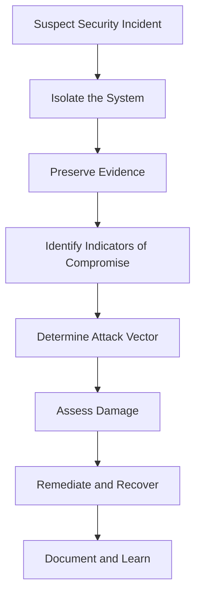

# Debian Security Troubleshooting

## Introduction

Security troubleshooting is an essential skill for anyone managing Debian systems. Even with Debian's reputation for stability and security, issues can arise from misconfigurations, unpatched vulnerabilities, or sophisticated attacks. This guide will walk you through the process of identifying, diagnosing, and resolving common security issues on Debian systems.

Whether you're a system administrator responding to security incidents or a beginner learning to secure your personal Debian installation, these troubleshooting techniques will help you maintain a secure environment.

## Common Security Issues and Solutions

### 1. Outdated Packages and Missing Security Updates

One of the most common security vulnerabilities stems from outdated software with known security flaws.

#### Diagnosis

Check if your system is up-to-date with security patches:

```bash
# List available security updates
apt list --upgradable | grep -i security

# Alternative method
apt-get -s dist-upgrade | grep "^Inst" | grep -i security
```

#### Solution

Update your package lists and apply security updates:

```bash
# Update package lists
sudo apt update

# Apply security updates only
sudo apt upgrade -s
sudo apt upgrade

# Alternative approach for security updates only
sudo apt-get install unattended-upgrades
sudo dpkg-reconfigure -plow unattended-upgrades
```

#### Real-world Example

In 2021, a critical vulnerability in Polkit (CVE-2021-3560) affected many Linux distributions including Debian. Systems that weren't promptly updated remained vulnerable to local privilege escalation attacks, potentially allowing attackers to gain root access.

### 2. Suspicious Running Processes

Malware or unauthorized services might be running on your system.

#### Diagnosis

Identify unusual processes or services:

```bash
# View all running processes
ps aux

# Check for unusual CPU/memory usage
top

# List listening network services
ss -tuln

# Check services running at boot
systemctl list-unit-files | grep enabled
```

#### Solution

Investigate and stop suspicious services:

```bash
# Get more details about a process
ps -fp <PID>

# Check when the process started
ps -eo pid,lstart,cmd | grep <PID>

# Check open network connections
lsof -p <PID>

# Stop a suspicious service
sudo systemctl stop <service-name>
sudo systemctl disable <service-name>
```

#### Real-world Example

A system administrator noticed unusually high CPU usage from a process called "kswapd0" - which is normally a legitimate kernel process. Upon closer inspection using `ps` and `lsof`, they discovered this was actually malware disguised with a similar name to a legitimate process, and it was actively attempting to mine cryptocurrency.

### 3. Unusual Network Activity

Unexpected network traffic might indicate data exfiltration or command-and-control communication.

#### Diagnosis

Monitor network connections and traffic:

```bash
# Check active network connections
netstat -antup

# Monitor network traffic in real-time
sudo tcpdump -i any
sudo tcpdump -i any port 80

# Watch for unusual outgoing connections
watch -n 1 "netstat -tup | grep ESTABLISHED"
```

#### Solution

Identify and block suspicious connections:

```bash
# Configure firewall rules with ufw
sudo apt install ufw
sudo ufw default deny outgoing
sudo ufw default deny incoming
sudo ufw allow out 80/tcp
sudo ufw allow out 443/tcp
sudo ufw allow out 53/udp
sudo ufw enable

# Or use iptables directly
sudo iptables -A OUTPUT -d <suspicious-ip> -j DROP
```

#### Real-world Example

A web server experienced unexplained slowdowns. Using `tcpdump`, the administrator discovered numerous outbound connections to IP addresses in countries where the company had no business. Further investigation revealed a web shell had been uploaded through a vulnerable plugin, allowing attackers to use the server as part of a botnet.

### 4. Compromised User Accounts

Unauthorized access to user accounts can lead to privilege escalation and further compromise.

#### Diagnosis

Check for unusual login activity:

```bash
# Review login history
last

# Check for failed login attempts
grep "Failed password" /var/log/auth.log

# Look for suspicious sudo usage
grep sudo /var/log/auth.log
```

#### Solution

Secure accounts and implement stronger authentication:

```bash
# Force password change for a user
sudo passwd -e username

# Lock a compromised account
sudo passwd -l username

# Set up SSH key-based authentication
# On your local machine:
ssh-keygen -t ed25519 -C "your_email@example.com"
ssh-copy-id username@remote_host

# Edit SSH configuration to disable password authentication
sudo nano /etc/ssh/sshd_config
# Set PasswordAuthentication no
sudo systemctl restart ssh
```

#### Real-world Example

A system administrator noticed failed login attempts at unusual hours. After checking the logs, they discovered brute force attacks targeting service accounts. They mitigated this by implementing SSH key authentication, fail2ban, and restricting SSH access to specific IP ranges.

### 5. File Integrity Issues

Modified system files may indicate a compromise.

#### Diagnosis

Check for unauthorized changes to system files:

```bash
# Install file integrity tools
sudo apt install aide

# Initialize AIDE database
sudo aideinit

# Check for changes (after database is created)
sudo aide --check
```

#### Solution

Restore files from known good backups or reinstall affected packages:

```bash
# Reinstall a potentially compromised package
sudo apt-get --reinstall install package-name

# Restore from backup
sudo cp /backup/path/file /original/path/

# Verify file checksums against package database
dpkg --verify package-name
```

#### Real-world Example

During a routine audit, a security team discovered that several binaries in `/usr/bin` had been modified. Using AIDE and comparing file hashes with the package database, they identified a rootkit that had replaced system utilities like `ls` and `ps` with versions that hid the attacker's activities.

## Security Monitoring Tools

Implementing proper monitoring tools can help you detect and respond to security issues more efficiently.

### Setting Up Logwatch

Logwatch provides daily reports of system activity from log files:

```bash
# Install Logwatch
sudo apt install logwatch

# Run a manual report
sudo logwatch --output stdout --format html --range yesterday --detail high
```

### Using Fail2ban to Protect Services

Fail2ban helps protect against brute force attacks:

```bash
# Install Fail2ban
sudo apt install fail2ban

# Create a custom jail configuration
sudo nano /etc/fail2ban/jail.local

# Example configuration for SSH protection
[sshd]
enabled = true
port = ssh
filter = sshd
logpath = /var/log/auth.log
maxretry = 3
bantime = 3600
```

Start the service:

```bash
sudo systemctl enable fail2ban
sudo systemctl start fail2ban
```

## Diagnosing a Compromised System: Step-by-Step Approach

If you suspect your system has been compromised, follow this structured approach:

<div className="mermaid">

</div>

### 1. Isolate the System

If practical, disconnect the system from the network to prevent further damage:

```bash
# Disable networking temporarily
sudo ifconfig eth0 down

# Or just disconnect from specific networks
sudo ip route del default
```

### 2. Collect Evidence

Gather information about the current state of the system:

```bash
# Capture running processes
ps aux > /secure-location/processes.txt

# Capture network connections
netstat -antup > /secure-location/network-connections.txt

# Preserve log files
cp /var/log/auth.log /secure-location/
cp /var/log/syslog /secure-location/

# Create memory dump (if appropriate tools are installed)
sudo apt install lime-forensics-dkms
sudo insmod /usr/src/lime-*.ko "path=/secure-location/memory.lime format=lime"
```

### 3. Identify Indicators of Compromise

Look for signs of unauthorized access:

```bash
# Check for unknown users
cat /etc/passwd | grep -E '(bash|sh)$'

# Check for unexpected SUID/SGID binaries
find / -type f \( -perm -4000 -o -perm -2000 \) -ls 2>/dev/null

# Check for unauthorized cron jobs
for user in $(cut -f1 -d: /etc/passwd); do echo $user; crontab -u $user -l 2>/dev/null; done

# Check for rootkits
sudo apt install rkhunter
sudo rkhunter --check
```

### 4. Remediation

Once you've identified the issues, take steps to resolve them:

```bash
# Remove malicious cron jobs
crontab -e

# Remove unauthorized user accounts
sudo userdel -r malicious-user

# Remove unauthorized SSH keys
nano ~/.ssh/authorized_keys

# Restore compromised files
sudo apt-get --reinstall install compromised-package
```

## Preventive Measures

Implement these best practices to minimize the risk of security incidents:

### 1. Regular Updates

Set up automatic security updates:

```bash
sudo apt install unattended-upgrades
sudo dpkg-reconfigure -plow unattended-upgrades
```

### 2. Minimal Attack Surface

Remove unnecessary services:

```bash
# List all running services
systemctl list-units --type=service --state=running

# Disable unnecessary services
sudo systemctl disable unnecessary-service
sudo systemctl stop unnecessary-service
```

### 3. Implement Strong Authentication

Configure SSH for key-based authentication and disable root login:

```bash
sudo nano /etc/ssh/sshd_config
```

Add or modify these lines:
```
PermitRootLogin no
PasswordAuthentication no
```

### 4. Regular Auditing

Schedule regular security audits:

```bash
# Install security audit tools
sudo apt install lynis

# Run a system audit
sudo lynis audit system
```

## Summary

Debian security troubleshooting is about being systematic in your approach to identifying, diagnosing, and resolving security issues. By understanding the common security problems and following the recommended troubleshooting steps, you can effectively protect your Debian systems and respond appropriately when security incidents occur.

The key points to remember are:
- Keep your system updated with security patches
- Monitor for unusual activities and processes
- Implement proper authentication and access controls
- Regularly audit your system's security
- Have a clear incident response plan

## Additional Resources

- [Debian Security Information](https://www.debian.org/security/)
- [Debian Security Tracker](https://security-tracker.debian.org/tracker/)
- [Debian Hardening Guide](https://wiki.debian.org/Hardening)
- [CIS Debian Linux Benchmarks](https://www.cisecurity.org/benchmark/debian_linux/)

## Practice Exercises

1. Set up a test Debian system and practice identifying outdated packages with security vulnerabilities.
2. Configure and test Fail2ban to protect an SSH server against brute force attacks.
3. Create a script that monitors for unusual login activity and sends email alerts.
4. Practice using AIDE to detect unauthorized file changes.
5. Conduct a security audit using Lynis and address the high-priority recommendations.