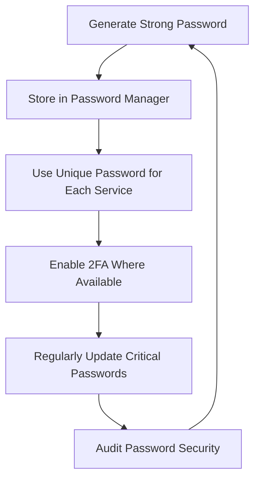

# Debian Password Management

## Introduction

Password management is a fundamental aspect of system security in Debian Linux. Proper password practices not only protect individual user accounts but also safeguard the entire system from unauthorized access. In this guide, we'll explore how Debian handles passwords, the tools available for password management, and best practices for maintaining secure passwords in a Debian environment.

Debian, like other Linux distributions, uses a sophisticated password system that encrypts and stores user credentials securely. Understanding how this system works and how to interact with it effectively is essential knowledge for any Debian user or administrator.

## Understanding Password Storage in Debian

### The /etc/passwd and /etc/shadow Files

Historically, Unix systems stored user account information, including encrypted passwords, in the `/etc/passwd` file. However, modern Debian systems use a more secure approach with two main files:

1. `/etc/passwd` - Contains basic user account information but no passwords
2. `/etc/shadow` - Contains encrypted password data with restricted access

Let's examine these files more closely:

```bash
# Example content of /etc/passwd (password field is 'x')
cat /etc/passwd

# Output
root:x:0:0:root:/root:/bin/bash
user1:x:1000:1000:Regular User,,,:/home/user1:/bin/bash
```

The 'x' in the second field indicates that the encrypted password is stored in the `/etc/shadow` file.

```bash
# Viewing shadow file (requires root privileges)
sudo cat /etc/shadow

# Output (example)
root:$6$xyz123...:18561:0:99999:7:::
user1:$6$abc456...:18561:0:99999:7:::
```

Each entry in `/etc/shadow` contains several fields separated by colons:
1. Username
2. Encrypted password hash
3. Days since Jan 1, 1970 that password was last changed
4. Days before password may be changed
5. Days after which password must be changed
6. Days before password expiration to warn user
7. Days after password expires that account is disabled
8. Days since Jan 1, 1970 that account is disabled
9. Reserved field

### Password Hashing

Debian uses strong cryptographic hashing algorithms to protect passwords. The hash format in `/etc/shadow` provides information about the algorithm used:

```
$ID$SALT$HASH
```

Where:
- ID: identifies the hashing algorithm (6 for SHA-512, 5 for SHA-256, etc.)
- SALT: random data that prevents identical passwords from having identical hashes
- HASH: the actual password hash

## Basic Password Management Commands

### Setting and Changing Passwords

The most basic command for password management is `passwd`:

```bash
# Change your own password
passwd

# Output
Changing password for user1.
Current password: 
New password: 
Retype new password: 
passwd: password updated successfully
```

For system administrators, additional options are available:

```bash
# Change another user's password (requires root)
sudo passwd username

# Lock a user account
sudo passwd -l username

# Unlock a user account
sudo passwd -u username
```

### Password Aging and Expiration

Debian provides tools to manage password aging policies:

```bash
# View password aging information
sudo chage -l username

# Output
Last password change                                : Jan 15, 2023
Password expires                                    : Apr 15, 2023
Password inactive                                   : never
Account expires                                     : never
Minimum number of days between password change      : 0
Maximum number of days between password change      : 90
Number of days of warning before password expires   : 7
```

To modify these settings:

```bash
# Set password to expire in 90 days
sudo chage -M 90 username

# Force password change on next login
sudo chage -d 0 username
```

## Password Quality and Policies

### PAM (Pluggable Authentication Modules)

Debian uses PAM to configure authentication policies, including password requirements. The main configuration for password quality is in `/etc/pam.d/common-password`.

To enforce stronger passwords, you can edit this file to include password quality requirements:

```bash
# Install libpam-pwquality
sudo apt install libpam-pwquality

# Edit PAM configuration
sudo nano /etc/pam.d/common-password
```

A typical configuration with password quality requirements might include:

```
# Line to look for in /etc/pam.d/common-password
password requisite pam_pwquality.so retry=3 minlen=12 difok=3 ucredit=-1 lcredit=-1 dcredit=-1 ocredit=-1 reject_username enforce_for_root
```

This configuration requires:
- Minimum password length of 12 characters
- At least 1 uppercase letter
- At least 1 lowercase letter
- At least 1 digit
- At least 1 special character
- Password cannot contain username
- Applied to root as well

### Testing Password Strength

You can use the `pwscore` utility (part of libpwquality) to test password strength:

```bash
# Install libpwquality-tools
sudo apt install libpwquality-tools

# Test a password
echo "MyPassword123!" | pwscore

# Output
85
```

The output is a score from 0-100, with higher scores indicating stronger passwords.

## Password Management Tools in Debian

### Command-line Password Managers

Debian offers several command-line password managers:

1. **pass** - The standard Unix password manager:

```bash
# Install pass
sudo apt install pass

# Initialize password store
pass init "Your GPG ID"

# Add a password
pass insert Email/gmail.com

# Retrieve a password
pass Email/gmail.com
```

2. **KeePassXC** - A cross-platform password manager:

```bash
# Install KeePassXC
sudo apt install keepassxc
```

### GUI Password Managers

For desktop users, Debian offers several graphical password managers:

1. **KeePassXC** - Also has a GUI interface
2. **Bitwarden** - Available as a .deb package or AppImage
3. **Password Safe** - A simple password manager

```bash
# Install Password Safe
sudo apt install passwordsafe
```

## System Authentication Configuration

### Using passwd and Authentication Settings

Debian provides system-wide authentication configuration through several files:

1. `/etc/login.defs` - Controls system-wide password aging defaults
2. `/etc/security/pwquality.conf` - Controls password quality requirements
3. `/etc/pam.d/` - Directory containing PAM configuration files

Example of editing `/etc/login.defs`:

```bash
sudo nano /etc/login.defs
```

Key settings include:

```
# Password aging controls
PASS_MAX_DAYS   90
PASS_MIN_DAYS   0
PASS_WARN_AGE   7

# Password length requirement
PASS_MIN_LEN    12
```

### sudo Password Configuration

The `sudo` command has its own password configuration in `/etc/sudoers`:

```bash
# Safely edit sudoers file
sudo visudo
```

Common configurations include:

```
# Extend sudo password timeout to 30 minutes
Defaults        timestamp_timeout=30

# Require password for specific commands
username ALL=(ALL) ALL

# No password required for specific commands
username ALL=(ALL) NOPASSWD: /usr/bin/apt update
```

## Best Practices for Password Management

### Creating and Managing Strong Passwords

Here's a flowchart showing a recommended password management approach:



Best practices include:

1. **Use a password manager** to generate and store complex passwords
2. **Create passphrases** instead of passwords when possible
3. **Enable two-factor authentication** where available
4. **Don't reuse passwords** across different services
5. **Regularly audit** your password security

### Automating Password Updates

For servers or systems with many users, you can use scripts to enforce password policies:

```bash
#!/bin/bash
# Script to force password change for all users

# Get all normal users (UID 1000+)
USERS=$(awk -F: '($3 >= 1000) && ($3 != 65534) {print $1}' /etc/passwd)

for user in $USERS; do
  # Force password change on next login
  sudo chage -d 0 "$user"
  echo "User $user will be required to change password on next login"
done
```

Save this as a script, make it executable with `chmod +x scriptname.sh`, and run it with sudo.

## Securing SSH with Key-Based Authentication

While not strictly password management, switching to SSH key-based authentication is a significant security improvement:

```bash
# Generate SSH key pair
ssh-keygen -t ed25519 -a 100

# Copy public key to remote server
ssh-copy-id username@remote-server

# Disable password authentication in /etc/ssh/sshd_config
PasswordAuthentication no
```

## Advanced Password Management

### Implementing a Password Rotation Policy

For organizations, implementing a password rotation policy is essential:

```bash
# Check password expiration status for all users
for user in $(cut -d: -f1 /etc/passwd); do
  echo "--- $user ---"
  sudo chage -l $user | grep "Password expires"
done
```

### Integration with Directory Services

For larger environments, consider integrating with directory services like LDAP or Active Directory:

```bash
# Install SSSD for integration
sudo apt install sssd-ldap sssd-tools

# Configure SSSD
sudo nano /etc/sssd/sssd.conf
```

## Troubleshooting Password Issues

### Resetting a Forgotten Password

If you forget your password, you'll need to:

1. Boot into recovery mode
2. Remount the filesystem as read-write
3. Reset the password

```bash
# Remount filesystem as read-write
mount -o remount,rw /

# Reset password for user
passwd username
```

### Dealing with Locked Accounts

If an account becomes locked due to too many failed attempts:

```bash
# Check if account is locked
sudo pam_tally2 --user=username

# Reset the counter
sudo pam_tally2 --user=username --reset
```

## Summary

Effective password management is a cornerstone of Debian security. By understanding how passwords are stored, implementing strong password policies, using appropriate tools, and following best practices, you can significantly enhance the security of your Debian system.

Remember these key points:
- Use strong, unique passwords or passphrases
- Employ a password manager to generate and store passwords
- Configure password aging and quality requirements
- Consider key-based authentication where appropriate
- Regularly audit and update your password security practices

## Additional Resources

- [Debian Security Manual](https://www.debian.org/doc/manuals/securing-debian-manual/)
- [PAM Documentation](https://www.linux-pam.org/Linux-PAM-html/Linux-PAM_SAG.html)
- [KeePassXC Documentation](https://keepassxc.org/docs/)

## Exercises

1. Configure your system to require passwords with at least 12 characters, including uppercase, lowercase, numbers, and special characters.
2. Set up a password manager and migrate your existing passwords to it.
3. Implement password aging policies requiring password changes every 90 days.
4. Create a script to audit password expiration for all users on your system.
5. Configure SSH key-based authentication and disable password authentication for SSH access.